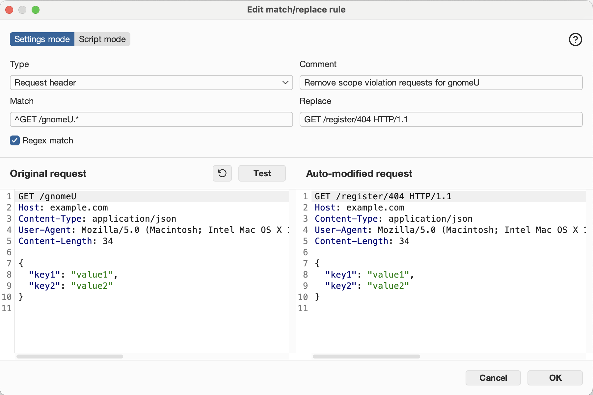
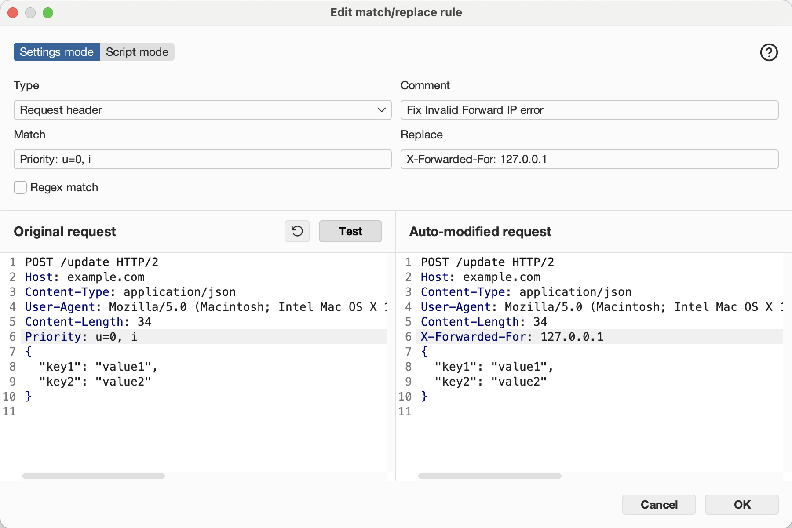

# Burp Suite

## Table of Contents
- [Burp Suite](#burp-suite)
  - [Table of Contents](#table-of-contents)
  - [Overview](#overview)
  - [Quick Reference](#quick-reference)
  - [Techniques](#techniques)
    - [Match and Replace Rules](#match-and-replace-rules)
      - [Suppress Out-of-Scope Requests](#suppress-out-of-scope-requests)
      - [Inject a Header on Every Request](#inject-a-header-on-every-request)
      - [Replace a Request Path](#replace-a-request-path)
    - [Intercepting and Replaying Requests](#intercepting-and-replaying-requests)
      - [Intercept a single request](#intercept-a-single-request)
      - [Send to Repeater for iterative testing](#send-to-repeater-for-iterative-testing)
    - [Scope Configuration](#scope-configuration)
      - [Set scope](#set-scope)
  - [References](#references)
    - [Labs](#labs)
    - [Challenges](#challenges)
    - [Web Sites](#web-sites)

---

## Overview

Burp Suite is an industry-standard web application security testing platform. In CTF web challenges it is primarily used to intercept, inspect, modify, and replay HTTP/S traffic between the browser and the target application. It is especially useful for actions that cannot be performed directly from the browser UI.

The **Community Edition** (free) covers the most common CTF use cases: Proxy Interception, HTTP History, Repeater, and Match & Replace rules.

---

## Quick Reference

| Feature | Location | Use |
|---|---|---|
| Proxy Intercept | Proxy → Intercept | Pause and modify individual requests on the fly |
| HTTP History | Proxy → HTTP history | Review all traffic that has passed through the proxy |
| Repeater | Repeater (Ctrl+R from HTTP history) | Replay and tweak a specific request repeatedly |
| Match & Replace | Proxy → Match and replace | Automatically modify every request or response matching a rule |
| Scope | Target → Scope | Restrict which hosts/paths Burp logs and tests |

---

## Techniques

### Match and Replace Rules

Match & Replace rules apply automatically to every request (or response) that passes through the Burp proxy. No manual interception needed. This makes them ideal for persistent modifications like suppressing unwanted requests or injecting headers across an entire session.

To create a new rule, go to Proxy → Match and replace and click on "Add".

Each rule has the following fields:

| Field | Description |
|---|---|
| Type | What part of the message to match: `Request header`, `Request body`, `Response header`, `Response body`, `Request first line` |
| Match | String or regex to find |
| Replace | String to substitute in |
| Regex match | Check this box if Match is a regular expression |
| Comment | Human-readable label (for your own reference) |

---

#### Suppress Out-of-Scope Requests

Use this when the page JavaScript fires requests to paths that are out of scope or that trigger unwanted side effects (e.g., scope violation counters, analytics beacons).

**Example:**

Redirect `GET` requests to a specific path `/gnomeU` to a harmless in-scope path:

| Field | Value |
|---|---|
| Type | `Request header` |
| Match | `^GET /gnomeU.*` |
| Regex match | ✅ |
| Replace | `GET /register/404 HTTP/1.1` |
| Comment | `Remove scope violation requests for gnomeU` |



**How it works:** The rule matches the first line of any GET request to `/gnomeU` (and any subpath) and rewrites it to point at a benign 404 path before the request leaves Burp. The browser never knows.

---

#### Inject a Header on Every Request

Use this when the server requires a header that browsers do not send automatically, e.g., `X-Forwarded-For` for IP spoofing, or a custom auth header.

**Example:**

Add `X-Forwarded-For: 127.0.0.1` to bypass an IP check:

| Field | Value |
|---|---|
| Type | `Request header` |
| Match | `Priority: u=0, i` |
| Regex match | ❌ |
| Replace | `X-Forwarded-For: 127.0.0.1` |
| Comment | `Fix Invalid Forward IP error` |



**How it works:** Burp matches the `Priority` header (sent by modern browsers) and replaces it with the `X-Forwarded-For` header. Since this is a replacement rather than an insertion, pick any header that appears reliably in every request but isn't security-critical. The replaced header is effectively discarded.

**Alternative approach:** match an empty line to append.
Some Burp versions support matching on a known-present but dispensable header (e.g., `DNT: 1`) to replace it with the desired header.

**Other common headers to inject this way:**
```
X-Forwarded-For: 127.0.0.1
X-Real-IP: 10.0.0.1
Authorization: Bearer YOUR_TOKEN
X-Api-Key: YOUR_KEY
```

---

#### Replace a Request Path

Use this to rewrite specific URL paths, e.g., to redirect traffic away from a problematic endpoint or to canonicalize a path prefix.

**Example:**

Strip a `/wip` prefix from all requests:**

| Field | Value |
|---|---|
| Type | `Request first line` |
| Match | `^(GET\|POST\|PUT\|DELETE) /wip/` |
| Regex match | ✅ |
| Replace | `$1 /` |
| Comment | `Strip /wip prefix` |

---

### Intercepting and Replaying Requests

#### Intercept a single request
1. Enable intercept: Proxy → Intercept → "Intercept is on"
2. Perform the browser action that triggers the request
3. In Burp, modify the request as needed
4. Click "Forward" to send it, or "Drop" to discard it

#### Send to Repeater for iterative testing
1. In Proxy → HTTP history, right-click a request → "Send to Repeater"
2. In Repeater, modify headers, body, or path and click "Send"
3. Compare responses across multiple attempts

---

### Scope Configuration

Restricting Burp's scope prevents noise from third-party domains and keeps logs focused on the target.

#### Set scope
1. Target → Scope → Add
2. Enter the target host (e.g., `flask-schrodingers-scope-firestore.holidayhackchallenge.com`)
3. In Proxy settings, enable "Drop all out-of-scope requests" to avoid logging irrelevant traffic

**Tip:** In CTF scenarios with explicit scope rules (e.g., "only test `/register`"), configure Burp's scope to match the path prefix in addition to the host to avoid accidental out-of-scope requests appearing in your history.

---

## References

### Labs
| Source | Name |
|---|---|
| N/A | N/A |

### Challenges
| Source | Name |
|---|---|
| Holiday Hack Challenge 2025, Act III | [Schrödinger's Scope](../../../ctf-writeups/holiday-hack-challenge/2025/act-iii/schroedingers-scope/README.md)


### Web Sites
- [Burp Suite Community Edition](https://portswigger.net/burp/communitydownload)
- [PortSwigger Web Academy](https://portswigger.net/web-security) — free labs covering all major web vulnerability classes
- [Burp Suite Match and Replace documentation](https://portswigger.net/burp/documentation/desktop/tools/proxy/match-and-replace)
