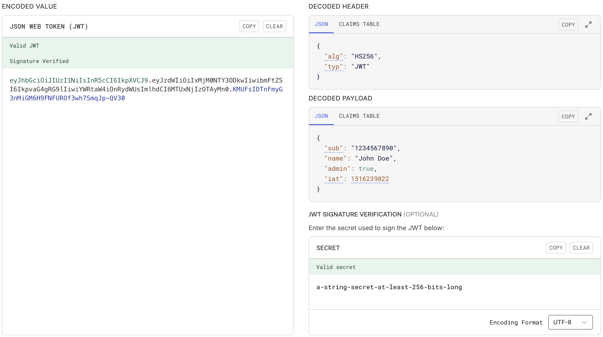
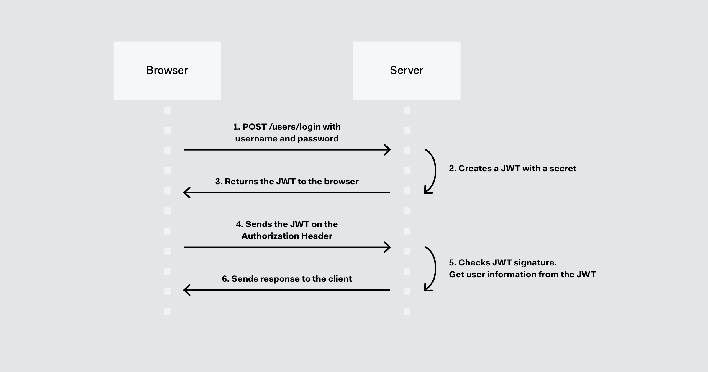

# JSON Web Token (JWT) Attacks

## Table of Contents

- [JSON Web Token (JWT) Attacks](#json-web-token-jwt-attacks)
  - [Table of Contents](#table-of-contents)
  - [Overview](#overview)
  - [What are JWT attacks?](#what-are-jwt-attacks)
  - [What is the impact of JWT attacks?](#what-is-the-impact-of-jwt-attacks)
  - [What is JSON Web Token?](#what-is-json-web-token)
    - [Characteristics](#characteristics)
  - [When are JSON Web Tokens used?](#when-are-json-web-tokens-used)
  - [What is the JSON Web Token structure?](#what-is-the-json-web-token-structure)
    - [Header](#header)
    - [Payload](#payload)
    - [Signature](#signature)
    - [Putting all together](#putting-all-together)
  - [How do JSON Web Tokens work?](#how-do-json-web-tokens-work)
  - [References](#references)
    - [Labs](#labs)
    - [Challenges](#challenges)
    - [Web Sites](#web-sites)

---

## Overview

Design issues and flawed handling of JSON web tokens (JWTs) can leave websites vulnerable to a variety of high-severity attacks. As JWTs are most commonly used in authentication, session management, and access control mechanisms, these vulnerabilities can potentially compromise the entire website and its users.

---

## What are JWT attacks?
JWT attacks involve a user sending modified JWTs to the server in order to achieve a malicious goal. Typically, this goal is to bypass authentication and access controls by impersonating another user who has already been authenticated.

---

## What is the impact of JWT attacks?
The impact of JWT attacks is usually severe. If an attacker is able to create their own valid tokens with arbitrary values, they may be able to escalate their own privileges or impersonate other users, taking full control of their accounts.

---

## What is JSON Web Token?
**JSON Web Token (JWT)** is an open standard ([RFC 7519](https://tools.ietf.org/html/rfc7519)) that defines a compact and self-contained way for securely transmitting information between parties as a JSON object. This information can be verified and trusted because it is digitally signed. JWTs can be signed using a secret (with **HMAC** algorithm) or a public/private key pair using **RSA**.

### Characteristics
- **Compact:** Because of its size, it can be sent through an URL, POST parameter, or inside an HTTP header. Additionally, due to its size its transmission is fast.
- **Self-contained:** The payload contains all the required information about the user, to avoid querying the database more than once.

---

## When are JSON Web Tokens used?
These are some scenarios where JSON Web Tokens are useful:
- **Authentication:** This is the typical scenario for using JWT, once the user is logged in, each subsequent request will include the JWT, allowing the user to access routes, services, and resources that are permitted with that token. Single Sign On (SSO) is a feature that widely uses JWT nowadays, because of its small overhead and its ability to be easily used among systems of different domains.
- **Information Exchange:** JWTs are a good way of securely transmitting information between parties. Because they can be signed (e.g., using a public/private key pair), you can be sure that the sender is who they say they are. Additionally, as the signature is calculated using the header and the payload, you can also verify that the content hasn’t changed.

---

## What is the JSON Web Token structure?
JWTs consist of three parts separated by dots (.):
- Header
- Payload
- Signature

Therefore, a JWT typically looks like the following.
```
xxxxx.yyyyy.zzzzz
```
Let’s break down the different parts.

### Header
The header *typically* consists of two parts: the type of the token, which is JWT, and the hashing algorithm such as HMAC SHA256 or RSA.

For example,
```json
{
  "alg": "HS256",
  "typ": "JWT"
}
```

The header is **Base64Url** encoded to form the first part of the JWT.
```
eyJhbGciOiJIUzI1NiIsInR5cCI6IkpXVCJ9
```

### Payload
The second part of the token is the payload, which contains the claims. Claims are statements about an entity (typically, the user) and additional metadata. There are three types of claims: *reserved*, *public*, and *private* claims.
- **Reserved claims:** These are a set of predefined claims, which are not mandatory but recommended, thought to provide a set of useful, interoperable claims. Some of them are: `iss` (issuer), `exp` (expiration time), `sub` (subject), `aud` (audience), among [others](https://tools.ietf.org/html/rfc7519#section-4.1).

> Note that the claim names are only three characters long as JWT is meant to be compact.

- **Public claims:** These can be defined at will by those using JWTs. But to avoid collisions they should be defined in the IANA JSON Web Token Registry or be defined as a URI that contains a collision resistant namespace.
- **Private claims:** These are the custom claims created to share information between parties that agree on using them.

For example,
```json
{
  "sub": "1234567890",
  "name": "John Doe",
  "admin": true
}
```

The payload is **Base64Url** encoded to form the second part of the JWT.
```
eyJzdWIiOiIxMjM0NTY3ODkwIiwibmFtZSI6IkpvaG4gRG9lIiwiYWRtaW4iOnRydWUsImlhdCI6MTUxNjIzOTAyMn0
```

### Signature
To create the signature part you have to take the encoded header, the encoded payload, a secret, the algorithm specified in the header, and sign that.

For example, if you want to use the HMAC SHA256 algorithm, the signature will be created in the following way:
```
HMACSHA256(
  base64UrlEncode(header) + "." +
  base64UrlEncode(payload),
  secret)
```
The signature is used to verify the message wasn't changed along the way, and, in the case of tokens signed with a private key, it can also verify that the sender of the JWT is who it says it is.

For example, we can generate this signature using the secret `a-string-secret-at-least-256-bits-long`,
```
KMUFsIDTnFmyG3nMiGM6H9FNFUROf3wh7SmqJp-QV30
```

### Putting all together
The output is three Base64-URL strings separated by dots that can be easily passed in HTML and HTTP environments, while being more compact when compared to XML-based standards such as SAML.

The following shows a JWT that has the previous header and payload encoded, and it is signed with a secret.
```
eyJhbGciOiJIUzI1NiIsInR5cCI6IkpXVCJ9
.
eyJzdWIiOiIxMjM0NTY3ODkwIiwibmFtZSI6IkpvaG4gRG9lIiwiYWRtaW4iOnRydWUsImlhdCI6MTUxNjIzOTAyMn0
.
KMUFsIDTnFmyG3nMiGM6H9FNFUROf3wh7SmqJp-QV30
```
The [JWT Debugger](https://www.jwt.io/) can be used to decode the content and confirm its validity.


---

## How do JSON Web Tokens work?
In authentication, when the user successfully logs in using their credentials, a JSON Web Token will be returned. Since tokens are credentials, great care must be taken to prevent security issues. In general, you should not keep tokens longer than required.

You also [should not store sensitive session data in browser storage due to lack of security](https://cheatsheetseries.owasp.org/cheatsheets/HTML5_Security_Cheat_Sheet.html#local-storage).

Whenever the user wants to access a protected route or resource, the user agent should send the JWT, typically in the Authorization header using the Bearer schema. The content of the header should look like the following:
```
Authorization: Bearer <token>
```

This is a stateless authentication mechanism as the user state is never saved in the server memory. The server’s protected routes will check for a valid JWT in the Authorization header, and if there is, the user will be allowed. As JWTs are self-contained, all the necessary information is there, reducing the need of going back and forward to the database.

This allows to fully rely on data APIs that are stateless and even make requests to downstream services. It doesn’t matter which domains are serving your APIs, as Cross-Origin Resource Sharing (CORS) won’t be an issue as it doesn’t use cookies.

The following diagram shows how a JWT is obtained and used to access APIs or resources:


1. The application or client requests authorization to the authorization server.
2. The authorization server creates an access token with the necessary details.
3. When the authorization is granted, the authorization server returns an access token to the application.
4. The application uses the access token to access a protected resource (like an API).
5. The resource server checks the validity of the token and extracts user information from it, as needed.
6. The resource server responds with the information requested.

---

## References

### Labs
| Source | Name |
|---|---|
| TBD | TBD |

### Challenges
| Source | Name |
|---|---|
| Holiday Hack Challenge 2025, Act II | Rogue Gnome Identity Provider |

### Web Sites
- [JWT Tool Wiki](https://github.com/ticarpi/jwt_tool/wiki)
- [JWT Attacks](https://portswigger.net/web-security/jwt)
- [JWT Debugger](https://www.jwt.io/)
