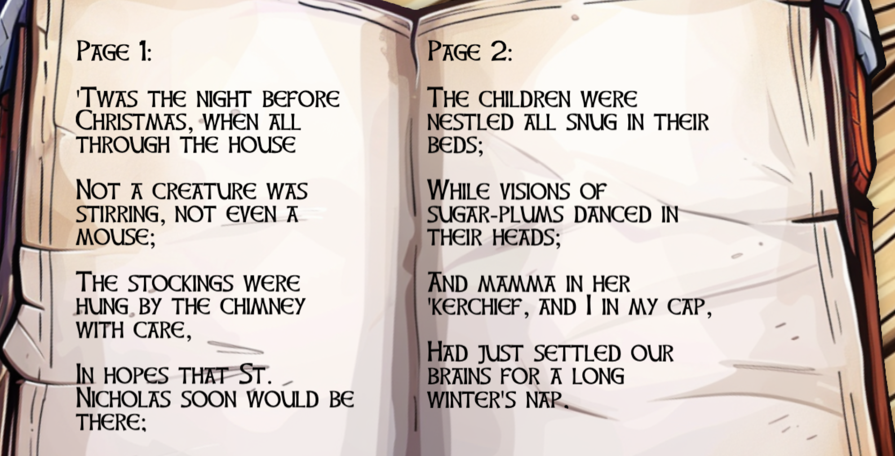
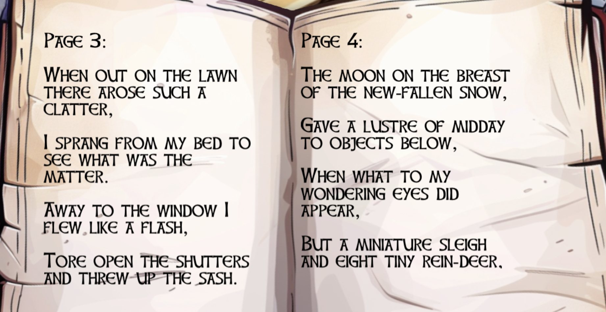
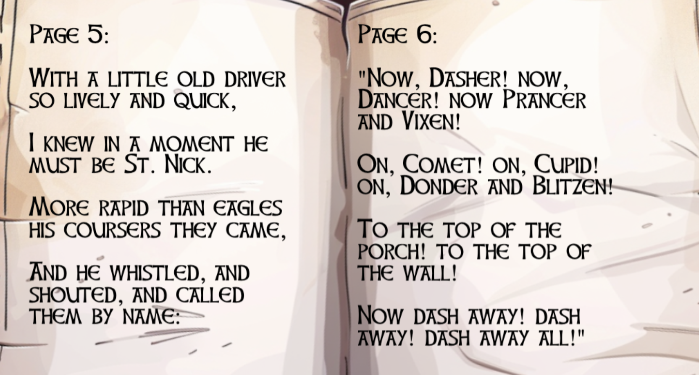
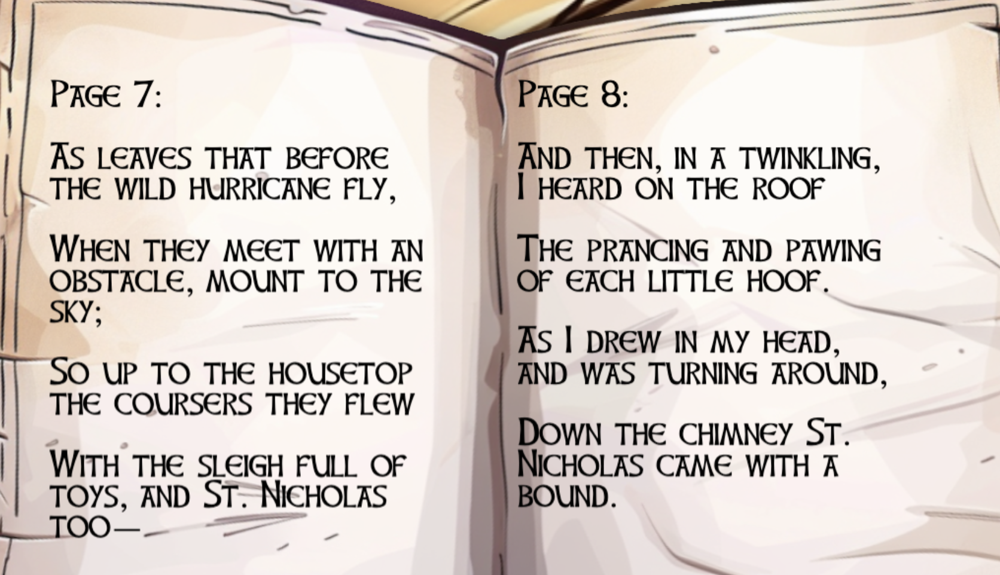
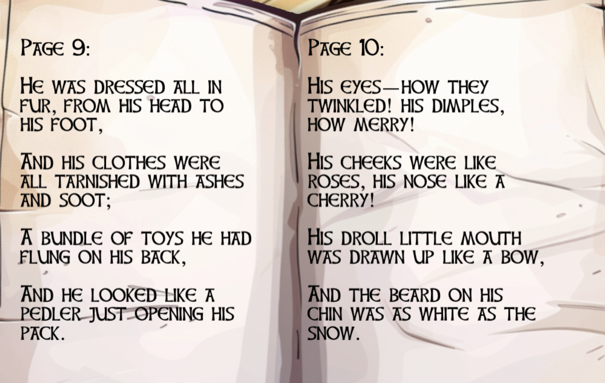
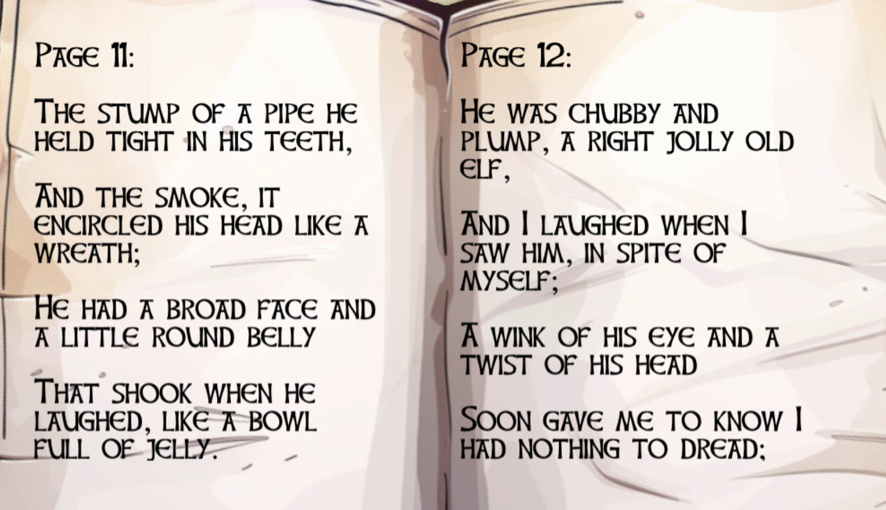
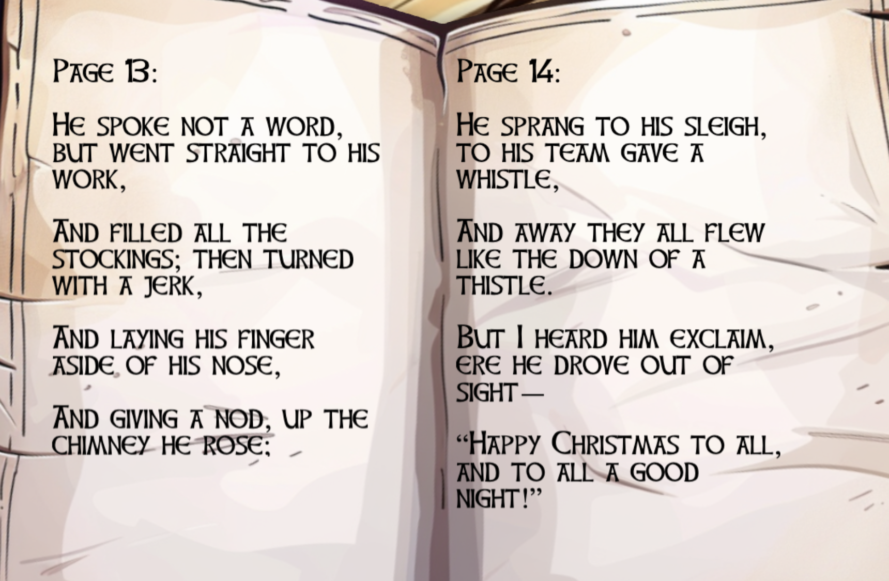
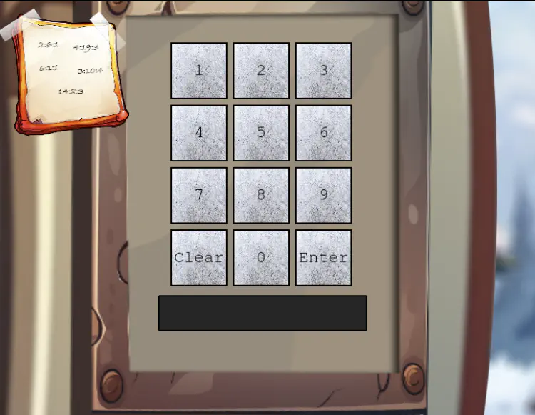
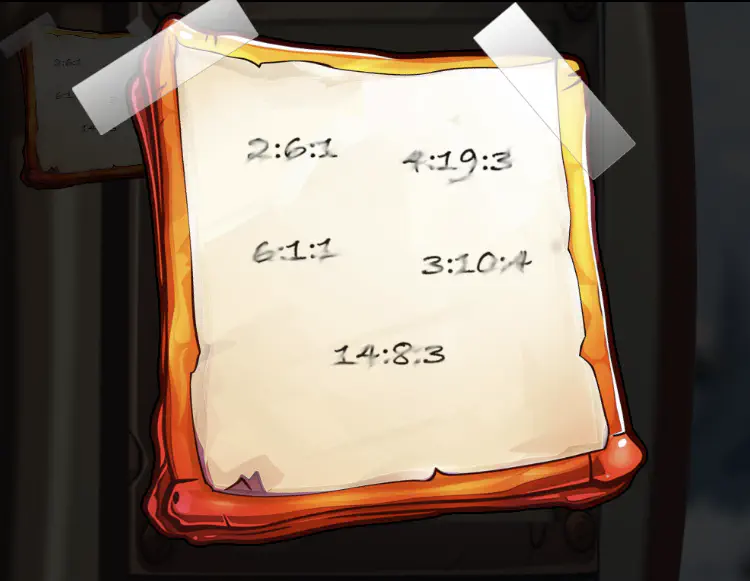
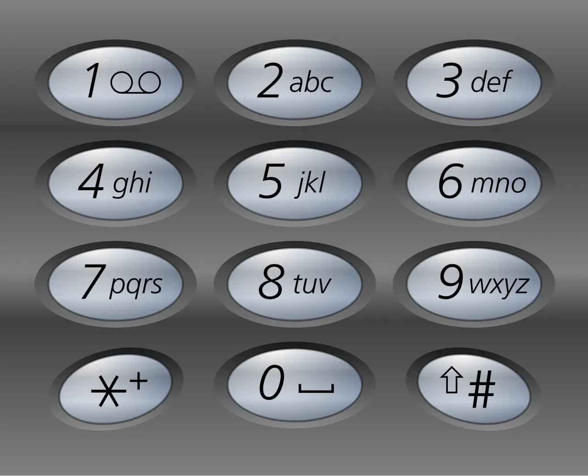

# Frosty Keypad

## Table of Contents
- [Frosty Keypad](#frosty-keypad)
  - [Table of Contents](#table-of-contents)
  - [Overview](#overview)
  - [Hints](#hints)
    - [Hint 1 - Just Some Light Reading](#hint-1---just-some-light-reading)
    - [Hint 2 - Shine Some Light on It](#hint-2---shine-some-light-on-it)
    - [Hint 3 - Who Are You Calling a Dorf?](#hint-3---who-are-you-calling-a-dorf)
  - [Recon](#recon)
    - [Notebook Pages](#notebook-pages)
    - [Keypad](#keypad)
  - [Silver](#silver)
    - [Analysis - Book Cipher](#analysis---book-cipher)
    - [Solution](#solution)
  - [Gold](#gold)
    - [Analysis - Brute Force](#analysis---brute-force)
    - [Solution](#solution-1)
  - [Files](#files)
  - [References](#references)
  - [Navigation](#navigation)

---

## Overview

Hello again! I’m Morcel Nougat, dashing around like a reindeer on a sugar rush! We’ve got a bit of a dilemma, and I could really use your expertise.

Wombley and Alabaster have taken charge now that Santa’s gone missing, and We’re scrambling to get the Wish List secured. But… one of the elves in the Data Management Team got overzealous, and the Shredder McShreddin 9000 gobbled up a crucial document we need to access Santa’s chest!

It’s our golden ticket to getting Santa’s Little Helper tool working properly. Without it, the hardware hack we’re planning is as empty as Santa’s sleigh in January.

Think you can help? I can get you into the Shredder McShreddin 9000’s inner workings to retrieve the pieces, but there are two access codes involved. One of the elves left a hint, but it’s all a blur to me!

I’ve noticed that some elves keep referring to a certain book when they walk by. I bet it has the answers we need to crack the code and recover the document!

You know, some of the elves always have their noses in the same book when they pass by here. Maybe it’s got the clues we need to crack the code?

## Hints

### Hint 1 - Just Some Light Reading
See if you can find a copy of that book everyone seems to be reading these days. I thought I saw somebody drop one close by…

### Hint 2 - Shine Some Light on It
Well this is puzzling. I wonder if Santa has a separate code. Bet that would cast some light on the problem. I know this is a stretch…but…what if you had one of those fancy UV lights to look at the fingerprints on the keypad? That might at least limit the possible digits being used…

### Hint 3 - Who Are You Calling a Dorf?
Hmmmm. I know I have seen Santa and the other elves use this keypad. I wonder what it contains. I bet whatever is in there is a National Treasure!

## Recon

Walking around the yard you can find two items: a notebook and a UV flashlight.

### Notebook Pages














### Keypad
The challenge presents a keypad with a note attached.





## Silver

### Analysis - Book Cipher

One of the hints refers to the 2004 film **National Treasure**, where the Ottendorf Cipher is a key plot device found on the back of the Declaration of Independence, revealed via heat and lemon juice.

The Ottendorf Cipher is a type of book cipher where plaintext is encrypted into sets of three numbers, typically indicating a specific page, line, and word (or letter) within a pre-agreed text, such as a book, newspaper, or document. The receiver must possess the exact same "key" text to decode the message.

In this challenge, the Ottendorf Cipher is using page:word:letter. After checking the pages in the notebook, we get the following results.

| Location | Result |
| --- | --- |
| 2:6:1 | S |
| 4:19:3 | A |
| 6:1:1  | N |
| 3:10:4 | T |
| 14:8:3 | A |

To convert the letters into numbers, let's use the telephone keypads used in older telephones where letters where mapped to a number.



| Letter | Number |
| --- | --- |
| S | 7 |
| A | 2 |
| N | 6 |
| T | 8 |
| A | 2 |

### Solution

The code for the keypad is `72682`.

## Gold

WOW, you did it! You know, they say Ottendorf ciphers were used back in the Frosty Archives crisis… or was that during the Jack Frost incident? Either way, you’re amazing!

But wait—there’s still one more code tucked away! This one might need a bit more elbow grease… you may need to try a few combinations to crack it!

### Analysis - Brute Force

Using the UV flashlight, you can see that the keys 2, 6, 7, 8, and Enter have fingerprints on them. The other keys do not.

The challenge makes it clear there are two different codes.

The UV flashlight highlights four (4) of the same digits from the first code. It’s worth a try to brute force it. Let's start with the assumption that the second code is the same length as the first code, i.e., five numbers. Hence, the fifth value has to be one of the four digits 2, 6, 7 or 8.

Let's write a Python script ([`frostykeypad.py`](./frostykeypad.py) to try all possible combinations from these four digits. The `itertools` Python library will take a list of things and a length and generate all possible lists of that length, allowing repeats.

The total number of iterations will be:
$$\text{NumOptions} ^ \text{Length} = 4^5 = 1024$$

Initial tests shows the following rate limiting error:
```log
22222 400 {'error': "The data you've provided seems to have gone on a whimsical adventure, losing all sense of order and coherence!"}
22227 400 {'error': "The data you've provided seems to have gone on a whimsical adventure, losing all sense of order and coherence!"}
22226 429 {'error': 'Too many requests from this User-Agent. Limited to 1 requests per 1 seconds.'}
```

When sending a request, the browser automatically adds a user agent to every request using the `User-Agent:` header. This header contains information about what is sending the request. In the case of Chrome, it will contain that it’s Chrome and which specific version of it is running.

To circumvent this limit, we can try modifying the `User-Agent` on every request. This way, we should never hit a limit. To do this, we can set the `User-Agent` to something that includes the answer. This will make sure we can never send the same `User-Agent` twice. For example,
```python
headers={
    "User-Agent": f"somerandomstring{code}",
},
```

Note, however, that adding delay of one second using the `sleep` function will take at most 1024 / 60 ~= 17 minutes. We can set the User-Agent header to something unique per request to avoid rate limiting, but for now, we'll just wait between requests.

Since we now that there are two possible codes, we will not break when we find a valid one.

### Solution

Running the Python script provides the following output:
```bash
python3 frostykeypad.py
```
```
Success: 72682
..........................................
Success: 22786
............

```

The second code for the keypad is `22786`.

---

## Files

| File | Description |
|---|---|
| `frostykeypad.py` | Python brute-force script using `itertools.permutations` and `curl` |
| `FrostyBook-1.png` through `FrostyBook-7.png` | Notebook pages used for the Ottendorf cipher |
| `keypad.png` | The keypad with note and the fingerprints shown with the UV light |
| `note.png` | The note attached to the keypad with the book cipher locations |
| `telephonekeypad.png` | A telephone keypad with the mapping between letters and numbers |

## References

- [`ctf-techniques/web/curl/`](../../../../../ctf-techniques/web/curl/README.md) — cURL technique reference used in the brute-force script
- [Book cipher / Ottendorf cipher — Wikipedia](https://en.wikipedia.org/wiki/Book_cipher)
- [National Treasure (2004 film)](https://en.wikipedia.org/wiki/National_Treasure_(film)) — referenced in Hint 3

---

## Navigation

| | |
|:---|---:|
| ← [cURLing](../curling/README.md) | [Hardware Part I](../hardware-part-i/README.md) → |