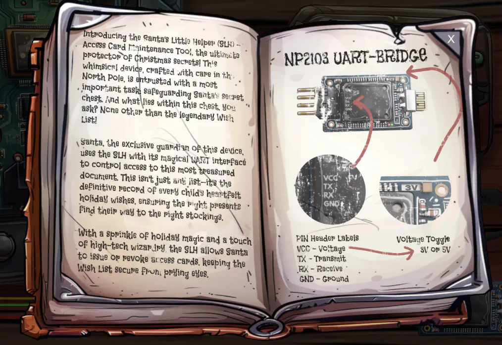
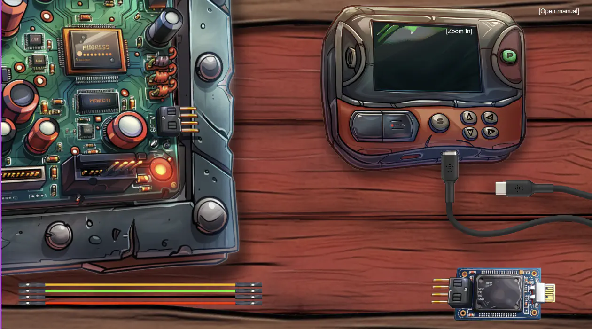
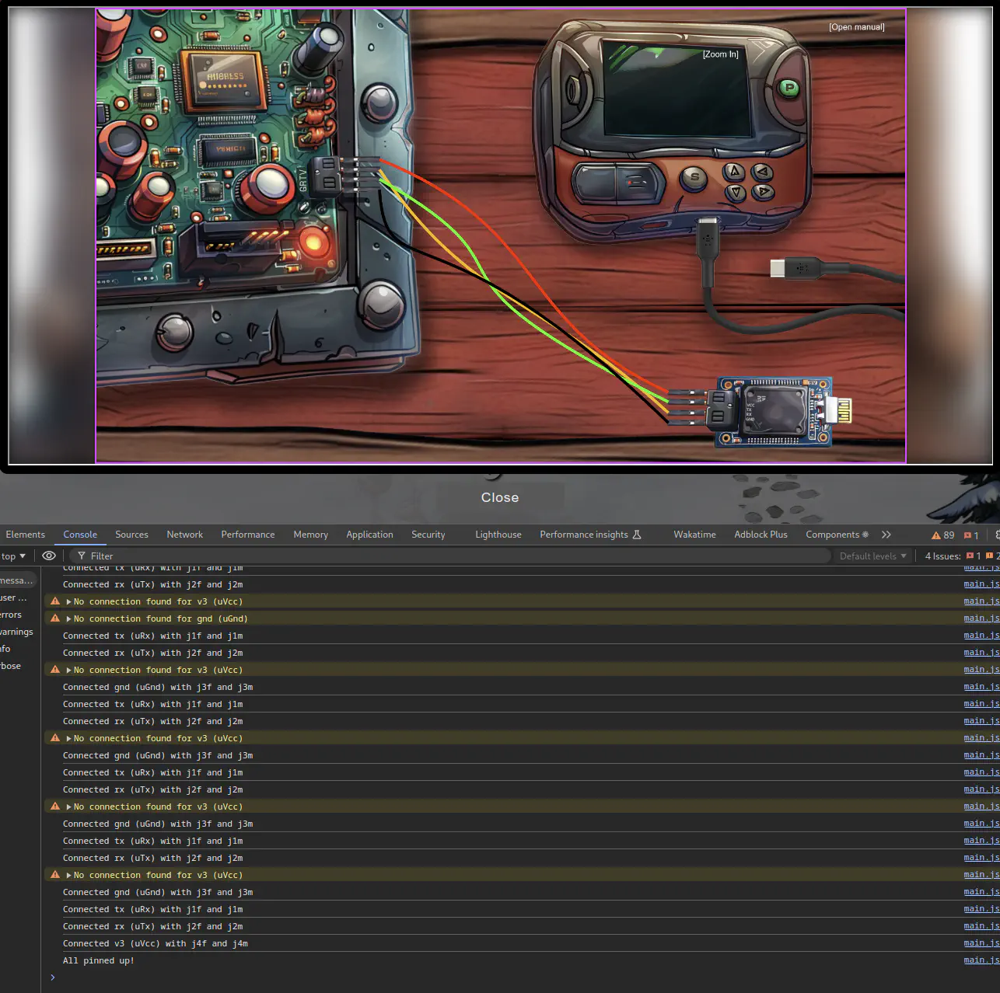
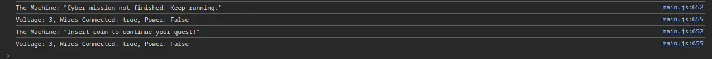
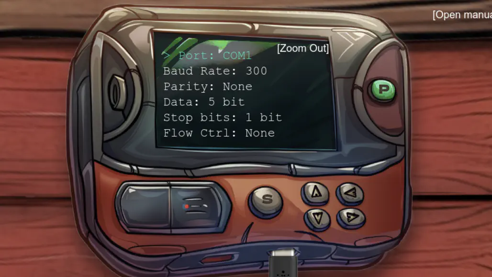
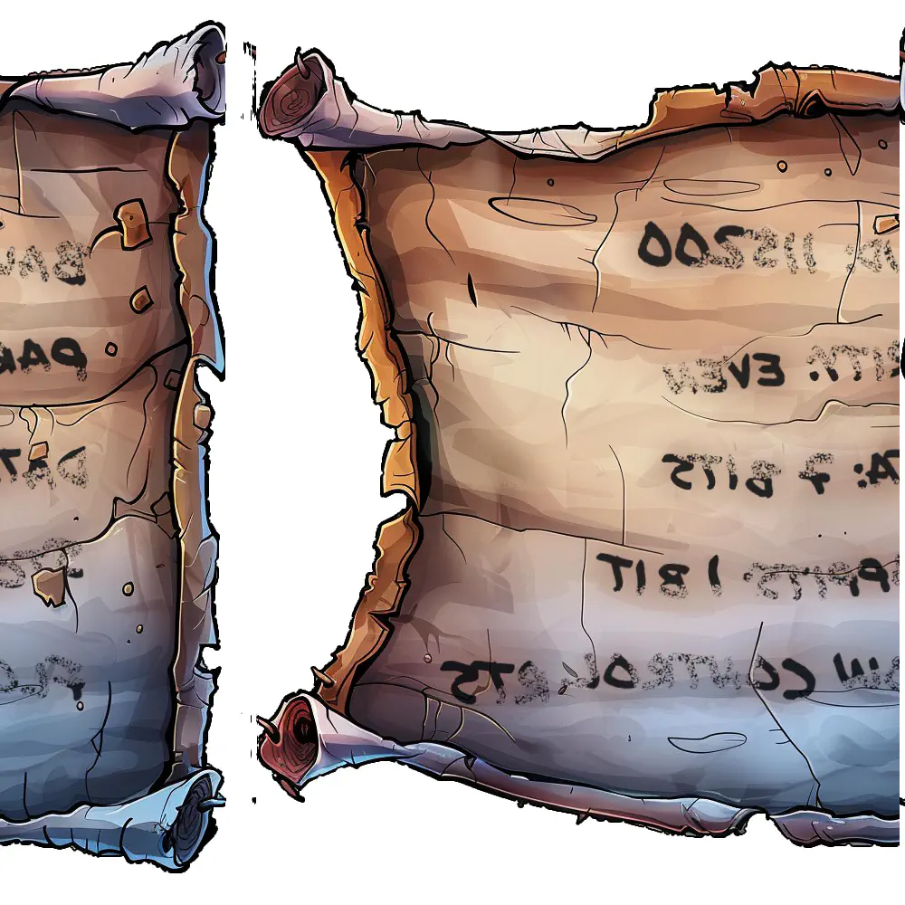
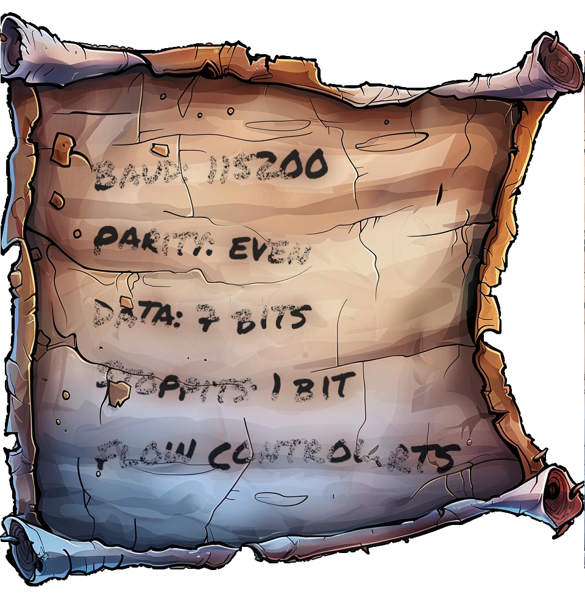
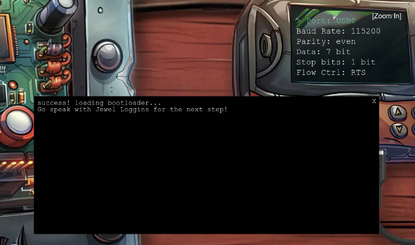

# Hardware Part I

## Table of Contents
- [Hardware Part I](#hardware-part-i)
  - [Table of Contents](#table-of-contents)
  - [Overview](#overview)
  - [Hints](#hints)
    - [On the Cutting Edge](#on-the-cutting-edge)
    - [Shredded to Pieces](#shredded-to-pieces)
  - [Recon](#recon)
  - [Silver](#silver)
    - [Analysis](#analysis)
    - [Solution](#solution)
  - [Gold](#gold)
    - [Analysis](#analysis-1)
    - [Solution](#solution-1)
  - [Files](#files)
  - [References](#references)
  - [Navigation](#navigation)

---

## Overview

Hello there! I’m Jewel Loggins.

I hate to trouble you, but I really need some help. Santa’s Little Helper tool isn’t working, and normally, Santa takes care of this… but with him missing, it’s all on me.

I need to connect to the UART interface to get things running, but it’s like the device just refuses to respond every time I try.

I’ve got all the right tools, but I must be overlooking something important. I’ve seen a few elves with similar setups, but everyone’s so busy preparing for Santa’s absence.

If you could guide me through the connection process, I’d be beyond grateful. It’s critical because this interface controls access to our North Pole access cards!

We used to have a note with the serial settings, but apparently, one of Wombley’s elves shredded it! You might want to check with Morcel Nougat—he might have a way to recover it.

## Hints

### On the Cutting Edge
Hey, I just caught wind of this neat way to piece back shredded paper! It’s a fancy heuristic detection technique—sharp as an elf’s wit, I tell ya! Got a sample Python script right here, courtesy of Arnydo. Check it out when you have a sec: [`heuristic_edge_detection.py`](./heuristic_edge_detection.py)."

### Shredded to Pieces
Have you ever wondered how elves manage to dispose of their sensitive documents? Turns out, they use this fancy shredder that is quite the marvel of engineering. It slices, it dices, it makes the paper practically disintegrate into a thousand tiny pieces. Perhaps, just perhaps, we could reassemble the pieces?

---

## Recon

After clicking on the challenge, we’ll get to see some instructions.



If we click away the instructions, we’ll also get to see some computer boards.



Upon clicking around, we also find that we can click on the buttons of the programmer (top right), and that the cables can be moved by clicking and dragging them to a connection point.

When we start moving the cables and connect them up, the console also shows a message when a correct connection is made. This should help us connect the programmer to the board.

## Silver

### Analysis
Let’s start of by connection the wires. If we open the DevTools console, and start connecting a cable, we’ll receive a message like `Connected v3 (uVcc) with j1f and j1m` when we make a correct connection. This makes it quite easy to find the right wiring, and in the end we get the message All pinned up!.



If we now click the power (P) button, and then the start (S) button, we receive new messages:



It looks like more configuration is needed. Let’s explore the code a bit. A good start might be near where these message are coming from. We can navigate there by clicking on the blue text at the end of the lines.

We end up being on the `checkConditions` function, and at the start of it, we find the following checks:
```js
async checkConditions() {
    if ((this.uV === 3 && this.allConnectedUp && !this.usbIsAtOriginalPosition) || this.dev) {
        // console.log("PARTY TIME");
        let checkIt = await checkit(
            [
                this.currentPortIndex,
                this.currentBaudIndex,
                this.currentParityIndex,
                this.currentDataIndex,
                this.currentStopBitsIndex,
                this.currentFlowControlIndex,
            ],
            this.uV
        );
        // ...
    }
}
```

It looks like we should set the voltage to 3v, connect all the wiring, connect the USB cable. That, or `dev` needs to be set to `true`.

After setting the voltage to 3 and connecting all the cables, we get a connection error popup.


Let's take a look at the configuration. We open the config by clicking any of the arrow keys on the programmer.



There are too many possible combinations to use brute force. The elf said: “We used to have a note with the serial settings, but apparently, one of Wombley’s elves shredded it!”.

When looking around, we found shredded pieces of paper behind the frosty keypad in a [shreds.zip](./shreds.zip) file.

After downloading and extracting the content, we get 1,000 slices of a picture in the `slices/` folder. Let's use the given `heuristic_edge_detection.py` script to help reconstructing an image our of the slices.

Running the script inside the `slices/` folder will produce this image:



which after correcting the x-axis offset will look like this:



### Solution

We can read the settings from the image, they are as follows:

| Name | Setting |
| --- | --- |
| Port | USB0 |
| Baud Rate | 115200 |
| Parity | even |
| Data | 7 bit |
| Stop Bits | 1 bit |
| Flow Control | RTS |

After we plug these settings into the programmer and click the start button, we get the following popup, and the silver medal!



## Gold

Fantastic! You managed to connect to the UART interface—great work with those tricky wires! I couldn’t figure it out myself…

Rumor has it you might be able to bypass the hardware altogether for the gold medal. Why not see if you can find that shortcut?

### Analysis

The elf suggests that we should bypass the hardware completely. Let’s explore the inner workings of the code a bit further.

Earlier when checking the `checkConditions` function in the code, we found references to `checkit`.

If we navigate to `checkit`, we find some interesting comments.
```js
async function checkit(serial, uV) {
    // ...

    // Build the URL with the request ID as a query parameter
    // Word on the wire is that some resourceful elves managed to brute-force their way in through the v1 API.
    // We have since updated the API to v2 and v1 "should" be removed by now.
    // const url = new URL(`${window.location.protocol}//${window.location.hostname}:${window.location.port}/api/v1/complete`);
    const url = new URL(
        `${window.location.protocol}//${window.location.hostname}:${window.location.port}/api/v2/complete`
    );

    // ...
}
```
The source code indicates that 'v1' of the API may still be available for hacking. Replacing `v2` with `v1` in the URL should bypass the current validation entirely.

### Solution

Let's find a valid request by navigating to the Network tab in the DevTools and inspecting the final POST request to `/api/v2/complete` after a successful Silver solve.

> **Note:** The `requestID` value is session-specific.

**URL:** https://hhc24-hardwarehacking.holidayhackchallenge.com/api/v2/complete

**Request:** POST
```json
{
  "requestID": "52434f99-9091-4b1d-8c13-3623c814a40b",
  "serial": [
    3,
    9,
    2,
    2,
    0,
    3
  ],
  "voltage": 3
}
```

**Response:** `true`|`false`

If we run the command as is, we would solve silver again. Let's replace `v2` with `v1` in the URL at the top and build the following `curl` command:
```bash
curl https://hhc24-hardwarehacking.holidayhackchallenge.com/api/v1/complete -X POST -H "Content-Type: application/json" -d '{ "requestID": "52434f99-9091-4b1d-8c13-3623c814a40b", "serial": [ 3, 9, 2, 2, 0, 3 ], "voltage": 3 }'
```

Once we run it, we receive the gold medal!

---

## Files

| File | Description |
|---|---|
| `heuristic_edge_detection.py` | Script to reassemble shredded image slices by matching edge pixel values |
| `shreds.zip` | Archive containing 1,000 shredded image slices |
| `assembled_image.png` | Reconstructed image output from the script |

## References

- [`ctf-techniques/web/curl/`](../../../../../ctf-techniques/web/curl/README.md) — cURL used in the Gold API bypass
- [`ctf-techniques/forensics/`](../../../../../ctf-techniques/forensics/README.md) — image analysis and file carving techniques
- [PIL / Pillow documentation](https://pillow.readthedocs.io/en/stable/) — Python imaging library used in `heuristic_edge_detection.py`
- [UART protocol overview](https://en.wikipedia.org/wiki/Universal_asynchronous_receiver-transmitter)

---

## Navigation

| | |
|:---|---:|
| ← [Frosty Keypad](../frosty-keypad/README.md) | [Hardware Part II](../hardware-part-ii/README.md) → |