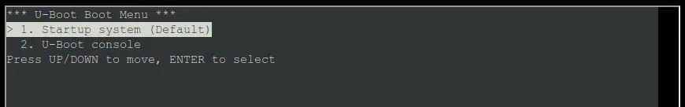
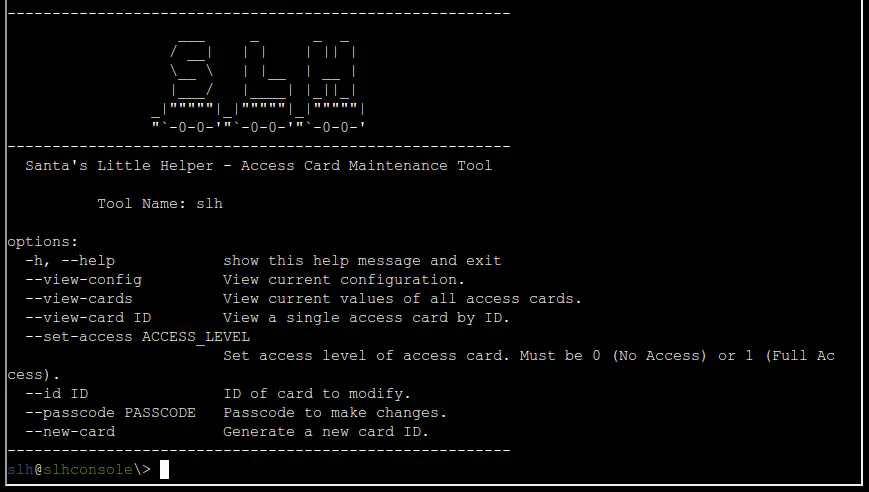
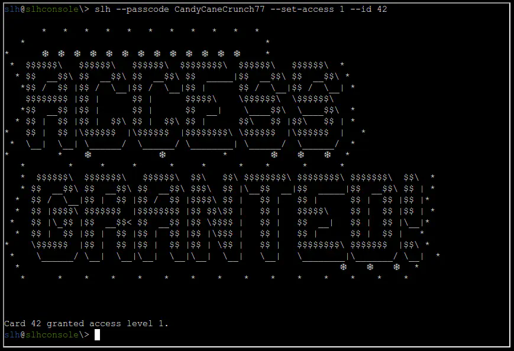

# Hardware Part II

## Table of Contents
- [Hardware Part II](#hardware-part-ii)
  - [Table of Contents](#table-of-contents)
  - [Overview](#overview)
  - [Hints](#hints)
    - [Hint 1 - Hidden in Plain Sight](#hint-1---hidden-in-plain-sight)
    - [Hint 2 - It’s In the Signature](#hint-2---its-in-the-signature)
  - [Recon](#recon)
  - [Silver](#silver)
    - [Analysis](#analysis)
    - [Solution](#solution)
  - [Gold](#gold)
    - [Analysis](#analysis-1)
    - [Solution](#solution-1)
  - [Files](#files)
  - [References](#references)
  - [Navigation](#navigation)

---

## Overview

Next, we need to access the terminal and modify the access database. We’re looking to grant access to card number 42.

Start by using the slh application—that’s the key to getting into the access database. Problem is, the ‘slh’ tool is password-protected, so we need to find it first.

Search the terminal thoroughly; passwords sometimes get left out in the open.

Once you’ve found it, modify the entry for card number 42 to grant access. Sounds simple, right? Let’s get to it!

## Hints

### Hint 1 - Hidden in Plain Sight
It is so important to keep sensitive data like passwords secure. Often times, when typing passwords into a CLI (Command Line Interface) they get added to log files and other easy to access locations. It makes it trivial to step back in history and identify the password.

### Hint 2 - It’s In the Signature
I seem to remember there being a handy HMAC generator included in [CyberChef](https://gchq.github.io/CyberChef/#recipe=HMAC%28%7B%27option%27:%27UTF8%27,%27string%27:%27%27%7D,%27SHA256%27%29).

---

## Recon

Upon clicking the challenge icon, a terminal shows up with a boot menu.



If we select Startup system, a terminal shows up with Santa’s Little Helper, an Access Card Maintenance Tool.



## Silver

### Analysis
The SLH help pages seems to indicate that we need to use the `slh` command with the correct flags.

Let's try `--set-access 1` and `--id 42` to grant Full Access to the card with ID 42.
```bash
slh@slhconsole\> slh --set-access 1 --id 42
```
```
Invalid passcode. Access not granted.
```

Looks like we need to provide a passcode to make changes using the `--passcode` option.

Since the passcode needs to be provided as an argument in the command line, it is likely someone did it before and left the value in the history file. Let's check the command history.
```bash
slh@slhconsole\> history | grep passcode | grep -v grep
11 slh --passcode CandyCaneCrunch77 --set-access 1 --id 143
```

### Solution

Let's run the command again with the passcode.
```bash
slh@slhconsole\> slh --passcode CandyCaneCrunch77 --set-access 1 --id 42
```



We got granted access and the silver medal!

## Gold

Wow! You’re amazing at this! Clever move finding the password in the command history. It’s a good reminder about keeping sensitive information secure…

There’s a tougher route if you’re up for the challenge to earn the Gold medal. It involves directly modifying the database and generating your own HMAC signature.

I know you can do it—come back once you’ve cracked it!

### Analysis

Let’s look around to find the database. We can start by listing the directory.
```bash
slh@slhconsole\> ls -lA
total 140
-r--r--r-- 1 slh  slh     518 Oct 16 23:52 .bash_history
-r--r--r-- 1 slh  slh    3897 Sep 23 20:02 .bashrc
-r--r--r-- 1 slh  slh     807 Sep 23 20:02 .profile
-rw-r--r-- 1 root root 131072 Nov 13 14:44 access_card
```

The “access_cards” file looks interesting. Let's check what kind of file it is.
```bash
slh@slhconsole\> file access_card
```
```
access_card: SQLite 3.x database, last written using SQLite version 3040001, file counter 4, database pages 32, cookie 0x2, schema 4, UTF-8, version-valid-for 4
```

It is an SQLite 3 database file. Let's open it using `sqlite3`.
```sql
> sqlite3 access_cards
SQLite version 3.40.1 2022-12-28 14:03:47
Enter ".help" for usage hints.
```

Let's list the tables in the database using `.tables`.
```sql
sqlite> .tables
access_cards  config
```

Let's explore the schema (table layout) of the tables using `.schema`.
```sql
sqlite> .schema
CREATE TABLE access_cards (
            id INTEGER PRIMARY KEY,
            uuid TEXT,
            access INTEGER,
            sig TEXT
        );
CREATE TABLE config (
            id INTEGER PRIMARY KEY,
            config_key TEXT UNIQUE,
            config_value TEXT
        );
```

Let's retrieve detailed information about all columns within each database table using `PRAGMA table_info(table-name)`.
```sql
sqlite> PRAGMA table_info('access_cards');
0|id|INTEGER|0||1
1|uuid|TEXT|0||0
2|access|INTEGER|0||0
3|sig|TEXT|0||0
sqlite> PRAGMA table_info('config');
0|id|INTEGER|0||1
1|config_key|TEXT|0||0
2|config_value|TEXT|0||0
```

Now that we know the schema and details of the `access_cards` table, let's create a query to get the current values of the card with `id` 42.
```sql
sqlite> SELECT * FROM access_cards WHERE id = 42;
42|c06018b6-5e80-4395-ab71-ae5124560189|0|ecb9de15a057305e5887502d46d434c9394f5ed7ef1a51d2930ad786b02f6ffd
```
| id | uuid | access | sig |
| --- | --- | --- | --- |
| `42` | `c06018b6-5e80-4395-ab71-ae5124560189` | `0` | `ecb9de15a057305e5887502d46d434c9394f5ed7ef1a51d2930ad786b02f6ffd` |

The goal is to set the `access` value to 1. The challenge in this case is that we also need to generate a new HMAC signature for the `sig` value.

We need to find out the input for the HMAC algorithm, i.e., the input format, a key, and the hashing function.

The hashing function can be inferred from the current hash. Judging by the length and type it’s likely SHA256, and any hash identifier will confirm that. For the other values, let's check the `config` table.
```
sqlite> SELECT * FROM config;
1|hmac_secret|9ed1515819dec61fd361d5fdabb57f41ecce1a5fe1fe263b98c0d6943b9b232e
2|hmac_message_format|{access}{uuid}
3|admin_password|3a40ae3f3fd57b2a4513cca783609589dbe51ce5e69739a33141c5717c20c9c1
4|app_version|1.0
```
| id | config_key | config_value |
| --- | --- | --- |
| `1` | `hmac_secret` | `9ed1515819dec61fd361d5fdabb57f41ecce1a5fe1fe263b98c0d6943b9b232e` |
| `2` | `hmac_message_format` | `{access}{uuid}` |
| `3` | `admin_password` | `3a40ae3f3fd57b2a4513cca783609589dbe51ce5e69739a33141c5717c20c9c1` |
| `4` | `app_version` | `1.0` |

This table provides the key and input format.

> **Note:** The `hmac_secret` looks like a Hex value, but it is actually UTF-8.

### Solution

We need to run the following SQL query with the new generated signature:
```sql
sqlite> UPDATE access_cards SET access = 1, sig = 'new_generated_hmac' WHERE id = 42;
```

The values to use for the new signature are:
| HMAC Key | HMAC Key Format | Hashing Function | Input `{access}{uuid}` |
| --- | --- | --- | --- |
| `9ed1515819dec61fd361d5fdabb57f41ecce1a5fe1fe263b98c0d6943b9b232e` | `UTF8`  | `SHA256` | `1c06018b6-5e80-4395-ab71-ae5124560189` |

We can use the [confirm_hmac.py](./confirm_hmac.py) Python script to generate the new signature.

As a redundancy, let's also plug the values into [CyberChef](https://gchq.github.io/CyberChef/#recipe=HMAC%28%7B%27option%27:%27UTF8%27,%27string%27:%279ed1515819dec61fd361d5fdabb57f41ecce1a5fe1fe263b98c0d6943b9b232e%27%7D,%27SHA256%27%29&input=MWMwNjAxOGI2LTVlODAtNDM5NS1hYjcxLWFlNTEyNDU2MDE4OQ) to generate the new signature.

The output is: `135a32d5026c5628b1753e6c67015c0f04e26051ef7391c2552de2816b1b7096`

Let's run the SQL query to update the row in the database:
```sql
sqlite> UPDATE access_cards SET access = 1, sig = "135a32d5026c5628b1753e6c67015c0f04e26051ef7391c2552de2816b1b7096" WHERE id = 42;
```

After running it and waiting for a few seconds, we get the gold medal!

---

## Files

| File | Description |
|---|---|
| `confirm_hmac.py` | Python script to generate and verify the HMAC-SHA256 signature for a given access/uuid pair |

## References

- [`ctf-techniques/post-exploitation/linux/`](../../../../../ctf-techniques/post-exploitation/linux/README.md) — Linux enumeration including bash history credential hunting
- [CyberChef HMAC generator](https://gchq.github.io/CyberChef/#recipe=HMAC%28%7B%27option%27:%27UTF8%27,%27string%27:%27%27%7D,%27SHA256%27%29)
- [SQLite documentation](https://www.sqlite.org/lang.html)
- [Python hmac module](https://docs.python.org/3/library/hmac.html)
- [UART protocol overview](https://en.wikipedia.org/wiki/Universal_asynchronous_receiver-transmitter)

---

## Navigation

| |
|:---|
| ← [Hardware Part I](../hardware-part-i/README.md) |