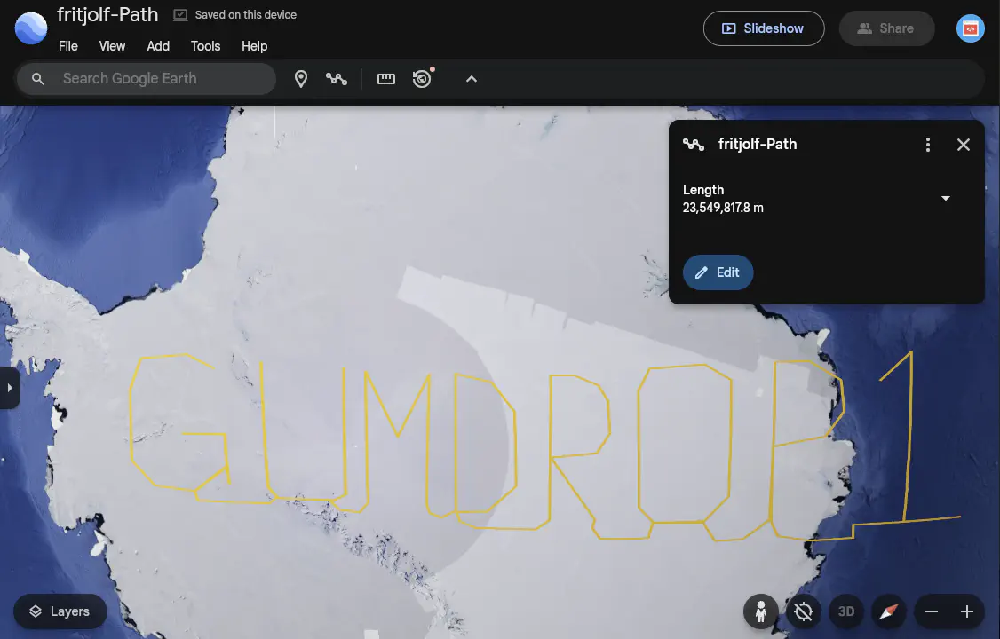
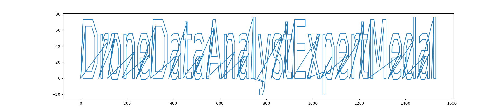

# Drone Path

## Table of Contents
- [Drone Path](#drone-path)
  - [Table of Contents](#table-of-contents)
  - [Overview](#overview)
  - [Initial Analysis](#initial-analysis)
  - [Silver](#silver)
    - [Analysis](#analysis)
      - [Login Credentials](#login-credentials)
      - [Search for Drone](#search-for-drone)
    - [Solution](#solution)
  - [Gold](#gold)
    - [Analysis](#analysis-1)
    - [Solution](#solution-1)
      - [Using Python](#using-python)
      - [Using BASH](#using-bash)
      - [Using CyberChef](#using-cyberchef)
  - [Files](#files)
  - [References](#references)
  - [Navigation](#navigation)

---

## Overview

Hey. Psst, over here. Hey, I’m Chimney Scissorsticks.

I’m not liking all the tension brewing between the factions, so even though I agreed with how Wombley was handling things, I get the feeling this is going to end poorly for everyone. So I’m trying to get this data to Alabaster’s side. Can you help?

Wombley’s planning something BIG in that toy factory. He’s not really making toys in there. He’s building an armada of drones!

They’re packed with valuable data from the elves working on the project. I think they hide the admin password in the drone flight logs. We need to crack this to prevent this escalating snowball showdown.

You’ll be working with KML files, tracking drone flight paths. Intriguing, right? We need every detail to prepare for what’s ahead!

Use tools like Google Earth and some Python scripting to decode the hidden passwords and codewords locked in those files.

Ready to give it a go? It’s going to be a wild ride, and your skills might just turn the tide of this conflict!

---

## Initial Analysis

Upon opening the challenge, we’re greeted with a website. From the navigation bar we can see there are three public pages:
- Home
- FileShare
- Login

On the FileShare page, there is a link to download [`fritjolf-Path.kml`](./fritjolf-Path.kml).

## Silver

### Analysis
KML is a file format for storing geolocation data.

Let's load this file in Google Earth. Once the image it loaded, Google Earth automatically zooms to it and we can see a word: `GUMDROP1`.



This looks like a password. We can use the `fritjolf` as the username since it is part of the file name.

#### Login Credentials 
Let's use these credentials in the Login page:
```
fritjolf: GUMDROP1
```

We now have access to additional pages:
- Workshop
- Profile
- Admin

The Profile Page provides an Avatar and the following Info:

> **Username:** fritjolf
> 
> **Bio:** Secret project is underway, we need to produce as many as possible for Wombley.
> 
> Note to self, remember drone name, it is the same location as secret snowball warehouses `/files/secret/Preparations-drone-name.csv`

We have a link to download the [`Preparations-drone-name.csv`](./Preparations-drone-name.csv) file.

The CSV file contains eight (8) different geo locations. We can convert these coordinates to 8 points in a KML file using the [`from-csv-to-kml-points.py`](./from-csv-to-kml-points.py) Python script and visualize them in Google Mpas.

These points do not "draw" a word like the previous file. Instead, they are several locations in Australia. When viewed in Satellite mode, we can see that the terrain forms a letter for each location.

| Pos | Latitude | Longitude | Link | Letter |
| --- | --- | --- | --- | --- |
| 1 | -37.42277804382341 | 144.8567879816271 | [Google Maps](https://www.google.com/maps/@-37.42277804382341,144.8567879816271,1200m) | `E` |
| 2 | -38.0569169391843 | 142.4357677725014 | [Google Maps](https://www.google.com/maps/@-38.0569169391843,142.4357677725014,600m) | `L` |
| 3 | -37.80217469906655 | 143.9329094555584 | [Google Maps](https://www.google.com/maps/@-37.80217469906655,143.9329094555584,600m) | `F` |
| 4 | -38.0682499155867 | 142.2754454646221 | [Google Maps](https://www.google.com/maps/@-38.0682499155867,142.2754454646221,600m) | `-` |
| 5 | -34.52324587244343 | 141.756352258091 | [Google Maps](https://www.google.com/maps/@-34.52324587244343,141.756352258091,3000m) | `H` |
| 6 | -36.74357572393437 | 145.513859306511 | [Google Maps](https://www.google.com/maps/@-36.74357572393437,145.513859306511,1400m) | `A` |
| 7 | -37.89721189352699 | 144.745994150535 | [Google Map](https://www.google.com/maps/@-37.89721189352699,144.745994150535,180m) | `W` |
| 8 | -37.00702150480869 | 145.8966329539992 | [Google Maps](https://www.google.com/maps/@-37.00702150480869,145.8966329539992,1200m) | `K` |

The complete word is:
```
ELF-HAWK
```

This looks like a drone name. Let's look for it in the Workshop page.

#### Search for Drone
Let's go to the **Elf Drone Workshop** and enter `ELF-HAWK` in the **Search for a Drone** field.

> **Drone Details**
> 
> **Name:** ELF-HAWK, **Quantity:** 40, **Weapons:** Snowball-launcher
> 
> **Comments for ELF-HAWK**
> 
> * These drones will work great to find Alabasters snowball warehouses. I have hid the activation code in the dataset `ELF-HAWK-dump.csv`. We need to keep it safe, for now it's under /files/secret.
> * We need to make sure we have enough of these drones ready for the upcoming operation. Well done on hiding the activation code in the dataset. If anyone finds it, it will take them a LONG time or forever to carve the data out, preferably the LATTER.

We have a link to download the [`ELF-HAWK-dump.csv`](./ELF-HAWK-dump.csv) file.

There are over 3,000 records. If we look at the values, we can see that the longitude values go up to over 1,500 which is strange because the values should only go from -180 to 180 degrees.

Let's convert the coordinates in the `ELF-HAWK-dump.csv` file to a path in the `ELF-HAWK-dump-Path.kml` KML file using the [`from-csv-to-kml-path.py`](./from-csv-to-kml-path.py) Python script and load it to a KML viewer that projects the points onto a flat surface, e.g., a QGIS desktop app (https://products.aspose.app/gis/viewer/kml).

Another option is to use the [`from-cvs-to-plot.py`](./from-cvs-to-plot.py) Python script to plot the coordinates from the CSV file.



### Solution

**Flag (Silver):** The last set of coordinates draw a path that makes the word `DroneDataAnalystExpertMedal`.

Let's go to the **Admin Code Verification Console** and enter this value in the **Submit your code for drone fleet administration** field.

After pressing the **Submit** button, we get the message:
> Success: Code accepted! You may now steer the fleet of drones. You are officially certified as a Drone Data Analyst Expert!

---

## Gold

Bravo! You’ve tackled the drone challenge and navigated through those KML files like a true expert. Your skills are just what we need to prevent the big snowball battle—the North Pole thanks you!

Well done! You cracked the code from the drones and showed you’ve mastered the basics of KML files. This kind of expertise will be invaluable as we gear up for what’s ahead!

But I need you to dig deeper. Make sure you’re checking those file structures carefully, and remember—rumor has it there is some injection flaw that might just give you the upper hand. Keep your eyes sharp!

### Analysis

The new message hints at some injection vulnerability.

Let's go back to the **Elf Drone Workshop** page and check for vulnerabilities in the search field.

If we enter a quote (`'`) in the input field, we see in the DevTools that a request is sent to `/drones?drone=%27` and fails with a 500 Internal Server Error. This hints at some SQL injection vulnerability.

Searching for drone name `ELF-HAWK' or 1=1 --` returns all the drone names and the comments for the last drone:

> **Drone Details**
> **Name:** ELF-HAWK, **Quantity:** 40, **Weapons:** Snowball-launcher
> **Name:** Pigeon-Lookalike-v4, **Quantity:** 20, **Weapons:** Surveillance Camera
> **Name:** FlyingZoomer, **Quantity:** 4, **Weapons:** Snowball-Dropper
> **Name:** Zapper, **Quantity:** 5, **Weapons:** CarrotSpike
> 
> **Comments for Zapper**
> This is sort of primitive, but it works!

In the DevTools, we can see the requests for all the drones:
```json
{
    "comments": [
        "These drones will work great to find Alabasters snowball warehouses.\n I have hid the activation code in the dataset <a href='../files/secret/ELF-HAWK-dump.csv'>ELF-HAWK-dump.csv</a>. We need to keep it safe, for now it's under /files/secret.",
        "We need to make sure we have enough of these drones ready for the upcoming operation. \n Well done on hiding the activation code in the dataset.\n If anyone finds it, it will take them a LONG time or forever to carve the data out, preferably the LATTER."
    ],
    "drone_name": "ELF-HAWK"
}
```
```json
{
    "comments": [
        "This is a great drone for surveillance, but we need to keep it out of the rain.",
        "I cant believe we are using pigeons for surveillance. \n If anyone finds out, there will most likely be a conspiracy theory about it.",
        "I heard a rumor that there is something fishing with some of the files. \nThere was some talk about only TRUE carvers would find secrets and that FALSE ones would never find it."
    ],
    "drone_name": "Pigeon-Lookalike-v4"
}
```
```json
{
    "comments": [
        "This drone is perfect for dropping snowballs on unsuspecting targets."
    ],
    "drone_name": "FlyingZoomer"
}
```
```json
{
    "comments": ["This is sort of primitive, but it works!"],
    "drone_name": "Zapper"
}
```
The comments for `Pigeon-Lookalike-v4` give us a hint, i.e., TRUE and FALSE are capitalized, likely referring to the many boolean values in the `ELF-HAWK-dump.csv` file.

### Solution

Based on the hint, we are probably looking for binary values to convert to ASCII characters to create ASCII art. Hence, let's execute these steps:
1. Extract all TRUE and FALSE values from the `ELF-HAWK-dump.csv` file.
2. Replace TRUE with 1 and FALSE with 0.
3. Remove any whitespace from the output to create a seamless list of 1 and 0 values, e.g., 0011101...
4. Transform the binary data into ASCII characters to reveal the message.

#### Using Python
The [`extract_bool_data.py`](./extract_bool_data.py) Python script loads the `ELF-HAWK-dump.csv` file and creates the `output_binary.txt` file with al the 0 and 1 values and the final `output_ascii.txt` file with the ASCII art.

#### Using BASH
The following command will the `ELF-HAWK-dump.csv` file and print the ASCII art to the console:
```bash
grep -oE "TRUE|FALSE" ELF-HAWK-dump.csv | sed 's/TRUE/1/g; s/FALSE/0/g' | tr -d '\n' | fold -w8 | while read -r byte; do echo "$((2#$byte))"; done | awk '{printf "%c", $1}'
```

#### Using CyberChef
The following [CyberChef recipe](
https://gchq.github.io/CyberChef/#recipe=Regular_expression('User%20defined','TRUE%7CFALSE',true,true,false,false,false,false,'List%20matches')Find_/_Replace(%7B'option':'Regex','string':'TRUE'%7D,'1',true,false,true,false)Find_/_Replace(%7B'option':'Regex','string':'FALSE'%7D,'0',true,false,true,false)Remove_whitespace(true,true,true,true,true,false)From_Binary('Space',8)) will execute all the steps to produce the ASCI art.
1. Load the `ELF-HAWK-dump.csv` file.
2. Create a RegEx to extract all the TRUE|FALSE values.
   ```
   Regular expression
   ------------------
   Built in regexes: User Defined
   Regex: TRUE|FALSE
   Case Insensitive: ON, ^ and $ match at newlines: ON (all the other options OFF)
   Output format: List matches
   ```
3. Replace all the TRUE values with 1.
   ```
   Find / Replace
   --------------
   Find: TRUE (REGEX)
   Replace: 1
   Global Match: ON, Multiline matching: ON (all the other options OFF)
   ```
4. Replace all the FALSE values with 0
   ```
   Find / Replace
   --------------
   Find: FALSE (REGEX)
   Replace: 0
   Global Match: ON, Multiline matching: ON (all the other options OFF)
   ```
5. Remove all the whitespace to create a single list of 0 and 1 values.
   ```
   Remove whitespace
   -----------------
   Spaces: ON, Carriage returns (\r): ON, Line feeds (\n): ON, Tabs: ON, Form feeds (\f): ON
   Full stops: OFF
   ```
6. Convert binary data into ASCII to decode the message.
   ```
   From Binary
   -----------
   Delimiter: Space
   Byte Length: 8
   ```

**Flag (Gold):** The code that comes up from the ASCII art is:
```
CODEWORD=EXPERTTURKEYCARVERMEDAL
```

Let's go to the **Admin Code Verification Console** and enter this value in the **Submit your code for drone fleet administration** field.

After pressing the **Submit** button, we get the message:
> Success: Code accepted! You may now take over the production of drones. You are officially certified as Super Admin Drone Data Analyst Expert!
---

## Files

| File | Description |
|---|---|
| `fritjolf-Path.kml` | KML file downloaded from the FileShare page with a flight path spelling `GUMDROP1` |
| `Preparations-drone-name.csv` | CSV with 8 geo-coordinates |
| `Preparations-drone-name-Points.kml` | KML points file generated from `Preparations-drone-name.csv` showing letters in satellite view forming the Drone Name `ELF-HAWK` |
| `ELF-HAWK-dump.csv` | Large drone telemetry dump containing an admin code and hidden boolean steganography |
| `ELF-HAWK-dump-Path.kml` | KML flight path generated from `ELF-HAWK-dump.csv` with the admin code to plot |
| `ELF-HAWK-dump-plot.png` | the plot for the path from `ELF-HAWK-dump.csv` making the admin code `DroneDataAnalystExpertMedal` for the Silver flag |
| `output_binary.txt` | Extracted TRUE/FALSE values converted to binary string |
| `output_ascii.txt` | Binary string decoded to ASCII art revealing the admin code `EXPERTTURKEYCARVERMEDAL` for the Gold flag |
| `from-csv-to-kml-path.py` | Script to convert CSV coordinates to a KML LineString path |
| `from-csv-to-kml-points.py` | Script to convert CSV coordinates to KML point placemarks |
| `from-cvs-to-plot.py` | Script to plot CSV coordinates using matplotlib |
| `extract_bool_data.py` | Script to extract TRUE/FALSE values and decode to ASCII |

## References

- [`ctf-techniques/web/sqli/`](../../../../../ctf-techniques/web/sqli/README.md) — SQL injection technique reference used in Gold
- [`ctf-techniques/forensics/`](../../../../../ctf-techniques/forensics/README.md) — data extraction and steganography techniques
- [Google Earth](https://earth.google.com/) — used to visualise KML flight paths
- [CyberChef](https://gchq.github.io/CyberChef/) — used to extract and decode binary steganography
- [KML reference](https://developers.google.com/kml/documentation/kmlreference)
- [simplekml Python library](https://simplekml.readthedocs.io/en/latest/)

---

## Navigation

| |
|---:|
| [Mobile Analysis](../mobile-analysis/README.md) → |
