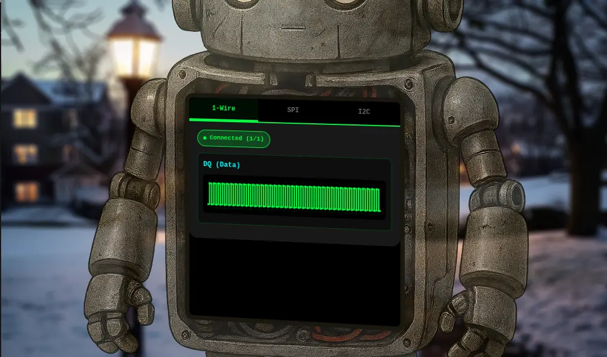
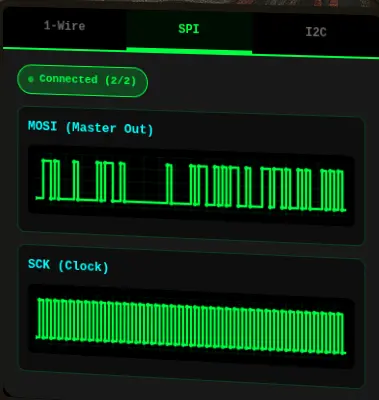
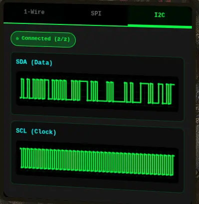

# On the Wire

## Table of Contents
- [On the Wire](#on-the-wire)
  - [Table of Contents](#table-of-contents)
  - [Overview](#overview)
  - [Introduction](#introduction)
  - [Hints](#hints)
    - [Hint 1: Protocols](#hint-1-protocols)
      - [Key concept - Clock vs. Data signals:](#key-concept---clock-vs-data-signals)
      - [For 1-Wire (no separate clock):](#for-1-wire-no-separate-clock)
      - [For SPI and I2C:](#for-spi-and-i2c)
      - [Technical approach:](#technical-approach)
    - [Hint 2: Structure](#hint-2-structure)
      - [What you're dealing with:](#what-youre-dealing-with)
      - [Where to start:](#where-to-start)
    - [Hint 3: On Rails](#hint-3-on-rails)
      - [Stage-by-stage approach](#stage-by-stage-approach)
    - [Hint 4: Garbage?](#hint-4-garbage)
      - [If your decoded data looks like gibberish:](#if-your-decoded-data-looks-like-gibberish)
      - [How XOR cipher works:](#how-xor-cipher-works)
      - [Key characteristics:](#key-characteristics)
      - [Testing your decryption:](#testing-your-decryption)
    - [Hint 5: Bits and Bytes](#hint-5-bits-and-bytes)
      - [MSB-first (Most Significant Bit first):](#msb-first-most-significant-bit-first)
      - [LSB-first (Least Significant Bit first):](#lsb-first-least-significant-bit-first)
      - [I2C specific considerations:](#i2c-specific-considerations)
      - [Converting bytes to text:](#converting-bytes-to-text)
  - [Analysis](#analysis)
    - [Enumeration](#enumeration)
    - [WebSocket Endpoints](#websocket-endpoints)
    - [1-Wire Protocol and Message Format](#1-wire-protocol-and-message-format)
      - [Background](#background)
      - [Messages (`dq` wire)](#messages-dq-wire)
    - [SPI Protocol and Message Format](#spi-protocol-and-message-format)
      - [Background](#background-1)
      - [Messages (`mosi` wire)](#messages-mosi-wire)
      - [Messages (`sck` wire)](#messages-sck-wire)
    - [I²C Protocol and Message Format](#ic-protocol-and-message-format)
      - [Background](#background-2)
      - [Messages (`sda` wire)](#messages-sda-wire)
      - [Messages (`scl` wire)](#messages-scl-wire)
    - [Strategy](#strategy)
  - [Solution](#solution)
    - [Stage 1: 1-Wire Data](#stage-1-1-wire-data)
      - [Capture](#capture)
      - [Analyze](#analyze)
      - [Decode](#decode)
      - [Answer](#answer)
    - [Stage 2: SPI Data](#stage-2-spi-data)
      - [Capture](#capture-1)
      - [Analyze](#analyze-1)
      - [Decode](#decode-1)
      - [Answer](#answer-1)
    - [Stage 3: I²C Data](#stage-3-ic-data)
      - [Capture](#capture-2)
      - [Analyze](#analyze-2)
      - [Decode](#decode-2)
      - [Answer](#answer-2)
  - [Outro](#outro)
  - [Files](#files)
  - [References](#references)
  - [Navigation](#navigation)

---

## Overview

Help Evan next to city hall hack this gnome and retrieve the temperature value reported by the I²C device at address `0x3C`. The temperature data is XOR-encrypted, so you'll need to work through each communication stage to uncover the necessary keys. Start with the unencrypted data being transmitted over the 1-wire protocol.

## Introduction

**Evan Booth**

Hey, I'm Evan!

I like to build things.

All sorts of things.

If you aren't failing on some front, consider adjusting your difficulty settings.

So here's the deal - there are some seriously bizarre signals floating around this area.

Not your typical radio chatter or WiFi noise, but something… different.

I've been trying to make sense of the patterns, but it's like trying to build a robot hand out of a coffee maker - you need the right approach.

Think you can help me decode whatever weirdness is being transmitted out there?

You know what happens to electronics in extreme cold? They fail. All my builds, all my robots, all my weird coffee-maker contraptions—frozen solid. We can't let Frosty turn this place into a permanent deep freeze.

## Hints

### Hint 1: Protocols

#### Key concept - Clock vs. Data signals:
- Some protocols have separate clock and data lines (like SPI and I2C)
- For clocked protocols, you need to sample the data line at specific moments defined by the clock
- The clock signal tells you when to read the data signal

#### For 1-Wire (no separate clock):
- Information is encoded in pulse widths (how long the signal stays low or high)
- Different pulse widths represent different bit values
- Look for patterns in the timing between transitions

#### For SPI and I2C:
- Identify which line is the clock (SCL for I2C, SCK for SPI)
- Data is typically valid/stable when the clock is in a specific state (high or low)
- You need to detect clock edges (transitions) and sample data at those moments

#### Technical approach:
- Sort frames by timestamp
- Detect rising edges (0→1) and falling edges (1→0) on the clock line
- Sample the data line's value at each clock edge

### Hint 2: Structure
#### What you're dealing with:
- You have access to WebSocket endpoints that stream digital signal data
- Each endpoint represents a physical wire in a hardware communication system
- The data comes as JSON frames with three properties: line (wire name), t (timestamp), and v (value: 0 or 1)
- The server continuously broadcasts signal data in a loop - you can connect at any time
- This is a multi-stage challenge where solving one stage reveals information needed for the next

#### Where to start:
- Connect to a WebSocket endpoint and observe the data format
- The server automatically sends data every few seconds - just wait and collect
- Look for documentation on the protocol types mentioned (1-Wire, SPI, I2C)
- Consider that hardware protocols encode information in the timing and sequence of signal transitions, not just the values themselves
- Consider capturing the WebSocket frames to a file so you can work offline

### Hint 3: On Rails

#### Stage-by-stage approach
1. Connect to the captured wire files or endpoints for the relevant wires.
2. Collect all frames for the transmission (buffer until inactivity or loop boundary).
3. Identify protocol from wire names (e.g., dq → 1-Wire; mosi/sck → SPI; sda/scl → I²C).
4. Decode the raw signal:
   - Pulse-width protocols: locate falling→rising transitions and measure low-pulse width.
   - Clocked protocols: detect clock edges and sample the data line at the specified sampling phase.
5. Assemble bits into bytes taking the correct bit order (LSB vs MSB).
6. Convert bytes to text (printable ASCII or hex as appropriate).
7. Extract information from the decoded output — it contains the XOR key or other hints for the next stage.
8. Repeat Stage 1 decoding to recover raw bytes (they will appear random).
9. Apply XOR decryption using the key obtained from the previous stage.
10. Inspect decrypted output for next-stage keys or target device information.
    - Multiple 7-bit device addresses share the same SDA/SCL lines.
    - START condition: SDA falls while SCL is high. STOP: SDA rises while SCL is high.
    - First byte of a transaction = (7-bit address << 1) | R/W. Extract address with address = first_byte >> 1.
    - Identify and decode every device's transactions; decrypt only the target device's payload.
    - Print bytes in hex and as ASCII (if printable) — hex patterns reveal structure.
    - Check printable ASCII range (0x20–0x7E) to spot valid text.
    - Verify endianness: swapping LSB/MSB will quickly break readable text.
    - For XOR keys, test short candidate keys and look for common English words.
    - If you connect mid-broadcast, wait for the next loop or detect a reset/loop marker before decoding.
    - Buffering heuristic: treat the stream complete after a short inactivity window (e.g., 500 ms) or after a full broadcast loop.
    - Sort frames by timestamp per wire and collapse consecutive identical levels before decoding to align with the physical waveform.

### Hint 4: Garbage?

#### If your decoded data looks like gibberish:
- The data may be encrypted with XOR cipher
- XOR is a simple encryption: `encrypted_byte XOR key_byte = plaintext_byte`
- The same operation both encrypts and decrypts: `plaintext XOR key = encrypted`, `encrypted XOR key = plaintext`

#### How XOR cipher works:
```python
function xorDecrypt(encrypted, key) {
  let result = "";
  for (let i = 0; i < encrypted.length; i++) {
    const encryptedChar = encrypted.charCodeAt(i);
    const keyChar = key.charCodeAt(i % key.length);  // Key repeats
    result += String.fromCharCode(encryptedChar ^ keyChar);
  }
  return result;
}
```

#### Key characteristics:
- The key is typically short and repeats for the length of the message
- You need the correct key to decrypt (look for keys in previous stage messages)
- If you see readable words mixed with garbage, you might have the wrong key or bit order

#### Testing your decryption:
- Encrypted data will have random-looking byte values
- Decrypted data should be readable ASCII text
- Try different keys from messages you've already decoded

### Hint 5: Bits and Bytes

**Critical detail - Bit ordering varies by protocol:**

#### MSB-first (Most Significant Bit first):
- SPI and I2C typically send the highest bit (bit 7) first
- When assembling bytes: `byte = (byte << 1) | bit_value`
- Start with an empty byte, shift left, add the new bit

#### LSB-first (Least Significant Bit first):
- 1-Wire and UART send the lowest bit (bit 0) first
- When assembling bytes: `byte |= bit_value << bit_position`
- Build the byte from bit 0 to bit 7

#### I2C specific considerations:
- Every 9th bit is an ACK (acknowledgment) bit - ignore these when decoding data
- The first byte in each transaction is the device address (7 bits) plus a R/W bit
- You may need to filter for specific device addresses

#### Converting bytes to text:
```python
String.fromCharCode(byte_value)  // Converts byte to ASCII character
```

---

## Analysis

Evan is hanging out next to City Hall with the "On the Wire" robot showing a terminal.

Clicking on the terminal opens up a [page](https://signals.holidayhackchallenge.com/?&challenge=termSignals&id=89dc761f-3ce6-4a85-8d13-304fcbe69d77) with the robot's data on display on three tabs.

Each tab displays different data:
- 1-Wire
  
  
- SPI

  
- I2C

  

### Enumeration
Let's figure out how the robot is getting those signals by looking at the source code in browser DevTools.

At the end of the HTML source is a large inline `<script>` block that handles all the signal processing.

There are five (5) wires:
```js
  // Signal data storage for each wire
  const signalData = {
      'dq': [],
      'mosi': [],
      'sck': [],
      'sda': [],
      'scl': []
  };
```

The wires are associated to each tab through this mapping:
```js
  // Wire to protocol mapping
  const wireToProtocol = {
      'dq': '1wire',
      'mosi': 'spi',
      'sck': 'spi',
      'sda': 'i2c',
      'scl': 'i2c'
  };
```
```js
  // Helper function to get wires for a protocol
  function getProtocolWires(protocol) {
      const protocolWires = {
          '1wire': ['dq'],
          'spi': ['mosi', 'sck'],
          'i2c': ['sda', 'scl']
      };
      return protocolWires[protocol] || [];
  }
```

Each wire is connected to the protocol using a dedicated WebSocket endpoint `/wire/{wireName}`:
```js
  // Connect to a specific wire
  function connectWire(wireName, protocolName) {
      if (connections[wireName]) {
          addLog(protocolName, `Already connected to ${wireName}`);
          return;
      }

      initCanvas(wireName);

      const proto = location.protocol === 'https:' ? 'wss' : 'ws';
      const host = location.host || location.hostname; // includes port if present in current URL
      const ws = new WebSocket(`${proto}://${host}/wire/${wireName}`);
      connections[wireName] = ws;

      ws.onopen = () => {
          updateStatus(protocolName);
          addLog(protocolName, `Connected to ${wireName}`);
      };

      ws.onmessage = (event) => {
          try {
              const data = JSON.parse(event.data);
              
              if (data.type === 'welcome') {
                  addLog(protocolName, `Server: ${data.message}`);
                  return;
              }

              if (data.line && typeof data.v !== 'undefined') {
                  updateSignal(data.line, data.v, data.t);
                  updateFrameCount(data.line);
              }
          } catch (e) {
              console.error('Error parsing message:', e);
          }
      };

      ws.onerror = (error) => {
          console.error(`WebSocket error on ${wireName}:`, error);
          addLog(protocolName, `Error on ${wireName}`);
      };

      ws.onclose = () => {
          delete connections[wireName];
          updateStatus(protocolName);
          addLog(protocolName, `Disconnected from ${wireName}`);
      };
  }
```

In the message handler, there is logic for the welcome message and additional logic for the rest of the data that updates the signal with three fields:
- `line` - the wire name
- `v` - the value (0 or 1)
- `t` - the timestamp
```js
  if (data.line && typeof data.v !== 'undefined') {
    updateSignal(data.line, data.v, data.t);
    updateFrameCount(data.line);
  }
``` 

### WebSocket Endpoints
In the Network tab, we can confirm all the WebSocket endpoints:

| Protocol | Wire Name | WebSocket endpoint |
| --- | --- | --- |
| 1-Wire | `dq` | `wss://signals.holidayhackchallenge.com/wire/dq` |
| SPI | `mosi` | `wss://signals.holidayhackchallenge.com/wire/mosi` |
|     | `sck` | `wss://signals.holidayhackchallenge.com/wire/sck` |
| I²C | `sda` | `wss://signals.holidayhackchallenge.com/wire/sda` |
|     | `scl` | `wss://signals.holidayhackchallenge.com/wire/scl` |

We can also confirm the format of the messages.

### 1-Wire Protocol and Message Format

#### Background
[1-Wire](https://en.wikipedia.org/wiki/1-Wire) is a protocol developed by Dallas Semiconductor that uses pulse-width encoding to transmit data over a single wire.

The key to decoding it is measuring how long the signal stays LOW:
- Short LOW pulse (1-15 time units) = 1.
- Long LOW pulse (~60 time units) = 0.
- Very long LOW pulses (150+) = reset/presence signals (skip these).
- Bits are transmitted LSB-first, i.e., need to reverse each group of 8 bits to get the correct byte value.

#### Messages (`dq` wire)
```json
{"type":"welcome","wire":"dq","message":"Connected to dq wire. Broadcasting continuously every 2000ms..."}
{"line":"dq","t":0,"v":1,"marker":"idle"}
{"line":"dq","t":1,"v":0,"marker":"reset"}
{"line":"dq","t":481,"v":1}
{"line":"dq","t":551,"v":0,"marker":"presence"}
{"line":"dq","t":701,"v":1}
{"line":"dq","t":941,"v":0}
{"line":"dq","t":1001,"v":1}
{"line":"dq","t":1011,"v":0}
{"line":"dq","t":1071,"v":1}
[...]
```

### SPI Protocol and Message Format

#### Background
[SPI (Serial Peripheral Interface)](https://en.wikipedia.org/wiki/Serial_Peripheral_Interface) uses separate clock and data lines. For this challenge, there is:
- `sck` - the clock signal
- `mosi` - the data signal (Master Out, Slave In)

To decode SPI:
- Sample the MOSI data line on each rising edge of SCK (when clock goes 0→1).
- Bits are MSB-first (most significant bit first).
- XOR decrypt with the given key from the decoded 1-Wire message.

#### Messages (`mosi` wire)
```json
{"type":"welcome","wire":"mosi","message":"Connected to mosi wire. Broadcasting continuously every 2000ms..."}
{"line":"mosi","t":4880000,"v":0,"marker":"data-bit"}
{"line":"mosi","t":4890000,"v":1,"marker":"data-bit"}
{"line":"mosi","t":4900000,"v":0,"marker":"data-bit"}
{"line":"mosi","t":4910000,"v":0,"marker":"data-bit"}
{"line":"mosi","t":4920000,"v":0,"marker":"data-bit"}
{"line":"mosi","t":4930000,"v":0,"marker":"data-bit"}
{"line":"mosi","t":4940000,"v":1,"marker":"data-bit"}
{"line":"mosi","t":4950000,"v":1,"marker":"data-bit"}
{"line":"mosi","t":4960000,"v":0,"marker":"data-bit"}
{"line":"mosi","t":4970000,"v":0,"marker":"data-bit"}
{"line":"mosi","t":4980000,"v":0,"marker":"data-bit"}
{"line":"mosi","t":4990000,"v":0,"marker":"data-bit"}
{"line":"mosi","t":5000000,"v":1,"marker":"data-bit"}
[...]
```

#### Messages (`sck` wire)
```json
{"type":"welcome","wire":"sck","message":"Connected to sck wire. Broadcasting continuously every 2000ms..."}
{"line":"sck","t":605000,"v":1,"marker":"sample"}
{"line":"sck","t":610000,"v":0}
{"line":"sck","t":615000,"v":1,"marker":"sample"}
{"line":"sck","t":620000,"v":0}
{"line":"sck","t":625000,"v":1,"marker":"sample"}
{"line":"sck","t":630000,"v":0}
{"line":"sck","t":635000,"v":1,"marker":"sample"}
{"line":"sck","t":640000,"v":0}
{"line":"sck","t":645000,"v":1,"marker":"sample"}
{"line":"sck","t":650000,"v":0}
{"line":"sck","t":655000,"v":1,"marker":"sample"}
{"line":"sck","t":660000,"v":0}
{"line":"sck","t":665000,"v":1,"marker":"sample"}
{"line":"sck","t":670000,"v":0}
{"line":"sck","t":675000,"v":1,"marker":"sample"}
{"line":"sck","t":680000,"v":0}
{"line":"sck","t":685000,"v":1,"marker":"sample"}
{"line":"sck","t":690000,"v":0}
[...]
```

### I²C Protocol and Message Format

#### Background
[I2C (Inter-Integrated Circuit)](https://en.wikipedia.org/wiki/I%C2%B2C) is another clock-and-data protocol, using:
- `scl` - the clock signal
- `sda` - the data signal

Like SPI, you sample SDA on the rising edge of SCL, and bits are MSB-first. However, I²C has additional complexity:
- The first byte of each transaction is the address byte: `(7-bit address << 1) | R/W bit`.
- Every 9th bit is an ACK bit that must be skipped when extracting data.
- The target address is `0x3C`.

#### Messages (`sda` wire)
```json
{"type":"welcome","wire":"sda","message":"Connected to sda wire. Broadcasting continuously every 2000ms..."}
{"line":"sda","t":0,"v":1,"marker":"bus-idle"}
{"line":"sda","t":2000,"v":0,"marker":"start"}
{"line":"sda","t":4000,"v":1,"marker":"address-bit","byteIndex":0,"bitIndex":0,"type":"address"}
{"line":"sda","t":14000,"v":0,"marker":"address-bit","byteIndex":0,"bitIndex":1,"type":"address"}
{"line":"sda","t":24000,"v":0,"marker":"address-bit","byteIndex":0,"bitIndex":2,"type":"address"}
{"line":"sda","t":34000,"v":1,"marker":"address-bit","byteIndex":0,"bitIndex":3,"type":"address"}
{"line":"sda","t":44000,"v":0,"marker":"address-bit","byteIndex":0,"bitIndex":4,"type":"address"}
{"line":"sda","t":54000,"v":0,"marker":"address-bit","byteIndex":0,"bitIndex":5,"type":"address"}
{"line":"sda","t":64000,"v":0,"marker":"address-bit","byteIndex":0,"bitIndex":6,"type":"address"}
{"line":"sda","t":74000,"v":0,"marker":"address-bit","byteIndex":0,"bitIndex":7,"type":"address"}
{"line":"sda","t":84000,"v":0,"marker":"ack-bit","byteIndex":0,"type":"ack"}
{"line":"sda","t":94000,"v":1,"marker":"ack-release","byteIndex":0,"type":"ack"}
{"line":"sda","t":94000,"v":0,"marker":"data-bit","byteIndex":1,"bitIndex":0,"type":"data"}
{"line":"sda","t":104000,"v":1,"marker":"data-bit","byteIndex":1,"bitIndex":1,"type":"data"}
{"line":"sda","t":114000,"v":0,"marker":"data-bit","byteIndex":1,"bitIndex":2,"type":"data"}
{"line":"sda","t":124000,"v":1,"marker":"data-bit","byteIndex":1,"bitIndex":3,"type":"data"}
{"line":"sda","t":134000,"v":0,"marker":"data-bit","byteIndex":1,"bitIndex":4,"type":"data"}
{"line":"sda","t":144000,"v":1,"marker":"data-bit","byteIndex":1,"bitIndex":5,"type":"data"}
{"line":"sda","t":154000,"v":1,"marker":"data-bit","byteIndex":1,"bitIndex":6,"type":"data"}
{"line":"sda","t":164000,"v":0,"marker":"data-bit","byteIndex":1,"bitIndex":7,"type":"data"}
{"line":"sda","t":174000,"v":0,"marker":"ack-bit","byteIndex":1,"type":"ack"}
{"line":"sda","t":184000,"v":1,"marker":"ack-release","byteIndex":1,"type":"ack"}
[...]
```

#### Messages (`scl` wire)
```json
{"line":"scl","t":64000,"v":0,"marker":"address-hold","byteIndex":0,"bitIndex":5,"type":"address"}
{"line":"scl","t":69000,"v":1,"marker":"address-sample","byteIndex":0,"bitIndex":6,"type":"address"}
{"line":"scl","t":74000,"v":0,"marker":"address-hold","byteIndex":0,"bitIndex":6,"type":"address"}
{"line":"scl","t":79000,"v":1,"marker":"address-sample","byteIndex":0,"bitIndex":7,"type":"address"}
{"line":"scl","t":84000,"v":0,"marker":"address-hold","byteIndex":0,"bitIndex":7,"type":"address"}
{"line":"scl","t":89000,"v":1,"marker":"ack-sample","byteIndex":0,"type":"ack"}
{"line":"scl","t":94000,"v":0,"marker":"ack-hold","byteIndex":0,"type":"ack"}
{"line":"scl","t":99000,"v":1,"marker":"data-sample","byteIndex":1,"bitIndex":0,"type":"data"}
{"line":"scl","t":104000,"v":0,"marker":"data-hold","byteIndex":1,"bitIndex":0,"type":"data"}
{"line":"scl","t":109000,"v":1,"marker":"data-sample","byteIndex":1,"bitIndex":1,"type":"data"}
{"line":"scl","t":114000,"v":0,"marker":"data-hold","byteIndex":1,"bitIndex":1,"type":"data"}
{"line":"scl","t":119000,"v":1,"marker":"data-sample","byteIndex":1,"bitIndex":2,"type":"data"}
{"line":"scl","t":124000,"v":0,"marker":"data-hold","byteIndex":1,"bitIndex":2,"type":"data"}
{"line":"scl","t":129000,"v":1,"marker":"data-sample","byteIndex":1,"bitIndex":3,"type":"data"}
{"line":"scl","t":134000,"v":0,"marker":"data-hold","byteIndex":1,"bitIndex":3,"type":"data"}
{"line":"scl","t":139000,"v":1,"marker":"data-sample","byteIndex":1,"bitIndex":4,"type":"data"}
{"line":"scl","t":144000,"v":0,"marker":"data-hold","byteIndex":1,"bitIndex":4,"type":"data"}
{"line":"scl","t":149000,"v":1,"marker":"data-sample","byteIndex":1,"bitIndex":5,"type":"data"}
{"line":"scl","t":154000,"v":0,"marker":"data-hold","byteIndex":1,"bitIndex":5,"type":"data"}
{"line":"scl","t":159000,"v":1,"marker":"data-sample","byteIndex":1,"bitIndex":6,"type":"data"}
{"line":"scl","t":164000,"v":0,"marker":"data-hold","byteIndex":1,"bitIndex":6,"type":"data"}
{"line":"scl","t":169000,"v":1,"marker":"data-sample","byteIndex":1,"bitIndex":7,"type":"data"}
{"line":"scl","t":174000,"v":0,"marker":"data-hold","byteIndex":1,"bitIndex":7,"type":"data"}
{"line":"scl","t":179000,"v":1,"marker":"ack-sample","byteIndex":1,"type":"ack"}
{"line":"scl","t":184000,"v":0,"marker":"ack-hold","byteIndex":1,"type":"ack"}
[...]
```

### Strategy
The goal is to get the reading from the I²C device at address `0x3C`. Using the provided WebSocket endpoints, this is the high-level strategy:
1. Capture and analyze the 1-Wire signal to find information that helps read the SPI signal.
2. Capture and analyze the SPI signal to find information that helps read the I²C signal.
3. Capture and analyze the I²C signal to decrypt the final information and solve the challenge.

---

## Solution

### Stage 1: 1-Wire Data

#### Capture
Let's capture 1-Wire signal data into a [`dq.csv`](./1-wire/dq.csv) file using the [`1-wire_capture.py`](./1-wire/1-wire_capture.py) Python script.
```log
[*] Collected 1000/10000
[*] Collected 2000/10000
[*] Collected 3000/10000
[*] Collected 4000/10000
[*] Collected 5000/10000
[*] Collected 6000/10000
[*] Collected 7000/10000
[*] Collected 8000/10000
[*] Collected 9000/10000
[*] Collected 10000/10000
[+] Done. Collected 10000 messages into dq.csv
```

The CSV data captured from the Python script looks like:
```csv
line,t,v
[...]
dq,32307,1
dq,32371,0
dq,32431,1
dq,32441,0
dq,32501,1
dq,32511,0
dq,32517,1
dq,32581,0
dq,32587,1
dq,32651,0
dq,32657,1
dq,32721,0
dq,32727,1
dq,32791,0
dq,32851,1
dq,32871,1
dq,0,1
dq,1,0
dq,481,1
dq,551,0
dq,701,1
dq,941,0
dq,1001,1
dq,1011,0
dq,1071,1
dq,1081,0
dq,1087,1
dq,1151,0
dq,1157,1
dq,1221,0
dq,1281,1
dq,1291,0
dq,1351,1
dq,1361,0
dq,1367,1
dq,1431,0
dq,1437,1
dq,1501,0
dq,1561,1
[...]
```

#### Analyze
From looking at the data:
- dq = 1-Wire data line
- t is timestamp (looks like microseconds or clock ticks)
- v is the logic level
- A low pulse is always:
	- 1 → 0 (falling edge)
	- followed by 0 → 1 (rising edge)
- Each bit value is encoded by how long the line stays LOW.

Let's manually compute a few low pulse durations to identify any patterns:

| Falling edge | Rising edge | Low duration |
| --- | --- | --- |
| 1 → 0 @ t=1 | 0 → 1 @ t=481 | 480 |
| 1 → 0 @ t=551 | 0 → 1 @ t=701 | 150 |
| 1 → 0 @ t=941 | 0 → 1 @ t=1001 | 60 |
| 1 → 0 @ t=1011 | 0 → 1 @ t=1071 | 60 |
| 1 → 0 @ t=1081 | 0 → 1 @ t=1087 | 6 |
| 1 → 0 @ t=1151 | 0 → 1 @ t=1157 | 6 |

Clear clusters emerge from this initial analysis:
- ~480 → very long → RESET (once at the very beginning)
- ~150 → long → start marker / presence / framing / SYNC (once)
- ~60 → medium → bit 0
- ~6 → short → bit 1

After the initial sync, the stream is simply NRZ (Non-Return-to-Zero) bits encoded by pulse width:
- Short low (6) = 1
- Longer low (60) = 0

> **Note:** NRZ (Non-Return-to-Zero) bits are a binary signaling method in digital communications where voltage levels remain high for a logic '1' and low for a logic '0', without returning to a neutral voltage in between. Instead of having a "rest" period between each bit, the signal stays high or low for the entire duration of the bit period.

#### Decode
Applying that logic to the captured pulses, let's decode bits:
```
RESET (480)
SYNC  (150)
0 0 1 1 0 1 0 0 1 0 ...
^   ^   ^
60  6   60
```
So, from pulse #3 onward, every pulse is a bit.

Let's put everything together, assemble bytes (LSB-first) by taking groups of 8 and convert into ASCII:
```python
def bits_to_bytes_lsb(bits):
    out = []
    for i in range(0, len(bits) - 7, 8):
        byte = 0
        for b in range(8):
            byte |= bits[i + b] << b
        out.append(byte)
    return out
```

The [`1-wire_decoder.py`](./1-wire/1-wire_decoder.py) Python script provides a staged decoding pipeline that separates signal parsing, pulse extraction, bit reconstruction, and byte decoding, allowing iterative validation at each layer.
- Detects if there are multiple RESET instances to identify multiple frames.
- Since the pulse widths are clustered into two ranges (~6µs and ~60µs), it uses tolerant thresholds instead of exact matching to account for jitter that could be present in real hardware behavior. This makes the solution portable and not specific to this dataset.
- The output provides a histogram to show the thresholds visually and the protocol structure (RESET, SYNC, data).

Running the decoder Python script with the [`dq.csv`](./1-wire/dq.csv) file, we get this output:
```
[*] Pulse distribution: Counter({60: 266, 6: 190, 480: 1, 150: 1})

[+] Detected 1 frame(s)

[*] --- Frame 0 ---
[*] Bytes: [204, 114, 101, 97, 100, 32, 97, 110, 100, 32, 100, 101, 99, 114, 121, 112, 116, 32, 116, 104, 101, 32, 83, 80, 73, 32, 98, 117, 115, 32, 100, 97, 116, 97, 32, 117, 115, 105, 110, 103, 32, 116, 104, 101, 32, 88, 79, 82, 32, 107, 101, 121, 58, 32, 105, 99, 121]
[*] Hex:   ['0xcc', '0x72', '0x65', '0x61', '0x64', '0x20', '0x61', '0x6e', '0x64', '0x20', '0x64', '0x65', '0x63', '0x72', '0x79', '0x70', '0x74', '0x20', '0x74', '0x68', '0x65', '0x20', '0x53', '0x50', '0x49', '0x20', '0x62', '0x75', '0x73', '0x20', '0x64', '0x61', '0x74', '0x61', '0x20', '0x75', '0x73', '0x69', '0x6e', '0x67', '0x20', '0x74', '0x68', '0x65', '0x20', '0x58', '0x4f', '0x52', '0x20', '0x6b', '0x65', '0x79', '0x3a', '0x20', '0x69', '0x63', '0x79']
[+] ASCII: .read and decrypt the SPI bus data using the XOR key: icy
```

#### Answer
The 1-Wire bus data decrypted message indicates that the SPI bus data can be decrypted using the XOR key `icy`.

### Stage 2: SPI Data

#### Capture
Let's capture SPI signal data into [`mosi.json`](./spi/mosi.json) and [`sck.json`](./spi/sck.json) files using the [`spi_capture.py`](./spi/spi_capture.py) Python script.
```log
[+] Connecting to MOSI at wss://signals.holidayhackchallenge.com/wire/mosi ...
[+] Connecting to SCK at wss://signals.holidayhackchallenge.com/wire/sck ...
[+] Connected to MOSI. Waiting for first idle-low...
[+] Connected to SCK. Waiting for first idle-low...
[+] First idle-low for SCK detected — starting capture
[+] Second idle-low for SCK detected — finishing capture
[+] Saved SCK capture to sck.json
[+] First idle-low for MOSI detected — starting capture
[+] Second idle-low for MOSI detected — finishing capture
[+] Saved MOSI capture to mosi.json
[+] Both captures complete.
```

#### Analyze
- There are only two lines:
  - SCK (the clock signal)
  - MOSI (the data signal)
- There is no CS line; hence, frame boundaries rely on idle markers.
- Clock idle state is LOW (CPOL = 0).
- Sampling edge is rising edge (CPHA = 0).
- Bit order is MSB first.
- XOR key is `icy` (from Stage 1).

From the captured [`sck.json`](./spi/sck.json) file:
- Idle-low is SPI Mode 0 (CPOL=0).
- The marker "sample" appears on SCK = 1.
- The clock period is constant:
  - There is a rising edge every 10,000.
  - A sample occurs at mid–high phase: t = 5k, 15k, 25k, ...

This means:
- Sample MOSI when SCK goes high.
- Each "sample" marker corresponds to one SPI bit.
- MOSI must be sampled at the same timestamps.

#### Decode
The [`spi_decoder.py`](./spi/spi_decoder.py) Python script helps automate the decoding process with the following steps:
1. Load raw signals from both JSON files.
2. Extract SCK sample timestamps to determine the clock rising edges (0→1 transitions).
3. At each SCK sample time, read the corresponding MOSI value.
4. Group bits into bytes (MSB first).
5. XOR decrypt with key `icy`.
6. Extract human-readable message.

Running the decoder Python script with the [`sck.json`](./spi/sck.json) and [`mosi.json`](./spi/mosi.json) files, we get this output:
```
[+] Loaded 800 SCK sample points
[+] Extracted 800 SPI bits
[+] Assembled 100 bytes

[*] [Hex]
1b 06 18 0d 43 18 07 07 59 0d 06 1a 1b 1a 09 1d 43 0d 01 06 59 20 51 3a 49 01 0c 1a 43 1d 08 17 18 49 16 0a 00 0d 1e 49 17 11 0c 43 21 26 31 59 02 06 00 53 43 1b 08 0d 18 07 19 18 47 43 0d 01 06 59 1d 06 14 19 06 0b 08 17 0c 1b 06 59 1a 06 17 1a 0c 0b 49 02 1d 0d 11 1c 1a 10 59 00 10 59 59 1b 4a 2a

[*] [Raw ASCII]
....C...Y.......C...Y Q:I...C....I.....I...C!&1Y...SC.......GC...Y...........Y......I.......Y..YY.J*

[+] [Decrypted ASCII]
read and decrypt the I2C bus data using the XOR key: bananza. the temperature sensor address is 0x3C
```

#### Answer
The SPI data bus decrypted message indicates that the I²C bus data can be decrypted using the XOR key `bananza`.

### Stage 3: I²C Data

#### Capture
Let's capture I²C signal data into [`scl.json`](./i2c/scl.json) and [`sda.json`](./i2c/sda.json) files using the [`i2c_capture.py`](./i2c/i2c_capture.py) Python script.

The script captures I²C traffic by leveraging timestamp resets (`t == 0`) as frame boundaries, buffering a complete transaction for both SDA and SCL lines, and preserving timing relationships for accurate clock-driven decoding.
```log
[+] Connecting to SDA at wss://signals.holidayhackchallenge.com/wire/sda ...
[+] Connecting to SCL at wss://signals.holidayhackchallenge.com/wire/scl ...
[+] Connected to SDA. Waiting for first timestamp=0...
[+] Connected to SCL. Waiting for first timestamp=0...
[+] First timestamp=0 for SCL detected — starting capture
[+] First timestamp=0 for SDA detected — starting capture
[+] Second timestamp=0 for SCL detected — finishing capture
[+] Second timestamp=0 for SDA detected — finishing capture
[+] Saved 502 packets to scl.json
[+] Saved 286 packets to sda.json
[+] Both captures complete.
```

#### Analyze
- There are only two wires:
  - SCL (the clock signal)
  - SDA (the data signal)
- The idle state for both lines is high.
- Need to detect START condition:
   - SDA: 1 → 0 while SCL = 1
- Need to detect STOP condition:
   - SDA: 0 → 1 while SCL = 1
- For each transaction:
  - Need to sample SDA on rising edge of SCL.
  - Each byte is 8 bits (MSB first).
  - Every 9th bit is ACK and should be ignored/skipped.
- First byte is equal to address + R/W bit.
- Need to find first byte equal to `0x3C` to locate the start of the relevant data.
- XOR key is `bananza` (from Stage 2).

#### Decode
The SDA capture already has clean semantic markers:
- `start`
- `address-bit`
- `data-bit`
- `ack-bit`
- `stop`

This makes the decoder much simpler than raw edge correlation for clock-edge detection. We can safely ignore SCL entirely and trust the `marker`, `byteIndex`, and `bitIndex` fields.

The [`i2c_decoder.py`](./i2c/i2c_decoder.py) Python script helps automate the decoding process with the following steps:
1. Load raw SDA events.
2. Perform bit reconstruction.
3. Perform byte reconstruction.
4. Parse each transaction.
5. Filter for address `0x3C`.
6. Extract payload.
7. XOR decrypt with key `bananza`.
8. Extract temperature value.

Running the decoder Python script with the [`sda.json`](./i2c/sda.json) file, we get this output:
```
[+] Decoded 4 I2C transactions

[*] TX 0: addr=0x48 data=[86, 84, 75]
[*] TX 1: addr=0x3C data=[81, 83, 64, 89, 90]
[*] TX 2: addr=0x51 data=[83, 81, 95, 82, 78, 18, 49, 3]
[*] TX 3: addr=0x29 data=[86, 84, 94, 65, 2, 15, 25]

[*] [Raw ASCII]
QS@YZ

[*] [Hex]
33 32 2e 38 34

[+] [Decrypted ASCII]
32.84
```

#### Answer
The I²C data bus decrypted message indicates that the temperature of the device is `32.84`.

---

## Outro

**Evan Booth**

Nice work! You cracked that signal encoding like a pro.

Turns out the weirdness had a method to it after all - just like most of my builds!

---

## Files

| File | Description |
|---|---|
| `1-wire/1-wire_capture.py` | Python script to capture 1-Wire DQ signal data via WebSocket |
| `1-wire/dq.csv` | CSV file with captured 1-Wire DQ signal data |
| `1-wire/1-wire_decoder.py` | Python script to decode 1-Wire frames from the CSV file |
| `spi/spi_capture.py` | Python script to capture SPI MOSI/SCK signals via WebSocket |
| `spi/mosi.json` | JSON file with captured SPI MOSI signal data |
| `spi/sck.json` | JSON file with captured SPI SCK signal data |
| `spi/spi_decoder.py` | Python script to decode SPI frames from MOSI/SCK JSON files |
| `i2c/i2c_capture.py` | Python script to capture I²C SDA/SCL signals via WebSocket |
| `i2c/sda.json` | JSON file with captured I²C SDA signal data |
| `i2c/scl.json` | JSON file with captured I²C SCL signal data |
| `i2c/i2c_decoder.py` | Python script to decode I²C frames from the SDA JSON file |

---

## References

- [`ctf-techniques/hardware/`](../../../../../ctf-techniques/hardware/README.md) — 1-Wire, SPI, and I²C protocol capture and decoding techniques
- [`ctf-techniques/crypto/`](../../../../../ctf-techniques/crypto/README.md) — XOR decryption (repeating-key)

---

## Navigation

| | |
|:---|---:|
| ← [Schrödinger's Scope](../schroedingers-scope/README.md) | [Free Ski](../free-ski/README.md) → |
