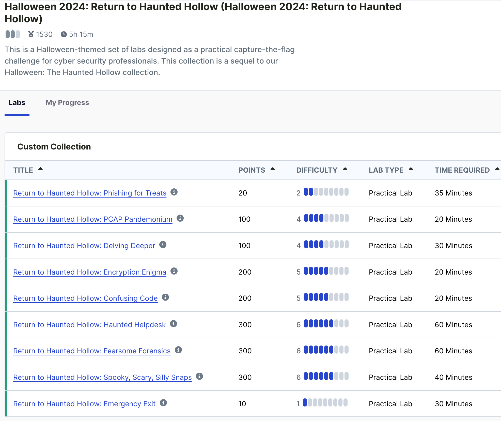

# Return to Haunted Hollow

## Table of Contents
- [Return to Haunted Hollow](#return-to-haunted-hollow)
  - [Table of Contents](#table-of-contents)
  - [Overview](#overview)
  - [Lab 1: Phishing for Treats - Halloween Edition](#lab-1-phishing-for-treats---halloween-edition)
  - [Lab 2: PCAP Pandemonium](#lab-2-pcap-pandemonium)
  - [Lab 3: Delving Deeper](#lab-3-delving-deeper)
  - [Lab 4: Encryption Enigma](#lab-4-encryption-enigma)
  - [Lab 5: Confusing Code](#lab-5-confusing-code)
  - [Lab 6: Haunted Helpdesk](#lab-6-haunted-helpdesk)
  - [Lab 7: Fearsome Forensics](#lab-7-fearsome-forensics)
  - [Lab 8: Spooky, Scary, Silly Snaps](#lab-8-spooky-scary-silly-snaps)
  - [Lab 9: Emergency Exit](#lab-9-emergency-exit)

## Overview

The file provides the answers from all the labs.

## Lab 1: Phishing for Treats - Halloween Edition
Who did Count Dracula intend to send the love letter to? `Morticia`

## Lab 2: PCAP Pandemonium
Record the first code ZIPPY gives you for later. You'll need it in another lab.

Here is a code you might need when you get further into the park: `Z1pPyTh3Zo0kE£peR!`

## Lab 3: Delving Deeper
What codeword did you submit to the API? `EbsEze10`

You should make a note of the answer to this question, as you'll need it to escape through the Emergency Exit.

## Lab 4: Encryption Enigma
Decode the messages. Which mirror is lying? `Revengeful Reflection`

Take note of this answer. You'll need it in the final lab of the collection.

## Lab 5: Confusing Code
What is the password to the computer? `pge2j`

Make a note of this, you'll need it for the final lab.

## Lab 6: Haunted Helpdesk
What is the token found in `/root/token`? `7dcb9e`

One of the complaints mentions a word being repeated by the AI courtesy phones. What is that word? `SOMNUM`

## Lab 7: Fearsome Forensics
What is the social media handle of the AI's creator? `HHfredAI`

You should make a note of the answer to this question, as you'll need it to escape through the Emergency Exit.

## Lab 8: Spooky, Scary, Silly Snaps
Upon its death knell, FredAI cries out one final secret. Can you manage to locate their final words? `IWillBeBackWaitAndS333`

**Note:** take note of this answer. You'll need it to complete the final lab of the collection and escape the Haunted Hollow once and for all!

## Lab 9: Emergency Exit
Final lab.