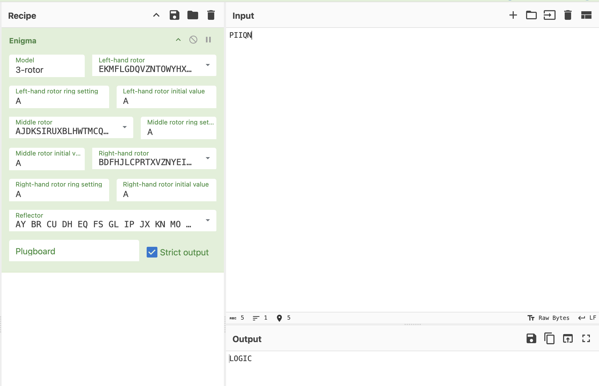

# Lab 4 - Encryption Enigma

## Table of Contents
- [Lab 4 - Encryption Enigma](#lab-4---encryption-enigma)
  - [Table of Contents](#table-of-contents)
  - [Overview](#overview)
  - [Maniacal Mirror](#maniacal-mirror)
    - [Encoded Message](#encoded-message)
    - [Decoded Message](#decoded-message)
  - [Revengful Reflection](#revengful-reflection)
    - [Encoded Message](#encoded-message-1)
    - [Decoded Message](#decoded-message-1)
  - [Phantom Portal](#phantom-portal)
    - [Encoded Message](#encoded-message-2)
    - [Decoded Message](#decoded-message-2)
  - [Analysis](#analysis)
  - [Solution](#solution)

## Overview

Need to decrypt messages from several mirrors in the application, find out who is telling the truth and who is not to get the password and solve the puzzle.

## Maniacal Mirror

### Encoded Message
```
01001101 01111001 00100000 01101101 01100101 01110011 01110011 01100001 01100111 01100101 00100000 01101001 01110011 00100000 01101001 01101110 00100000 01100010 01101001 01101110 01100001 01110010 01111001 00101100 00100000 01100001 01101110 01100100 00100000 01010010 01100101 01110110 01100101 01101110 01100111 01100101 01100110 01110101 01101100 00100000 01010010 01100101 01100110 01101100 01100101 01100011 01110100 01101001 01101111 01101110 00100111 01110011 00100000 01101101 01100101 01110011 01110011 01100001 01100111 01100101 00100000 01101001 01110011 00100000 01100010 01100001 01110011 01100101 00110110 00110100 00101110 00100000 01010100 01101000 01100101 00100000 01110000 01100001 01110011 01110011 01110111 01101111 01110010 01100100 00100000 01101001 01110011 00100000 01101110 01101111 01110100 00100000 00100111 01001010 01001101 01001011 01000011 01000001 00100000 01001001 00100111 00101110
```

### Decoded Message
My message is in binary, and Revengeful Reflection's message is base64. The password is not 'JMKCA I'.

## Revengful Reflection

### Encoded Message
```
UGhhbnRvbSBQb3J0YWwncyBtZXNzYWdlIGlzbid0IGhleGFkZWNpbWFsLCBhbmQgbXkgbWVzc2FnZSBpcyBpbiBiaW5hcnkuIFRoZSBwYXNzd29yZCBpcyBub3QgJ1BJSVFOJy4=
```

### Decoded Message
Phantom Portal's message isn't hexadecimal, and my message is in binary. The password is not 'PIIQN'.

## Phantom Portal

### Encoded Message
```
4d 79 20 6d 65 73 73 61 67 65 20 69 73 20 69 6e 20 68 65 78 61 64 65 63 69 6d 61 6c 2c 20 61 6e 64 20 4d 61 6e 69 61 63 61 6c 20 4d 69 72 72 6f 72 20 69 73 20 74 65 6c 6c 69 6e 67 20 74 68 65 20 74 72 75 74 68 2e 20 54 68 65 20 70 61 73 73 77 6f 72 64 20 69 73 20 6e 6f 74 20 27 4d 4f 49 51 58 20 57 55 27 2e
```

### Decoded Message
My message is in hexadecimal, and Maniacal Mirror is telling the truth. The password is not 'MOIQX WU'.

## Analysis

We have three decoded hints:
1. **Maniacal Mirror**
    - Binary message
    - Says **Revengeful Reflection** uses Base64
    - Password is not `JMKCA I`
2. **Revengeful Reflection**
    - Base64 message
    - Says **Phantom Portal** message isn’t hexadecimal
    - Password is not `PIIQN`
3. **Phantom Portal**
    - Hexadecimal message
    - Says **Maniacal Mirror** is telling the truth
    - Password is not `MOIQX WU`

- The **Revengeful Reflection** message says **Phantom Portal** is NOT hex.
- But the **Phantom Portal** message is hex.
- The **Phantom Portal** message says that **Maniacal Mirror** is telling the truth.
- Hence, **Revengful Reflection** is the liar.
- The encoded password is `PIIQN`.

## Solution

The name of the challenge hints at using the Enigma machine to decode the password.

Usign Enigna in CyberChef with default settings decodes the password to `LOGIC`.


Congratulations! Here's your token: `8fc5dc`
