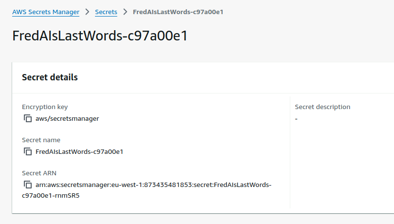
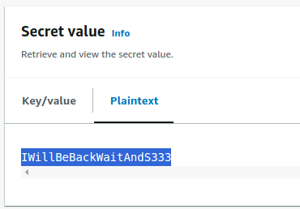

# Lab 8 - Spooky, Scary, Silly Snaps

## Table of Contents
- [Lab 8 - Spooky, Scary, Silly Snaps](#lab-8---spooky-scary-silly-snaps)
  - [Table of Contents](#table-of-contents)
  - [Overview](#overview)
    - [Learning outcomes](#learning-outcomes)
    - [What's involved](#whats-involved)
  - [Get Credentials from Public AWS S3 Buckets](#get-credentials-from-public-aws-s3-buckets)
  - [Log In Using AWS Portal](#log-in-using-aws-portal)
  - [Stop AWS EC2 Instance](#stop-aws-ec2-instance)
  - [Elevate Permissions](#elevate-permissions)
  - [Solution](#solution)

## Overview

### Learning outcomes
* Enumerate public S3 bucket resources
* Navigate the AWS Management Console
* Recall how to escalate privileges in AWS

### What's involved
* Find the stored snaps that FredAI has replaced with horrifying threats
* Stop the FredAI server
* Sneakily adjust some permissions to access FredAI's final secret

-------------------------------------------

## Get Credentials from Public AWS S3 Buckets
* Created a [`spooky-scary-silly-snaps.py`](./spooky-scary-silly-snaps.py) Python script to check the list of S3 buckets to get any available objects.
* The `haunted-hollow-spooky-<id>` S3 bucket had several objects available named 0, 1, 2, ... 102.
* Copied over all the objects using the AWS CLI.
  ```bash
  $ aws s3 cp s3://haunted-hollow-spooky-<id>/ ~/Desktop/AWS_Objects --recursive --no-sign-request
  ```
* After examining their content, all the objects were text files and included the following clues.
  ```bash
  $ cd ~/Desktop/AWS_Objects; grep AWS *
  ```
  ```
  25:I'm going to fill your 625873624021 AWS account with zombie cryptominers!
  62:I'm going to leak your credentials! Everyone already knows you're the haunted-hollow-admin AWS user, but I bet they didn't know your password was '5pooky5cary5keletons!'. How silly!
  ```

-------------------------------------------

## Log In Using AWS Portal
* The local instance of Chrome had a landing page with the AWS IAM login page.
* Let's use the credentials found above:
  - Account ID: `618376206520`
  - IAM user name: `haunted-hollow-admin`
  - Password: `5pooky5cary5keletons!`

-------------------------------------------

## Stop AWS EC2 Instance
* Inside AWS, there was an EC2 instance called `FredAI-server` running.
* Needed to go to **Actions > Manage instance state > Instance state settings**,
  select "Stop" or "Terminate, and click on "Change state".

-------------------------------------------

## Elevate Permissions
* After stopping the EC2 instance, you will notice that there are a lot of access limitations and not a lot of options are available to that user.
* Need to go to **IAM > Users**, select the `haunted-hollow-admin` user, edit the policies and "escalate the privileges" by activating all the policies in all the resources like an Administrator would have.
  ```json
  {
      "Effect": "Allow",
      "Action": [
          "*"
      ],
      "Resource": "*"
  },
  ```
* Click "Next" and "Save Changes" to take effect. This will grant access to everything that account is able see, which would include the secret message.

-------------------------------------------

## Solution

* Go to **Secrets Manager > Secrets**.
* There was a secret called `FredAIsLAstWords-c97a00e1`.

  
* Go to the "Secret Value" section and click "Get Secret Value" on the right.
* The decrypted value in Plaintext was `IWillBeBackWaitAndS333`.

  
