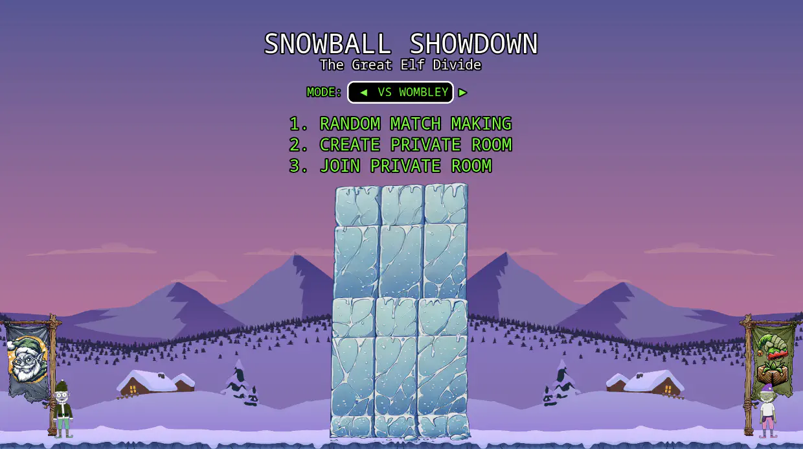
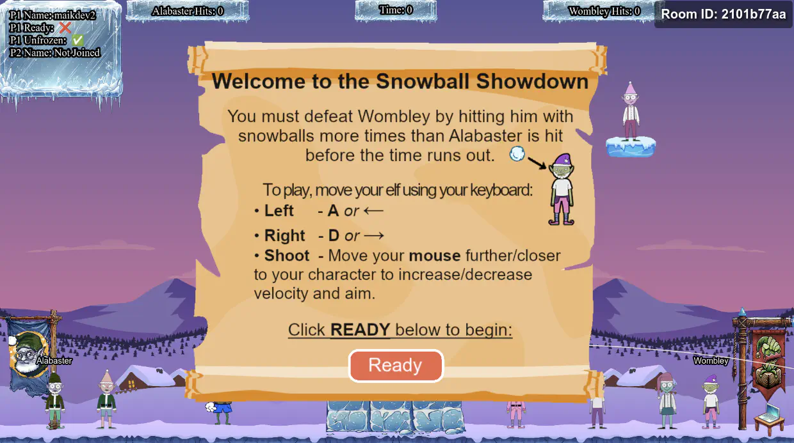
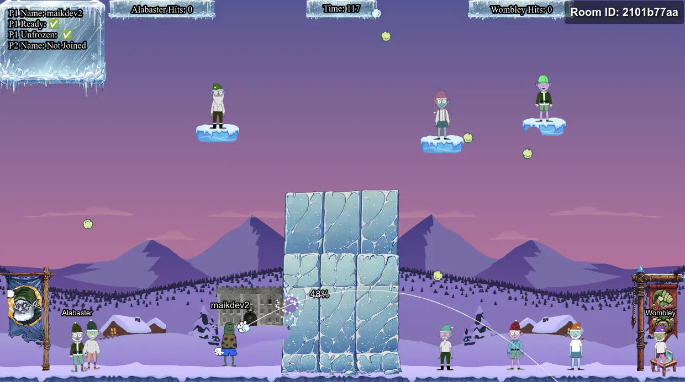
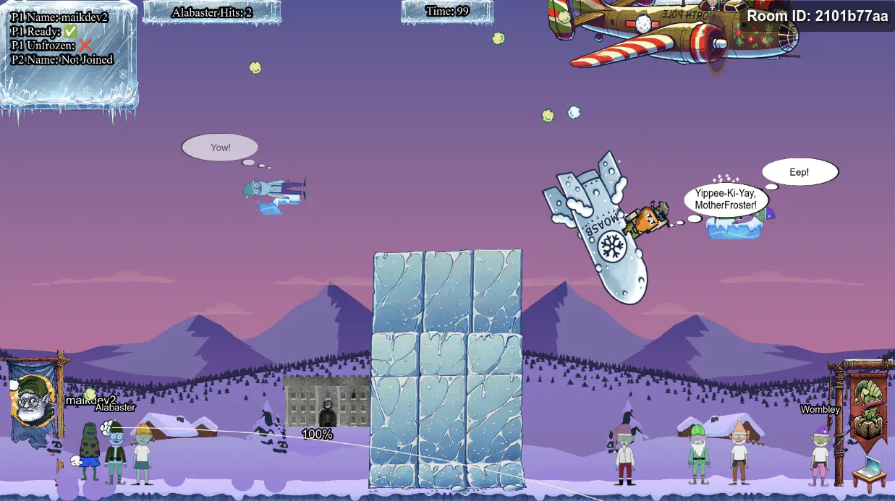

# Snowball Showdown

## Table of Contents
- [Snowball Showdown](#snowball-showdown)
  - [Table of Contents](#table-of-contents)
  - [Overview](#overview)
  - [Introduction](#introduction)
  - [Initial Analysis](#initial-analysis)
  - [Silver](#silver)
    - [Silver Analysis](#silver-analysis)
      - [Play Solo](#play-solo)
      - [Modify Variables](#modify-variables)
      - [Automate Attacks](#automate-attacks)
    - [Silver Solution](#silver-solution)
  - [Gold](#gold)
    - [Gold Analysis](#gold-analysis)
    - [Gold Solution](#gold-solution)
  - [Outro](#outro)
  - [Files](#files)
  - [References](#references)
  - [Navigation](#navigation)

---

## Overview

On Alabaster's side of the Front Yard, Dusty Giftwrap is standing next to the Snowball Showdown poster on a small wall (that is also a terminal).

Dusty needs help win the snowball fight that will take down Wombley and end this fight.

## Introduction

**Dusty Giftwrap**

Hi there! I'm Dusty Giftwrap, back from the battlefield! I'm mostly here for the snowball fights!

But I also don't want Santa angry at us, you wouldn't like him when he's angry. His face becomes as red as his hat! So I guess I'm rooting for Alabaster.

Alabaster Snowball seems to be having quite a pickle with Wombley Cube. We need your wizardry.

Take down Wombley the usual way with a friend, or try a different strategy by tweaking client-side values for an extra edge.

Alternatively, we've got a secret weapon - a giant snow bomb - but we can't remember where we put it or how to launch it.

Adjust the right elements and victory for Alabaster can be secured with more subtlety. Intriguing, right?

Raring to go? Terrific! Here's a real brain tickler. Navigator of chaos or maestro of subtlety, which will you be? Either way, remember our objective: bring victory to Alabaster.

Confidence! Wit! We've got what it takes. Team up with a friend or find a way to go solo - no matter how, let's end this conflict and take down Wombley!

---

## Initial Analysis

After clicking on the challenge, a new tab opens with a welcome screen for the **Snowball Showdown - The Great Elf Divide** game showing a menu:



There are three options in the menu:

1. Random Match Making
2. Create Private Room
3. Join Private Room
   
If we chose option one or two, we get redirected to the game, where we see some instructions.



Once two players join the room and click the "Ready" button, the game starts.



The game is fairly simple. We can move horizontally with the letters `A` (left) or `D` (right), aim the snowball with the mouse pointer, and throw the snowball by clicking with the left mouse button.

## Silver

### Silver Analysis

The hint suggests to hack the client-side code to get an extra advantage.

#### Play Solo
Let's check the URL for the game:
```bash
https://hhc24-snowballshowdown.holidayhackchallenge.com/game.html?username=maikdev2&roomId=2101b77aa&roomType=private&id=[YOUR_ID]&dna=ATATATTAATATATATATATATGCATATATATCGATCGGCATATATATATATATATATATATATATATTATAATATCGTAATATATATATATTAATATATATATATATGCCGATATATTA&singlePlayer=false
```

At the end of the URL, there is a variable `singlePlayer` set to `false`. If we change it to `true` though, and reload the page, it starts immediately upon clicking the "Ready" button. This way, we don't have to wait for another player to join.

#### Modify Variables
Looking at the game source code in the DevTools, we find that it is made using the [Phaser](https://phaser.io/) framework.

The game logic is in the `js/phaser-snowball-game.js` file, where we can see a couple of interesting variables:

- `this.snowBallBlastRadius = 24;`
- `this.throwRateOfFire = 1000;`

We can change their values to make things easier:
```js
const scene = game.scene.scenes[0];
scene.snowBallBlastRadius = 30;
scene.throwRateOfFire = 1;
```

#### Automate Attacks
There is also this code in the `setupPlayerBindings` function.
```js
this.input.on("pointerup", (pointer) => {
    if (pointer.button === 0 && !this.player1.isKo) {
        this.calcSnowballTrajectory(pointer, this.player1);
    }
});
```

This runs every time the left mouse button is released, and sends off the snowball. We can automate this part, so we don't have to keep clicking with the mouse.
```js
const t = setInterval(() => {
    scene.calcSnowballTrajectory(scene.input.mousePointer, scene.player1);
}, 10);
```

### Silver Solution
Let's click "Ready" after making the modifications above. After the game starts, we move closer to the ice block a bit and wait. After a few seconds, we get the Silver medal!

---

## Gold

Fantastic work! You've used your hacker skills to lead Alabaster's forces to victory. That was some impressive strategy!

Christmas is on the line! For a mischievous edge-up, dive into the game's code - a few client-side tweaks to speed, movement, or power might shift the balance… or just help us find that secret weapon we misplaced!

Excellent! With Wombley's forces defeated, they'll have no choice but to admit defeat and abandon their wild plans to hijack Christmas.

### Gold Analysis
Let's check the code again to find information about the "secret weapon".

Checking all the instances of `sendMessage(` we find a reference to "moasb".
```js
this.moasb = () => {
    this.ws.sendMessage({ type: "moasb" });
};
```

This call sends a websocket message of the type “moasb”. 

This word seems to be a twist referring to the [MOAB](https://en.wikipedia.org/wiki/GBU-43/B_MOAB) (Mother Of All Bombs).

### Gold Solution
Let's just force a call to the method during the game:
```js
const scene = game.scene.scenes[0];
scene.moasb();
```

After this call is made, the console shows a `moasb_start` message in response from the server:
```js
{"type":"moasb"}
{"type":"moasb_start"}
```
and an animation is triggered showing a plane that drops a massive bomb on Wonbley's elves.



Upon the bomb exploding, the client sends the moasb message with the launch code:
```js
{"type":"moasb"}
{"type":"moasb_start"}
{"type":"moasb","launch_code":"85e8e9729e2437c9d7d6addca68abb9f"}
```

This seems to trigger the solve on the server, and we get the Gold medal!

```
Brilliant! You unravel the puzzle and launched the ‘mother-of-all-snow-bombs' like a true mastermind. Wombley never saw it coming!
```

> [!NOTE]
> If you are in a game with another player who starts the MOASB sequence, the `moasb_start` message comes to both browsers, and then both browsers send the `launch_code` and get the gold solve.

---

## Outro

**Dusty Giftwrap**

Brilliant! You unravel the puzzle and launched the ‘mother-of-all-snow-bombs' like a true mastermind. Wombley never saw it coming!

Excellent! With Wombley's forces defeated, they'll have no choice but to admit defeat and abandon their wild plans to hijack Christmas.

---

## Files

| File | Description |
|---|---|
| `welcome-screen.png` | Game welcome screen showing the main menu |
| `game-instructions.png` | In-game instructions displayed before the match starts |
| `playing-the-game.png` | Screenshot of the automated attack in progress |
| `moasb.png` | Screenshot of the MOASB bomb drop triggered for Gold |

## References

- [Phaser game framework](https://phaser.io/) — JavaScript framework used to build the game
- [MOAB — Wikipedia](https://en.wikipedia.org/wiki/GBU-43/B_MOAB) — reference for the MOASB easter egg name
- [JavaScript DevTools console](https://developer.chrome.com/docs/devtools/console/) — used to inject and run the exploit code

---

## Navigation

| | |
|:---|---:|
| ← [PowerShell](../powershell/README.md) | [The Great Elf Conflict](../the-great-elf-conflict/README.md) → |
