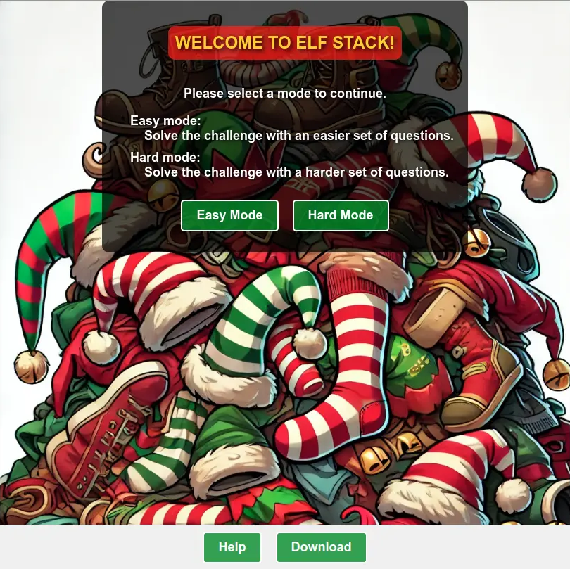
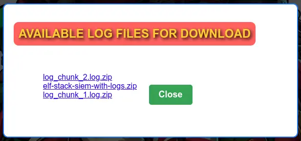
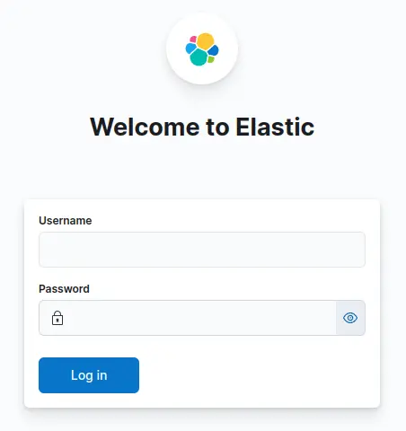
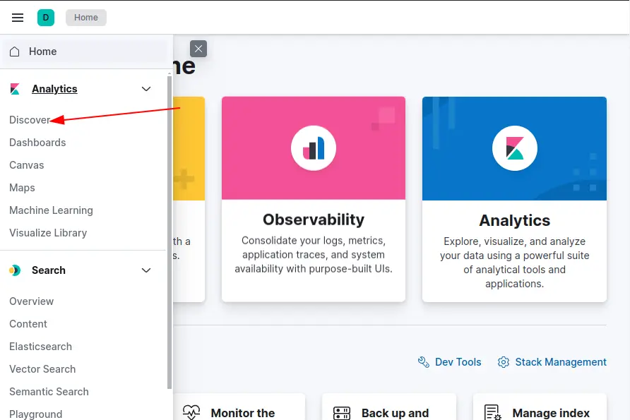
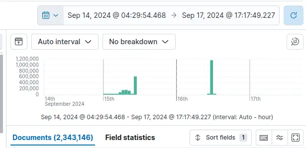

# Elf Stack

## Table of Contents
- [Elf Stack](#elf-stack)
  - [Table of Contents](#table-of-contents)
  - [Overview](#overview)
  - [Introduction](#introduction)
  - [Hints](#hints)
    - [Hint 1: Elf Stack Intro](#hint-1-elf-stack-intro)
    - [Hint 2: Elf Stack Fields](#hint-2-elf-stack-fields)
    - [Hint 3: Elf Stack WinEvent](#hint-3-elf-stack-winevent)
    - [Hint 4: Elf Stack PowerShell](#hint-4-elf-stack-powershell)
    - [Hint 5: Elf Stack Hard - Email1](#hint-5-elf-stack-hard---email1)
    - [Hint 6: Elf Stack Hard - Email2](#hint-6-elf-stack-hard---email2)
  - [Initial Analysis](#initial-analysis)
    - [Quick Start Instructions](#quick-start-instructions)
    - [Welcome to Elf Stack](#welcome-to-elf-stack)
  - [Elf Stack Help](#elf-stack-help)
    - [Description](#description)
    - [Challenge Modes](#challenge-modes)
      - [Easy Mode](#easy-mode)
      - [Hard Mode](#hard-mode)
    - [Optional: Elf Stack SIEM](#optional-elf-stack-siem)
      - [Containerized ELK Stack](#containerized-elk-stack)
      - [Containerized ELK Stack: Prerequisites](#containerized-elk-stack-prerequisites)
      - [Containerized ELK Stack: Setup](#containerized-elk-stack-setup)
  - [Elf Stack Download](#elf-stack-download)
  - [Elf Stack Setup](#elf-stack-setup)
  - [Elf Stack Elastic Search](#elf-stack-elastic-search)
  - [Silver](#silver)
    - [Question 1: How many unique values are there for the event\_source field in all logs?](#question-1-how-many-unique-values-are-there-for-the-event_source-field-in-all-logs)
    - [Question 2: Which event\_source has the fewest number of events related to it?](#question-2-which-event_source-has-the-fewest-number-of-events-related-to-it)
    - [Question 3: Using the event\_source from the previous question as a filter, what is the field name that contains the name of the system the log event originated from?](#question-3-using-the-event_source-from-the-previous-question-as-a-filter-what-is-the-field-name-that-contains-the-name-of-the-system-the-log-event-originated-from)
    - [Question 4: Which event\_source has the second highest number of events related to it?](#question-4-which-event_source-has-the-second-highest-number-of-events-related-to-it)
    - [Question 5: Using the event\_source from the previous question as a filter, what is the name of the field that defines the destination port of the Netflow logs?](#question-5-using-the-event_source-from-the-previous-question-as-a-filter-what-is-the-name-of-the-field-that-defines-the-destination-port-of-the-netflow-logs)
    - [Question 6: Which event\_source is related to email traffic?](#question-6-which-event_source-is-related-to-email-traffic)
    - [Question 7: Looking at the event source from the last question, what is the name of the field that contains the actual email text?](#question-7-looking-at-the-event-source-from-the-last-question-what-is-the-name-of-the-field-that-contains-the-actual-email-text)
    - [Question 8: Using the 'GreenCoat' event\_source, what is the only value in the hostname field?](#question-8-using-the-greencoat-event_source-what-is-the-only-value-in-the-hostname-field)
    - [Question 9: Using the 'GreenCoat' event\_source, what is the name of the field that contains the site visited by a client in the network?](#question-9-using-the-greencoat-event_source-what-is-the-name-of-the-field-that-contains-the-site-visited-by-a-client-in-the-network)
    - [Question 10: Using the 'GreenCoat' event\_source, which unique URL and port (URL:port) did clients in the TinselStream network visit most?](#question-10-using-the-greencoat-event_source-which-unique-url-and-port-urlport-did-clients-in-the-tinselstream-network-visit-most)
    - [Question 11: Using the 'WindowsEvent' event\_source, how many unique Channels is the SIEM receiving Windows event logs from?](#question-11-using-the-windowsevent-event_source-how-many-unique-channels-is-the-siem-receiving-windows-event-logs-from)
    - [Question 12: What is the name of the event.Channel (or Channel) with the second highest number of events?](#question-12-what-is-the-name-of-the-eventchannel-or-channel-with-the-second-highest-number-of-events)
    - [Question 13: Our environment is using Sysmon to track many different events on Windows systems. What is the Sysmon Event ID related to loading of a driver?](#question-13-our-environment-is-using-sysmon-to-track-many-different-events-on-windows-systems-what-is-the-sysmon-event-id-related-to-loading-of-a-driver)
    - [Question 14: What is the Windows event ID that is recorded when a new service is installed on a system?](#question-14-what-is-the-windows-event-id-that-is-recorded-when-a-new-service-is-installed-on-a-system)
    - [Question 15: Using the WindowsEvent event\_source as your initial filter, how many user accounts were created?](#question-15-using-the-windowsevent-event_source-as-your-initial-filter-how-many-user-accounts-were-created)
  - [Gold](#gold)
    - [Question 1: What is the event.EventID number for Sysmon event logs relating to process creation?](#question-1-what-is-the-eventeventid-number-for-sysmon-event-logs-relating-to-process-creation)
    - [Question 2: How many unique values are there for the 'event\_source' field in all of the logs?](#question-2-how-many-unique-values-are-there-for-the-event_source-field-in-all-of-the-logs)
    - [Question 3: What is the event\_source name that contains the email logs?](#question-3-what-is-the-event_source-name-that-contains-the-email-logs)
    - [Question 4: The North Pole network was compromised recently through a sophisticated phishing attack sent to one of our elves. The attacker found a way to bypass the middleware that prevented phishing emails from getting to North Pole elves. As a result, one of the Received IPs will likely be different from what most email logs contain. Find the email log in question and submit the value in the event 'From:' field for this email log event.](#question-4-the-north-pole-network-was-compromised-recently-through-a-sophisticated-phishing-attack-sent-to-one-of-our-elves-the-attacker-found-a-way-to-bypass-the-middleware-that-prevented-phishing-emails-from-getting-to-north-pole-elves-as-a-result-one-of-the-received-ips-will-likely-be-different-from-what-most-email-logs-contain-find-the-email-log-in-question-and-submit-the-value-in-the-event-from-field-for-this-email-log-event)
    - [Question 5: Our ElfSOC analysts need your help identifying the hostname of the domain computer that established a connection to the attacker after receiving the phishing email from the previous question. You can take a look at our GreenCoat proxy logs as an event source. Since it is a domain computer, we only need the hostname, not the fully qualified domain name (FQDN) of the system.](#question-5-our-elfsoc-analysts-need-your-help-identifying-the-hostname-of-the-domain-computer-that-established-a-connection-to-the-attacker-after-receiving-the-phishing-email-from-the-previous-question-you-can-take-a-look-at-our-greencoat-proxy-logs-as-an-event-source-since-it-is-a-domain-computer-we-only-need-the-hostname-not-the-fully-qualified-domain-name-fqdn-of-the-system)
    - [Question 6: What was the IP address of the system you found in the previous question?](#question-6-what-was-the-ip-address-of-the-system-you-found-in-the-previous-question)
    - [Question 7: A process was launched when the user executed the program AFTER they downloaded it. What was that Process ID number (digits only please)?](#question-7-a-process-was-launched-when-the-user-executed-the-program-after-they-downloaded-it-what-was-that-process-id-number-digits-only-please)
    - [Question 8: Did the attacker's payload make an outbound network connection? Our ElfSOC analysts need your help identifying the destination TCP port of this connection.](#question-8-did-the-attackers-payload-make-an-outbound-network-connection-our-elfsoc-analysts-need-your-help-identifying-the-destination-tcp-port-of-this-connection)
    - [Question 9: The attacker escalated their privileges to the SYSTEM account by creating an inter-process communication (IPC) channel. Submit the alpha-numeric name for the IPC channel used by the attacker.](#question-9-the-attacker-escalated-their-privileges-to-the-system-account-by-creating-an-inter-process-communication-ipc-channel-submit-the-alpha-numeric-name-for-the-ipc-channel-used-by-the-attacker)
    - [Question 10: The attacker's process attempted to access a file. Submit the full and complete file path accessed by the attacker's process.](#question-10-the-attackers-process-attempted-to-access-a-file-submit-the-full-and-complete-file-path-accessed-by-the-attackers-process)
    - [Question 11: The attacker attempted to use a secure protocol to connect to a remote system. What is the hostname of the target server?](#question-11-the-attacker-attempted-to-use-a-secure-protocol-to-connect-to-a-remote-system-what-is-the-hostname-of-the-target-server)
    - [Question 12: The attacker created an account to establish their persistence on the Linux host. What is the name of the new account created by the attacker?](#question-12-the-attacker-created-an-account-to-establish-their-persistence-on-the-linux-host-what-is-the-name-of-the-new-account-created-by-the-attacker)
    - [Question 13: The attacker wanted to maintain persistence on the Linux host they gained access to and executed multiple binaries to achieve their goal. What was the full CLI syntax of the binary the attacker executed after they created the new user account?](#question-13-the-attacker-wanted-to-maintain-persistence-on-the-linux-host-they-gained-access-to-and-executed-multiple-binaries-to-achieve-their-goal-what-was-the-full-cli-syntax-of-the-binary-the-attacker-executed-after-they-created-the-new-user-account)
    - [Question 14: The attacker enumerated Active Directory using a well known tool to map our Active Directory domain over LDAP. Submit the full ISO8601 compliant timestamp when the first request of the data collection attack sequence was initially recorded against the domain controller.](#question-14-the-attacker-enumerated-active-directory-using-a-well-known-tool-to-map-our-active-directory-domain-over-ldap-submit-the-full-iso8601-compliant-timestamp-when-the-first-request-of-the-data-collection-attack-sequence-was-initially-recorded-against-the-domain-controller)
    - [Question 15: The attacker attempted to perform an ADCS ESC1 attack, but certificate services denied their certificate request. Submit the name of the software responsible for preventing this initial attack.](#question-15-the-attacker-attempted-to-perform-an-adcs-esc1-attack-but-certificate-services-denied-their-certificate-request-submit-the-name-of-the-software-responsible-for-preventing-this-initial-attack)
    - [Question 16: We think the attacker successfully performed an ADCS ESC1 attack. Can you find the name of the user they successfully requested a certificate on behalf of?](#question-16-we-think-the-attacker-successfully-performed-an-adcs-esc1-attack-can-you-find-the-name-of-the-user-they-successfully-requested-a-certificate-on-behalf-of)
    - [Question 17: One of our file shares was accessed by the attacker using the elevated user account (from the ADCS attack). Submit the folder name of the share they accessed.](#question-17-one-of-our-file-shares-was-accessed-by-the-attacker-using-the-elevated-user-account-from-the-adcs-attack-submit-the-folder-name-of-the-share-they-accessed)
    - [Question 18: The naughty attacker continued to use their privileged account to execute a PowerShell script to gain domain administrative privileges. What is the password for the account the attacker used in their attack payload?](#question-18-the-naughty-attacker-continued-to-use-their-privileged-account-to-execute-a-powershell-script-to-gain-domain-administrative-privileges-what-is-the-password-for-the-account-the-attacker-used-in-their-attack-payload)
    - [Question 19: The attacker then used remote desktop to remotely access one of our domain computers. What is the full ISO8601 compliant UTC EventTime when they established this connection?](#question-19-the-attacker-then-used-remote-desktop-to-remotely-access-one-of-our-domain-computers-what-is-the-full-iso8601-compliant-utc-eventtime-when-they-established-this-connection)
    - [Question 20: The attacker is trying to create their own naughty and nice list! What is the full file path they created using their remote desktop connection?](#question-20-the-attacker-is-trying-to-create-their-own-naughty-and-nice-list-what-is-the-full-file-path-they-created-using-their-remote-desktop-connection)
    - [Question 21: The Wombley faction has user accounts in our environment. How many unique Wombley faction users sent an email message within the domain?](#question-21-the-wombley-faction-has-user-accounts-in-our-environment-how-many-unique-wombley-faction-users-sent-an-email-message-within-the-domain)
    - [Question 22: The Alabaster faction also has some user accounts in our environment. How many emails were sent by the Alabaster users to the Wombley faction users?](#question-22-the-alabaster-faction-also-has-some-user-accounts-in-our-environment-how-many-emails-were-sent-by-the-alabaster-users-to-the-wombley-faction-users)
    - [Question 23: Of all the reindeer, there are only nine. What's the full domain for the one whose nose does glow and shine? To help you narrow your search, search the events in the 'SnowGlowMailPxy' event source.](#question-23-of-all-the-reindeer-there-are-only-nine-whats-the-full-domain-for-the-one-whose-nose-does-glow-and-shine-to-help-you-narrow-your-search-search-the-events-in-the-snowglowmailpxy-event-source)
    - [Question 24: With a fiery tail seen once in great years, what's the domain for the reindeer who flies without fears? To help you narrow your search, search the events in the 'SnowGlowMailPxy' event source.](#question-24-with-a-fiery-tail-seen-once-in-great-years-whats-the-domain-for-the-reindeer-who-flies-without-fears-to-help-you-narrow-your-search-search-the-events-in-the-snowglowmailpxy-event-source)
  - [Outro](#outro)
  - [Files](#files)
  - [References](#references)
  - [Navigation](#navigation)

---

## Overview

Fitzy Shortstack is towards the top left corner of the yard standing by a tent with a destroyed satellite dish and the Elf Stack terminal, and introduces the North Pole Elf Stack SIEM.

## Introduction

**Fitzy Shortstack**

Greetings! I'm the genius behind the North Pole Elf Stack SIEM. And oh boy, we've got a situation on our hands.

Our system was attacked—Wombley's faction unleashed their FrostBit ransomware, and it's caused a digital disaster.

The logs are a mess, and Wombley's laptop—the only backup of the Naughty-Nice List—was smashed to pieces.

Now, it's all up to you to help me trace the attack vectors and events. We need to figure out how this went down before it's too late.

You'll be using a containerized ELK stack or Linux CLI tools. Sounds like a fun little puzzle, doesn't it?

Your job is to analyze these logs… think of it as tracking snow tracks but in a digital blizzard.

If you can find the attack path, maybe we can salvage what's left and get Santa's approval.

Santa's furious at the faction fighting, and he's disappointed. We have to make things right.

So, let's show these attackers that the North Pole's defenses are no joke!

## Hints

### Hint 1: Elf Stack Intro
I'm part of the ElfSOC that protects the interests here at the North Pole. We built the Elf Stack SIEM, but not everybody uses it. Some of our senior analysts choose to use their command line skills, while others choose to deploy their own solution. Any way is possible to hunt through our logs!

### Hint 2: Elf Stack Fields
If you are using your command line skills to solve the challenge, you might need to review the configuration files from the containerized Elf Stack SIEM.

### Hint 3: Elf Stack WinEvent
One of our seasoned ElfSOC analysts told me about a great resource to have handy when hunting through event log data. I have it around here somewhere, or maybe it was online. Hmm.

### Hint 4: Elf Stack PowerShell
Our Elf Stack SIEM has some minor issues when parsing log data that we still need to figure out. Our ElfSOC SIEM engineers drank many cups of hot chocolate figuring out the right parsing logic. The engineers wanted to ensure that our junior analysts had a solid platform to hunt through log data.

### Hint 5: Elf Stack Hard - Email1
I was on my way to grab a cup of hot chocolate the other day when I overheard the reindeer talking about playing games. The reindeer mentioned trying to invite Wombley and Alabaster to their games. This may or may not be great news. All I know is, the reindeer better create formal invitations to send to both Wombley and Alabaster.

### Hint 6: Elf Stack Hard - Email2
Some elves have tried to make tweaks to the Elf Stack log parsing logic, but only a seasoned SIEM engineer or analyst may find that task useful.

---

## Initial Analysis

Upon clicking on the challenge, an iFrame pops up with some instructions and a menu.

### Quick Start Instructions

Welcome to Elf Stack! Here are some quick instructions to help you get started:

* Select a mode and click "Start Challenge" to begin.
* Use the "Back to Main Page" button to return to the main menu and restart your session.
* Click "Download" to download log files or containerized SIEM files.
* Access detailed help anytime by clicking the "Help" button.

### Welcome to Elf Stack

Closing the instructions shows a welcome page:



There are two buttons to solve the challenge:

* **Easy mode:** Solve the challenge with an easier set of questions.
* **Hard mode:** Solve the challenge with a harder set of questions.

---

## Elf Stack Help

Let's start by looking at the Help.

### Description
* Help the ElfSOC analysts and test your technical and security skills while you investigate a malicious attack. You will parse a set of log files to identify the malicious attack vector and various events within an attack chain.
* The log parsing skills emphasized by this challenge can be done with the provided containerized Elf Stack SIEM, through traditional Linux CLI tools, or however you want. There are two challenge modes (EASY and HARD) which determines the difficulty of questions presented to you.
* **Note:** You do not have to use the containerized SIEM to solve any of the questions, but it might make things a bit easier!
* You can download the containerized Elf Stack SIEM configuration and log files by selecting the "Download" button.

### Challenge Modes

#### Easy Mode
* This mode teaches basic log parsing with a common SIEM utility like the ELK stack. You are provided a Docker Compose configuration that allows you to fully setup an ELK stack within a containerized environment.
* Select this mode if you are new to security, or you want to continue on with the story. This mode is meant to help you learn while doing.

#### Hard Mode
* This mode expects you have some knowledge on parsing log files. The attack path is more complex and you will need to research how to identify the steps within the attack chain.
* Select this mode if you want to challenge your security skills.

### Optional: Elf Stack SIEM

#### Containerized ELK Stack
* The containerized SIEM is provided to assist in solving the challenge. The SIEM is fully functional and configured to ingest the provided log files.
* **Note:** This was built and tested on an Ubuntu 22.04 Linux virtual machine.

#### Containerized ELK Stack: Prerequisites
* Minimum system specs to run the containerized SIEM. The specs below minimize the loss of logs during ingestion. Adjusting the specs down may cause longer delays in log ingestion, loss of logs during ingestion, or slow performance:
  * RAM: Minimum 16GB
  * CPU Cores: Minimum 4
  * Hard drive space: Minimum 30GB / Recommended 40GB
  * A network interface with internet connectivity
* Follow the instructions on Docker Installation Guide (https://docs.docker.com/engine/install) to install Docker on your respective platform.
* After installation of Docker, download the Elf Stack files from the download page.
* Unzip/Extract the containerized files into a single directory.

#### Containerized ELK Stack: Setup
* **Note:** Setup time depends on internet connectivity and system resources.
* Browse to the directory containing the container SIEM files and setup the environment. Time to complete ~2-10 minutes:
  ```bash
  docker compose up setup
  ```
* Run the ELF Stack SIEM to automatically ingest the logs. Time to complete ~20-30 minutes:
  ```bash
  docker compose up
  ```
* The terminal output will display:
  * When logs ingestion is complete.
  * The login URL and credentials.
* After the login URL and credentials are displayed, the Elf Stack SIEM is ready for use.
* **Note:** After your Elf Stack SIEM is setup, ensure you set the timeframe to look at events in 2024.
Containerized ELK Stack: Teardown
* Use the following command to shut down the Elf Stack SIEM:
  ```bash
  docker compose down --volumes
  ```
* **Note:** The command requires the `--volumes` syntax to clear the volume data which may skew your results if you set the stack up again later.

---

## Elf Stack Download

Upon clicking the "Download" button, we get links to three files with raw logs ([`log_chunk_1.log.zip`](./files/log_chunk_1.log.zip) and [`log_chunk_2.log.zip`](./files/log_chunk_2.log.zip)) and a full ELK stack with logs ([`elf-stack-siem-with-logs.zip`](./files/elf-stack-siem-with-logs.zip)):



---

## Elf Stack Setup

First, installed Docker Desktop from https://docs.docker.com/desktop/setup/install/mac-install/, using the default configuration options, and skipping the account creation and survey.

Unzipped the `elf-stack-siem-with-logs.zip` file, went to the folder with the Elf Stack SIEM files and ran the Docker setup.
```bash
cd elf-stack-siem/
docker compose up setup
```
```
[+] Running 12/12
 ✔ setup Pulled                                                             125.1s 
 ✔ elasticsearch Pulled                                                     125.2s 
   ✔ bef9b66d64c1 Pull complete                                              14.1s 
   ✔ a809598a97cb Pull complete                                              15.0s 
   ✔ b1e3cab81fe0 Pull complete                                              15.0s 
   ✔ 4ca545ee6d5d Pull complete                                              15.0s 
   ✔ c5877fdff53b Pull complete                                             117.1s 
   ✔ 0db2217c4e96 Pull complete                                             117.1s 
   ✔ a26d7e8c9bed Pull complete                                             117.2s 
   ✔ e8e978c35e48 Pull complete                                             117.2s 
   ✔ 6cf397f5af60 Pull complete                                             117.3s 
   ✔ 086a059acc9c Pull complete                                             117.3s 
[+] Running 4/4
 ✔ Network elf_net                 Created                                    0.1s 
 ✔ Volume "ess_elastisearch_data"  Created                                    0.0s 
 ✔ Container ess_elasticsearch     Created                                    0.6s 
 ✔ Container ess_setup             Created                                    0.0s 
Attaching to ess_setup
ess_setup  | [+] Waiting for availability of Elasticsearch. This can take several minutes.
ess_setup  |    ⠿ Elasticsearch is running
ess_setup  | [+] Waiting for initialization of built-in users
ess_setup  |    ⠿ Built-in users were initialized
ess_setup  | [+] Role 'heartbeat_writer'
ess_setup  |    ⠿ Creating/updating
ess_setup  | [+] Role 'metricbeat_writer'
ess_setup  |    ⠿ Creating/updating
ess_setup  | [+] Role 'filebeat_writer'
ess_setup  |    ⠿ Creating/updating
ess_setup  | [+] Role 'logstash_writer'
ess_setup  |    ⠿ Creating/updating
ess_setup  | [+] User 'filebeat_internal'
ess_setup  |    ⠿ User does not exist, creating
ess_setup  | [+] User 'kibana_system'
ess_setup  |    ⠿ User exists, setting password
ess_setup  | [+] User 'logstash_internal'
ess_setup  |    ⠿ User does not exist, creating
ess_setup  | [+] User 'heartbeat_internal'
ess_setup  |    ⠿ User does not exist, creating
ess_setup  | [+] User 'metricbeat_internal'
ess_setup  |    ⠿ User does not exist, creating
ess_setup  | [+] User 'monitoring_internal'
ess_setup  |    ⠿ User does not exist, creating
ess_setup  | [+] User 'beats_system'
ess_setup  |    ⠿ User exists, setting password
ess_setup exited with code 0
```

Ran the ELF Stack SIEM to automatically ingest the logs.
```bash
docker compose up
```
```
[+] Running 25/25
 ✔ logstash Pulled                                                          151.1s 
   ✔ b815ad5402cf Pull complete                                              71.5s 
   ✔ 5b47878f3ce9 Pull complete                                              71.5s 
   ✔ 23a82c4a5e37 Pull complete                                             148.7s 
   ✔ fa216204f551 Pull complete                                             148.8s 
   ✔ d1ab9b97bbc1 Pull complete                                             148.8s 
   ✔ 41fdd4dc3795 Pull complete                                             148.8s 
   ✔ 1df19db0c531 Pull complete                                             148.8s 
   ✔ 49876161b294 Pull complete                                             148.9s 
   ✔ a31f67a0f79b Pull complete                                             149.0s 
   ✔ 128e51c267a7 Pull complete                                             149.0s 
 ✔ kibana Pulled                                                            155.2s 
   ✔ bef9b66d64c1 Already exists                                              0.0s 
   ✔ aefe6918a643 Pull complete                                              37.6s 
   ✔ 5cf4ad7c6244 Pull complete                                             153.0s 
   ✔ a5b3f4bba780 Pull complete                                             153.1s 
   ✔ a40c3021b8ef Pull complete                                             153.4s 
   ✔ cd53abaf1764 Pull complete                                             153.5s 
   ✔ 4ca545ee6d5d Pull complete                                             153.5s 
   ✔ 08ad53f4fdc8 Pull complete                                             153.5s 
   ✔ 763424658332 Pull complete                                             153.5s 
   ✔ f93a25f04320 Pull complete                                             153.6s 
   ✔ e19f47aeef22 Pull complete                                             153.6s 
   ✔ 309bf1b8ab68 Pull complete                                             153.6s 
   ✔ c97d1115b929 Pull complete                                             153.7s 
[+] Building 82.6s (9/9) FINISHED                             docker:desktop-linux
 => [syslog_sender internal] load build definition from Dockerfile            0.0s
 => => transferring dockerfile: 349B                                          0.0s
 => [syslog_sender internal] load metadata for docker.io/library/ubuntu:22.04 1.6s
 => [syslog_sender internal] load .dockerignore                               0.0s
 => => transferring context: 2B                                               0.0s
 => [syslog_sender 1/4] FROM docker.io/library/ubuntu:22.04@sha256:0e5e4a57c2499249aafc3b40fcd541e9a456aab7296681a3994  9.3s
 => => resolve docker.io/library/ubuntu:22.04@sha256:0e5e4a57c2499249aafc3b40fcd541e9a456aab7296681a3994d631587203f97   0.0s
 => => sha256:6414378b647780fee8fd903ddb9541d134a1947ce092d08bdeb23a54cb3684ac 29.54MB / 29.54MB                        4.6s
 => => sha256:0e5e4a57c2499249aafc3b40fcd541e9a456aab7296681a3994d631587203f97 6.69kB / 6.69kB                          0.0s
 => => sha256:3d1556a8a18cf5307b121e0a98e93f1ddf1f3f8e092f1fddfd941254785b95d7 424B / 424B                              0.0s
 => => sha256:97271d29cb7956f0908cfb1449610a2cd9cb46b004ac8af25f0255663eb364ba 2.30kB / 2.30kB                          0.0s
 => => extracting sha256:6414378b647780fee8fd903ddb9541d134a1947ce092d08bdeb23a54cb3684ac                               4.2s
 => [syslog_sender 2/4] RUN apt-get update &&     DEBIAN_FRONTEND=noninteractive apt-get install -y     python3     p  60.5s
 => [syslog_sender 3/4] RUN python3 -m pip install requests art aiohttp       8.7s
 => [syslog_sender 4/4] WORKDIR /root                                         0.0s
 => [syslog_sender] exporting to image                                        2.3s
 => => exporting layers                                                       2.3s
 => => writing image sha256:ffa549e0e5228721f51996ab3c5352b84f1aa37931377bf75e2c041bca36829f                            0.0s
 => => naming to docker.io/library/elf_stack_syslog_sender:latest             0.0s
 => [syslog_sender] resolving provenance for metadata file                    0.0s
[+] Running 5/4
 ✔ Volume "ess_logstash_queue_data"  Created                                                                            0.0s
 ✔ Container ess_elasticsearch       Running                                                                            0.0s
 ✔ Container ess_kibana              Created                                                                            0.1s
 ✔ Container ess_logstash            Created                                                                            0.1s
 ✔ Container ess_syslog_sender       Created                                                                            0.0s
Attaching to ess_elasticsearch, ess_kibana, ess_logstash, ess_syslog_sender
ess_logstash       | Using bundled JDK: /usr/share/logstash/jdk
ess_kibana         | Kibana is currently running with legacy OpenSSL providers enabled! For details and instructions on how to disable see https://www.elastic.co/guide/en/kibana/8.15/production.html#openssl-legacy-provider
ess_kibana         | {"log.level":"info","@timestamp":"2024-12-04T21:15:44.403Z","log.logger":"elastic-apm-node","ecs.version":"8.10.0","agentVersion":"4.7.0","env":{"pid":7,"proctitle":"/usr/share/kibana/bin/../node/glibc-217/bin/node","os":"linux 6.10.14-linuxkit","arch":"x64","host":"d79f5327ace9","timezone":"UTC+00","runtime":"Node.js v20.15.1"},"config":{"active":{"source":"start","value":true},"breakdownMetrics":{"source":"start","value":false},"captureBody":{"source":"start","value":"off","commonName":"capture_body"},"captureHeaders":{"source":"start","value":false},"centralConfig":{"source":"start","value":false},"contextPropagationOnly":{"source":"start","value":true},"environment":{"source":"start","value":"production"},"globalLabels":{"source":"start","value":[["git_rev","f66ec5b0ddd990d103489c47ca1bcb97dc50bc6b"]],"sourceValue":{"git_rev":"f66ec5b0ddd990d103489c47ca1bcb97dc50bc6b"}},"logLevel":{"source":"default","value":"info","commonName":"log_level"},"metricsInterval":{"source":"start","value":120,"sourceValue":"120s"},"serverUrl":{"source":"start","value":"https://kibana-cloud-apm.apm.us-east-1.aws.found.io/","commonName":"server_url"},"transactionSampleRate":{"source":"start","value":0.1,"commonName":"transaction_sample_rate"},"captureSpanStackTraces":{"source":"start","sourceValue":false},"secretToken":{"source":"start","value":"[REDACTED]","commonName":"secret_token"},"serviceName":{"source":"start","value":"kibana","commonName":"service_name"},"serviceVersion":{"source":"start","value":"8.15.1","commonName":"service_version"}},"activationMethod":"require","message":"Elastic APM Node.js Agent v4.7.0"}
ess_kibana         | Native global console methods have been overridden in production environment.
ess_syslog_sender  | 🎄✖🎄✖🎄⇇🎄✖🎄✖🎄⇇🎄✖🎄✖🎄⇇🎄✖🎄✖🎄⇇🎄✖🎄✖🎄⇇🎄✖🎄✖🎄⇇🎄✖🎄✖🎄⇇🎄✖🎄✖🎄⇇🎄✖🎄✖🎄⇇🎄✖🎄✖🎄
ess_syslog_sender  | 🎄✖🎄✖🎄⇇🎄✖🎄✖🎄⇇🎄✖🎄✖🎄⇇🎄✖🎄✖🎄⇇🎄✖🎄✖🎄⇇🎄✖🎄✖🎄⇇🎄✖🎄✖🎄⇇🎄✖🎄✖🎄⇇🎄✖🎄✖🎄⇇🎄✖🎄✖🎄
ess_syslog_sender  |
ess_syslog_sender  |   _____  _      _____     ____   _____     _      ____  _  __
ess_syslog_sender  |  | ____|| |    |  ___|   / ___| |_   _|   / \    / ___|| |/ /
ess_syslog_sender  |  |  _|  | |    | |_      \___ \   | |    / _ \  | |    | ' /
ess_syslog_sender  |  | |___ | |___ |  _|      ___) |  | |   / ___ \ | |___ | . \
ess_syslog_sender  |  |_____||_____||_|       |____/   |_|  /_/   \_\ \____||_|\_\
ess_syslog_sender  |
ess_syslog_sender  |   _          _                    _    _
ess_syslog_sender  |  (_) ___    | |__    ___    ___  | |_ (_) _ __    __ _
ess_syslog_sender  |  | |/ __|   | '_ \  / _ \  / _ \ | __|| || '_ \  / _` |
ess_syslog_sender  |  | |\__ \   | |_) || (_) || (_) || |_ | || | | || (_| | _  _  _
ess_syslog_sender  |  |_||___/   |_.__/  \___/  \___/  \__||_||_| |_| \__, |(_)(_)(_)
ess_syslog_sender  |                                                  |___/
ess_syslog_sender  |
ess_syslog_sender  | 	****READY AT APPROXIMATELY: 2024-12-04 21:46:00+00:00 (~20-30 MINUTES)****
ess_syslog_sender  |
ess_syslog_sender  | 🎄✖🎄✖🎄⇇🎄✖🎄✖🎄⇇🎄✖🎄✖🎄⇇🎄✖🎄✖🎄⇇🎄✖🎄✖🎄⇇🎄✖🎄✖🎄⇇🎄✖🎄✖🎄⇇🎄✖🎄✖🎄⇇🎄✖🎄✖🎄⇇🎄✖🎄✖🎄
ess_syslog_sender  | 🎄✖🎄✖🎄⇇🎄✖🎄✖🎄⇇🎄✖🎄✖🎄⇇🎄✖🎄✖🎄⇇🎄✖🎄✖🎄⇇🎄✖🎄✖🎄⇇🎄✖🎄✖🎄⇇🎄✖🎄✖🎄⇇🎄✖🎄✖🎄⇇🎄✖🎄✖🎄
ess_syslog_sender  | [2024-12-04T21:15:58.941771+00:00] INFO: Elasticsearch is up!
ess_syslog_sender  | [2024-12-04T21:15:58.946810+00:00] INFO: The Logstash connection is not available yet...
ess_syslog_sender  | [2024-12-04T21:15:58.946909+00:00] INFO: Retrying connection to Logstash in 15 seconds...
ess_syslog_sender  | [2024-12-04T21:16:13.967699+00:00] INFO: The Logstash connection is not available yet...
ess_syslog_sender  | [2024-12-04T21:16:13.967799+00:00] INFO: Retrying connection to Logstash in 15 seconds...
ess_logstash       | Sending Logstash logs to /usr/share/logstash/logs which is now configured via log4j2.properties
ess_syslog_sender  | [2024-12-04T21:16:29.078641+00:00] INFO: Logstash is up!
ess_syslog_sender  | [2024-12-04T21:16:30.972854+00:00] INFO: Retrying connection to Kibana in 15 seconds...
ess_syslog_sender  | [2024-12-04T21:16:46.003460+00:00] INFO: Kibana is up!
ess_syslog_sender  | [2024-12-04T21:16:56.042055+00:00] INFO: Replica settings applied to all indexes.
ess_syslog_sender  | [2024-12-04T21:16:56.440836+00:00] INFO: Index settings updated successfully.
ess_syslog_sender  | [2024-12-04T21:16:57.965348+00:00] INFO: Data View created successfully!
ess_syslog_sender  | [2024-12-04T21:16:57.966215+00:00] INFO: Starting log ingestion for file: /root/log_chunk_1.log
ess_syslog_sender  | [2024-12-04T21:32:43.531946+00:00] INFO: Starting log ingestion for file: /root/log_chunk_2.log
ess_syslog_sender  | [2024-12-04T21:52:06.062829+00:00] INFO: Total number of lines sent across all log files: 2343146.
ess_syslog_sender  | [2024-12-04T21:52:06.063199+00:00] INFO: Total time taken for ingestion: 0:36:07.
ess_syslog_sender  | 🎄✖🎄✖🎄⇇🎄✖🎄✖🎄⇇🎄✖🎄✖🎄⇇🎄✖🎄✖🎄⇇🎄✖🎄✖🎄⇇🎄✖🎄✖🎄⇇🎄✖🎄✖🎄⇇🎄✖🎄✖🎄⇇🎄✖🎄✖🎄⇇🎄✖🎄✖🎄
ess_syslog_sender  | 🎄✖🎄✖🎄⇇🎄✖🎄✖🎄⇇🎄✖🎄✖🎄⇇🎄✖🎄✖🎄⇇🎄✖🎄✖🎄⇇🎄✖🎄✖🎄⇇🎄✖🎄✖🎄⇇🎄✖🎄✖🎄⇇🎄✖🎄✖🎄⇇🎄✖🎄✖🎄
ess_syslog_sender  |   _____  _      _____     ____   _____     _      ____  _  __
ess_syslog_sender  |  | ____|| |    |  ___|   / ___| |_   _|   / \    / ___|| |/ /
ess_syslog_sender  |  |  _|  | |    | |_      \___ \   | |    / _ \  | |    | ' /
ess_syslog_sender  |  | |___ | |___ |  _|      ___) |  | |   / ___ \ | |___ | . \
ess_syslog_sender  |  |_____||_____||_|       |____/   |_|  /_/   \_\ \____||_|\_\
ess_syslog_sender  |
ess_syslog_sender  |   _                                 _         _
ess_syslog_sender  |  (_) ___     _ __   ___   __ _   __| | _   _ | |
ess_syslog_sender  |  | |/ __|   | '__| / _ \ / _` | / _` || | | || |
ess_syslog_sender  |  | |\__ \   | |   |  __/| (_| || (_| || |_| ||_|
ess_syslog_sender  |  |_||___/   |_|    \___| \__,_| \__,_| \__, |(_)
ess_syslog_sender  |                                        |___/
ess_syslog_sender  |
ess_syslog_sender  | ****************************************
ess_syslog_sender  | 	LOGIN INFORMATION:
ess_syslog_sender  | 		URL: http://localhost:5601
ess_syslog_sender  | 		Username: elastic
ess_syslog_sender  | 		Password: ELFstackLogin!
ess_syslog_sender  |
ess_syslog_sender  | 		SET DATE IN ANALYSIS: DISCOVER TO 2024
ess_syslog_sender  | ****************************************
ess_syslog_sender  |
ess_syslog_sender  | 🎄✖🎄✖🎄⇇🎄✖🎄✖🎄⇇🎄✖🎄✖🎄⇇🎄✖🎄✖🎄⇇🎄✖🎄✖🎄⇇🎄✖🎄✖🎄⇇🎄✖🎄✖🎄⇇🎄✖🎄✖🎄⇇🎄✖🎄✖🎄⇇🎄✖🎄✖🎄
ess_syslog_sender  | 🎄✖🎄✖🎄⇇🎄✖🎄✖🎄⇇🎄✖🎄✖🎄⇇🎄✖🎄✖🎄⇇🎄✖🎄✖🎄⇇🎄✖🎄✖🎄⇇🎄✖🎄✖🎄⇇🎄✖🎄✖🎄⇇🎄✖🎄✖🎄⇇🎄✖🎄✖🎄
ess_syslog_sender  | Finished
ess_syslog_sender exited with code 0
```

---

## Elf Stack Elastic Search

Visiting `http://localhost:5601` loads the Elastic Search login screen:



After entering the given credentials, it loads the home screen. Let's go to "Discover" to get access to the logs:



The initial view shows no data because the timeframe (Last 15 minutes by default) does not show the event to be investigated.

Setting a wider timeframe allows us to see that all the data is from September 15, 2024 to September 16, 2024:



---

## Silver

Let's click "Easy Mode" and go through the questions.

### Question 1: How many unique values are there for the event_source field in all logs?
- Visualize Library > Create new visualization > Aggregation based > Metric
- Source: Elf Stack
- Data > Metric
  - Aggregation: Unique Count
  - Field: `event_source`

**Answer 1:** `5`

### Question 2: Which event_source has the fewest number of events related to it?
- Filter: event_source:*
- Click on event_source on the available fields and select "Visualize"
- There are 5 vertical bars:
  - WindowsEvent: 2,229,324
  - NetflowPmacct: 34,679
  - GreenCoat: 7,476
  - SnowGlowMailPxy: 1,398
  - AuthLog: 269

**Answer 2:** `AuthLog`

### Question 3: Using the event_source from the previous question as a filter, what is the field name that contains the name of the system the log event originated from?
- Filter: `event_source:AuthLog`
- Copy Value from one of the entries:
```json
{
  "@timestamp": [
    "2024-09-15T04:10:01.000Z"
  ],
  "@version": [
    "1"
  ],
  "data_stream.dataset": [
    "generic"
  ],
  "data_stream.namespace": [
    "default"
  ],
  "data_stream.type": [
    "logs"
  ],
  "event_source": [
    "AuthLog"
  ],
  "event.hostname": [
    "kringleSSleigH"
  ],
  "event.message": [
    "pam_unix(cron:session): session opened for user root(uid=0) by (uid=0)"
  ],
  "event.OpcodeDisplayNameText": [
    "Unknown"
  ],
  "event.service": [
    "CRON[4863]:"
  ],
  "event.timestamp": [
    "2024-09-15T07:10:01.304Z"
  ],
  "host.ip": [
    "172.18.0.5"
  ],
  "hostname": [
    "kringleSSleigH"
  ],
  "log.syslog.facility.code": [
    1
  ],
  "log.syslog.facility.name": [
    "user-level"
  ],
  "log.syslog.facility.name.text": [
    "user-level"
  ],
  "log.syslog.severity.code": [
    5
  ],
  "log.syslog.severity.name": [
    "notice"
  ],
  "log.syslog.severity.name.text": [
    "notice"
  ],
  "tags": [
    "match"
  ],
  "type": [
    "syslog"
  ],
  "_id": "50c83b8e057e3e978814c4f7c7b49171bc7b3e8c",
  "_index": ".ds-logs-generic-default-2024.12.04-000001",
  "_score": null
}
```

**Answer 3:** `hostname`

### Question 4: Which event_source has the second highest number of events related to it?
- Same data from Question 2.

**Answer 4:** `NetflowPmacct`

### Question 5: Using the event_source from the previous question as a filter, what is the name of the field that defines the destination port of the Netflow logs?
- Filter: `event_source:NetflowPmacct`
- Copy Value from one of the entries:
```json
{
  "@timestamp": [
    "2024-09-15T14:37:43.000Z"
  ],
  "@version": [
    "1"
  ],
  "data_stream.dataset": [
    "generic"
  ],
  "data_stream.namespace": [
    "default"
  ],
  "data_stream.type": [
    "logs"
  ],
  "event_source": [
    "NetflowPmacct"
  ],
  "event.bytes": [
    40
  ],
  "event.dst_host": [
    ""
  ],
  "event.event_type": [
    "purge"
  ],
  "event.ip_dst": [
    "172.24.25.25"
  ],
  "event.ip_proto": [
    "tcp"
  ],
  "event.ip_src": [
    "172.24.25.93"
  ],
  "event.OpcodeDisplayNameText": [
    "Unknown"
  ],
  "event.packets": [
    1
  ],
  "event.port_dst": [
    808
  ],
  "event.port_src": [
    29994
  ],
  "event.src_host": [
    "SnowSentry.northpole.local"
  ],
  "event.timestamp_end": [
    "0000-00-00T00:00:00-00:00"
  ],
  "event.timestamp_start": [
    "2024-09-15T10:37:43-04:00"
  ],
  "host.ip": [
    "172.18.0.5"
  ],
  "hostname": [
    "kringleconnect"
  ],
  "log.syslog.facility.code": [
    1
  ],
  "log.syslog.facility.name": [
    "user-level"
  ],
  "log.syslog.facility.name.text": [
    "user-level"
  ],
  "log.syslog.severity.code": [
    5
  ],
  "log.syslog.severity.name": [
    "notice"
  ],
  "log.syslog.severity.name.text": [
    "notice"
  ],
  "tags": [
    "match"
  ],
  "type": [
    "syslog"
  ],
  "_id": "a182c8102610ce686c58b0e5f6d6c9acbc6b5ab3",
  "_index": ".ds-logs-generic-default-2024.12.04-000001",
  "_score": null
}
```

**Answer 5:** `event.port_dst`

### Question 6: Which event_source is related to email traffic?
- Same data from Question 2.

**Answer 6:** `SnowGlowMailPxy`

### Question 7: Looking at the event source from the last question, what is the name of the field that contains the actual email text?
- Filter: `event_source:SnowGlowMailPxy`
- Copy Value from one of the entries:
```json
{
  "@timestamp": [
    "2024-09-16T15:58:49.000Z"
  ],
  "@version": [
    "1"
  ],
  "data_stream.dataset": [
    "generic"
  ],
  "data_stream.namespace": [
    "default"
  ],
  "data_stream.type": [
    "logs"
  ],
  "event_source": [
    "SnowGlowMailPxy"
  ],
  "event.Body": [
    "Dear elf_user00,\n\nI wanted to take a moment to introduce two new additions to our team. [New Hire 1] will be joining us as a talented software engineer, bringing valuable expertise in advanced algorithms and data structures. Additionally, [New Hire 2] will be joining our design team, bringing a fresh perspective on user experience and visual communication. Please join me in extending a warm welcome to both of them!\n\nBest regards,\nTinselTwinkle\n"
  ],
  "event.From": [
    "TinselTwinkle@nutcracker.tale"
  ],
  "event.Message-ID": [
    "<5B722F7A-95B9-4289-8A79-622C4243A2EC@SecureElfGwy.northpole.local>"
  ],
  "event.OpcodeDisplayNameText": [
    "Unknown"
  ],
  "event.Received_Time": [
    "2024-09-16T11:58:49-04:00"
  ],
  "event.ReceivedIP1": [
    "172.24.25.25"
  ],
  "event.ReceivedIP2": [
    "172.24.25.20"
  ],
  "event.Return-Path": [
    "NorthPolePostmaster@northpole.exchange"
  ],
  "event.Subject": [
    "Introduction of New Hires"
  ],
  "event.To": [
    "elf_user00@northpole.local"
  ],
  "host.ip": [
    "172.18.0.5"
  ],
  "hostname": [
    "SecureElfGwy"
  ],
  "log.syslog.facility.code": [
    1
  ],
  "log.syslog.facility.name": [
    "user-level"
  ],
  "log.syslog.facility.name.text": [
    "user-level"
  ],
  "log.syslog.severity.code": [
    5
  ],
  "log.syslog.severity.name": [
    "notice"
  ],
  "log.syslog.severity.name.text": [
    "notice"
  ],
  "tags": [
    "match"
  ],
  "type": [
    "syslog"
  ],
  "_id": "90b91bd2c1658ace3c7019dcaa046a67b07aa28b",
  "_index": ".ds-logs-generic-default-2024.12.04-000001",
  "_score": null
}
```

**Answer 7:** `event.Body`

### Question 8: Using the 'GreenCoat' event_source, what is the only value in the hostname field?
- Filter: `event_source:GreenCoat`
- Copy Value from one of the entries:
```json
{
  "@timestamp": [
    "2024-09-16T15:26:11.000Z"
  ],
  "@version": [
    "1"
  ],
  "data_stream.dataset": [
    "generic"
  ],
  "data_stream.namespace": [
    "default"
  ],
  "data_stream.type": [
    "logs"
  ],
  "event_source": [
    "GreenCoat"
  ],
  "event.additional_info": [
    "outgoing via 172.24.25.25"
  ],
  "event.host": [
    "SnowSentry"
  ],
  "event.http_protocol": [
    "HTTP/1.1"
  ],
  "event.ip": [
    "172.24.25.93"
  ],
  "event.method": [
    "CONNECT"
  ],
  "event.OpcodeDisplayNameText": [
    "Unknown"
  ],
  "event.protocol": [
    "HTTPS"
  ],
  "event.response_size": [
    0
  ],
  "event.status_code": [
    200
  ],
  "event.timestamp": [
    "2024-09-16T15:26:11.000Z"
  ],
  "event.url": [
    "www.rottentomatoes.com:443"
  ],
  "event.user_identifier": [
    "elf_user03"
  ],
  "host.ip": [
    "172.18.0.5"
  ],
  "hostname": [
    "SecureElfGwy"
  ],
  "log.syslog.facility.code": [
    1
  ],
  "log.syslog.facility.name": [
    "user-level"
  ],
  "log.syslog.facility.name.text": [
    "user-level"
  ],
  "log.syslog.severity.code": [
    5
  ],
  "log.syslog.severity.name": [
    "notice"
  ],
  "log.syslog.severity.name.text": [
    "notice"
  ],
  "tags": [
    "match"
  ],
  "type": [
    "syslog"
  ],
  "_id": "c9f1ce912270a2ff1527b738437e0453a71c4b05",
  "_index": ".ds-logs-generic-default-2024.12.04-000001",
  "_score": null
```

**Answer 8:** `SecureElfGwy`

### Question 9: Using the 'GreenCoat' event_source, what is the name of the field that contains the site visited by a client in the network?
- Same data from Question 8.

**Answer 9:** `event.url`

### Question 10: Using the 'GreenCoat' event_source, which unique URL and port (URL:port) did clients in the TinselStream network visit most?
- Visualize Library > Create new visualization > Aggregation based > Data table
- Source: Elf Stack
- Data > Metric
  - Aggregation: Count
- Data > Buckets
  - Split rows
  - Aggregation: Terms
  - Field: event.url
  - Order by: Metric: Count
  - Order: Descending
  - Size: 1 (to display only the most visited URL:port)

**Result:**
```
  event.url: pagead2.googlesyndication.com:443
  count: 150
```

**Answer 10:** `pagead2.googlesyndication.com:443`

### Question 11: Using the 'WindowsEvent' event_source, how many unique Channels is the SIEM receiving Windows event logs from?
- Filter: `event_source:WindowsEvent`
- Copy Value from one of the entries:
```json
{
  "@timestamp": [
    "2024-09-16T15:58:46.000Z"
  ],
  "@version": [
    "1"
  ],
  "data_stream.dataset": [
    "generic"
  ],
  "data_stream.namespace": [
    "default"
  ],
  "data_stream.type": [
    "logs"
  ],
  "event_source": [
    "WindowsEvent"
  ],
  "event.Application": [
    "\\device\\harddiskvolume3\\ccproxy\\ccproxy.exe"
  ],
  "event.ApplicationInformation_ApplicationName": [
    "\\device\\harddiskvolume3\\ccproxy\\ccproxy.exe"
  ],
  "event.ApplicationInformation_ProcessID": [
    3820
  ],
  "event.Category": [
    "Filtering Platform Connection"
  ],
  "event.Channel": [
    "Security"
  ],
  "event.DestAddress": [
    "3.162.174.95"
  ],
  "event.DestPort": [
    443
  ],
  "event.Direction": [
    "%%14593"
  ],
  "event.EventID": [
    5156
  ],
  "event.EventTime": [
    "2024-09-16T15:58:46.000Z"
  ],
  "event.EventType": [
    "AUDIT_SUCCESS"
  ],
  "event.FilterInformation_FilterRunTimeID": [
    0
  ],
  "event.FilterInformation_LayerName": [
    "Connect"
  ],
  "event.FilterInformation_LayerRunTimeID": [
    48
  ],
  "event.FilterRTID": [
    0
  ],
  "event.Hostname": [
    "SecureElfGwy.northpole.local"
  ],
  "event.Keywords": [
    "-9214364837600034816"
  ],
  "event.LayerName": [
    "%%14611"
  ],
  "event.LayerRTID": [
    48
  ],
  "event.MoreDetails": [
    "The Windows Filtering Platform has permitted a connection."
  ],
  "event.NetworkInformation_DestinationAddress": [
    "3.162.174.95"
  ],
  "event.NetworkInformation_DestinationPort": [
    443
  ],
  "event.NetworkInformation_Direction": [
    "Outbound"
  ],
  "event.NetworkInformation_Protocol": [
    6
  ],
  "event.NetworkInformation_SourceAddress": [
    "172.24.25.25"
  ],
  "event.NetworkInformation_SourcePort": [
    55088
  ],
  "event.OpcodeDisplayNameText": [
    "Info"
  ],
  "event.OpcodeValue": [
    0
  ],
  "event.ProcessID": [
    4
  ],
  "event.Protocol": [
    6
  ],
  "event.ProviderGuid": [
    "{54849625-5478-4994-A5BA-3E3B0328C30D}"
  ],
  "event.RecordNumber": [
    399657
  ],
  "event.RemoteMachineID": [
    "S-1-0-0"
  ],
  "event.RemoteUserID": [
    "S-1-0-0"
  ],
  "event.Severity": [
    "INFO"
  ],
  "event.SeverityValue": [
    2
  ],
  "event.SourceAddress": [
    "172.24.25.25"
  ],
  "event.SourceModuleName": [
    "inSecurityEvent"
  ],
  "event.SourceModuleType": [
    "im_msvistalog"
  ],
  "event.SourceName": [
    "Microsoft-Windows-Security-Auditing"
  ],
  "event.SourcePort": [
    55088
  ],
  "event.Task": [
    12810
  ],
  "event.ThreadID": [
    7952
  ],
  "event.Version": [
    1
  ],
  "host.ip": [
    "172.18.0.5"
  ],
  "hostname": [
    "SecureElfGwy.northpole.local"
  ],
  "log.syslog.facility.code": [
    1
  ],
  "log.syslog.facility.name": [
    "user-level"
  ],
  "log.syslog.facility.name.text": [
    "user-level"
  ],
  "log.syslog.severity.code": [
    5
  ],
  "log.syslog.severity.name": [
    "notice"
  ],
  "log.syslog.severity.name.text": [
    "notice"
  ],
  "tags": [
    "match"
  ],
  "type": [
    "syslog"
  ],
  "_id": "bcddfb7b54b3d29aac8c0f5f656780699c053f0f",
  "_index": ".ds-logs-generic-default-2024.12.04-000001",
  "_score": null
}
```
- Visualize Library > Create new visualization > Aggregation based > Data table
- Source: Elf Stack
- Data > Metric
  - Aggregation: Count
- Data > Buckets
  - Split rows
  - Aggregation: Terms
  - Field: event.channel
  - Order by: Metric: Count
  - Order: Descending
  - Size: 10 (to display as many are available)

**Result:**
```
  event.channel: Security, count: 2,268,402
  event.channel: Microsoft-Windows-Sysmon/Operational, count: 17,713
  event.channel: Microsoft-Windows-PowerShell/Operational, count: 11,751
  event.channel: System, count: 191
  event.channel: Windows PowerShell, count: 50
```

**Answer 11:** `5`

### Question 12: What is the name of the event.Channel (or Channel) with the second highest number of events?
- Same data from Question 11.

**Answer 12:** Microsoft-Windows-Sysmon/Operational

### Question 13: Our environment is using Sysmon to track many different events on Windows systems. What is the Sysmon Event ID related to loading of a driver?
- From Google:
  - The Sysmon Event ID related to the loading of a driver is "Event ID 6: Driver loaded".
- Reference: https://learn.microsoft.com/en-us/sysinternals/downloads/sysmon#event-id-6-driver-loaded

**Answer 13:** `6`

### Question 14: What is the Windows event ID that is recorded when a new service is installed on a system?
- From Google:
  - **Event ID 7045:** A new service was installed by the user indicated in the subject. Subject often identifies the local system (SYSTEM) for services installed as part of native Windows components and therefore you can't determine who actually initiated the installation.
  - **Event ID 4697:** A service was installed in the system. This event generates when new service was installed in the system.
- Key Differences Between 7045 and 4697:
  - **7045:** Logged by the Service Control Manager. Focuses on operational and technical details of the new service (start type, file path, etc.).
  - **4697:** Logged by the Security Audit system (if auditing is enabled). Focuses on tracking who installed the service for security purposes.
- Reference: https://learn.microsoft.com/en-us/previous-versions/windows/it-pro/windows-10/security/threat-protection/auditing/event-4697

**Answer 14:** `4697`

### Question 15: Using the WindowsEvent event_source as your initial filter, how many user accounts were created?
- From Google:
  - When a user account is created in Active Directory, Event ID 4720 is logged.
- Reference: https://learn.microsoft.com/en-us/previous-versions/windows/it-pro/windows-10/security/threat-protection/auditing/event-4720
- Filter: `event_source:WindowsEvent AND event.eventID: 4720`

**Answer 15:** `0`

---

## Gold

Let's click "Hard Mode" and go through the questions.

Fantastic job! You worked through the logs using the ELK stack like a pro—efficient, quick, and spot-on. Maybe, just maybe, this will turn Santa's frown upside down!

Up for the real challenge? Take a deep dive into those logs and query your way through the chaos. It might be tricky, but I know your adaptable skills will crack it!

Bravo! You pieced it all together, uncovering the attack path. Santa's gonna be grateful for your quick thinking and tech savvyness. The North Pole owes you big time!

### Question 1: What is the event.EventID number for Sysmon event logs relating to process creation?
- From Google:
  - **Event ID 1:** Process creation. The process creation event provides extended information about a newly created process.

**Answer 1:** `1`

### Question 2: How many unique values are there for the 'event_source' field in all of the logs?
- Same as Question 1 from Silver.

**Amswer 2:** `5`

### Question 3: What is the event_source name that contains the email logs?
- Same as Question 6 from Silver.

**Amswer 3:** `SnowGlowMailPxy`

### Question 4: The North Pole network was compromised recently through a sophisticated phishing attack sent to one of our elves. The attacker found a way to bypass the middleware that prevented phishing emails from getting to North Pole elves. As a result, one of the Received IPs will likely be different from what most email logs contain. Find the email log in question and submit the value in the event 'From:' field for this email log event.
- Filter: `event_source: "SnowGlowMailPxy" AND (event.ReceivedIP1: * OR event.ReceivedIP2: *)`
- Checked `event.ReceivedIP1` and 100% of the values were `172.24.25.25`.
- Checked `event.ReceivedIP2` and 99.9% of the values were `172.24.25.20` and 0.1 % were `34.30.110.62`.
- Filter: `event_source: "SnowGlowMailPxy" AND event.ReceivedIP2: "34.30.110.62"`
- Only one event is listed:
```json
{
  "@timestamp": [
    "2024-09-15T14:36:09.000Z"
  ],
  "@version": [
    "1"
  ],
  "data_stream.dataset": [
    "generic"
  ],
  "data_stream.namespace": [
    "default"
  ],
  "data_stream.type": [
    "logs"
  ],
  "event_source": [
    "SnowGlowMailPxy"
  ],
  "event.Body": [
    "We need to store the updated naughty and nice list somewhere secure. I posted it here http://hollyhaven.snowflake/howtosavexmas.zip. Act quickly so I can remove the link from the internet! I encrypted it with the password: n&nli$t_finAl1\n\nthx!\nkris\n- Sent from the sleigh. Please excuse any Ho Ho Ho's."
  ],
  "event.From": [
    "kriskring1e@northpole.local"
  ],
  "event.Message-ID": [
    "<F3483D7F-3DBF-4A92-813D-4D9738479E50@SecureElfGwy.northpole.local>"
  ],
  "event.OpcodeDisplayNameText": [
    "Unknown"
  ],
  "event.Received_Time": [
    "2024-09-15T10:36:09-04:00"
  ],
  "event.ReceivedIP1": [
    "172.24.25.25"
  ],
  "event.ReceivedIP2": [
    "34.30.110.62"
  ],
  "event.Return-Path": [
    "fr0sen@hollyhaven.snowflake"
  ],
  "event.Subject": [
    "URGENT!"
  ],
  "event.To": [
    "elf_user02@northpole.local"
  ],
  "host.ip": [
    "172.18.0.5"
  ],
  "hostname": [
    "SecureElfGwy"
  ],
  "log.syslog.facility.code": [
    1
  ],
  "log.syslog.facility.name": [
    "user-level"
  ],
  "log.syslog.facility.name.text": [
    "user-level"
  ],
  "log.syslog.severity.code": [
    5
  ],
  "log.syslog.severity.name": [
    "notice"
  ],
  "log.syslog.severity.name.text": [
    "notice"
  ],
  "tags": [
    "match"
  ],
  "type": [
    "syslog"
  ],
  "_id": "e513f585fcfe096b33e7e406b11cc51b9c0b64d7",
  "_index": ".ds-logs-generic-default-2024.12.04-000001",
  "_score": null
}
```

**Answer 4:** `kriskring1e@northpole.local`

### Question 5: Our ElfSOC analysts need your help identifying the hostname of the domain computer that established a connection to the attacker after receiving the phishing email from the previous question. You can take a look at our GreenCoat proxy logs as an event source. Since it is a domain computer, we only need the hostname, not the fully qualified domain name (FQDN) of the system.
- Filter: `event_source: "GreenCoat"`
- The phishing email in the previous question was received at:
  `"event.Received_Time": "2024-09-15T10:36:09-04:00"`
- We can filter for proxy logs within a time window around the email event (e.g., ±5–10 minutes).
- Set the time range between Sep 15, 2024 @ 09:26:00.000 and Sep 15, 2024 @ 09:46:00.000
```json
{
  "@timestamp": [
    "2024-09-15T14:36:26.000Z"
  ],
  "@version": [
    "1"
  ],
  "data_stream.dataset": [
    "generic"
  ],
  "data_stream.namespace": [
    "default"
  ],
  "data_stream.type": [
    "logs"
  ],
  "event_source": [
    "GreenCoat"
  ],
  "event.additional_info": [
    "outgoing via 172.24.25.25"
  ],
  "event.host": [
    "SleighRider"
  ],
  "event.http_protocol": [
    "HTTP/1.1"
  ],
  "event.ip": [
    "172.24.25.12"
  ],
  "event.method": [
    "GET"
  ],
  "event.OpcodeDisplayNameText": [
    "Unknown"
  ],
  "event.protocol": [
    "HTTP"
  ],
  "event.response_size": [
    1098
  ],
  "event.status_code": [
    200
  ],
  "event.timestamp": [
    "2024-09-15T14:36:26.000Z"
  ],
  "event.url": [
    "http://hollyhaven.snowflake/howtosavexmas.zip"
  ],
  "event.user_identifier": [
    "elf_user02"
  ],
  "host.ip": [
    "172.18.0.5"
  ],
  "hostname": [
    "SecureElfGwy"
  ],
  "log.syslog.facility.code": [
    1
  ],
  "log.syslog.facility.name": [
    "user-level"
  ],
  "log.syslog.facility.name.text": [
    "user-level"
  ],
  "log.syslog.severity.code": [
    5
  ],
  "log.syslog.severity.name": [
    "notice"
  ],
  "log.syslog.severity.name.text": [
    "notice"
  ],
  "tags": [
    "match"
  ],
  "type": [
    "syslog"
  ],
  "_id": "99acfd10b8d765011915a3479a424b1d75d3c105",
  "_index": ".ds-logs-generic-default-2024.12.04-000001",
  "_score": null
}
```

**Answer 5:** `SleighRider`

### Question 6: What was the IP address of the system you found in the previous question?
**Answer 6:** `172.24.25.12`

### Question 7: A process was launched when the user executed the program AFTER they downloaded it. What was that Process ID number (digits only please)?
- Filter: `event.Category: "Process Create" OR event.EventID: 1`
- Time Range between Sep 15, 2024 @ 09:36:09.000 and Sep 15, 2024 @ 09:46:09.000
```json
{
  "@timestamp": [
    "2024-09-15T14:37:50.000Z"
  ],
  "@version": [
    "1"
  ],
  "data_stream.dataset": [
    "generic"
  ],
  "data_stream.namespace": [
    "default"
  ],
  "data_stream.type": [
    "logs"
  ],
  "event_source": [
    "WindowsEvent"
  ],
  "event.AccountName": [
    "SYSTEM"
  ],
  "event.AccountType": [
    "User"
  ],
  "event.Category": [
    "Process Create (rule: ProcessCreate)"
  ],
  "event.Channel": [
    "Microsoft-Windows-Sysmon/Operational"
  ],
  "event.CommandLine": [
    "\"C:\\Users\\elf_user02\\Downloads\\howtosavexmas\\howtosavexmas.pdf.exe\" "
  ],
  "event.Company": [
    "-"
  ],
  "event.CurrentDirectory": [
    "C:\\Users\\elf_user02\\Downloads\\howtosavexmas\\"
  ],
  "event.Description": [
    "-"
  ],
  "event.Domain": [
    "NT AUTHORITY"
  ],
  "event.EventID": [
    1
  ],
  "event.EventTime": [
    "2024-09-15T14:37:50.000Z"
  ],
  "event.EventType": [
    "INFO"
  ],
  "event.FileVersion": [
    "-"
  ],
  "event.Hashes": [
    "MD5=790F0E0E9DBF7E9771FF9F0F7DE9804C,SHA256=7965DB6687032CB6A3D875DF6A013FA61B9804F98618CE83688FBA546D5EC892,IMPHASH=B4C6FFF030479AA3B12625BE67BF4914"
  ],
  "event.Hostname": [
    "SleighRider.northpole.local"
  ],
  "event.Image": [
    "C:\\Users\\elf_user02\\Downloads\\howtosavexmas\\howtosavexmas.pdf.exe"
  ],
  "event.IntegrityLevel": [
    "High"
  ],
  "event.Keywords": [
    "-9223372036854775808"
  ],
  "event.LogonGuid": [
    "{face0b26-426d-660c-650f-7d0500000000}"
  ],
  "event.LogonId": [
    "0x57d0f65"
  ],
  "event.MoreDetails": [
    "Process Create:"
  ],
  "event.OpcodeDisplayNameText": [
    "Info"
  ],
  "event.OpcodeValue": [
    0
  ],
  "event.OriginalFileName": [
    "-"
  ],
  "event.ParentCommandLine": [
    "C:\\Windows\\Explorer.EXE"
  ],
  "event.ParentImage": [
    "C:\\Windows\\explorer.exe"
  ],
  "event.ParentProcessGuid": [
    "{face0b26-e149-6606-9300-000000000700}"
  ],
  "event.ParentProcessId": [
    5680
  ],
  "event.ParentUser": [
    "NORTHPOLE\\elf_user02"
  ],
  "event.ProcessGuid": [
    "{face0b26-426e-660c-eb0f-000000000700}"
  ],
  "event.ProcessId": [
    8096
  ],
  "event.ProcessID": [
    10014
  ],
  "event.Product": [
    "-"
  ],
  "event.ProviderGuid": [
    "{5770385F-C22A-43E0-BF4C-06F5698FFBD9}"
  ],
  "event.RecordNumber": [
    723
  ],
  "event.RuleName": [
    "-"
  ],
  "event.Severity": [
    "INFO"
  ],
  "event.SeverityValue": [
    2
  ],
  "event.SourceModuleName": [
    "inSysmon"
  ],
  "event.SourceModuleType": [
    "im_msvistalog"
  ],
  "event.SourceName": [
    "Microsoft-Windows-Sysmon"
  ],
  "event.Task": [
    1
  ],
  "event.TerminalSessionId": [
    1
  ],
  "event.ThreadID": [
    6340
  ],
  "event.User": [
    "NORTHPOLE\\elf_user02"
  ],
  "event.UserID": [
    "S-1-5-18"
  ],
  "event.Version": [
    5
  ],
  "host.ip": [
    "172.18.0.5"
  ],
  "hostname": [
    "SleighRider.northpole.local"
  ],
  "log.syslog.facility.code": [
    1
  ],
  "log.syslog.facility.name": [
    "user-level"
  ],
  "log.syslog.facility.name.text": [
    "user-level"
  ],
  "log.syslog.severity.code": [
    5
  ],
  "log.syslog.severity.name": [
    "notice"
  ],
  "log.syslog.severity.name.text": [
    "notice"
  ],
  "tags": [
    "match"
  ],
  "type": [
    "syslog"
  ],
  "_id": "7d2888f34620e5a0a21300a3328744dffb29f120",
  "_index": ".ds-logs-generic-default-2024.12.04-000001",
  "_score": null
}
```
- Check for `event.ProcessID`.

**Answer 7:** `10014`

### Question 8: Did the attacker's payload make an outbound network connection? Our ElfSOC analysts need your help identifying the destination TCP port of this connection.
- Filter: `event_source: * AND event.Category:"Network connection detected (rule: NetworkConnect)" AND event.ProcessID: "10014"`
```json
{
  "@timestamp": [
    "2024-09-15T14:37:51.000Z"
  ],
  "@version": [
    "1"
  ],
  "data_stream.dataset": [
    "generic"
  ],
  "data_stream.namespace": [
    "default"
  ],
  "data_stream.type": [
    "logs"
  ],
  "event_source": [
    "WindowsEvent"
  ],
  "event.AccountName": [
    "SYSTEM"
  ],
  "event.AccountType": [
    "User"
  ],
  "event.Category": [
    "Network connection detected (rule: NetworkConnect)"
  ],
  "event.Channel": [
    "Microsoft-Windows-Sysmon/Operational"
  ],
  "event.DestinationHostname": [
    "19.148.239.35.bc.googleusercontent.com"
  ],
  "event.DestinationIp": [
    "103.12.187.43"
  ],
  "event.DestinationIsIpv6": [
    false
  ],
  "event.DestinationPort": [
    8443
  ],
  "event.DestinationPortName": [
    "-"
  ],
  "event.Domain": [
    "NT AUTHORITY"
  ],
  "event.EventID": [
    3
  ],
  "event.EventTime": [
    "2024-09-15T14:37:51.000Z"
  ],
  "event.EventType": [
    "INFO"
  ],
  "event.Hostname": [
    "SleighRider.northpole.local"
  ],
  "event.Image": [
    "C:\\Users\\elf_user02\\Downloads\\howtosavexmas\\howtosavexmas.pdf.exe"
  ],
  "event.Initiated": [
    true
  ],
  "event.Keywords": [
    "-9223372036854775808"
  ],
  "event.MoreDetails": [
    "Network connection detected:"
  ],
  "event.OpcodeDisplayNameText": [
    "Info"
  ],
  "event.OpcodeValue": [
    0
  ],
  "event.ProcessGuid": [
    "{face0b26-426e-660c-eb0f-000000000700}"
  ],
  "event.ProcessId": [
    8096
  ],
  "event.ProcessID": [
    10014
  ],
  "event.ProtocolText": [
    "tcp"
  ],
  "event.ProviderGuid": [
    "{5770385F-C22A-43E0-BF4C-06F5698FFBD9}"
  ],
  "event.RecordNumber": [
    729
  ],
  "event.RuleName": [
    "Usermode"
  ],
  "event.Severity": [
    "INFO"
  ],
  "event.SeverityValue": [
    2
  ],
  "event.SourceHostname": [
    "SleighRider.northpole.local"
  ],
  "event.SourceIp": [
    "172.24.25.12"
  ],
  "event.SourceIsIpv6": [
    false
  ],
  "event.SourceModuleName": [
    "inSysmon"
  ],
  "event.SourceModuleType": [
    "im_msvistalog"
  ],
  "event.SourceName": [
    "Microsoft-Windows-Sysmon"
  ],
  "event.SourcePort": [
    64543
  ],
  "event.SourcePortName": [
    "-"
  ],
  "event.Task": [
    3
  ],
  "event.ThreadID": [
    5844
  ],
  "event.User": [
    "NORTHPOLE\\elf_user02"
  ],
  "event.UserID": [
    "S-1-5-18"
  ],
  "event.Version": [
    5
  ],
  "host.ip": [
    "172.18.0.5"
  ],
  "hostname": [
    "SleighRider.northpole.local"
  ],
  "log.syslog.facility.code": [
    1
  ],
  "log.syslog.facility.name": [
    "user-level"
  ],
  "log.syslog.facility.name.text": [
    "user-level"
  ],
  "log.syslog.severity.code": [
    5
  ],
  "log.syslog.severity.name": [
    "notice"
  ],
  "log.syslog.severity.name.text": [
    "notice"
  ],
  "tags": [
    "match"
  ],
  "type": [
    "syslog"
  ],
  "_id": "8999f8e78e346f8b074f33cb9d0362b8ae1f8a15",
  "_index": ".ds-logs-generic-default-2024.12.04-000001",
  "_score": null
}
```
- Use value from `event.DestinationPort`.

**Answer 8:** `8443`

### Question 9: The attacker escalated their privileges to the SYSTEM account by creating an inter-process communication (IPC) channel. Submit the alpha-numeric name for the IPC channel used by the attacker.
- Filter: `event.Category: "Registry value set (rule: RegistryEvent)" AND event.ProcessID: "10014"`
```json
{
  "@timestamp": [
    "2024-09-15T14:38:22.000Z"
  ],
  "@version": [
    "1"
  ],
  "data_stream.dataset": [
    "generic"
  ],
  "data_stream.namespace": [
    "default"
  ],
  "data_stream.type": [
    "logs"
  ],
  "event_source": [
    "WindowsEvent"
  ],
  "event.AccountName": [
    "SYSTEM"
  ],
  "event.AccountType": [
    "User"
  ],
  "event.Category": [
    "Registry value set (rule: RegistryEvent)"
  ],
  "event.Channel": [
    "Microsoft-Windows-Sysmon/Operational"
  ],
  "event.Details": [
    "cmd.exe /c echo ddpvccdbr &gt; \\\\.\\pipe\\ddpvccdbr"
  ],
  "event.Domain": [
    "NT AUTHORITY"
  ],
  "event.EventID": [
    13
  ],
  "event.EventTime": [
    "2024-09-15T14:38:22.000Z"
  ],
  "event.EventType": [
    "INFO"
  ],
  "event.Hostname": [
    "SleighRider.northpole.local"
  ],
  "event.Image": [
    "C:\\Windows\\system32\\services.exe"
  ],
  "event.Keywords": [
    "-9223372036854775808"
  ],
  "event.MoreDetails": [
    "Registry value set:"
  ],
  "event.OpcodeDisplayNameText": [
    "Info"
  ],
  "event.OpcodeValue": [
    0
  ],
  "event.ProcessGuid": [
    "{face0b26-e125-6606-0b00-000000000700}"
  ],
  "event.ProcessId": [
    628
  ],
  "event.ProcessID": [
    10014
  ],
  "event.ProviderGuid": [
    "{5770385F-C22A-43E0-BF4C-06F5698FFBD9}"
  ],
  "event.RecordNumber": [
    731
  ],
  "event.RuleName": [
    "T1031,T1050"
  ],
  "event.Severity": [
    "INFO"
  ],
  "event.SeverityValue": [
    2
  ],
  "event.SourceModuleName": [
    "inSysmon"
  ],
  "event.SourceModuleType": [
    "im_msvistalog"
  ],
  "event.SourceName": [
    "Microsoft-Windows-Sysmon"
  ],
  "event.TargetObject": [
    "HKLM\\System\\CurrentControlSet\\Services\\ddpvccdbr\\ImagePath"
  ],
  "event.Task": [
    13
  ],
  "event.ThreadID": [
    6340
  ],
  "event.User": [
    "NT AUTHORITY\\SYSTEM"
  ],
  "event.UserID": [
    "S-1-5-18"
  ],
  "event.Version": [
    2
  ],
  "host.ip": [
    "172.18.0.5"
  ],
  "hostname": [
    "SleighRider.northpole.local"
  ],
  "log.syslog.facility.code": [
    1
  ],
  "log.syslog.facility.name": [
    "user-level"
  ],
  "log.syslog.facility.name.text": [
    "user-level"
  ],
  "log.syslog.severity.code": [
    5
  ],
  "log.syslog.severity.name": [
    "notice"
  ],
  "log.syslog.severity.name.text": [
    "notice"
  ],
  "tags": [
    "match"
  ],
  "type": [
    "syslog"
  ],
  "_id": "011946c455aa4fcca5f1b1f473ec5127678bab25",
  "_index": ".ds-logs-generic-default-2024.12.05-000001",
  "_score": null
}
```
- Filter: `event.Category: "Process Create (rule: ProcessCreate)" AND event.ProcessID: "10014"`
```json
{
  "@timestamp": [
    "2024-09-15T14:38:22.000Z"
  ],
  "@version": [
    "1"
  ],
  "data_stream.dataset": [
    "generic"
  ],
  "data_stream.namespace": [
    "default"
  ],
  "data_stream.type": [
    "logs"
  ],
  "event_source": [
    "WindowsEvent"
  ],
  "event.AccountName": [
    "SYSTEM"
  ],
  "event.AccountType": [
    "User"
  ],
  "event.Category": [
    "Process Create (rule: ProcessCreate)"
  ],
  "event.Channel": [
    "Microsoft-Windows-Sysmon/Operational"
  ],
  "event.CommandLine": [
    "cmd.exe /c echo ddpvccdbr &gt; \\\\.\\pipe\\ddpvccdbr"
  ],
  "event.Company": [
    "Microsoft Corporation"
  ],
  "event.CurrentDirectory": [
    "C:\\Windows\\system32\\"
  ],
  "event.Description": [
    "Windows Command Processor"
  ],
  "event.Domain": [
    "NT AUTHORITY"
  ],
  "event.EventID": [
    1
  ],
  "event.EventTime": [
    "2024-09-15T14:38:22.000Z"
  ],
  "event.EventType": [
    "INFO"
  ],
  "event.FileVersion": [
    "10.0.19041.3636 (WinBuild.160101.0800)"
  ],
  "event.Hashes": [
    "MD5=CB6CD09F6A25744A8FA6E4B3E4D260C5,SHA256=265B69033CEA7A9F8214A34CD9B17912909AF46C7A47395DD7BB893A24507E59,IMPHASH=272245E2988E1E430500B852C4FB5E18"
  ],
  "event.Hostname": [
    "SleighRider.northpole.local"
  ],
  "event.Image": [
    "C:\\Windows\\System32\\cmd.exe"
  ],
  "event.IntegrityLevel": [
    "System"
  ],
  "event.Keywords": [
    "-9223372036854775808"
  ],
  "event.LogonGuid": [
    "{face0b26-e125-6606-e703-000000000000}"
  ],
  "event.LogonId": [
    "0x3e7"
  ],
  "event.MoreDetails": [
    "Process Create:"
  ],
  "event.OpcodeDisplayNameText": [
    "Info"
  ],
  "event.OpcodeValue": [
    0
  ],
  "event.OriginalFileName": [
    "Cmd.Exe"
  ],
  "event.ParentCommandLine": [
    "C:\\Windows\\system32\\services.exe"
  ],
  "event.ParentImage": [
    "C:\\Windows\\System32\\services.exe"
  ],
  "event.ParentProcessGuid": [
    "{face0b26-e125-6606-0b00-000000000700}"
  ],
  "event.ParentProcessId": [
    628
  ],
  "event.ParentUser": [
    "NT AUTHORITY\\SYSTEM"
  ],
  "event.ProcessGuid": [
    "{face0b26-428e-660c-f10f-000000000700}"
  ],
  "event.ProcessId": [
    6484
  ],
  "event.ProcessID": [
    10014
  ],
  "event.Product": [
    "Microsoft® Windows® Operating System"
  ],
  "event.ProviderGuid": [
    "{5770385F-C22A-43E0-BF4C-06F5698FFBD9}"
  ],
  "event.RecordNumber": [
    732
  ],
  "event.RuleName": [
    "-"
  ],
  "event.Severity": [
    "INFO"
  ],
  "event.SeverityValue": [
    2
  ],
  "event.SourceModuleName": [
    "inSysmon"
  ],
  "event.SourceModuleType": [
    "im_msvistalog"
  ],
  "event.SourceName": [
    "Microsoft-Windows-Sysmon"
  ],
  "event.Task": [
    1
  ],
  "event.TerminalSessionId": [
    0
  ],
  "event.ThreadID": [
    6340
  ],
  "event.User": [
    "NT AUTHORITY\\SYSTEM"
  ],
  "event.UserID": [
    "S-1-5-18"
  ],
  "event.Version": [
    5
  ],
  "host.ip": [
    "172.18.0.5"
  ],
  "hostname": [
    "SleighRider.northpole.local"
  ],
  "log.syslog.facility.code": [
    1
  ],
  "log.syslog.facility.name": [
    "user-level"
  ],
  "log.syslog.facility.name.text": [
    "user-level"
  ],
  "log.syslog.severity.code": [
    5
  ],
  "log.syslog.severity.name": [
    "notice"
  ],
  "log.syslog.severity.name.text": [
    "notice"
  ],
  "tags": [
    "match"
  ],
  "type": [
    "syslog"
  ],
  "_id": "d78c1069c55d2522bf8a526f564e852126190ff5",
  "_index": ".ds-logs-generic-default-2024.12.05-000001",
  "_score": null
}
```
- Check for `event.Details` or `event.CommandLine`:
  `"cmd.exe /c echo ddpvccdbr &gt; \\\\.\\pipe\\ddpvccdbr"`

**Answer 9:** `ddpvccdbr`

### Question 10: The attacker's process attempted to access a file. Submit the full and complete file path accessed by the attacker's process.
- Filter: `event_source: * AND event.ProcessID: 10014 AND event.EventID: 4663`
```json
{
  "@timestamp": [
    "2024-09-16T14:45:48.000Z"
  ],
  "@version": [
    "1"
  ],
  "data_stream.dataset": [
    "generic"
  ],
  "data_stream.namespace": [
    "default"
  ],
  "data_stream.type": [
    "logs"
  ],
  "event_source": [
    "WindowsEvent"
  ],
  "event.Accesses": [
    "READ_CONTROL,SYNCHRONIZE,ReadData"
  ],
  "event.AccessMask": [
    "0x120089"
  ],
  "event.AccountName": [
    "SYSTEM"
  ],
  "event.AccountType": [
    "User"
  ],
  "event.Category": [
    "Object Access"
  ],
  "event.Channel": [
    "Security"
  ],
  "event.Domain": [
    "NT AUTHORITY"
  ],
  "event.EventID": [
    4663
  ],
  "event.EventTime": [
    "2024-09-16T14:45:48.000Z"
  ],
  "event.EventType": [
    "AUDIT_SUCCESS"
  ],
  "event.HandleID": [
    "0x3fc"
  ],
  "event.Hostname": [
    "SleighRider.northpole.local"
  ],
  "event.Keywords": [
    "-9223372036854775808"
  ],
  "event.ObjectName": [
    "C:\\Users\\elf_user02\\Desktop\\kkringl315@10.12.25.24.pem"
  ],
  "event.ObjectServer": [
    "Security"
  ],
  "event.ObjectType": [
    "File"
  ],
  "event.OpcodeDisplayNameText": [
    "Info"
  ],
  "event.OpcodeValue": [
    0
  ],
  "event.ProcessGuid": [
    "{face0b26-426e-660c-eb0f-000000000700}"
  ],
  "event.ProcessID": [
    10014
  ],
  "event.ProcessName": [
    "C:\\Users\\elf_user02\\Downloads\\howtosavexmas\\howtosavexmas.pdf.exe"
  ],
  "event.ProviderGuid": [
    "{54849625-5478-4994-A5BA-3E3B0328C30D}"
  ],
  "event.RecordNumber": [
    123456
  ],
  "event.Severity": [
    "INFO"
  ],
  "event.SeverityValue": [
    4
  ],
  "event.SourceModuleName": [
    "inSecurity"
  ],
  "event.SourceModuleType": [
    "im_msvistalog"
  ],
  "event.SourceName": [
    "Microsoft-Windows-Security-Auditing"
  ],
  "event.Task": [
    12800
  ],
  "event.ThreadID": [
    6340
  ],
  "event.UserID": [
    "S-1-5-18"
  ],
  "event.Version": [
    1
  ],
  "host.ip": [
    "172.18.0.5"
  ],
  "hostname": [
    "SleighRider.northpole.local"
  ],
  "log.syslog.facility.code": [
    1
  ],
  "log.syslog.facility.name": [
    "user-level"
  ],
  "log.syslog.facility.name.text": [
    "user-level"
  ],
  "log.syslog.severity.code": [
    5
  ],
  "log.syslog.severity.name": [
    "notice"
  ],
  "log.syslog.severity.name.text": [
    "notice"
  ],
  "tags": [
    "match"
  ],
  "type": [
    "syslog"
  ],
  "_id": "5286d785ec03eff219472ee28cecf07fcff32127",
  "_index": ".ds-logs-generic-default-2024.12.05-000001",
  "_score": null
}
```
- Check for `event.ObjectName`.

**Answer 10:** `C:\Users\elf_user02\Desktop\kkringl315@10.12.25.24.pem`

### Question 11: The attacker attempted to use a secure protocol to connect to a remote system. What is the hostname of the target server?
- The previous answer indicates the use of the file `kkringl315@10.12.25.24.pem`.
- This is a private key file used for SSH authentication.
- The name suggests that this key is specifically for user `kkringl315` accessing a host with the IP address `10.12.25.24`.
- Filter: `event.service: sshd* AND (event.message: kkringl315 OR event.message: 10.12.25.24)`
```json
{
  "@timestamp": [
    "2024-09-15T14:50:21.000Z"
  ],
  "@version": [
    "1"
  ],
  "data_stream.dataset": [
    "generic"
  ],
  "data_stream.namespace": [
    "default"
  ],
  "data_stream.type": [
    "logs"
  ],
  "event_source": [
    "AuthLog"
  ],
  "event.hostname": [
    "kringleSSleigH"
  ],
  "event.message": [
    "Connection from 34.30.110.62 port 39732 on 10.12.25.24 port 22 rdomain \"\""
  ],
  "event.OpcodeDisplayNameText": [
    "Unknown"
  ],
  "event.service": [
    "sshd[6110]:"
  ],
  "event.timestamp": [
    "2024-09-15T17:50:21.450Z"
  ],
  "host.ip": [
    "172.18.0.5"
  ],
  "hostname": [
    "kringleSSleigH"
  ],
  "log.syslog.facility.code": [
    1
  ],
  "log.syslog.facility.name": [
    "user-level"
  ],
  "log.syslog.facility.name.text": [
    "user-level"
  ],
  "log.syslog.severity.code": [
    5
  ],
  "log.syslog.severity.name": [
    "notice"
  ],
  "log.syslog.severity.name.text": [
    "notice"
  ],
  "tags": [
    "match"
  ],
  "type": [
    "syslog"
  ],
  "_id": "ed18150125cf69a9ccfbc955f9077e33558c49af",
  "_index": ".ds-logs-generic-default-2024.12.05-000001",
  "_score": null
}
```
* The hostname of the target server is `kringleSSleigH`.

**Answer 11:** `kringleSSleigH`

### Question 12: The attacker created an account to establish their persistence on the Linux host. What is the name of the new account created by the attacker?
- Filter: `event.message: ("useradd" OR "adduser") AND hostname: "kringleSSleigH"`
```json
{
  "@timestamp": [
    "2024-09-16T14:59:45.000Z"
  ],
  "@version": [
    "1"
  ],
  "data_stream.dataset": [
    "generic"
  ],
  "data_stream.namespace": [
    "default"
  ],
  "data_stream.type": [
    "logs"
  ],
  "event_source": [
    "AuthLog"
  ],
  "event.hostname": [
    "kringleSSleigH"
  ],
  "event.message": [
    " kkringl315 : TTY=pts/5 ; PWD=/opt ; USER=root ; COMMAND=/usr/sbin/adduser ssdh"
  ],
  "event.OpcodeDisplayNameText": [
    "Unknown"
  ],
  "event.service": [
    "sudo:"
  ],
  "event.timestamp": [
    "2024-09-16T17:59:45.985Z"
  ],
  "host.ip": [
    "172.18.0.5"
  ],
  "hostname": [
    "kringleSSleigH"
  ],
  "log.syslog.facility.code": [
    1
  ],
  "log.syslog.facility.name": [
    "user-level"
  ],
  "log.syslog.facility.name.text": [
    "user-level"
  ],
  "log.syslog.severity.code": [
    5
  ],
  "log.syslog.severity.name": [
    "notice"
  ],
  "log.syslog.severity.name.text": [
    "notice"
  ],
  "tags": [
    "match"
  ],
  "type": [
    "syslog"
  ],
  "_id": "f958f0695ffada65705bc3afb42067a9cd22a6ea",
  "_index": ".ds-logs-generic-default-2024.12.05-000001",
  "_score": null
}
```
- The `event.message` contains the command where the attacker used `sudo` to execute the `adduser` command, creating a new user named `ssdh`.

**Answer 12:** `ssdh`

### Question 13: The attacker wanted to maintain persistence on the Linux host they gained access to and executed multiple binaries to achieve their goal. What was the full CLI syntax of the binary the attacker executed after they created the new user account?
- Filter: `event.message: ("COMMAND=") AND hostname: "kringleSSleigH"`
- Found a command right after creating the new user.
```json
{
  "_index": ".ds-logs-generic-default-2024.12.05-000001",
  "_id": "3c5666cb4e4f5824a25ec618930be55641c1c420",
  "_version": 1,
  "_score": 0,
  "_source": {
    "hostname": "kringleSSleigH",
    "@timestamp": "2024-09-16T15:00:14.000Z",
    "log": {
      "syslog": {
        "severity": {
          "code": 5,
          "name": "notice"
        },
        "facility": {
          "code": 1,
          "name": "user-level"
        }
      }
    },
    "data_stream": {
      "namespace": "default",
      "type": "logs",
      "dataset": "generic"
    },
    "@version": "1",
    "host": {
      "ip": "172.18.0.5"
    },
    "event_source": "AuthLog",
    "event": {
      "hostname": "kringleSSleigH",
      "OpcodeDisplayNameText": "Unknown",
      "service": "sudo:",
      "message": " kkringl315 : TTY=pts/5 ; PWD=/opt ; USER=root ; COMMAND=/usr/sbin/usermod -a -G sudo ssdh",
      "timestamp": "2024-09-16T14:00:14.317262-04:00"
    },
    "type": "syslog",
    "tags": [
      "match"
    ]
  },
  "fields": {
    "log.syslog.severity.name.text": [
      "notice"
    ],
    "event.OpcodeDisplayNameText": [
      "Unknown"
    ],
    "log.syslog.severity.code": [
      5
    ],
    "data_stream.namespace": [
      "default"
    ],
    "event_source": [
      "AuthLog"
    ],
    "event.timestamp": [
      "2024-09-16T18:00:14.317Z"
    ],
    "type": [
      "syslog"
    ],
    "data_stream.type": [
      "logs"
    ],
    "tags": [
      "match"
    ],
    "host.ip": [
      "172.18.0.5"
    ],
    "event.hostname": [
      "kringleSSleigH"
    ],
    "hostname": [
      "kringleSSleigH"
    ],
    "@timestamp": [
      "2024-09-16T15:00:14.000Z"
    ],
    "event.message": [
      " kkringl315 : TTY=pts/5 ; PWD=/opt ; USER=root ; COMMAND=/usr/sbin/usermod -a -G sudo ssdh"
    ],
    "log.syslog.facility.name": [
      "user-level"
    ],
    "log.syslog.facility.name.text": [
      "user-level"
    ],
    "data_stream.dataset": [
      "generic"
    ],
    "@version": [
      "1"
    ],
    "event.service": [
      "sudo:"
    ],
    "log.syslog.severity.name": [
      "notice"
    ],
    "log.syslog.facility.code": [
      1
    ]
  }
}
```
- This command adds the newly created user `ssdh` to the `sudo` group, granting them elevated privileges on the system. This action is often used to maintain persistence, as the attacker ensures that the new user has the ability to execute commands with
root privileges.

**Answer 13:** `/usr/sbin/usermod -a -G sudo ssdh`

### Question 14: The attacker enumerated Active Directory using a well known tool to map our Active Directory domain over LDAP. Submit the full ISO8601 compliant timestamp when the first request of the data collection attack sequence was initially recorded against the domain controller.
- Filter: `event.Category: "LDAP Interface" OR event.EventID: 2889`
- First event in the results:
```json
{
  "@timestamp": [
    "2024-09-16T15:10:12.000Z"
  ],
  "@version": [
    "1"
  ],
  "data_stream.dataset": [
    "generic"
  ],
  "data_stream.namespace": [
    "default"
  ],
  "data_stream.type": [
    "logs"
  ],
  "event_source": [
    "WindowsEvent"
  ],
  "event.BindType": [
    "0 - Simple Bind that does not support signing"
  ],
  "event.Category": [
    "LDAP Interface"
  ],
  "event.ClientIPaddress": [
    "172.24.25.22:18598"
  ],
  "event.Computer": [
    "dc01.northpole.local"
  ],
  "event.Date": [
    "2024-09-16T11:10:12-04:00"
  ],
  "event.Description": [
    "The following client performed a SASL (Negotiate/Kerberos/NTLM/Digest) LDAP bind without requesting signing (integrity verification), or performed a simple bind over a clear text (non-SSL/TLS-encrypted) LDAP connection."
  ],
  "event.EventID": [
    2889
  ],
  "event.Keywords": [
    "Classic"
  ],
  "event.LevelText": [
    "Information"
  ],
  "event.LogName": [
    "Directory Service"
  ],
  "event.OpcodeDisplayNameText": [
    "Unknown"
  ],
  "event.ServiceIpAddress": [
    "172.24.25.153"
  ],
  "event.ServiceName": [
    "dc01.northpole.local"
  ],
  "event.ServicePort": [
    389
  ],
  "event.Source": [
    "Microsoft-Windows-ActiveDirectory_DomainService"
  ],
  "event.UserID": [
    "elf_user@northpole.local"
  ],
  "host.ip": [
    "172.18.0.5"
  ],
  "hostname": [
    "dc01.northpole.local"
  ],
  "log.syslog.facility.code": [
    1
  ],
  "log.syslog.facility.name": [
    "user-level"
  ],
  "log.syslog.facility.name.text": [
    "user-level"
  ],
  "log.syslog.severity.code": [
    5
  ],
  "log.syslog.severity.name": [
    "notice"
  ],
  "log.syslog.severity.name.text": [
    "notice"
  ],
  "tags": [
    "match"
  ],
  "type": [
    "syslog"
  ],
  "_id": "20fcd3b99267705d2e48fd59ed83c2040bb11558",
  "_index": ".ds-logs-generic-default-2024.12.05-000001",
  "_score": null
}
```
- Check for `event.Date`.

**Answer 14:** `2024-09-16T11:10:12-04:00`

### Question 15: The attacker attempted to perform an ADCS ESC1 attack, but certificate services denied their certificate request. Submit the name of the software responsible for preventing this initial attack.
- Filter: `event.Category: "Certification Services - Certificate Request Denied"`
```json
{
  "@timestamp": [
    "2024-09-16T15:14:12.000Z"
  ],
  "@version": [
    "1"
  ],
  "data_stream.dataset": [
    "generic"
  ],
  "data_stream.namespace": [
    "default"
  ],
  "data_stream.type": [
    "logs"
  ],
  "event_source": [
    "WindowsEvent"
  ],
  "event.AdditionalInformation_RequestedUPN": [
    "administrator@northpole.local"
  ],
  "event.AdditionalInformation_RequesterComputer": [
    "10.12.25.24"
  ],
  "event.Category": [
    "Certification Services - Certificate Request Denied"
  ],
  "event.CertificateInformation_CertificateAuthority": [
    "elf-dc01-SeaA"
  ],
  "event.CertificateInformation_RequestedTemplate": [
    "Administrator"
  ],
  "event.Computer": [
    "dc01.northpole.local"
  ],
  "event.Date": [
    "2024-09-16T11:14:12-04:00"
  ],
  "event.Description": [
    "A certificate request was made for a certificate template, but the request was denied because it did not meet the criteria."
  ],
  "event.EventID": [
    4888
  ],
  "event.Keywords": [
    "Audit Failure"
  ],
  "event.LevelText": [
    "Information"
  ],
  "event.LogName": [
    "Security"
  ],
  "event.OpcodeDisplayNameText": [
    "Unknown"
  ],
  "event.ReasonForRejection": [
    "KringleGuard EDR flagged the certificate request."
  ],
  "event.Source": [
    "Microsoft-Windows-Security-Auditing"
  ],
  "event.User": [
    "N/A"
  ],
  "event.UserInformation_UserName": [
    "elf_user@northpole.local"
  ],
  "host.ip": [
    "172.18.0.5"
  ],
  "hostname": [
    "dc01.northpole.local"
  ],
  "log.syslog.facility.code": [
    1
  ],
  "log.syslog.facility.name": [
    "user-level"
  ],
  "log.syslog.facility.name.text": [
    "user-level"
  ],
  "log.syslog.severity.code": [
    5
  ],
  "log.syslog.severity.name": [
    "notice"
  ],
  "log.syslog.severity.name.text": [
    "notice"
  ],
  "tags": [
    "match"
  ],
  "type": [
    "syslog"
  ],
  "_id": "e8748bedde7a1d383adff1387a9a477b34adbe23",
  "_index": ".ds-logs-generic-default-2024.12.05-000001",
  "_score": null
}
```
- Check for `event.ReasonForRejection`.

**Answer 15:** `KringleGuard`

### Question 16: We think the attacker successfully performed an ADCS ESC1 attack. Can you find the name of the user they successfully requested a certificate on behalf of?
- Filter: `event.Category: "Certification Services - Certificate Issuance"`
```json
{
  "@timestamp": [
    "2024-09-16T15:15:12.000Z"
  ],
  "@version": [
    "1"
  ],
  "data_stream.dataset": [
    "generic"
  ],
  "data_stream.namespace": [
    "default"
  ],
  "data_stream.type": [
    "logs"
  ],
  "event_source": [
    "WindowsEvent"
  ],
  "event.AdditionalInformation_CallerComputer": [
    "172.24.25.153"
  ],
  "event.AdditionalInformation_RequesterComputer": [
    "10.12.25.24"
  ],
  "event.Category": [
    "Certification Services - Certificate Issuance"
  ],
  "event.CertificateInformation_CertificateAuthority": [
    "elf-dc01-SeaA"
  ],
  "event.CertificateInformation_CertificateTemplate": [
    "ElfUsers"
  ],
  "event.Computer": [
    "dc01.northpole.local"
  ],
  "event.Date": [
    "2024-09-16T11:15:12-04:00"
  ],
  "event.Description": [
    "A certificate was issued to a user."
  ],
  "event.EventID": [
    4886
  ],
  "event.Keywords": [
    "Audit Success"
  ],
  "event.LevelText": [
    "Information"
  ],
  "event.LogName": [
    "Security"
  ],
  "event.OpcodeDisplayNameText": [
    "Unknown"
  ],
  "event.Source": [
    "Microsoft-Windows-Security-Auditing"
  ],
  "event.User": [
    "N/A"
  ],
  "event.UserInformation_UPN": [
    "nutcrakr@northpole.local"
  ],
  "event.UserInformation_UserName": [
    "elf_user@northpole.local"
  ],
  "host.ip": [
    "172.18.0.5"
  ],
  "hostname": [
    "dc01.northpole.local"
  ],
  "log.syslog.facility.code": [
    1
  ],
  "log.syslog.facility.name": [
    "user-level"
  ],
  "log.syslog.facility.name.text": [
    "user-level"
  ],
  "log.syslog.severity.code": [
    5
  ],
  "log.syslog.severity.name": [
    "notice"
  ],
  "log.syslog.severity.name.text": [
    "notice"
  ],
  "tags": [
    "match"
  ],
  "type": [
    "syslog"
  ],
  "_id": "9b6d44a8566951e47f49f805cbbb22e0d9bb1724",
  "_index": ".ds-logs-generic-default-2024.12.05-000001",
  "_score": null
}
```
- Check for `event.UserInformation_UPN`.

**Answer 16:** `nutcrakr`

### Question 17: One of our file shares was accessed by the attacker using the elevated user account (from the ADCS attack). Submit the folder name of the share they accessed.
- Filter: `event.EventID: 5145 AND event.SubjectUserName: nutcrakr*`
```json
{
  "@timestamp": [
    "2024-09-16T15:18:43.000Z"
  ],
  "@version": [
    "1"
  ],
  "data_stream.dataset": [
    "generic"
  ],
  "data_stream.namespace": [
    "default"
  ],
  "data_stream.type": [
    "logs"
  ],
  "event_source": [
    "WindowsEvent"
  ],
  "event.AccessCheckResults": [
    ","
  ],
  "event.AccessCheckResults_ReadAttributes": [
    "Granted by\tD:(A;;0x1200a9;;;WD)"
  ],
  "event.AccessCheckResults_ReadDataorListDirectory": [
    "Granted by\tD:(A;;0x1200a9;;;WD)"
  ],
  "event.AccessList": [
    "%%4416\r\n\t\t\t\t%%4423\r\n\t\t\t\t"
  ],
  "event.AccessMask": [
    "0x81"
  ],
  "event.AccessReason": [
    "%%4416:\t%%1801\tD:(A;;0x1200a9;;;WD)\r\n\t\t\t\t%%4423:\t%%1801\tD:(A;;0x1200a9;;;WD)\r\n\t\t\t\t"
  ],
  "event.AccessRequestInformation": [
    "ReadAttributes,,"
  ],
  "event.AccessRequestInformation_Accesses": [
    "ReadData (or ListDirectory)"
  ],
  "event.AccessRequestInformation_AccessMask": [
    "0x81"
  ],
  "event.Category": [
    "Detailed File Share"
  ],
  "event.Channel": [
    "Security"
  ],
  "event.EventID": [
    5145
  ],
  "event.EventTime": [
    "2024-09-16T15:18:43.000Z"
  ],
  "event.EventType": [
    "AUDIT_SUCCESS"
  ],
  "event.Hostname": [
    "dc01.northpole.local"
  ],
  "event.IpAddress": [
    "34.30.110.62"
  ],
  "event.IpPort": [
    "53378"
  ],
  "event.Keywords": [
    "-9214364837600034816"
  ],
  "event.MoreDetails": [
    "A network share object was checked to see whether client can be granted desired access."
  ],
  "event.NetworkInformation": [
    ","
  ],
  "event.NetworkInformation_ObjectType": [
    "File"
  ],
  "event.NetworkInformation_SourceAddress": [
    "34.30.110.62"
  ],
  "event.NetworkInformation_SourcePort": [
    53378
  ],
  "event.ObjectType": [
    "File"
  ],
  "event.OpcodeDisplayNameText": [
    "Info"
  ],
  "event.OpcodeValue": [
    0
  ],
  "event.ProcessID": [
    4
  ],
  "event.ProviderGuid": [
    "{54849625-5478-4994-A5BA-3E3B0328C30D}"
  ],
  "event.RecordNumber": [
    498421
  ],
  "event.RelativeTargetName": [
    "\\"
  ],
  "event.Severity": [
    "INFO"
  ],
  "event.SeverityValue": [
    2
  ],
  "event.ShareInformation_RelativeTargetName": [
    "\\"
  ],
  "event.ShareInformation_ShareName": [
    "\\\\*\\WishLists"
  ],
  "event.ShareInformation_SharePath": [
    "\\??\\C:\\WishLists"
  ],
  "event.ShareLocalPath": [
    "\\??\\C:\\WishLists"
  ],
  "event.ShareName": [
    "\\\\*\\WishLists"
  ],
  "event.SourceModuleName": [
    "inSecurityEvent"
  ],
  "event.SourceModuleType": [
    "im_msvistalog"
  ],
  "event.SourceName": [
    "Microsoft-Windows-Security-Auditing"
  ],
  "event.Subject_AccountDomain": [
    "NORTHPOLE"
  ],
  "event.Subject_AccountName": [
    "nutcrakr"
  ],
  "event.Subject_LogonID": [
    "0xD8FDB3"
  ],
  "event.Subject_SecurityID": [
    "S-1-5-21-3699322559-1991583901-1175093138-1112"
  ],
  "event.SubjectDomainName": [
    "NORTHPOLE"
  ],
  "event.SubjectLogonId": [
    "0xd8fdb3"
  ],
  "event.SubjectUserName": [
    "nutcrakr"
  ],
  "event.SubjectUserSid": [
    "S-1-5-21-3699322559-1991583901-1175093138-1112"
  ],
  "event.Task": [
    12811
  ],
  "event.ThreadID": [
    5692
  ],
  "event.Version": [
    0
  ],
  "host.ip": [
    "172.18.0.5"
  ],
  "hostname": [
    "dc01.northpole.local"
  ],
  "log.syslog.facility.code": [
    1
  ],
  "log.syslog.facility.name": [
    "user-level"
  ],
  "log.syslog.facility.name.text": [
    "user-level"
  ],
  "log.syslog.severity.code": [
    5
  ],
  "log.syslog.severity.name": [
    "notice"
  ],
  "log.syslog.severity.name.text": [
    "notice"
  ],
  "tags": [
    "match"
  ],
  "type": [
    "syslog"
  ],
  "_id": "ff240f5bcf7801d3a4a4e753f21092b7bc2f5ac2",
  "_index": ".ds-logs-generic-default-2024.12.05-000001",
  "_score": null
}
```
- Check for `event.ShareInformation_SharePath' and 'event.ShareLocalPath`.

**Answer 17:** `WishLists`

### Question 18: The naughty attacker continued to use their privileged account to execute a PowerShell script to gain domain administrative privileges. What is the password for the account the attacker used in their attack payload?
- Filter: `event.EventID: 4104`
- Check `event.ScriptBlockText` for username `nutcrakr`
```json
{
  "@timestamp": [
    "2024-09-16T15:33:12.000Z"
  ],
  "@version": [
    "1"
  ],
  "data_stream.dataset": [
    "generic"
  ],
  "data_stream.namespace": [
    "default"
  ],
  "data_stream.type": [
    "logs"
  ],
  "event_source": [
    "WindowsEvent"
  ],
  "event.Channel": [
    "Microsoft-Windows-PowerShell/Operational"
  ],
  "event.Computer": [
    "SleighRider.northpole.local"
  ],
  "event.Correlation_ActivityID": [
    "{17aa0df9-5d3d-46e9-bce0-55b7a5be4b43}"
  ],
  "event.EventID": [
    4104
  ],
  "event.EventRecordID": [
    54059
  ],
  "event.Keywords": [
    "0x0"
  ],
  "event.Level": [
    5
  ],
  "event.MessageNumber": [
    1
  ],
  "event.MessageTotal": [
    1
  ],
  "event.OpcodeDisplayNameText": [
    "Termination"
  ],
  "event.ParentProcessID": [
    928
  ],
  "event.Path": [
    ""
  ],
  "event.Provider_Guid": [
    "{a0c1853b-5c40-4b15-8766-3cf1c58f985a}"
  ],
  "event.Provider_Name": [
    "Microsoft-Windows-PowerShell"
  ],
  "event.ScriptBlockId": [
    "{01bbe2da-58c3-4490-aa52-682dbae233a3}"
  ],
  "event.ScriptBlockText": [
    "Add-Type -AssemblyName System.DirectoryServices\n$ldapConnString = \"LDAP://CN=Domain Admins,CN=Users,DC=northpole,DC=local\"\n$username = \"nutcrakr\"\n$pswd = 'fR0s3nF1@k3_s'\n$nullGUID = [guid]'00000000-0000-0000-0000-000000000000'\n$propGUID = [guid]'00000000-0000-0000-0000-000000000000'\n$IdentityReference = (New-Object System.Security.Principal.NTAccount(\"northpole.local\\$username\")).Translate([System.Security.Principal.SecurityIdentifier])\n$inheritanceType = [System.DirectoryServices.ActiveDirectorySecurityInheritance]::None\n$ACE = New-Object System.DirectoryServices.ActiveDirectoryAccessRule $IdentityReference, ([System.DirectoryServices.ActiveDirectoryRights] \"GenericAll\"), ([System.Security.AccessControl.AccessControlType] \"Allow\"), $propGUID, $inheritanceType, $nullGUID\n$domainDirEntry = New-Object System.DirectoryServices.DirectoryEntry $ldapConnString, $username, $pswd\n$secOptions = $domainDirEntry.get_Options()\n$secOptions.SecurityMasks = [System.DirectoryServices.SecurityMasks]::Dacl\n$domainDirEntry.RefreshCache()\n$domainDirEntry.get_ObjectSecurity().AddAccessRule($ACE)\n$domainDirEntry.CommitChanges()\n$domainDirEntry.dispose()\n$ldapConnString = \"LDAP://CN=Domain Admins,CN=Users,DC=northpole,DC=local\"\n$domainDirEntry = New-Object System.DirectoryServices.DirectoryEntry $ldapConnString, $username, $pswd\n$user = New-Object System.Security.Principal.NTAccount(\"northpole.local\\$username\")\n$sid=$user.Translate([System.Security.Principal.SecurityIdentifier])\n$b=New-Object byte[] $sid.BinaryLength\n$sid.GetBinaryForm($b,0)\n$hexSID=[BitConverter]::ToString($b).Replace('-','')\n$domainDirEntry.Add(\"LDAP://<SID=$hexSID>\")\n$domainDirEntry.CommitChanges()\n$domainDirEntry.dispose()"
  ],
  "event.Security_UserID": [
    "S-1-5-21-3699322559-1991583901-1175093138-1110"
  ],
  "event.Task": [
    2
  ],
  "event.ThreadID": [
    4896
  ],
  "event.TimeCreated_SystemTime": [
    "2024-09-16T11:33:12-04:00"
  ],
  "event.Version": [
    1
  ],
  "host.ip": [
    "172.18.0.5"
  ],
  "hostname": [
    "SleighRider.northpole.local"
  ],
  "log.syslog.facility.code": [
    1
  ],
  "log.syslog.facility.name": [
    "user-level"
  ],
  "log.syslog.facility.name.text": [
    "user-level"
  ],
  "log.syslog.severity.code": [
    5
  ],
  "log.syslog.severity.name": [
    "notice"
  ],
  "log.syslog.severity.name.text": [
    "notice"
  ],
  "tags": [
    "match"
  ],
  "type": [
    "syslog"
  ],
  "_id": "bb1002e36555b7849f828e430ec45a99d6544305",
  "_ignored": [
    "event.ScriptBlockText"
  ],
  "_index": ".ds-logs-generic-default-2024.12.05-000001",
  "_score": null
}
```
- Check `event.ScriptBlockText` for username and password.

**Answer 18:** `fR0s3nF1@k3_s`

### Question 19: The attacker then used remote desktop to remotely access one of our domain computers. What is the full ISO8601 compliant UTC EventTime when they established this connection?
- Search for Event ID 4624 (Logon) with Logon Type 10 (Remote Interactive logon)
- Filter: `event.EventID: 4624 AND event.LogonInformation_LogonType: 10`
```json
{
  "@timestamp": [
    "2024-09-16T15:35:57.000Z"
  ],
  "@version": [
    "1"
  ],
  "data_stream.dataset": [
    "generic"
  ],
  "data_stream.namespace": [
    "default"
  ],
  "data_stream.type": [
    "logs"
  ],
  "event_source": [
    "WindowsEvent"
  ],
  "event.ActivityID": [
    "{D72392BD-843F-0000-1F93-23D73F84DA01}"
  ],
  "event.AuthenticationPackageName": [
    "Negotiate"
  ],
  "event.Category": [
    "Logon"
  ],
  "event.Channel": [
    "Security"
  ],
  "event.DetailedAuthenticationInformation_AuthenticationPackage": [
    "Negotiate"
  ],
  "event.DetailedAuthenticationInformation_KeyLength": [
    0
  ],
  "event.DetailedAuthenticationInformation_LogonProcess": [
    "User32"
  ],
  "event.DetailedAuthenticationInformation_PackageNameNTLMonly": [
    "-"
  ],
  "event.DetailedAuthenticationInformation_TransitedServices": [
    "-"
  ],
  "event.ElevatedToken": [
    "%%1843"
  ],
  "event.EventID": [
    4624
  ],
  "event.EventTime": [
    "2024-09-16T15:35:57.000Z"
  ],
  "event.EventType": [
    "AUDIT_SUCCESS"
  ],
  "event.Hostname": [
    "dc01.northpole.local"
  ],
  "event.ImpersonationLevel": [
    "%%1833"
  ],
  "event.IpAddress": [
    "10.12.25.24"
  ],
  "event.IpPort": [
    "0"
  ],
  "event.KeyLength": [
    0
  ],
  "event.Keywords": [
    "-9214364837600034816"
  ],
  "event.LmPackageName": [
    "-"
  ],
  "event.LogonGuid": [
    "{00000000-0000-0000-0000-000000000000}"
  ],
  "event.LogonInformation_ElevatedToken": [
    "No"
  ],
  "event.LogonInformation_LogonType": [
    10
  ],
  "event.LogonInformation_RestrictedAdminMode": [
    "No"
  ],
  "event.LogonInformation_VirtualAccount": [
    "No"
  ],
  "event.LogonProcessName": [
    "User32 "
  ],
  "event.LogonType": [
    10
  ],
  "event.MoreDetails": [
    "An account was successfully logged on.\nThis event is generated when a logon session is created. It is generated on the computer that was accessed.\nThe subject fields indicate the account on the local system which requested the logon. This is most commonly a service such as the Server service, or a local process such as Winlogon.exe or Services.exe.\nThe logon type field indicates the kind of logon that occurred. The most common types are 2 (interactive) and 3 (network).\nThe New Logon fields indicate the account for whom the new logon was created, i.e. the account that was logged on.\nThe network fields indicate where a remote logon request originated. Workstation name is not always available and may be left blank in some cases.\nThe impersonation level field indicates the extent to which a process in the logon session can impersonate.\nThe authentication information fields provide detailed information about this specific logon request.\n- Logon GUID is a unique identifier that can be used to correlate this event with a KDC event.\n- Transited services indicate which intermediate services have participated in this logon request.\n- Package name indicates which sub-protocol was used among the NTLM protocols.\n- Key length indicates the length of the generated session key. This will be 0 if no session key was requested."
  ],
  "event.NetworkInformation_SourceNetworkAddress": [
    "10.12.25.24"
  ],
  "event.NetworkInformation_SourcePort": [
    0
  ],
  "event.NetworkInformation_WorkstationName": [
    "DC01"
  ],
  "event.NewLogon_AccountDomain": [
    "NORTHPOLE"
  ],
  "event.NewLogon_AccountName": [
    "nutcrakr"
  ],
  "event.NewLogon_LinkedLogonID": [
    "0xDD41AF"
  ],
  "event.NewLogon_LogonGUID": [
    "{00000000-0000-0000-0000-000000000000}"
  ],
  "event.NewLogon_LogonID": [
    "0xDD425E"
  ],
  "event.NewLogon_NetworkAccountDomain": [
    "-"
  ],
  "event.NewLogon_NetworkAccountName": [
    "-"
  ],
  "event.NewLogon_SecurityID": [
    "S-1-5-21-3699322559-1991583901-1175093138-1112"
  ],
  "event.OpcodeDisplayNameText": [
    "Info"
  ],
  "event.OpcodeValue": [
    0
  ],
  "event.ProcessID": [
    704
  ],
  "event.ProcessInformation_ProcessID": [
    "0x994"
  ],
  "event.ProcessInformation_ProcessName": [
    "C:\\Windows\\System32\\svchost.exe"
  ],
  "event.ProcessName": [
    "C:\\Windows\\System32\\svchost.exe"
  ],
  "event.ProviderGuid": [
    "{54849625-5478-4994-A5BA-3E3B0328C30D}"
  ],
  "event.RecordNumber": [
    530313
  ],
  "event.RestrictedAdminMode": [
    "%%1843"
  ],
  "event.Severity": [
    "INFO"
  ],
  "event.SeverityValue": [
    2
  ],
  "event.SourceModuleName": [
    "inSecurityEvent"
  ],
  "event.SourceModuleType": [
    "im_msvistalog"
  ],
  "event.SourceName": [
    "Microsoft-Windows-Security-Auditing"
  ],
  "event.Subject_AccountDomain": [
    "NORTHPOLE"
  ],
  "event.Subject_AccountName": [
    "DC01$"
  ],
  "event.Subject_LogonID": [
    "0x3E7"
  ],
  "event.Subject_SecurityID": [
    "S-1-5-18"
  ],
  "event.SubjectDomainName": [
    "NORTHPOLE"
  ],
  "event.SubjectLogonId": [
    "0x3e7"
  ],
  "event.SubjectUserName": [
    "DC01$"
  ],
  "event.SubjectUserSid": [
    "S-1-5-18"
  ],
  "event.TargetDomainName": [
    "NORTHPOLE"
  ],
  "event.TargetLinkedLogonId": [
    "0xdd41af"
  ],
  "event.TargetLogonId": [
    "0xdd425e"
  ],
  "event.TargetOutboundDomainName": [
    "-"
  ],
  "event.TargetOutboundUserName": [
    "-"
  ],
  "event.TargetUserName": [
    "nutcrakr"
  ],
  "event.TargetUserSid": [
    "S-1-5-21-3699322559-1991583901-1175093138-1112"
  ],
  "event.Task": [
    12544
  ],
  "event.ThreadID": [
    1124
  ],
  "event.TransmittedServices": [
    "-"
  ],
  "event.Version": [
    2
  ],
  "event.VirtualAccount": [
    "%%1843"
  ],
  "event.WorkstationName": [
    "DC01"
  ],
  "host.ip": [
    "172.18.0.5"
  ],
  "hostname": [
    "dc01.northpole.local"
  ],
  "log.syslog.facility.code": [
    1
  ],
  "log.syslog.facility.name": [
    "user-level"
  ],
  "log.syslog.facility.name.text": [
    "user-level"
  ],
  "log.syslog.severity.code": [
    5
  ],
  "log.syslog.severity.name": [
    "notice"
  ],
  "log.syslog.severity.name.text": [
    "notice"
  ],
  "tags": [
    "match"
  ],
  "type": [
    "syslog"
  ],
  "_id": "7b20cc30051072784eedc6d39e47c3a655a9dff4",
  "_ignored": [
    "event.MoreDetails"
  ],
  "_index": ".ds-logs-generic-default-2024.12.05-000001",
  "_score": null
}
```
- Check for `event.EventTime`.

**Answer 19:** `2024-09-16T15:35:57.000Z`

### Question 20: The attacker is trying to create their own naughty and nice list! What is the full file path they created using their remote desktop connection?
- Filter: `event.ParentUser: "NORTHPOLE\\nutcrakr" AND event.CommandLine: *WishList*`
```json
{
  "@timestamp": [
    "2024-09-16T15:36:28.000Z"
  ],
  "@version": [
    "1"
  ],
  "data_stream.dataset": [
    "generic"
  ],
  "data_stream.namespace": [
    "default"
  ],
  "data_stream.type": [
    "logs"
  ],
  "event_source": [
    "WindowsEvent"
  ],
  "event.AccountName": [
    "SYSTEM"
  ],
  "event.AccountType": [
    "User"
  ],
  "event.Category": [
    "Process Create (rule: ProcessCreate)"
  ],
  "event.Channel": [
    "Microsoft-Windows-Sysmon/Operational"
  ],
  "event.CommandLine": [
    "\"C:\\Windows\\system32\\NOTEPAD.EXE\" C:\\WishLists\\santadms_only\\its_my_fakelst.txt"
  ],
  "event.Company": [
    "Microsoft Corporation"
  ],
  "event.CurrentDirectory": [
    "C:\\WishLists\\santadms_only\\"
  ],
  "event.Description": [
    "Notepad"
  ],
  "event.Domain": [
    "NT AUTHORITY"
  ],
  "event.EventID": [
    1
  ],
  "event.EventTime": [
    "2024-09-16T15:36:28.000Z"
  ],
  "event.EventType": [
    "INFO"
  ],
  "event.FileVersion": [
    "10.0.17763.1697 (WinBuild.160101.0800)"
  ],
  "event.Hashes": [
    "MD5=5394096A1CEBF81AF24E993777CAABF4,SHA256=A28438E1388F272A52559536D99D65BA15B1A8288BE1200E249851FDF7EE6C7E,IMPHASH=C8922BE3DCDFEB5994C9EEE7745DC22E"
  ],
  "event.Hostname": [
    "dc01.northpole.local"
  ],
  "event.Image": [
    "C:\\Windows\\System32\\notepad.exe"
  ],
  "event.IntegrityLevel": [
    "Medium"
  ],
  "event.Keywords": [
    "-9223372036854775808"
  ],
  "event.LogonGuid": [
    "{f151dc49-500d-660c-5e42-dd0000000000}"
  ],
  "event.LogonId": [
    "0xdd425e"
  ],
  "event.MoreDetails": [
    "Process Create:"
  ],
  "event.OpcodeDisplayNameText": [
    "Info"
  ],
  "event.OpcodeValue": [
    0
  ],
  "event.OriginalFileName": [
    "NOTEPAD.EXE"
  ],
  "event.ParentCommandLine": [
    "C:\\Windows\\Explorer.EXE"
  ],
  "event.ParentImage": [
    "C:\\Windows\\explorer.exe"
  ],
  "event.ParentProcessGuid": [
    "{f151dc49-500f-660c-5902-000000000900}"
  ],
  "event.ParentProcessId": [
    1364
  ],
  "event.ParentUser": [
    "NORTHPOLE\\nutcrakr"
  ],
  "event.ProcessGuid": [
    "{f151dc49-502c-660c-8702-000000000900}"
  ],
  "event.ProcessId": [
    9152
  ],
  "event.ProcessID": [
    6468
  ],
  "event.Product": [
    "Microsoft® Windows® Operating System"
  ],
  "event.ProviderGuid": [
    "{5770385F-C22A-43E0-BF4C-06F5698FFBD9}"
  ],
  "event.RecordNumber": [
    641
  ],
  "event.RuleName": [
    "-"
  ],
  "event.Severity": [
    "INFO"
  ],
  "event.SeverityValue": [
    2
  ],
  "event.SourceModuleName": [
    "inSysmon"
  ],
  "event.SourceModuleType": [
    "im_msvistalog"
  ],
  "event.SourceName": [
    "Microsoft-Windows-Sysmon"
  ],
  "event.Task": [
    1
  ],
  "event.TerminalSessionId": [
    2
  ],
  "event.ThreadID": [
    4816
  ],
  "event.User": [
    "NORTHPOLE\\nutcrakr"
  ],
  "event.UserID": [
    "S-1-5-18"
  ],
  "event.Version": [
    5
  ],
  "host.ip": [
    "172.18.0.5"
  ],
  "hostname": [
    "dc01.northpole.local"
  ],
  "log.syslog.facility.code": [
    1
  ],
  "log.syslog.facility.name": [
    "user-level"
  ],
  "log.syslog.facility.name.text": [
    "user-level"
  ],
  "log.syslog.severity.code": [
    5
  ],
  "log.syslog.severity.name": [
    "notice"
  ],
  "log.syslog.severity.name.text": [
    "notice"
  ],
  "tags": [
    "match"
  ],
  "type": [
    "syslog"
  ],
  "_id": "c417220f729689c017f62b6a2eddf834e713478e",
  "_index": ".ds-logs-generic-default-2024.12.05-000001",
  "_score": null
}
```
- Check for `event.CommandLine`.

**Answer 20:** `C:\WishLists\santadms_only\its_my_fakelst.txt`

### Question 21: The Wombley faction has user accounts in our environment. How many unique Wombley faction users sent an email message within the domain?
- Filter: `event_source: "SnowGlowMailPxy" AND event.From: *.local`
- Check the values in the `event.From` field and you will notice a naming convention for Wombley users starting with `w`.
- Filter: `event_source: "SnowGlowMailPxy" AND event.From: w*.local`
- Visualize the `event.From` field and check the total number of unique results.

**Answer 21:** `4`

### Question 22: The Alabaster faction also has some user accounts in our environment. How many emails were sent by the Alabaster users to the Wombley faction users?
- Filter: `event_source: "SnowGlowMailPxy" AND event.From: *.local`
- Check the values in the `event.From` field and you will notice a naming convention for Alabaster users starting with `a`.
- Filter: `event_source: "SnowGlowMailPxy" AND event.From: a*.local AND event.To: w*.local`
- Check the total number of results.

**Answer 22:** `22`

### Question 23: Of all the reindeer, there are only nine. What's the full domain for the one whose nose does glow and shine? To help you narrow your search, search the events in the 'SnowGlowMailPxy' event source.
- Filter: `event_source: "SnowGlowMailPxy" AND event.From: *glow*`
```json
{
  "@timestamp": [
    "2024-09-16T15:58:37.000Z"
  ],
  "@version": [
    "1"
  ],
  "data_stream.dataset": [
    "generic"
  ],
  "data_stream.namespace": [
    "default"
  ],
  "data_stream.type": [
    "logs"
  ],
  "event_source": [
    "SnowGlowMailPxy"
  ],
  "event.Body": [
    "elf_user05,\n\nI wanted to update you on the latest progress with our\n"
  ],
  "event.From": [
    "RudolphRunner@rud01ph.glow"
  ],
  "event.Message-ID": [
    "<A1E38EA6-50AF-47FA-A3FE-4C16B0084B2A@SecureElfGwy.northpole.local>"
  ],
  "event.OpcodeDisplayNameText": [
    "Unknown"
  ],
  "event.Received_Time": [
    "2024-09-16T11:58:37-04:00"
  ],
  "event.ReceivedIP1": [
    "172.24.25.25"
  ],
  "event.ReceivedIP2": [
    "172.24.25.20"
  ],
  "event.Return-Path": [
    "NorthPolePostmaster@northpole.exchange"
  ],
  "event.Subject": [
    "Diversity and Inclusion Initiatives at The North Pole"
  ],
  "event.To": [
    "elf_user05@northpole.local"
  ],
  "host.ip": [
    "172.18.0.5"
  ],
  "hostname": [
    "SecureElfGwy"
  ],
  "log.syslog.facility.code": [
    1
  ],
  "log.syslog.facility.name": [
    "user-level"
  ],
  "log.syslog.facility.name.text": [
    "user-level"
  ],
  "log.syslog.severity.code": [
    5
  ],
  "log.syslog.severity.name": [
    "notice"
  ],
  "log.syslog.severity.name.text": [
    "notice"
  ],
  "tags": [
    "match"
  ],
  "type": [
    "syslog"
  ],
  "_id": "bbdeaf7108859a5ccc1467a9b7b8f19d747a443e",
  "_index": ".ds-logs-generic-default-2024.12.05-000001",
  "_score": null
}
```
- Check value in `event.From` to get the domain.

**Answer 23:** `rud01ph.glow`

### Question 24: With a fiery tail seen once in great years, what's the domain for the reindeer who flies without fears? To help you narrow your search, search the events in the 'SnowGlowMailPxy' event source.
- Filter: `event_source: "SnowGlowMailPxy" AND NOT event.From: *northpole.local`
- The reindeer associated with "a fiery tail" is Comet.
- Check the results for anything that refers to "comet" considering leet variations.
- Filter: `event_source: "SnowGlowMailPxy" AND NOT event.From: *northpole.local AND event.From: *c0m3t*`
```json
{
  "@timestamp": [
    "2024-09-16T15:55:19.000Z"
  ],
  "@version": [
    "1"
  ],
  "data_stream.dataset": [
    "generic"
  ],
  "data_stream.namespace": [
    "default"
  ],
  "data_stream.type": [
    "logs"
  ],
  "event_source": [
    "SnowGlowMailPxy"
  ],
  "event.Body": [
    "Dear elf_user09,\n\nI hope this email finds you motivated and ready for new challenges! As we continue to strive for excellence at The North Pole, I wanted to bring to your attention the exciting training opportunities available to all employees. \n\nInvesting in our professional development is crucial to stay ahead in the ever-evolving world of technology. Therefore, I would like to inform you about a series of upcoming training sessions and workshops designed to enhance our skills and knowledge.\n\n1. Professional Growth Workshop:\nDate: [Date]\nTime: [Time]\nLocation: [Venue]\nTopic: Building Effective Communication Skills for Team Collaboration\n\nThis workshop aims to strengthen our ability to effectively communicate and collaborate within our teams. It will provide practical tips and techniques to improve interpersonal skills, overcome communication barriers, and foster a collaborative work environment.\n\n2. Technical Webinar:\nDate: [Date]\nTime: [Time]\nLocation: Online (Webinar Link will be shared separately)\nTopic: Deep Dive into Data Encryption and Security Best Practices\n\nIn this technical webinar, we will explore the latest advancements in data encryption and security. Our experts will discuss current trends, best practices, and demonstrate how we can leverage this knowledge to enhance our projects' security and protection against cyber threats.\n\n3. Leadership Development Program:\nDates: [Date 1], [Date 2], [Date 3], [Date 4]\nTime: [Time]\nLocation: [Venue]\nTheme: Leading with Innovation and Adaptability\n\nThe Leadership Development Program is tailored for high-potential individuals aspiring to take on leadership roles. This program will cover various aspects of effective leadership, including fostering innovation, adaptability, and managing change. Participants will gain insights from experienced leaders within our organization and have the chance to engage in interactive discussions and case studies.\n\nTo register for any of these training opportunities, please click on the provided link: [Registration Link]. Kindly note that seats are limited, and registrations will be accepted on a first-come, first-served basis.\n\nRemember, learning never stops, and continuous improvement is key to our success. I encourage you to take advantage of these training initiatives and further augment your capabilities.\n\nIf you have any questions or require further information, please do not hesitate to reach out to me or our dedicated HR team at [HR Contact Information].\n\nTogether, let's unlock our potential and embrace the path of endless possibilities!\n\nWarm regards,\n\nStockingStitcher\n"
  ],
  "event.From": [
    "StockingStitcher@c0m3t.halleys"
  ],
  "event.Message-ID": [
    "<48025832-AF6A-49D9-9664-AB3A0CFC0356@SecureElfGwy.northpole.local>"
  ],
  "event.OpcodeDisplayNameText": [
    "Unknown"
  ],
  "event.Received_Time": [
    "2024-09-16T11:55:19-04:00"
  ],
  "event.ReceivedIP1": [
    "172.24.25.25"
  ],
  "event.ReceivedIP2": [
    "172.24.25.20"
  ],
  "event.Return-Path": [
    "NorthPolePostmaster@northpole.exchange"
  ],
  "event.Subject": [
    "Training Opportunities at The North Pole"
  ],
  "event.To": [
    "elf_user09@northpole.local"
  ],
  "host.ip": [
    "172.18.0.5"
  ],
  "hostname": [
    "SecureElfGwy"
  ],
  "log.syslog.facility.code": [
    1
  ],
  "log.syslog.facility.name": [
    "user-level"
  ],
  "log.syslog.facility.name.text": [
    "user-level"
  ],
  "log.syslog.severity.code": [
    5
  ],
  "log.syslog.severity.name": [
    "notice"
  ],
  "log.syslog.severity.name.text": [
    "notice"
  ],
  "tags": [
    "match"
  ],
  "type": [
    "syslog"
  ],
  "_id": "28f6143ed91ee8e3fea17a6f7d4be13edde074de",
  "_ignored": [
    "event.Body"
  ],
  "_index": ".ds-logs-generic-default-2024.12.05-000001",
  "_score": null
}
```
- Check value in `event.From` to get the domain.

**Answer 24:** `c0m3t.halleys`

---

## Outro

**Fitzy Shortstack**

Unbelievable! You dissected the attack chain using advanced analysis—impressive work! With determination like yours, we might just fix the mess and get Santa smiling again.

Bravo! You pieced it all together, uncovering the attack path. Santa's gonna be grateful for your quick thinking and tech savvyness. The North Pole owes you big time!

**Santa**

Wonderful! Now we have a much better idea of how that pesky ransomware made its way onto the file share. We're one step closer to getting the Naughty-Nice List back.

**Alabaster Snowball**

You continue to amaze! Now that you've investigated with Elf Stack and solved the case, we're one step closer to recovering the Naughty-Nice List.

**Wombley Cube**

Great work, but successfully investigating our attack chain is only the first step.

---

## Files

| File | Description |
|---|---|
| [`files/log_chunk_1.log.zip`](./files/log_chunk_1.log.zip) | First chunk of raw log data |
| [`files/log_chunk_2.log.zip`](./files/log_chunk_2.log.zip) | Second chunk of raw log data |
| [`files/elf-stack-siem-with-logs.zip`](./files/elf-stack-siem-with-logs.zip) | Full ELK stack with pre-loaded logs for local analysis |

## References

- [`ctf-techniques/forensics/`](../../../../../ctf-techniques/forensics/README.md) — log analysis and SIEM techniques
- [`ctf-techniques/post-exploitation/linux/`](../../../../../ctf-techniques/post-exploitation/linux/README.md) — Linux persistence techniques seen in Gold
- [`ctf-techniques/web/sqli/`](../../../../../ctf-techniques/web/sqli/README.md) — referenced in phishing chain analysis
- [Elastic / Kibana documentation](https://www.elastic.co/guide/en/kibana/current/index.html)
- [Sysmon Event IDs reference](https://learn.microsoft.com/en-us/sysinternals/downloads/sysmon)
- [ADCS ESC1 attack — MITRE ATT&CK](https://attack.mitre.org/techniques/T1649/)
- [Windows Event IDs reference](https://www.ultimatewindowssecurity.com/securitylog/encyclopedia/)
- [Docker — for running the containerized ELK stack](https://docs.docker.com/)

---

## Navigation

| | |
|:---|---:|
| ← [Santa Vision](../santa-vision/README.md) | [Frostbit Decrypt the Naughty-Nice List](../frostbit-decrypt-the-naughty-nice-list/README.md) → |
