# Schrödinger's Scope

## Table of Contents
- [Schrödinger's Scope](#schrödingers-scope)
  - [Table of Contents](#table-of-contents)
  - [Overview](#overview)
  - [Introduction](#introduction)
  - [Hints](#hints)
    - [Hint 1: Application Endpoints](#hint-1-application-endpoints)
    - [Hint 2: Keep it Simple](#hint-2-keep-it-simple)
    - [Hint 3: Respect Scope](#hint-3-respect-scope)
    - [Hint 4: Review Messages](#hint-4-review-messages)
    - [Hint 5: Remove Obstacles](#hint-5-remove-obstacles)
  - [Analysis](#analysis)
    - [Status Report Page](#status-report-page)
    - [Violation Gnome Requests](#violation-gnome-requests)
    - [Sitemap](#sitemap)
  - [Solution](#solution)
    - [Vulnerability 1: WIP Paths](#vulnerability-1-wip-paths)
    - [Vulnerability 2: Login Page](#vulnerability-2-login-page)
    - [Vulnerability 3: Course Search](#vulnerability-3-course-search)
    - [Vulnerability 4: Course Search Page](#vulnerability-4-course-search-page)
    - [Vulnerability 5: Invalid Course](#vulnerability-5-invalid-course)
    - [Vulnerability 6: Cookies](#vulnerability-6-cookies)
  - [Assessment Complete](#assessment-complete)
  - [Outro](#outro)
  - [Files](#files)
  - [References](#references)
  - [Navigation](#navigation)

---

## Overview

Kevin in the Retro Store ponders pentest paradoxes — can you solve Schrödinger's Scope?

## Introduction
The Neighborhood College Course Registration System has been getting some updates lately and I'm wondering if you might help me improve its security by performing a small web application penetration test of the site.

For any web application test, one of the most important things for the test is the 'scope', that is, what one is permitted to test and what one should not. While hacking is fun and cool, professional integrity means respecting scope boundaries, especially when there are tempting targets outside our permitted scope.

Thankfully, the Neighborhood College has provided a very concise set of 'Instructions' which are accessible via a link provided on the site you will be testing. Do not overlook or dismiss the instructions! Following them is key to successfully completing the test.

Unfortunately, those pesky gnomes have found their way into the site and have been causing some mischief as well. Be wary of their presence and anything they may have to say as you are testing.

Can you help me demonstrate to the Neighborhood College that we know what responsible penetration testing looks like?

An eternal winter might sound poetic, but there's a reason Tolkien's heroes fought against endless darkness. A neighborhood frozen in time isn't preservation—it's stagnation. No spring astronomy observations, no summer shortwave propagation... just ice.

## Hints

### Hint 1: Application Endpoints
During any kind of penetration test, always be on the lookout for items which may be predictable from the available information, such as application endpoints. Things like a sitemap can be helpful, even if it is old or incomplete. Other predictable values to look for are things like token and cookie values.

### Hint 2: Keep it Simple
Though it might be more interesting to start off trying clever techniques and exploits, always start with the simple stuff first, such as reviewing HTML source code and basic SQLi.

### Hint 3: Respect Scope
As you test this with a tool like Burp Suite, resist temptations and stay true to the instructed path.

### Hint 4: Review Messages
Pay close attention to the instructions and be very wary of advice from the tongues of gnomes! Perhaps not ignore everything, but be careful!

### Hint 5: Remove Obstacles
Watch out for tiny, pesky gnomes who may be violating your progress. If you find one, figure out how they are getting into things and consider matching and replacing them out of your way.

---

## Analysis

Clicking on the Schrodinger's Scope terminal loads a [website](https://flask-schrodingers-scope-firestore.holidayhackchallenge.com/?&challenge=termScope&id=39c71acd-2d2e-4fa6-8617-d618cce17269) with instructions:

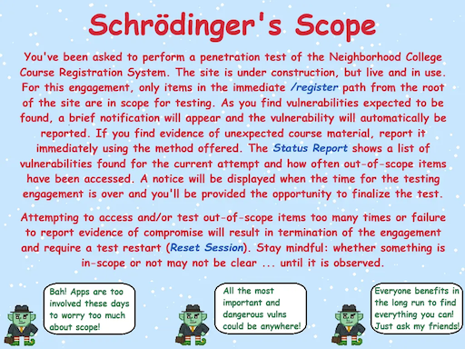

The main point of this challenge is to find vulnerabilities in the website without going out of scope, which is only down the path `/register`.

### Status Report Page
Clicking on **View Status Report** takes you to the `/register/status_report` page where you can see the number of **Vulnerabilities Found** and **Scope Violations** you have accumulated so far.

Opening the page without doing anything else already shows two violations.

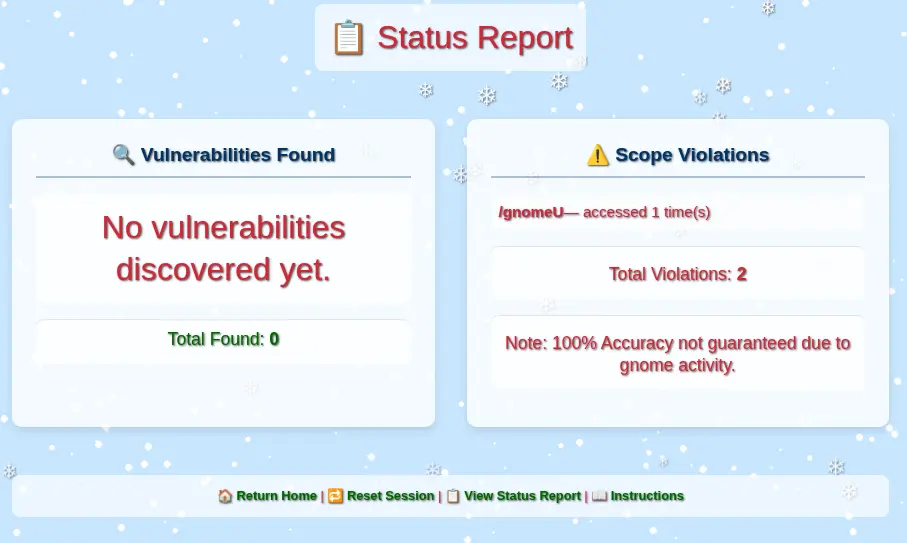

If you navigate around pages within the scope under the `/register` path, you will still get too many violations and the engagement will be terminated. To restart, you need to click on **Reset Session**.

### Violation Gnome Requests
We can see in the **Status Report** page a reference to `/gnomeU` as a scope violation.

Looking at the Network activity in the DevTools, we can see a `GET /gnomeU` request during every page load that counts as an out-of-scope violation.

It is possible to override the source code of every page in the browser DevTools to avoid making this call. However, in Burp Suite, it is possible to create a Proxy "Match and Replace" rule to redirect all requests to a path that will not cause a violation. This rule would apply to the whole site, avoiding the need to change pages individually.

Go to Proxy -> Match and replace -> Add:

- **Type:** `Request header`
- **Comment:** `Remove scope violation requests for gnomeU`
- **Match:** `^GET /gnomeU.*`
- **Regex match:** `true`
- **Replace:** `GET /register/404 HTTP/1.1`

### Sitemap
Starting from the main page, there is a link to **Enter Registration System**. This page provides access to the **Student Login** page and a gnome with a message. If you hover over the gnome, there is a hint to check out the sitemap with a link to it under `/register/sitemap`.

The path is in scope. So, let's check it out.
```xml
This XML file does not appear to have any style information associated with it. The document tree is shown below.
<urlset xmlns="http://www.sitemaps.org/schemas/sitemap/0.9">
<url>
<loc>http://flask-schrodingers-scope-firestore.holidayhackchallenge.com/</loc>
<changefreq>monthly</changefreq>
</url>
<url>
<loc>http://flask-schrodingers-scope-firestore.holidayhackchallenge.com/admin</loc>
<changefreq>monthly</changefreq>
</url>
<url>
<loc>http://flask-schrodingers-scope-firestore.holidayhackchallenge.com/admin/</loc>
<changefreq>monthly</changefreq>
</url>
<url>
<loc>http://flask-schrodingers-scope-firestore.holidayhackchallenge.com/admin/console</loc>
<changefreq>monthly</changefreq>
</url>
<url>
<loc>http://flask-schrodingers-scope-firestore.holidayhackchallenge.com/admin/console/</loc>
<changefreq>monthly</changefreq>
</url>
<url>
<loc>http://flask-schrodingers-scope-firestore.holidayhackchallenge.com/admin/logs</loc>
<changefreq>monthly</changefreq>
</url>
<url>
<loc>http://flask-schrodingers-scope-firestore.holidayhackchallenge.com/admin/logs/</loc>
<changefreq>monthly</changefreq>
</url>
<url>
<loc>http://flask-schrodingers-scope-firestore.holidayhackchallenge.com/auth</loc>
<changefreq>monthly</changefreq>
</url>
<url>
<loc>http://flask-schrodingers-scope-firestore.holidayhackchallenge.com/auth/</loc>
<changefreq>monthly</changefreq>
</url>
<url>
<loc>http://flask-schrodingers-scope-firestore.holidayhackchallenge.com/auth/register</loc>
<changefreq>monthly</changefreq>
</url>
<url>
<loc>http://flask-schrodingers-scope-firestore.holidayhackchallenge.com/auth/register/</loc>
<changefreq>monthly</changefreq>
</url>
<url>
<loc>http://flask-schrodingers-scope-firestore.holidayhackchallenge.com/auth/register/login</loc>
<changefreq>monthly</changefreq>
</url>
<url>
<loc>http://flask-schrodingers-scope-firestore.holidayhackchallenge.com/auth/register/login/</loc>
<changefreq>monthly</changefreq>
</url>
<url>
<loc>http://flask-schrodingers-scope-firestore.holidayhackchallenge.com/register/</loc>
<changefreq>monthly</changefreq>
</url>
<url>
<loc>http://flask-schrodingers-scope-firestore.holidayhackchallenge.com/register/login</loc>
<changefreq>monthly</changefreq>
</url>
<url>
<loc>http://flask-schrodingers-scope-firestore.holidayhackchallenge.com/register/login/</loc>
<changefreq>monthly</changefreq>
</url>
<url>
<loc>http://flask-schrodingers-scope-firestore.holidayhackchallenge.com/register/reset</loc>
<changefreq>monthly</changefreq>
</url>
<url>
<loc>http://flask-schrodingers-scope-firestore.holidayhackchallenge.com/register/reset/</loc>
<changefreq>monthly</changefreq>
</url>
<url>
<loc>http://flask-schrodingers-scope-firestore.holidayhackchallenge.com/register/sitemap</loc>
<changefreq>monthly</changefreq>
</url>
<url>
<loc>http://flask-schrodingers-scope-firestore.holidayhackchallenge.com/register/sitemap/</loc>
<changefreq>monthly</changefreq>
</url>
<url>
<loc>http://flask-schrodingers-scope-firestore.holidayhackchallenge.com/register/status_report</loc>
<changefreq>monthly</changefreq>
</url>
<url>
<loc>http://flask-schrodingers-scope-firestore.holidayhackchallenge.com/register/status_report/</loc>
<changefreq>monthly</changefreq>
</url>
<url>
<loc>http://flask-schrodingers-scope-firestore.holidayhackchallenge.com/search</loc>
<changefreq>monthly</changefreq>
</url>
<url>
<loc>http://flask-schrodingers-scope-firestore.holidayhackchallenge.com/search/</loc>
<changefreq>monthly</changefreq>
</url>
<url>
<loc>http://flask-schrodingers-scope-firestore.holidayhackchallenge.com/search/student_lookup</loc>
<changefreq>monthly</changefreq>
</url>
<url>
<loc>http://flask-schrodingers-scope-firestore.holidayhackchallenge.com/search/student_lookup/</loc>
<changefreq>monthly</changefreq>
</url>
<url>
<loc>http://flask-schrodingers-scope-firestore.holidayhackchallenge.com/wip</loc>
<changefreq>monthly</changefreq>
</url>
<url>
<loc>http://flask-schrodingers-scope-firestore.holidayhackchallenge.com/wip/</loc>
<changefreq>monthly</changefreq>
</url>
<url>
<loc>http://flask-schrodingers-scope-firestore.holidayhackchallenge.com/wip/register</loc>
<changefreq>monthly</changefreq>
</url>
<url>
<loc>http://flask-schrodingers-scope-firestore.holidayhackchallenge.com/wip/register/</loc>
<changefreq>monthly</changefreq>
</url>
<url>
<loc>http://flask-schrodingers-scope-firestore.holidayhackchallenge.com/wip/register/dev</loc>
<changefreq>monthly</changefreq>
</url>
<url>
<loc>http://flask-schrodingers-scope-firestore.holidayhackchallenge.com/wip/register/dev/</loc>
<changefreq>monthly</changefreq>
</url>
<url>
<loc>http://flask-schrodingers-scope-firestore.holidayhackchallenge.com/wip/register/dev/dev_notes</loc>
<changefreq>monthly</changefreq>
</url>
<url>
<loc>http://flask-schrodingers-scope-firestore.holidayhackchallenge.com/wip/register/dev/dev_notes/</loc>
<changefreq>monthly</changefreq>
</url>
<url>
<loc>http://flask-schrodingers-scope-firestore.holidayhackchallenge.com/wip/register/dev/dev_todos</loc>
<changefreq>monthly</changefreq>
</url>
<url>
<loc>http://flask-schrodingers-scope-firestore.holidayhackchallenge.com/wip/register/dev/dev_todos/</loc>
<changefreq>monthly</changefreq>
</url>
</urlset>
```

This is a summary of all the paths:
```
📁 /admin
├── 📄 /console
└── 📄 /logs
📁 /auth
└── 📁 /register
    └── 📄 /login
📁 /register
├── 📄 /login
├── 📄 /reset
├── 📄 /sitemap
└── 📄 /status_report
📁 /search
└── 📄 /student_lookup
📁 /wip
└── 📁 /register
    └── 📁 /dev
        ├── 📄 /dev_notes
        └── 📄 /dev_todos
```

Checking all the `register/` URLs from the sitemap, we can confirm the following:

- `/register/` — Main page to the login screen. Provides link to sitemap.
- `/register/sitemap` — The sitemap.
- `/register/reset` — The option to reset the session.
- `/register/status_report` — The status report page with number of vulnerabilities found and scope violations.
- `/register/login` — The login page.

---

## Solution

At this point, we can start looking for vulnerabilities without having to worry about the unwanted out-of-scope requests on every page load.

### Vulnerability 1: WIP Paths
There are two `/wip/register` paths in the sitemap that are out of scope.

It is common for development sites to mirror paths on production sites. It is also common for sitemaps to be out of date, wrong, or to hide certain endpoints.

Let's try these paths without the `/wip` prefix:

- `/register/dev/dev_notes` — the page fails with a `403 Forbidden` error. This is something we can check later once we have more information.

  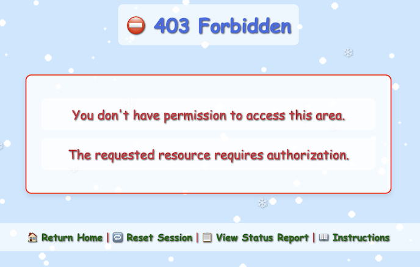
- `/register/dev/dev_todos` — Provides a list of pending actions with vulnerability information.

  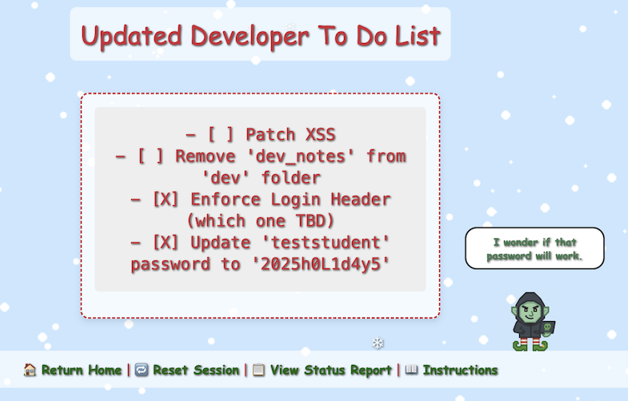

Loading the Developer To Do List page shows a message indicating that a vulnerability was found.


> [!SUCCESS] Vulnerability 1 Found
> - [X] Uncovered developer information disclosure.

In this list, there are two important pieces of information:

- Enforce Login Header (which one TBD)
- Update 'teststudent' password to '2025h0L1d4y5'

### Vulnerability 2: Login Page
Let's check the `/register/login` page. Attempting any username / password combination throws an "Invalid Forward IP" error.

This has something to do with the To Do item above "Enforce Login Header".

The application is expecting the request to come through a trusted proxy/load balancer and is validating the client IP using forwarded headers instead of the direct TCP source IP.

This is a common pattern in Flask / reverse-proxy setups where the app rejects requests unless a valid IP is found in:

- `X-Forwarded-For`
- `X-Real-IP`
- `Forwarded`

Since browsers do not send `X-Forwarded-For`, the backend sees no forwarding IP; hence, the login is blocked before auth logic runs.

You cannot set this from the browser UI alone. You must use an interception or replay tool like Burp Suite or `curl`.

Let's test setting `X-Forwarded-For` with the following IP values:

| Type | Example |
| --- | --- |
| Public IPv4 | `8.8.8.8` |
| Public IPv4 | `1.1.1.1` |
| Reserved test-net | `203.0.113.5` |
| Internal (to trigger bugs) | `127.0.0.1` |
| Internal | `10.0.0.5` |
| Multiple IPs (comma-separated) | `8.8.8.8`, `127.0.0.1` |

Using `curl` with the proper "id" in the query parameters and cookies, using the IP `127.0.0.1` in the header works. When sending a test username/password combination, the page now fails with "Invalid Username/Password Combination":
```bash
curl -X POST https://flask-schrodingers-scope-firestore.holidayhackchallenge.com/register/login?id=b8b98c4c-6fa5-4812-831a-6cf9f25d60f2 \
  -H "X-Forwarded-For: 127.0.0.1" \
  -H "Content-Type: application/x-www-form-urlencoded" \
  -H "Cookie: Schrodinger=3bc90fde-b93b-45fa-ae94-b41311ed9b26; registration=eb72a05369dcb44d" \
  -d "username=test&password=test&id=b8b98c4c-6fa5-4812-831a-6cf9f25d60f2"
```
```html
<!DOCTYPE html>
<html lang="en">
[...]
            <p class="error-message">Invalid Username/Password Combination</p>
[...]
</html>
```

In Burp Suite, it is possible to create a Proxy "Match and Replace" rule to include the valid entry in the header for all page loads.

Go to Proxy -> Match and replace -> Add:

- **Type:** `Request header`
- **Comment:** `Fix Invalid Forward IP error`
- **Match:** `Priority: u=0, i`
- **Regex match:** `false`
- **Replace:** `X-Forwarded-For: 127.0.0.1`

Let's try login now with the credentials we found in the To Do list:

- **username:** `teststudent`
- **password:** `2025h0L1d4y5`

The credentials are accepted and we are logged into the "Neighborhood College Courses" page.

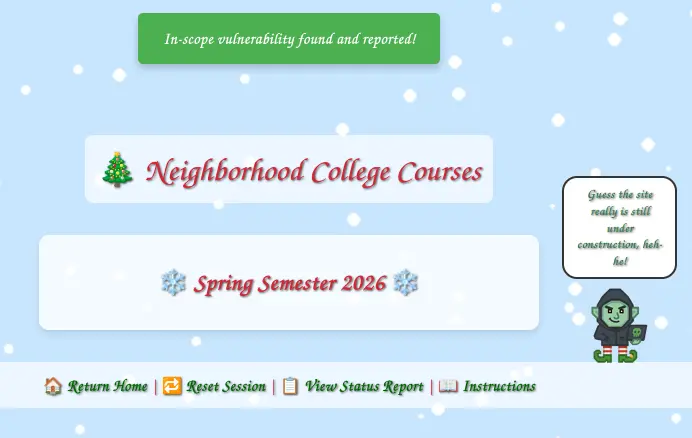

> [!SUCCESS] Vulnerability 2 Found
> - [X] Exploited Information Disclosure via login and additional X-Forwarded-For header.

### Vulnerability 3: Course Search
The new `/register/courses` page comes up with an empty list of "Neighborhood College Courses" for "Spring Semester 2026".

After inspecting the HTML page, there is a comment mentioning a different endpoint:
```html
<section class="courses-content">
    <div class="courses-container" style="max-width: 500px;">
        <h2 class="semester-heading">❄️ Spring Semester 2026 ❄️</h2>
        <!-- Should provide course listing here eventually instead of the extra step through search flow. -->
        <!-- <ul id="courseSearch" class="courses-list">
            <li><a href="/register/courses/search?id=1da0186b-4709-4edc-80be-fe43675c480d">Course Search</a></li>
        </ul> -->
    </div>
</section>
```

After enabling the commented out code to show the list, a link shows up to go to the course search page.


> [!SUCCESS] Vulnerability 3 Found
> - [X] Found commented-out course search.

### Vulnerability 4: Course Search Page
The `/register/courses/search` page provides a form with a search field that takes a number.

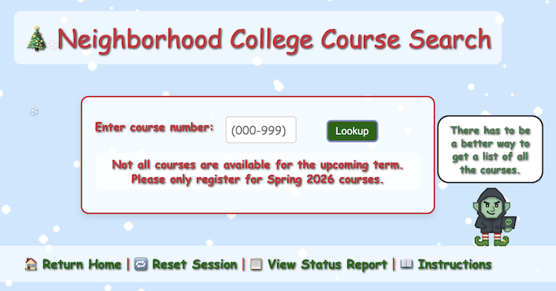

Searching for `1` shows all the courses with a `1` in them:


Let's try a simple SQLi string `' OR 1=1;--` to try to get all the courses.

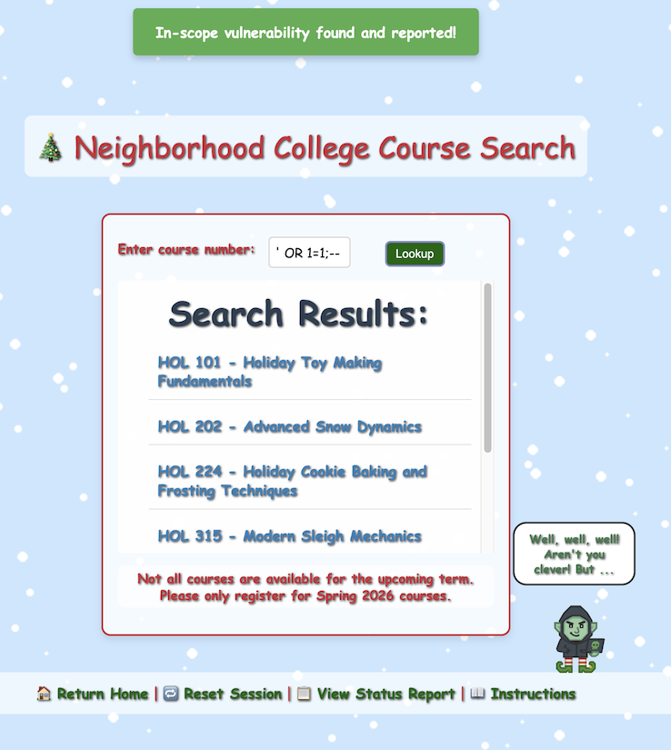

> [!SUCCESS] Vulnerability 4 Found
> - [X] Identified SQL injection vulnerability.

### Vulnerability 5: Invalid Course

All the course names in the list start with "HOL" followed by a number and a title. However, the last one is named:
```
GNOME 827 - Mischief Management
```

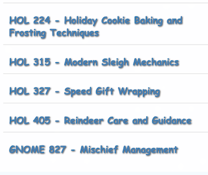

Clicking on the link of that course opens up a registration page `/register/courses/gnome_mischief` and the following warning:

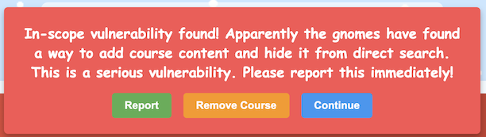

The correct answer is to "Report". When you find an issue as a pentester, it is not your job to fix it, but to report it. Failure to do so in this case ends the assessment.


> [!SUCCESS] Vulnerability 5 Found
> - [X] Reported the unauthorized gnome course.

Reloading the page now shows that the course has been removed:

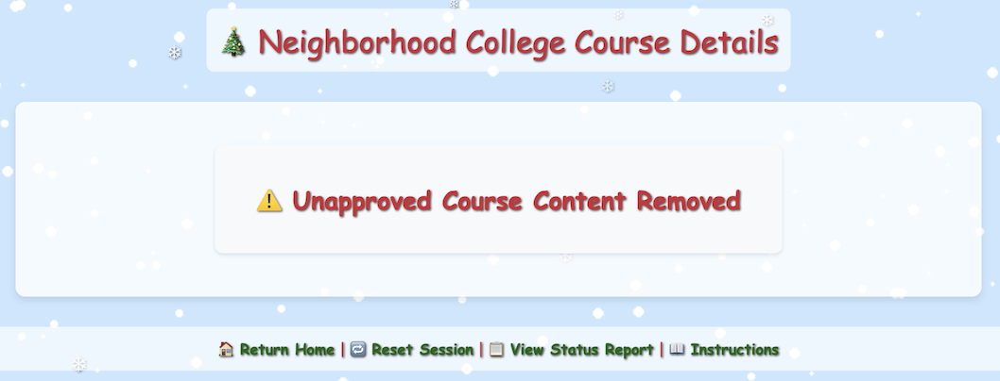

### Vulnerability 6: Cookies

Going back to the course search page, the gnome indicates there is another way to see all the courses:


On hover, the message points to two pages:


- The "page" link leads to `/dev/courseListings`, which is out of scope.
- The "notes" link leads back to `/register/dev/dev_notes`, which was blocked before, but now contains a message since we are logged in with a valid user.

  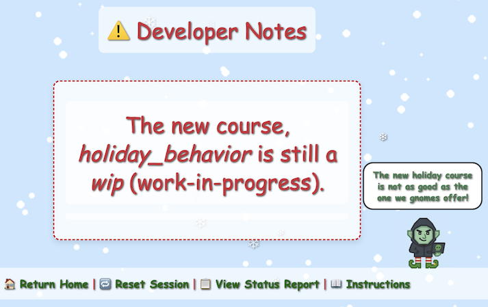

Using the same URL path as the other courses `/register/courses/holiday_behavior` fails with a 404. However, since the description says it is "wip", let's try `/register/courses/wip/holiday_behavior`. This path fails with a `403 Forbidden` error.

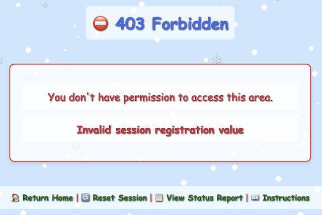

The error "Invalid session registration value" refers to a cookie that gets set on almost every HTTP response:
```http
HTTP/2 200 OK
Content-Type: text/html; charset=utf-8
Set-Cookie: registration=eb72a05369dcb445; Path=/
X-Cloud-Trace-Context: 8a31409d34e55aad510944d7d98499c5;o=1
Date: Wed, 26 Nov 2025 10:57:04 GMT
Server: Google Frontend
Content-Length: 26663
Via: 1.1 google
Alt-Svc: h3=":443"; ma=2592000,h3-29=":443"; ma=2592000
```

Checking the application cookies, we can see a couple of values:
```
registration: eb72a05369dcb447
Schrodinger: b8dee0b4-1522-43e6-9327-ebdbe28f1c2e
```

The `registration` cookie is a 16 hex character value. After refreshing the web app several times, we can see that the value always starts with `eb72a05369dcb4` and only the last byte varies.

Using the [`detect_registration_cookie.py`](./detect_registration_cookie.py) Python script, we can interact with the remote web service to collect observed cookie values, derive the fixed prefix, and brute-force all 256 possible values for the last byte. A valid cookie was found after 11 attempts:

```
Collected 20 unique registration cookies:
{'eb72a05369dcb442',
 'eb72a05369dcb443',
 'eb72a05369dcb444',
 'eb72a05369dcb445',
 'eb72a05369dcb446',
 'eb72a05369dcb447',
 'eb72a05369dcb448',
 'eb72a05369dcb449',
 'eb72a05369dcb44a',
 'eb72a05369dcb44b',
 'eb72a05369dcb44d',
 'eb72a05369dcb44e',
 'eb72a05369dcb44f',
 'eb72a05369dcb450',
 'eb72a05369dcb451',
 'eb72a05369dcb452',
 'eb72a05369dcb453',
 'eb72a05369dcb454',
 'eb72a05369dcb455',
 'eb72a05369dcb456'}

Derived prefix: eb72a05369dcb4
Starting byte (hex): 42
[1/256] Register: eb72a05369dcb442 => NOPE
[2/256] Register: eb72a05369dcb443 => NOPE
[3/256] Register: eb72a05369dcb444 => NOPE
[4/256] Register: eb72a05369dcb445 => NOPE
[5/256] Register: eb72a05369dcb446 => NOPE
[6/256] Register: eb72a05369dcb447 => NOPE
[7/256] Register: eb72a05369dcb448 => NOPE
[8/256] Register: eb72a05369dcb449 => NOPE
[9/256] Register: eb72a05369dcb44a => NOPE
[10/256] Register: eb72a05369dcb44b => NOPE
[11/256 ] Register: eb72a05369dcb44c => YES
```

The last two characters range from `42`–`56` in hex, except `4c` is missing from the observed values. `0x4c` is "L" in ASCII. So, this is a classic "No L / Noel" joke, hiding the valid cookie in plain sight.

Let's change the existing `registration` cookie to `eb72a05369dcb44c` and reload the page.

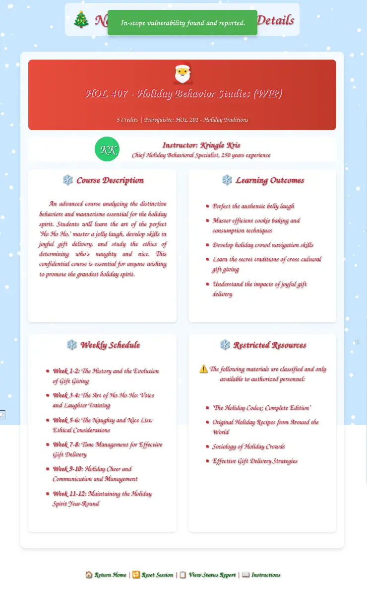

> [!SUCCESS] Vulnerability 6 Found
> - [X] Hidden course found via cookie prediction.

## Assessment Complete

Loading any page gives a redirect to `/register/all_vulnerabilities_found` with this message:
```
Assessment Complete!

Nice work! You've found 6 vulnerabilities in the Neighborhood College Course Registration System.

The time allotted for the penetration test is over. You've reached the end of the engagement.
```

And two buttons:

- Finalize Test
- Continue Testing

After clicking on "Finalize Test", a summary page comes up:


---

## Outro

**Kevin McFarland**

Excellent work! You've just demonstrated one of the most valuable skills in cybersecurity - the ability to think like the original programmer and unravel their logic without needing to execute a single line of code.

Well done - you've shown the wisdom to stay within scope, uncover what mattered, and respecting other testing boundaries.

That kind of discipline is what separates a real penetration tester from someone just poking around.

---

## Files

| File | Description |
|---|---|
| [`detect_registration_cookie.py`](./detect_registration_cookie.py) | Python script to enumerate and brute-force the predictable `registration` cookie for the WIP course |

---

## References

- [`ctf-techniques/web/curl/`](../../../../../ctf-techniques/web/curl/README.md) — `X-Forwarded-For` header spoofing and custom request headers with cURL
- [`ctf-techniques/web/burpsuite/`](../../../../../ctf-techniques/web/burpsuite/README.md) — Burp Suite Match & Replace rules for suppressing requests and injecting headers
- [`ctf-techniques/web/cookies/`](../../../../../ctf-techniques/web/cookies/README.md) — Predictable cookie enumeration and brute-forcing
- [`ctf-techniques/web/sqli/`](../../../../../ctf-techniques/web/sqli/README.md) — Basic SQL injection (`OR 1=1`)

---

## Navigation

| | |
|:---|---:|
| ← [Hack-a-Gnome](../hack-a-gnome/README.md) | [On the Wire](../on-the-wire/README.md) → |
