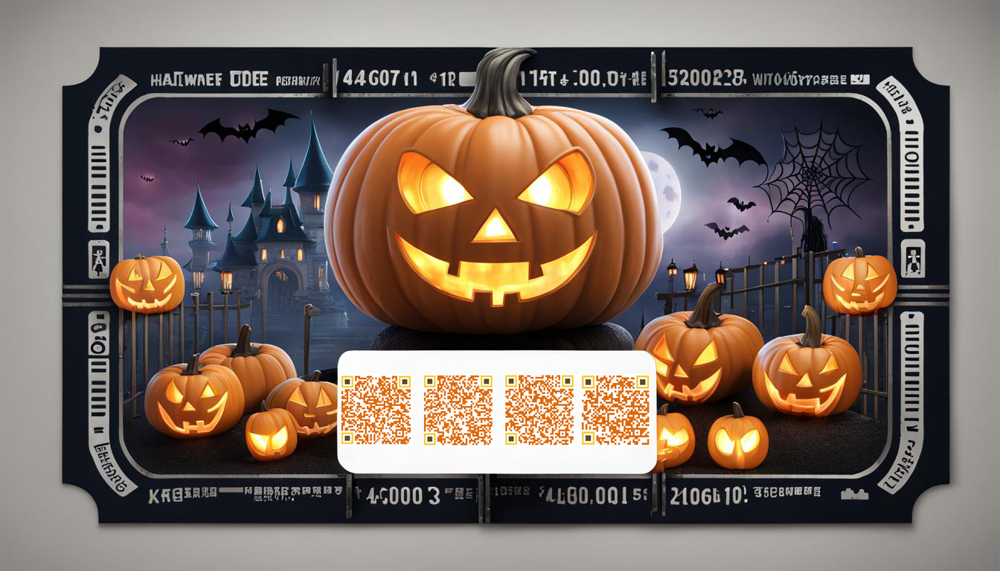

# Lab 1 - The Gatekeepers

## Table of Contents
- [Lab 1 - The Gatekeepers](#lab-1---the-gatekeepers)
  - [Table of Contents](#table-of-contents)
  - [Overview](#overview)
  - [Analysis](#analysis)
    - [QR Code 1](#qr-code-1)
    - [QR Code 2](#qr-code-2)
    - [QR Code 3](#qr-code-3)
    - [QR Code 4](#qr-code-4)
  - [Solution](#solution)
  - [Navigation](#navigation)

---

## Overview

Decipher QR codes from the given image to get secret messages and discover the secret word.

---

## Analysis
This is the given halloween ticket image:


Let's extract the QR codes and use an online [QR Code Scanner](https://scanqr.org/) to extract the messages.

### QR Code 1


* **Message:** `Creeping through the code, under the moon's glow,`

### QR Code 2


* **Message:** `On this eerie Halloween night, the cyber winds blow,`

### QR Code 3


* **Message:** `Riddles and mysteries, in the Labs they stow.`

### QR Code 4


* **Message:** `Whispering secrets only Immersive Labs know.`

---

## Solution
The complete message is:
```
Creeping through the code, under the moon's glow,
On this eerie Halloween night, the cyber winds blow,
Riddles and mysteries, in the Labs they stow.
Whispering secrets only Immersive Labs know.
```

The first letter of each line is `C`, `O`, `R`, `W`.

By reordering them, we can find the secret word: `CROW`.

---

## Navigation

| |
|---:|
| [Python Pit](../lab-2-python-pit/README.md) → |
